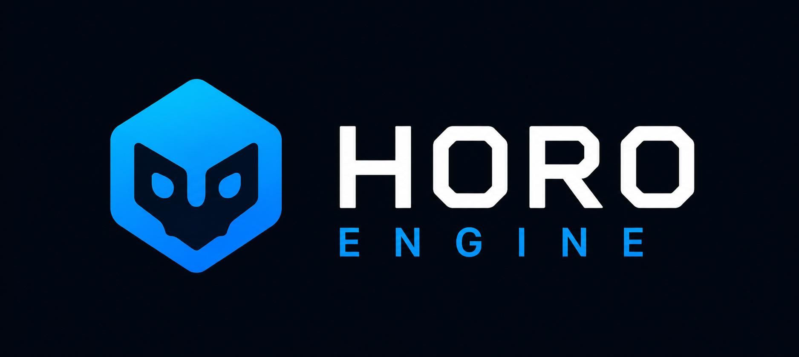
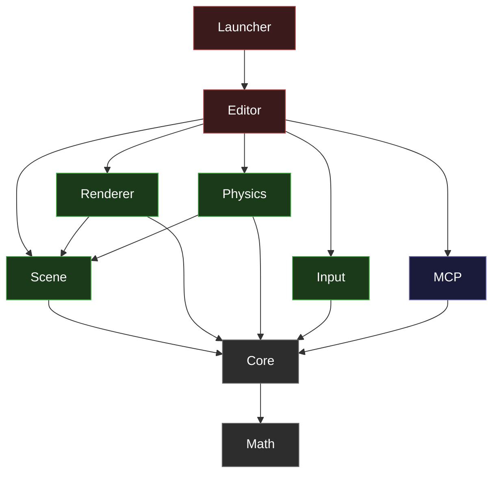

<p align="center">
  <picture>
    <source media="(prefers-color-scheme: dark)" srcset="assets/launcher/logo_with_title.png">
    
  </picture>
</p>

<p align="center">
  <a href="https://github.com/abdullahbodur/horo-engine/actions/workflows/ci.yml"></a>
  <a href="https://sonarcloud.io/summary/new_code?id=docktail_horo-engine"></a>
  <a href="https://sonarcloud.io/summary/new_code?id=docktail_horo-engine"></a>
  
  <a href="LICENSE"></a>
  
  <a href="https://github.com/abdullahbodur/horo-engine/releases"></a>
</p>

**Horo Engine is an open-source C++20 game engine and AI-centric editor IDE — a standalone alternative to Unity and Unreal, built with AI tooling at its core.** Download a release and start editing scenes immediately, or embed it as a submodule so your AI agents have the full engine source in their context — no more guessing how a black-box engine works. No opaque SDKs, no vendor lock-in: the entire engine, editor, and AI integration layer are open and modifiable.

---

## Screenshot


---

## Why Horo

| | |
|---|---|
| **AI-centric editor IDE** | A standalone game editor with AI at its core — download, launch, and connect any MCP-compatible agent to inspect and edit scenes programmatically. |
| **Full authoring editor** | Viewport, scene hierarchy, asset inspector, drag-drop workflows — built with Dear ImGui. |
| **Modular runtime** | Rendering, scene, physics, input, and MCP as decoupled modules with enforced dependency direction. |
| **AI-ready source access** | Drop it into your repo as a submodule. Your AI agents read the full engine source like any other file — they know how the scene system, renderer, and physics work without black-box guessing. |
| **Cross-platform** | Linux, macOS, Windows — same codebase, same CMake presets, same CI matrix. |
| **Tested by default** | Catch2 unit tests, UI automation tests, SonarCloud quality gates, and deterministic CI runs. |
| **Clean architecture** | Enforced module boundaries, documented dependency rules, typed scene model, and value semantics by default. |

## When Horo May Not Fit

Horo is not the right choice if you need:

- a turnkey no-code pipeline with marketplace-driven workflows
- immediate production-ready tooling breadth of very large commercial engines
- strict "no engine code ownership" organizational boundaries

---

## Architecture

Horo is organized into layered modules with enforced dependency direction. Lower layers know nothing about the layers above them.



| Module | Purpose |
|---|---|
| `math` | Vectors, matrices, quaternions, transforms — the architectural floor, zero engine dependencies |
| `core` | Application shell, windowing, logging, path resolution, generic utilities |
| `scene` | ECS registry, components, scene data model and lifecycle |
| `renderer` | Rendering API, camera, meshes, shaders, textures, debug draw, backend abstraction |
| `physics` | Collision, rigid bodies, constraints, world stepping |
| `input` | Input polling and state access |
| `mcp` | MCP protocol transport, snapshot publishing, command controller |
| `editor` | Authoring UI, inspection, scene editing, asset workflows, MCP orchestration |

See [docs/architecture/README.md](./docs/architecture/README.md) for the full module documentation and boundary policy.

---

## Quick Start

### Download and run (standalone)

Grab the latest release for your platform from the [Releases page](https://github.com/abdullahbodur/horo-engine/releases). No installers, no dependencies — just unzip and launch HoroEditor.

### Build from source

```bash
git clone https://github.com/abdullahbodur/horo-engine
cd horo-engine
make
make test
make run-launcher   # builds and launches HoroEditor
```

**Build requirements:**

- CMake 3.25+
- C++20 compiler (Clang 15+ / GCC 13+ / MSVC 2022 17.6+)
- Ninja (Linux/macOS) or Visual Studio 2022 (Windows)

Linux packages (typical):

```bash
sudo apt install libx11-dev libxrandr-dev libxinerama-dev libxcursor-dev libxi-dev libwayland-dev libxkbcommon-dev
```

**Core commands:**

```bash
make                    # debug build
make test               # run tests (Catch2)
make run-launcher       # build and launch HoroEditor from source
make ui-test            # launcher unit tests
make ui-test-windowed   # launcher UI automation tests
```

For direct CMake usage:

```bash
cmake --preset debug
cmake --build --preset debug
ctest --preset debug --output-on-failure
```

### Embed as a submodule (advanced)

Other engines are black boxes to AI — their source is hidden behind binary SDKs. Embed Horo and your AI agents read the full engine source alongside your game code, so they know exactly how the engine works instead of guessing.

```bash
git submodule add https://github.com/abdullahbodur/horo-engine engine
```

Then from your game's `CMakeLists.txt`:

```cmake
add_subdirectory(engine)
target_link_libraries(MyGame PRIVATE HoroEngine)
```

See [docs/submodule-ai-reasoning.md](./docs/submodule-ai-reasoning.md) for the full rationale and why this matters for AI-assisted development.

---

## AI-Centric Editor

Horo is designed from the ground up for AI-assisted development. The editor includes a built-in [MCP](https://modelcontextprotocol.io) server that exposes scene inspection, asset queries, and editor commands over HTTP.

**What this means in practice:**

- **Connect any MCP agent** — Claude Code, Codex, Cursor — to inspect and edit your scene in real time
- **Programmatic editing** — create entities, modify transforms, assign materials, run editor commands
- **Live snapshots** — the MCP server publishes current scene state so agents always see your project
- **Full source context** — embed as submodule and agents read engine source too ([why?](./docs/submodule-ai-reasoning.md))

**Quick setup:**

1. Launch HoroEditor (standalone or from source)
2. Enable MCP in **File → Settings...**
3. Point your AI agent at `http://127.0.0.1:39281/mcp`

Settings are stored in `~/.horo/settings.json` (`%USERPROFILE%\\.horo\\settings.json` on Windows).

See [docs/mcp.md](./docs/mcp.md) for the full tool reference and IDE integration guides.

---

## Documentation

| Area | Where to look |
|---|---|
| Architecture & module boundaries | [docs/architecture/README.md](./docs/architecture/README.md) |
| Submodule integration rationale | [docs/submodule-ai-reasoning.md](./docs/submodule-ai-reasoning.md) |
| MCP server setup & reference | [docs/mcp.md](./docs/mcp.md) |
| Renderer backend parity | [docs/development/backend-parity-validation-matrix.md](./docs/development/backend-parity-validation-matrix.md) |
| API documentation conventions | [AGENTS.md § Documentation](./AGENTS.md#documentation-doxygen) |
| Contributing guide & PR checklist | [.github/CONTRIBUTING.md](.github/CONTRIBUTING.md) |

---

## License

[MIT](LICENSE) — source code in this repository. See `vendor/` subdirectories for third-party licenses.
