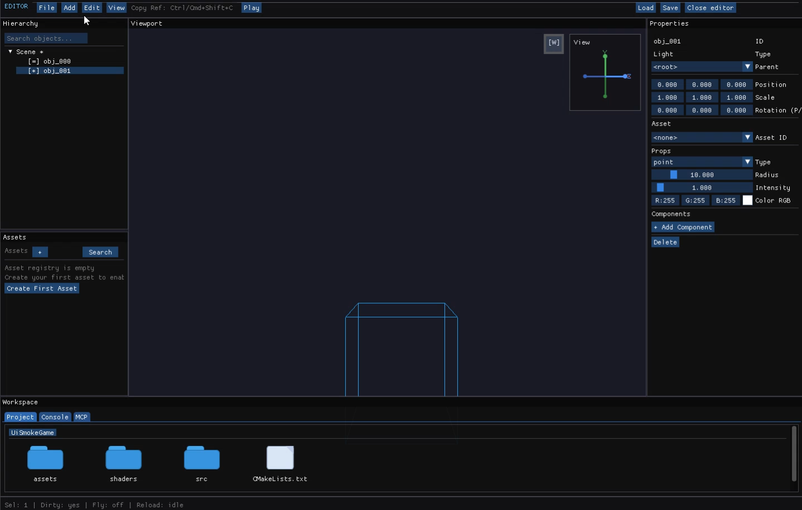
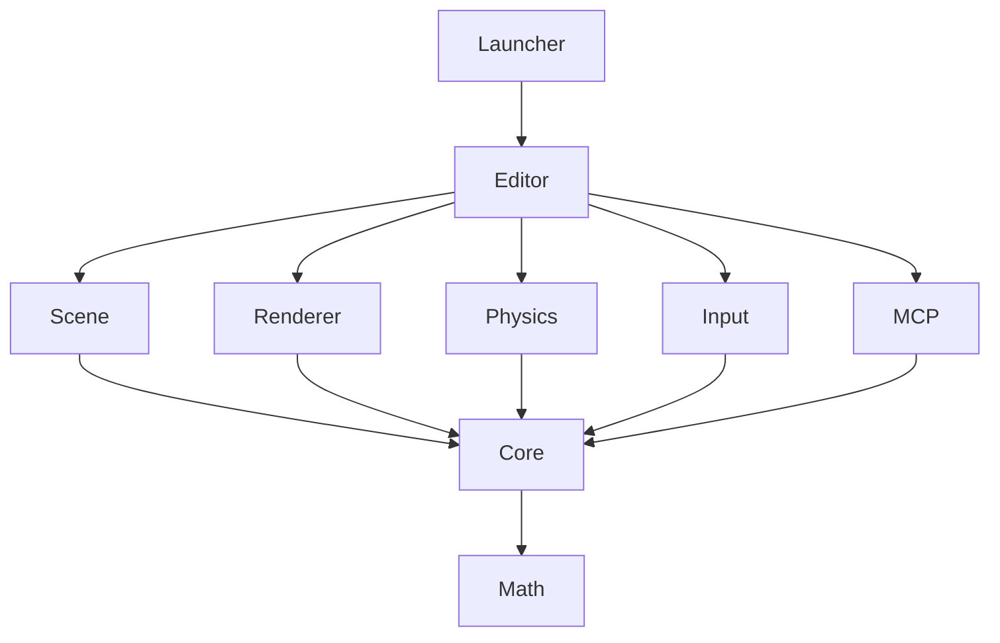

# Horo Engine

[](https://github.com/abdullahbodur/horo-engine/actions/workflows/ci.yml)
[](https://sonarcloud.io/summary/new_code?id=docktail_horo-engine)
[](https://sonarcloud.io/summary/new_code?id=docktail_horo-engine)
[](https://sonarcloud.io/summary/new_code?id=docktail_horo-engine)
[](https://sonarcloud.io/summary/new_code?id=docktail_horo-engine)

[](LICENSE)

[](https://github.com/abdullahbodur/horo-engine/releases)

Horo Engine is an open-source C++20 game engine focused on **clarity, embeddability, and fast iteration**.

It is designed to be added directly to your repo (typically as a submodule) so your game code, engine code, tooling, and
CI all live in one visible workspace.

## Screenshots

<!-- Drop editor/renderer screenshots here once captured. -->
<!-- Example:  -->

## Use Cases

Horo is a good fit when you want to:

- **Own engine behavior directly in source** instead of waiting on vendor/plugin roadmaps
- **Debug and fix runtime/editor issues in one place** with full engine + game code visibility
- **Use AI-assisted development on real engine internals**, not only wrappers or plugin APIs
- **Evolve engine architecture incrementally** as your game requirements change
- **Run cross-platform CI with deterministic tests** (including launcher/UI automation)

You should try Horo if your team says:

- "We need an engine we can actually modify, not just configure."
- "We want our game and engine changes reviewed together in PRs."
- "We care about testable editor workflows and reproducible CI."

## When Horo May Not Fit

Horo may not be the best choice if you need:

- a turnkey no-code pipeline with marketplace-driven workflows
- immediate production-ready tooling breadth of very large commercial engines
- strict "no engine code ownership" organizational boundaries

## What It Is

- A modular 3D engine core (runtime + editor tooling)
- A CMake-first codebase that builds on Linux, macOS, and Windows
- A source-available engine intended for direct integration, not opaque SDK consumption
- A practical platform for gameplay, editor workflows, and automation tests

## Features

| Module | Status | Notes |
|---|---|---|
| Core (ECS, scene, serialization) | ✅ Production | |
| OpenGL renderer | ✅ Production | |
| Asset import pipeline | ✅ Production | |
| Unit test suite (Catch2) | ✅ Production | |
| UI automation tests | ✅ Production | Launcher + editor flows |
| MCP server (editor AI tooling) | ✅ Production | HTTP endpoint, opt-in |
| Vulkan renderer | 🔧 In progress | Not parity-complete yet |
| Backend resource factory API | 🔧 In progress | Active PRs |
| Physics | 🔧 In progress | Module scaffolded |
| GI / reflections | 📋 Planned | Architecture defined |

## Architecture



See [docs/architecture/README.md](./docs/architecture/README.md) for full module documentation.

## Quick Start

### Add as submodule

```bash
git submodule add https://github.com/abdullahbodur/horo-engine engine
```

### Link from CMake

```cmake
add_subdirectory(engine)
target_link_libraries(MyGame PRIVATE HoroEngine)
```

### Build locally

```bash
git clone https://github.com/abdullahbodur/horo-engine
cd horo-engine
make
make test
```

## Build Requirements

- CMake 3.25+
- C++20 compiler (Clang/GCC/MSVC)
- Ninja (Linux/macOS) or Visual Studio 2022 (Windows)

Linux packages (typical):

```bash
sudo apt install libx11-dev libxrandr-dev libxinerama-dev libxcursor-dev libxi-dev libwayland-dev libxkbcommon-dev
```

## Core Commands

```bash
make          # debug build
make test     # run tests
make ui-test  # launcher unit tests (Catch2)
make ui-test-windowed  # launcher UI automation (HoroEditorUiTest --run-ui-tests, use HORO_UI_TEST_FILTER=launcher/*)
```

For direct CMake usage:

```bash
cmake --preset debug
cmake --build --preset debug
ctest --preset debug --output-on-failure
```

## Docs

- Architecture: [docs/architecture/README.md](./docs/architecture/README.md)
- Module docs: `core/`, `editor/`, `scene/`, `renderer/`, `launcher/`, `tests/`
- Renderer parity
  tracking: [docs/development/backend-parity-validation-matrix.md](./docs/development/backend-parity-validation-matrix.md)

Architecture policy reminders:

- new headers are internal by default
- every new public type should clearly identify its owning module

## Built-in MCP

Horo includes an editor-integrated MCP server for AI-assisted tooling workflows.

- Enable from `File -> Settings...` in the editor
- Default endpoint while editor is open: `http://127.0.0.1:39281/mcp`
- Settings file: `~/.horo/settings.json` (Windows: `%USERPROFILE%\\.horo\\settings.json`)

See [docs/mcp.md](./docs/mcp.md) for setup and usage.

## Contributing

See [CONTRIBUTING.md](.github/CONTRIBUTING.md) for setup, branch naming, commit conventions, and the PR checklist.

## License

[MIT](LICENSE) — source code in this repository. See `vendor/` subdirectories for third-party licenses.
