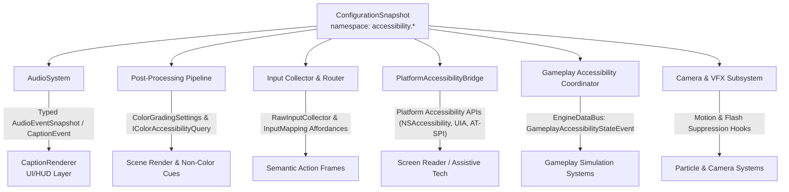

# ADR-011: Accessibility Ownership, Typed Transport and Non-Gating Policy

- **Status**: Proposed
- **Date**: 2026-08-28
- **Supersedes**: None
- **Scope**: Accessibility subsystem ownership, typed transport per feature family, configuration snapshot integration, DataBus boundary enforcement, non-gating policy, and platform/tier parity
- **Issue**: [#1849](https://github.com/abdullahbodur/horo-engine/issues/1849) ([ACC-001.1])
- **JIRA**: HORO-1805
- **Normative document**: [Accessibility Architecture](../architecture/runtime/accessibility-architecture.md)

## Context

Accessibility is a core engineering requirement across Horo Engine, encompassing player accessibility (closed captions, subtitles, colorblind filters, high contrast, control remapping affordances, screen reader bridge, and gameplay difficulty assists) and developer accessibility (in-editor contrast validation, colorblind simulation, control scheme verification, and screen reader logging).

Previously, accessibility concerns were scattered across individual subsystem documents (audio, input, post-processing, game UI, editor design system) without an explicit, unified ownership architecture:

1. **Risk of DataBus Misuse**: A common architectural failure mode is treating the general `EngineDataBus` as a universal dumping ground or state store for all accessibility data (e.g., pushing raw audio dialogue, UI accessibility trees, input chord remappings, and color matrices through the bus). This degrades frame performance, introduces unnecessary heap allocations and lock contention, and bypasses typed subsystem interfaces.
2. **Undefined State Authority & Provenance**: Accessibility preferences were split between local UI state, ad hoc structs, and scattered configuration keys without a centralized schema, monotonic versioning, or snapshot immutability.
3. **Unclear Transport Boundaries**: Transports between producers and consumers (e.g., audio playback to caption rendering, UI focus to OS screen readers, input collector to remapped actions) lacked explicit type definitions and threading contracts.
4. **Risk of Tier-Gating or Loop Stalls**: Without a normative non-gating policy, accessibility features could accidentally be tied to high-end rendering tiers, omitted in headless/test environments, or allowed to block real-time engine loops (e.g., audio callbacks or render submission).

[ACC-001.1] establishes the authoritative ownership model, typed transports, strict anti-pattern rules, and non-gating policy across all product tiers and platforms.

## Decision

**Accessibility feature families are owned directly by their respective domain subsystems and communicate across narrow, typed transport interfaces. Configuration snapshots carry validated accessibility settings and provenance. The general `EngineDataBus` is strictly reserved for gameplay difficulty assists (`GameplayAccessibilityStateEvent`) and must NOT be used as an authoritative store or universal accessibility transport. Accessibility features are non-gating: they never block core engine loops, must be available across all product tiers, platforms, and render backends, and must not introduce circular subsystem dependencies.**

### Ratify-or-revise outcomes

| Area | Prior state | Outcome |
|---|---|---|
| Feature ownership | Dispersed across audio, input, rendering, and UI | **Ratified & Partitioned.** Each feature family has exactly one owning subsystem; no monolithic God-object manager is introduced. |
| Transport mechanism | Informal topic mentions and direct struct access | **Revised.** Typed transports are strictly defined per feature family. |
| DataBus role | Ambiguous; potential catch-all accessibility bus | **Revised & Restricted.** The DataBus carries only `GameplayAccessibilityStateEvent` notifications. Universal bus transport for all accessibility is strictly forbidden. |
| Settings & provenance | Ad hoc settings structs | **Revised.** All settings are registered under the Foundation `accessibility.*` configuration schema and consumed via immutable `ConfigurationSnapshot` handles. |
| Tier & platform availability | "All Tiers: Yes" noted in table without enforcement rules | **Ratified & Enforced.** Non-gating policy is mandatory across `es3`, `dx11`, `dx12_vulkan`, and `high_end`, as well as headless and null backends. |
| Threading & real-time loops | Unspecified interaction with real-time audio/render loops | **Ratified with Invariants.** Zero allocation, zero blocking I/O, and zero synchronous OS accessibility calls in real-time callbacks or render passes. |

### Authoritative Ownership And Typed Transport Map

| Feature family | Authoritative subsystem owner | Typed transport / API contract | Configuration schema namespace | Consumption point & synchronization |
|---|---|---|---|---|
| **Captions & Subtitles** | `AudioRuntime` / `AudioSystem` (events) & `CaptionRenderer` (presentation) | Direct consumption of typed `AudioEventSnapshot` / `CaptionEvent` queue from `AudioSystem` | `accessibility.captions.*` | Evaluated on main thread during UI/HUD frame pass; no bus routing |
| **Colorblind Filters & Contrast** | Post-Processing / Render Pipeline | Applied as post-process color transform via `ColorGradingSettings`; queried via `IColorAccessibilityQuery` | `accessibility.colorblind.*`, `accessibility.visual.*` | Render graph post-process pass after tonemapping; synchronous query for UI/gameplay |
| **Input Remapping & Sticky Keys** | `RawInputCollector` (Layer 1) & `InputRouter` / `InputMapping` (Layer 3) | Direct integration in `RawInputCollector` (sticky keys, hold thresholds) and `InputMapping` (remapping, toggle actions) | `accessibility.input.*` | Input frame collection and semantic action resolution; no bus events per key |
| **Screen Reader / TTS** | Platform / UI Subsystem (`PlatformAccessibilityBridge`) | Direct metadata registration via `AccessibilityNodeDescriptor` and dispatch across `IScreenReader` / OS bridge | `accessibility.screen_reader.*` | Main-thread UI focus/update events; bounded async dispatch to OS accessibility APIs |
| **Gameplay Difficulty Assists** | Gameplay / Game Simulation | Published strictly via `GameplayAccessibilityStateEvent` topic on `EngineDataBus` | `accessibility.gameplay.*` | Simulation tick boundaries; read by gameplay controllers without mid-tick tearing |
| **Visual Settings (Scale, Motion, Flash)** | UI Design System (scale/contrast) & Camera/VFX (motion/flash) | Direct consumption of immutable `ConfigurationSnapshot` by UI renderer, Camera Controller, and VFX runtime | `accessibility.visual.*` | Frame start / scene render setup; hooks in camera shake and particle flash passes |
| **Developer Validation Tools** | Editor Diagnostics & CI Harness | Editor viewport render modes, headless contrast scanner, screen reader capture log | `editor.accessibility.*` | Editor panels and automated test suites; display-independent CI checks |

### Strict Anti-Pattern Rules

1. **The DataBus Is Not a Universal Accessibility Store**:
   - The general `EngineDataBus` must **never** be used as a shared repository or message queue for audio dialogue streams, UI accessibility trees, per-stroke input remapping, or color transform updates.
   - Only `GameplayAccessibilityStateEvent` is published via the DataBus. Gameplay difficulty assists cross the boundary between host configuration and game-specific simulation modules where loose coupling is mandatory.
   - All other feature families communicate via direct, typed domain interfaces.
2. **No Monolithic Accessibility Singleton**:
   - Accessibility is an architectural cross-cutting concern composed of domain-owned features, not a single monolithic `AccessibilityManager` God-class.
   - Audio owns audio events; Render owns post-processing; Input owns key collectors; Platform owns OS screen reader bridges.
3. **No Stringly-Typed Payloads**:
   - Transports must use strongly-typed C++20 structures (`AudioEventSnapshot`, `CaptionEvent`, `ColorGradingSettings`, `AccessibilityNodeDescriptor`, `GameplayAccessibilityStateEvent`).
   - Configuration keys are registered with typed descriptors in `ConfigurationSchema`; runtime paths must not perform runtime string parsing or dynamic map lookups.

### Non-Gating Policy And Platform Parity

1. **Product Tier Parity**:
   - Accessibility features are **never tier-gated**. Every feature family (captions, colorblind simulation, input affordances, screen reader bridge, difficulty assists, visual overrides) is functional on all graphics tiers: `es3`, `dx11`, `dx12_vulkan`, and `high_end`.
   - On resource-constrained mobile/embedded platforms (`es3`), color transforms use compact ALU arithmetic in the tonemapper shader rather than skipping the pass.
2. **Core Loop Non-Blocking Invariant**:
   - Accessibility processing must never introduce unbounded latency or blocking operations into core engine loops.
   - **Audio Mixer Thread**: Audio event snapshots for captions are pushed to a lock-free or bounded queue from the audio engine; the real-time audio callback never allocates memory, performs disk I/O, or formats text.
   - **Render Loop**: Post-process colorblind transforms are executed as standard constant-buffer-driven shader operations without CPU-GPU readback sync.
   - **Main/UI Loop**: Platform screen reader announcements (`IScreenReader::Announce`) must be non-blocking or queued for asynchronous dispatch to native platform accessibility APIs (macOS NSAccessibility, Windows UI Automation, Linux AT-SPI).
3. **Headless And Test Parity**:
   - Headless hosts (`horo-engine`, CI test suites) and null backends must provide fully functional mock/null implementations (`NullPlatformAccessibilityBridge`, `NullAudioDevice`).
   - Automated tests validate caption generation, input affordance logic, and contrast calculations in headless CI without requiring a display server or audio hardware.
4. **No Circular Subsystem Dependencies**:
   - Subsystem dependency direction remains strictly acyclic (DAG).
   - Audio never depends on UI; UI consumes audio events through the `AudioEventSnapshot` contract.
   - Post-processing never depends on Input or Gameplay; Gameplay queries post-processing state through the narrow `IColorAccessibilityQuery` interface.

### Configuration And Synchronization

1. **Immutable Snapshots**:
   - Accessibility settings are registered in the Foundation `ConfigurationSchema` under the `accessibility.*` namespace.
   - Subsystems capture a `ConfigurationSnapshot` handle at defined lifecycle boundaries (frame start or simulation tick start).
2. **Tear-Free Application**:
   - Modifying an accessibility setting (e.g. enabling high contrast, toggling auto-aim, changing caption size) atomically publishes a new configuration revision.
   - Subsystems apply new settings at their next frame/tick synchronization point, preventing mid-frame visual tearing or mid-tick physics inconsistencies.

## Consequences

- Every accessibility feature family has an unambiguous, single subsystem owner and a typed transport contract.
- The `EngineDataBus` remains clean and lightweight, carrying only asynchronous lifecycle and gameplay state notifications.
- All accessibility capabilities are guaranteed across all platforms, render backends, and product tiers.
- Real-time audio, rendering, and input loops remain predictable, allocation-free, and lock-free.
- Future accessibility features (e.g., haptic feedback cues, speech-to-text input) have clear architectural placement rules.

## Rejected Alternatives

- **Universal Accessibility DataBus Hub**: Rejected because routing high-frequency audio, input, and UI tree mutations through the general bus introduces lock contention, dynamic memory overhead, and latency hazards, while degrading type safety.
- **Monolithic `AccessibilityManager` God-Object**: Rejected because centralizing unrelated domain logic (shader math, audio event parsing, OS accessibility IPC, input rebinding) violates modularity and creates bidirectional coupling across the entire engine.
- **Tier-Gating Low-End Platforms**: Rejected because accessibility is an essential user right and legal compliance requirement (CVAA, European Accessibility Act, ADA/WCAG), not a graphical luxury.
- **Synchronous OS Screen Reader Dispatch in UI Render Passes**: Rejected because platform accessibility IPC can block for arbitrary durations, which would cause frame drops and UI stuttering.
