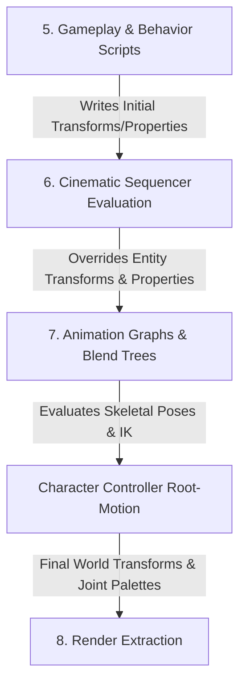

# ADR-011: Sequencer Ownership, Clock Authority and Binding Boundary Decision

- **Status**: Proposed
- **Date**: 2026-08-28
- **Supersedes**: None
- **Scope**: Cinematic sequencer clock authority, frame evaluation phase, object and property binding resolution, time-scale and pause policies, origin-rebase interaction
- **Issue**: [#1697](https://github.com/abdullahbodur/horo-engine/issues/1697) ([CIN-001.1])
- **JIRA**: HORO-1697
- **Normative document**: [Cinematic Sequencer Architecture](../architecture/runtime/cinematic-sequencer-architecture.md)

## Context

`docs/architecture/runtime/cinematic-sequencer-architecture.md` specifies the timeline and track data model for animating scene objects, properties, cameras, audio, and events. Cinematic sequences must execute deterministically during gameplay cutscenes, remain scrubbable in editor preview, support time-dilation and reverse playback, and cleanly blend with gameplay and skeletal animation without race conditions or undefined update ordering.

The current architecture baseline establishes basic track definitions, but key execution, timing, and binding boundaries remain unratified:

1. **Clock Authority**: Ambiguity exists regarding whether sequencer playback time is driven directly by raw presentation frame delta, fixed simulation step, or a dedicated playback clock. In-game cutscenes must stay locked to deterministic simulation ticks and respond to gameplay time dilation (`globalTimeDilation`), while UI animations, intro cinematics, and pause-menu sequences must advance even when gameplay simulation is frozen.
2. **Frame Evaluation Phase**: The exact frame phase of sequence evaluation relative to gameplay behaviors/scripts, physics, skeletal animation graphs, and character controller root motion is underspecified. If evaluation occurs before gameplay scripts, script mutations overwrite cinematic keyframes; if evaluation occurs after skeletal animation graphs, animation poses and IK solvers cannot react to cinematic root transforms.
3. **Object Binding Resolution**: Authored sequence assets reference scene objects by durable `StableObjectId`s (UUIDs), but runtime execution operates on generation-checked `EntityId`s / `EntityRef`s. The ownership of this resolution seam, lifetime of cached bindings, and behavior across scene transitions or entity respawns must be strictly defined.
4. **Typed Property Binding Registry**: Animating component properties requires a reflection/binding mechanism. Exposing this through ad hoc string paths or tying it to editor inspector widgets introduces cyclic dependencies or performance penalties on frame-hot paths.
5. **Origin-Rebase, Pause, and Time-Scale Interactions**: Large-world origin rebasing shifts world-space coordinates during play. Cinematic transform tracks must maintain coordinate integrity without drift. The interactions between gameplay pause, player-level sequence pause, time dilation, and reverse playback must be deterministic and stateless.

[CIN-001.1] requires an authoritative architecture decision resolving these ownership, timing, phase, and binding boundaries before child tickets [CIN-001.2] through [CIN-001.7] implement sequence identities, schemas, sampling cores, and tracks.

## Decision

**The cinematic runtime (`HoroEngine::CinematicRuntime`) owns a dedicated `SequencePlaybackClock` and `SequenceBindingAuthority` per active player instance. Sequence evaluation executes in an explicit frame phase AFTER gameplay state updates and BEFORE animation blend trees and character controller root-motion extraction. Object bindings are resolved from `StableObjectId` to `EntityId` at sequence activation and revalidated across scene transitions with typed diagnostic outcomes. The typed property binding registry is owned by `HoroEngine::SceneModel` and shared between the Inspector authoring surface and Sequencer runtime without reverse dependencies on Editor UI.**

### Ratify-or-revise outcomes

| Area | Prior state | Outcome |
|---|---|---|
| Clock authority | Implicit variable frame delta | **Revised.** Dedicated `SequencePlaybackClock` driven by explicit `SequenceClockPolicy` (`SimulationTime`, `UnscaledWallClock`, `ExternalSync`). |
| Frame evaluation phase | Generic frame update step | **Revised.** Explicit phase: runs after gameplay behaviors/scripts and before animation graphs, IK, and character controller root motion. |
| Object binding resolution | Undefined runtime binding mechanism | **Revised.** `SequenceBindingAuthority` resolves `StableObjectId` to generation-checked `EntityId`s at activation; stale references report typed diagnostic outcomes. |
| Property binding registry | Conceptual binding IDs | **Ratified and formalized.** Shared `PropertyBindingRegistry` in `HoroEngine::SceneModel`; consumed by Sequencer and Editor Inspector downwards. |
| Time-scale and pause | Basic speed multiplier | **Ratified and formalized.** Multiplicative time dilation; clock policy dictates pause coupling; curve evaluation is stateless on reverse seeks. |
| Origin-rebase interaction | Unspecified coordinate space | **Formalized.** Transform tracks evaluate in local/parent-relative space; origin shifts leave local curves invariant and maintain world consistency. |

---

### Authoritative ownership

| Subsystem / Type | Owning Target | Allowed Consumers | Responsibility |
|---|---|---|---|
| `SequenceAsset`, `SequenceTrack`, `Keyframe` | `HoroEngine::CinematicModel` | Sequencer runtime, Editor timeline, Cook pipeline, Test mocks | Pure immutable data structures, schemas, and serialization contracts. |
| `SequencePlaybackClock` | `HoroEngine::CinematicRuntime` | `SequencePlayer`, playback systems, diagnostic profilers | Authoritative playhead time, clock policy dispatch, time dilation, pause state, and playback direction. |
| `SequenceBindingAuthority` | `HoroEngine::CinematicRuntime` | `SequencePlayer`, active sequence tracks | Resolves authored `StableObjectId` to runtime `EntityRef`, manages binding cache, and orchestrates scene transition rebinds. |
| `SequenceEvaluationSystem` | `HoroEngine::CinematicRuntime` | Scene runtime frame scheduler | Executes track sampling in topological hierarchy order during the dedicated post-gameplay evaluation phase. |
| `PropertyBindingRegistry` | `HoroEngine::SceneModel` | `HoroEngine::CinematicRuntime`, `HoroEngine::EditorServices`, Inspector panels | Single source of truth for typed component property metadata, accessors, offsets, and type constraints. |
| Timeline & Curve Editor | `HoroEngine::EditorServices` / `HoroEngine::Gui` | `HoroEditor` workspace | Authoring UI, visual curve manipulation, property keying, and interactive scrubbing via application use cases. |

---

### Clock Authority: Dedicated `SequencePlaybackClock`

Every `SequencePlayer` instance owns an isolated, deterministic `SequencePlaybackClock`. The clock advances according to an explicit `SequenceClockPolicy`:

```cpp
enum class SequenceClockPolicy : uint8_t {
    SimulationTime,     ///< Advances with fixed/interpolated engine simulation time; respects gameplay pause and time dilation.
    UnscaledWallClock,  ///< Advances with monotonic real time; ignores simulation pause and gameplay time dilation (UI/intro).
    ExternalSync        ///< Slaved to external provider (e.g. audio device playhead or media stream).
};
```

#### Advancing Playback Time

1. **`SimulationTime` (Default for in-game cutscenes and world sequences)**:
   - Driven by committed simulation delta $\Delta t_{sim}$ (`FixedStepContext::fixedDelta` or frame-interpolated simulation time).
   - Effective delta: $\Delta t_{eff} = \Delta t_{sim} \times \text{playbackSpeed} \times \text{gameplayTimeDilation}$.
   - When gameplay simulation is paused (`RuntimeMode::EditorPaused` or menu pause), $\Delta t_{sim} = 0$, deterministically freezing sequence playback.
   - When sequence playback settings specify `pauseGameplay = true`, the sequence player signals the runtime scheduler to pause gameplay behavior systems while continuing its own simulation-clock evaluation.

2. **`UnscaledWallClock` (For UI animations, intro cinematics, pause menus)**:
   - Driven by platform monotonic frame delta $\Delta t_{real}$ (`FrameContext::realDeltaTime`).
   - Effective delta: $\Delta t_{eff} = \Delta t_{real} \times \text{playbackSpeed}$.
   - Completely decoupled from gameplay simulation pause and gameplay time dilation.
   - Suspends only when the host application transitions to `Suspended` or when the sequence player is explicitly paused via `SequencePlayer::Pause()`.

3. **`ExternalSync` (Audio / Media Master)**:
   - Playhead time is locked to an authoritative external timeline (e.g., hardware audio clock for lip-sync precision).
   - Drift correction smoothly adjusts local playhead to match external master without discontinuous pops.

#### Stateless Curve Sampling and Reverse Playback

- Playback speed can be negative ($\text{playbackSpeed} < 0$), driving reverse playback.
- **Stateless sampling guarantee**: Sequence curve evaluation is pure and memoryless. Evaluating the sequence at time $T$ produces bit-identical property and transform values regardless of whether $T$ was reached via forward playback, reverse playback, or an instantaneous random-access seek (`SequencePlayer::Seek(T)`).
- Event tracks maintain directional trigger tracking: during reverse playback, event keyframes emit reverse notifications or are suppressed according to track configuration.

---

### Frame Evaluation Phase Ordering

To guarantee that cinematic keyframes reliably override gameplay transformations while allowing downstream animation graphs and physics to consume the final state, sequence evaluation executes in an explicit frame phase.

#### Canonical Simulation Tick / Frame Phase Order

```text
1. Poll Platform Events & Build Input Snapshot
2. Pre-Physics Gameplay Systems
3. Physics Fixed Steps & Collision Resolution
4. Physics Transform Publish (Scene Transform Update)
5. Post-Physics Gameplay Systems & Behavior Script Updates (OnUpdate)
6. === [Cinematic Sequencer Evaluation Phase] ===
   - Sample active SequencePlayers (topological parent-to-child transform hierarchy)
   - Apply TransformTrack local transforms
   - Apply PropertyTrack values via PropertyBindingRegistry
   - Process CameraCutTrack & EventTrack triggers
7. === [Animation & Character Controller Phase] ===
   - Evaluate Animation Graphs & Pose Blend Trees
   - Apply Skeletal IK Solvers & Additive Pose Layers
   - Evaluate Character Controller Root-Motion extraction / displacement
8. Render Snapshot Extraction (Joint palettes, world matrices, camera view/projection)
9. Render Execution & GUI Presentation
```



#### Rationale

- **After Gameplay (Phase 5)**: Gameplay AI, player input scripts, and behavior controllers execute first. Cinematic tracks have authoritative override power over transforms, materials, and components for entities participating in a cutscene.
- **Before Animation & IK (Phase 7)**: Skeletal animation graphs, procedural IK solvers (e.g., look-at constraints, foot placement), and character controllers evaluate *after* the cinematic sequence sets the entity's base transform and animation parameters. This enables characters in cinematics to combine cinematic root movement with dynamic skeletal IK and blend trees.
- **Editor Preview Execution**: In `EditorIdle` mode, `SequenceEvaluationSystem` runs during `VariableUpdate` before `RenderExtraction`. Viewport scrubbing evaluates transforms directly on the preview scene without running the fixed physics loop.

---

### Object Binding Resolution (`SequenceBindingAuthority`)

#### Persistent Identification vs. Runtime Identity

- **Authored Asset Surface**: Sequence tracks persist `StableObjectId` (128-bit logical UUID) to identify target scene entities. Tracks never serialize ephemeral `EntityId` or memory pointers.
- **Runtime Resolution**: When a sequence is activated (`SequencePlayer::Play()` or editor preview mount), `SequenceBindingAuthority` resolves each `StableObjectId` to an active `EntityRef { SceneRuntimeId, EntityId }` by querying the authoritative `RuntimeScene` authored identity index.

#### Resolution Lifecycle & Scene Transitions

```text
Sequence Activation (Play / Preview)
  -> SequenceBindingAuthority queries RuntimeSceneView::FindByStableObjectId()
  -> Success: Cache EntityRef { SceneRuntimeId, EntityId }
  -> Missing: Emit structured diagnostic outcome (Non-fatal warning, skip track)

Scene Transition / Replacement (SceneRuntimeId changes)
  -> Stale EntityRefs detected via generation and SceneRuntimeId check
  -> SequenceBindingAuthority::Rebind() executed at CommitDeferredLifecycleChanges
  -> Re-query new scene authored index; restore active bindings
```

#### Diagnostics and Error Containment

- If a referenced entity is missing, deleted, or of an incompatible archetype:
  - **Runtime**: Produces a typed `BindingResolutionResult::MissingTarget` diagnostic event; the track is gracefully disabled for that playback cycle without throwing exceptions, asserting, or corrupting state.
  - **Editor**: Reports an actionable entry in the Problems panel with direct navigation to the sequence asset and affected track.
- If an entity matching `StableObjectId` is spawned dynamically at a later frame, `SequenceBindingAuthority` supports deferred resolution hooks to rebind the track.

---

### Typed Property Binding Registry

#### Architecture Boundary and Dependency Direction

To prevent reverse dependencies from runtime code into editor GUI or Inspector widgets, the property binding metadata lives in Foundation/SceneModel:

```text
[HoroEngine::Foundation]
       ^
       |
[HoroEngine::SceneModel] (Owns PropertyBindingRegistry, PropertyBindingDescriptor, Type Accessors)
       ^                           ^
       |                           |
[HoroEngine::CinematicRuntime]     [HoroEngine::EditorServices / Inspector]
(Consumes registry for tracks)     (Consumes registry for UI widgets)
```

- `HoroEngine::SceneModel` owns the `PropertyBindingRegistry`.
- `PropertyBindingDescriptor` defines:
  - `PropertyBindingId`: Stable hash / integer identifier.
  - `ComponentTypeId`: Target component type.
  - `PropertyType`: Supported primitive/math type (`Float`, `Vec2`, `Vec3`, `Vec4`, `Quat`, `Color`, `Bool`, `Int32`, `AssetRef`).
  - Accessors: Fast member byte offset for direct contiguous access, or type-erased getter/setter function pointers compiled into component definitions.
  - Value range / interpolation metadata.
- **Zero Reverse Dependencies**: `HoroEngine::CinematicRuntime` and `HoroEngine::CinematicModel` depend only on `SceneModel` and `Foundation`. They contain zero includes or linkages to `HoroEngine::Gui`, `HoroEngine::EditorServices`, or ImGui.

---

### Origin-Rebase, Pause, and Time-Scale Interactions

#### Large-World Origin Rebase

In large-world environments, the coordinate system periodically rebases by offsetting world coordinates:

1. **Transform Track Coordinate Space**: Transform keyframes store **local-space / parent-relative** coordinates ($T_{local}, R_{local}, S_{local}$).
2. **Rebase Invariance**: Because tracks sample and apply local transforms, an origin shift does not invalidate or require mutation of keyframe data.
3. **World Transform Recomputation**: The scene hierarchy system propagates local transforms down to world transforms during the evaluation phase, automatically incorporating the active `WorldOriginOffset`.
4. **World-Space Camera Tracks**: World-space camera cut keyframes or spatial spline paths apply the active `WorldOriginOffset` at sample time, ensuring seamless camera placement across cell boundaries.

#### Pause and Time-Scale Matrix

| Scenario | `ClockPolicy::SimulationTime` | `ClockPolicy::UnscaledWallClock` |
|---|---|---|
| Gameplay Paused (`pauseGameplay = true` or menu pause) | Sequence freezes ($\Delta t_{eff} = 0$). | Sequence continues advancing normally. |
| Player Paused (`SequencePlayer::Pause()`) | Sequence freezes; holds current values. | Sequence freezes; holds current values. |
| Gameplay Time Dilation ($\times 0.5$ slow motion) | Sequence advances at $0.5 \times \text{playbackSpeed}$. | Sequence advances at $1.0 \times \text{playbackSpeed}$. |
| Host Suspended (App minimized / focus loss) | Suspended; clock baseline reset on resume. | Suspended; clock baseline reset on resume. |
| Negative Speed ($\text{playbackSpeed} = -1.0$) | Evaluates reverse curves statelessly. | Evaluates reverse curves statelessly. |
| Seek / Scrubbing (`Seek(t)`) | Immediate random-access sample; bit-identical. | Immediate random-access sample; bit-identical. |

---

### Migration and Implementation Boundaries

- **[CIN-001.2] Stable Identities**: Implements `SequenceId`, `TrackId`, `KeyframeId`, and `PropertyBindingId` value types with generation safety and serialization.
- **[CIN-001.3] Asset Schema & Validation**: Implements `SequenceAsset` bounded parser, cook profile checks, tier limits, and asset dependency tracking.
- **[CIN-001.4] Sampling Core**: Implements stateless, deterministic, allocation-free curve sampling with linear, cubic, and constant interpolation.
- **[CIN-001.5] Transform Track**: Implements local-space transform tracks with hierarchy-aware topological evaluation and origin-rebase compatibility.
- **[CIN-001.6] Property Track**: Implements property tracks over the shared `PropertyBindingRegistry` with typed diagnostic error surfacing.
- **[CIN-001.7] Foundation Qualification**: End-to-end qualification across platforms proving determinism, allocation budgets, reverse-seek correctness, and hostile asset rejection.

After acceptance, follow-up tickets must strictly adhere to these boundaries. Any architectural revision requires an explicit follow-up ADR.

## Consequences

- Cinematic playback determinism is guaranteed across variable and fixed framerates.
- Dedicated clock policies decouple in-game cutscenes from UI/intro sequences cleanly.
- Explicit frame phase placement ensures cinematic overrides take precedence over gameplay scripts while feeding cleanly into skeletal animation and character controllers.
- Object bindings are robust against scene reloads, respawns, and asset refactoring without relying on transient pointer identities.
- The property binding registry is unified between runtime and editor without introducing architectural layer violations.
- Large-world origin rebasing is naturally supported without keyframe mutation or precision degradation.

## Rejected Alternatives

- **Drive sequencer playback with raw variable frame time (`deltaTime`)**: Rejected because playback becomes non-deterministic, desynchronizes with fixed physics, and fails to handle simulation pause or slow motion properly.
- **Evaluate sequence tracks before gameplay behavior updates**: Rejected because gameplay scripts would overwrite keyframed transforms and properties in the same frame, causing visible jitter and broken cutscenes.
- **Evaluate sequence tracks after animation graphs**: Rejected because skeletal animation graphs and IK solvers would be unable to consume cinematic root transforms and target positions.
- **Serialize raw `EntityId`s in sequence assets**: Rejected because runtime entity IDs are ephemeral, generation-dependent, and invalid across scene reloads or asset cook boundaries.
- **Use string-based property paths (e.g. `"Transform/Position/X"`) for property tracks**: Rejected due to string parsing overhead, heap allocation on frame-hot paths, and lack of compile-time/cook-time type safety.
- **Replay history from $t=0$ on reverse playback or seeking**: Rejected because it introduces unbounded CPU spikes and state accumulation; stateless mathematical curve evaluation guarantees $O(1)$ random-access performance.
