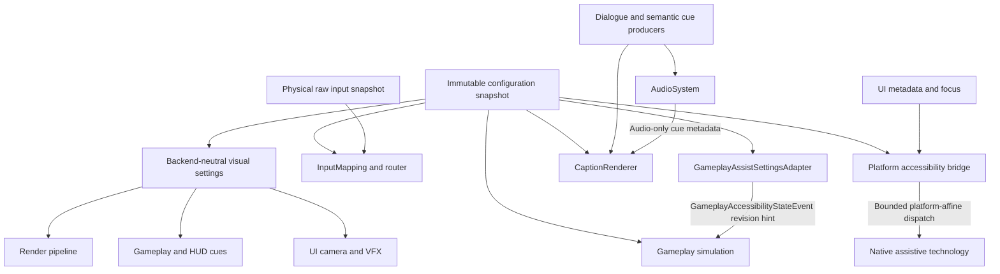

# ADR-015: Accessibility Ownership, Typed Transport and Non-Gating Policy

- **Status**: Proposed
- **Date**: 2026-08-28
- **Supersedes**: None
- **Scope**: Accessibility state ownership, typed transports, configuration snapshots, DataBus boundaries, non-blocking loops, and semantic availability
- **Issue**: [#1849](https://github.com/abdullahbodur/horo-engine/issues/1849) ([ACC-001.1])
- **JIRA**: HORO-1805
- **Normative document**: [Accessibility Architecture](../architecture/runtime/accessibility-architecture.md)

## Context

Accessibility spans dialogue, audio, input, rendering, UI, platform services, and
simulation. Assigning an entire feature family to one subsystem obscures producer
and presenter responsibilities. Informal transports also risk duplicate settings
stores, gameplay dependencies on renderer state, and blocking native calls in core
loops. This decision assigns authority per datum and behavior, and defines the
boundaries through which cooperating subsystems consume it.

## Decision

**Each accessibility datum, setting key, and behavior has one authoritative owner.
A feature may span multiple owners through typed producer/consumer contracts.
Immutable configuration snapshots are the settings authority. DataBus carries
coarse notifications, never accessibility state or frame data. Accessibility
semantics are not gated by graphics quality; native integration reports actual
platform capability. No accessibility path may introduce unbounded core-loop waits.**

### Ratify-or-revise outcomes

| Area | Outcome |
|---|---|
| Ownership | **Revised.** One authority per datum/behavior, with explicit producer and presenter roles; no global accessibility manager. |
| Transport | **Revised.** Semantic captions, immutable visual settings, mapped input, and platform metadata use typed domain interfaces. |
| DataBus | **Restricted.** Only the currently approved `GameplayAccessibilityStateEvent` revision notification crosses this boundary. Additional coarse events require architecture review. |
| Configuration | **Revised.** Domains supply inert typed descriptors; host composition validates unique key ownership. Foundation supplies generic schema/snapshot infrastructure only. |
| Availability | **Revised.** Semantic behavior is independent of graphics quality. Native bridge support is explicit, not promised on unsupported platforms. |
| Threading | **Reconciled.** Per-loop budgets and native thread affinity follow ADR-010/018; bounded notifications are not automatically user operations. |

### Ownership And Typed Transport Map

| Feature | Authorities and consumers | Settings owner / namespace | Consumption boundary |
|---|---|---|---|
| Captions & subtitles | Dialogue/gameplay owns semantic cue identity and timing; Audio owns audio-only cue metadata; UI `CaptionRenderer` owns presentation | Caption presentation domain: `accessibility.captions.*` | Typed `CaptionEvent` queue at HUD frame boundary; audio-only metadata via bounded `AudioEventSnapshot` |
| Colorblind filters | Backend-neutral visual-settings domain owns desired mode; renderer owns shader application; gameplay/HUD independently consume semantic settings | Visual-settings domain: `accessibility.colorblind.*` | Snapshot-backed `IColorAccessibilityQuery` on the consumer's captured revision; render pass applies its own snapshot |
| Input affordances | Collector owns physical facts; `InputMapping`/router owns sticky modifiers, hold/repeat/toggle state and remapping | Input domain: `accessibility.input.*` | Action resolution after immutable raw snapshot, before semantic frame publication |
| Screen reader bridge | UI owns node metadata/focus; Platform owns native dispatch and capability | Platform accessibility domain: `accessibility.screen_reader.*` | Bounded owned messages to the platform-affine dispatcher |
| Gameplay assists | Configuration owns desired settings; gameplay owns applying supported assists; gameplay-owned `GameplayAssistSettingsAdapter` publishes revision hints | Gameplay: `accessibility.gameplay.*` | Simulation tick start acquires authoritative snapshot, even if notification was missed |
| Scale & contrast | UI design system owns layout/palette behavior | UI visual-settings domain: `accessibility.visual.ui.*` | UI frame boundary |
| Motion & flash | Camera/VFX own effects; shared safety policy is read-only to them | Visual-settings domain: `accessibility.visual.safety.*` | Scene/frame setup; no mid-pass state mutation |
| Developer validation | Editor diagnostics owns inspection; test harness owns recording fakes | Editor: `editor.accessibility.*` | Editor tools and deterministic headless tests |

`GameplayAssistSettingsAdapter` is a gameplay-owned composition instance observing
committed configuration revisions. It neither owns settings nor coordinates other
accessibility domains. The simulation also receives a read-only configuration
provider directly; the event is not its state source.

### State, Configuration And DataBus Boundaries

1. [ADR-009](009-configuration-schema-precedence-and-secret-boundary.md) governs
   schema registration, provenance and immutable snapshots. Domain descriptors are
   inert; the host composes them and rejects duplicate keys, owner conflicts and
   invalid values before publishing a revision. Shared readers do not register
   another copy of a setting.
2. `ConfigurationSnapshot` is the authority for desired preferences. A consumer
   captures one revision at its frame/tick boundary. Derived runtime state is local
   to that consumer, never a competing mutable settings store.
3. `GameplayAccessibilityStateEvent` contains only `ConfigurationRevision`.
   Notifications may coalesce or be missed: at every tick start, gameplay compares
   its captured revision to the authoritative snapshot and refreshes if needed.
   Unsupported or authority-restricted assists do not override game rules; normal
   configuration and command authorization still applies.
4. DataBus accepts only coarse asynchronous cross-domain notifications. Captions,
   audio buffers, UI trees, raw input, matrices and authoritative settings stay off
   it. `GameplayAccessibilityStateEvent` is the sole approved accessibility event
   today; adding another requires explicit ownership and transport review.

### Transport And Threading Invariants

- **Captions** originate from semantic dialogue/gameplay cues independently of
  audio playback success, mute state or device presence. Stable cue identities
  suppress duplicates when optional audio timing metadata arrives. Audio-only
  cues use a preallocated queue of fixed-size IDs/metadata; text localization and
  layout happen outside the mixer callback.
- **Visual settings** are backend-neutral. `IColorAccessibilityQuery` reads a
  retained immutable snapshot, never live render state. Gameplay, UI and workers
  may read their own captured revision without cross-thread calls or waits.
  Rendering consumes that same contract independently; gameplay does not depend
  on PostProcessing. Non-color cues remain gameplay/HUD responsibilities.
- **Input** preserves physical facts in `RawInputCollector`. Sticky keys,
  hold/repeat thresholds and toggles belong to semantic mapping after collection.
  Focus loss, device disconnect and context removal clear synthetic held state.
- **Platform bridge** copies call-duration inputs into bounded owned storage and
  dispatches on the OS-required thread/run loop. No synchronous IPC occurs in
  audio callbacks, input collection or render submission. Screen-reader bridging
  does not include engine-owned dialogue TTS synthesis; that would require a
  separate Audio speech-service decision.
- **Async reconciliation** follows [ADR-010](010-job-waiting-and-operation-store-ownership.md)
  and [ADR-018](018-command-registration-permissions-threading-and-packaged-build-policy.md).
  CPU preparation may use `JobSystem`/`JobId`; native calls retain platform affinity.
  Individual node/focus/announcement notifications are bounded messages, not
  `OperationId`s. An exposed long-running user operation uses the application-owned
  `OperationStore` and its authorized coordinator. Neither workers nor bridge
  callbacks mutate a separate operation store; completions are posted to the owner.
  Cancellation and shutdown stop admission and retire owned payloads without
  blocking ordinary main/render/transport paths.

### Availability And Loop Budgets

Graphics quality tables in [Post-Processing And Effects](../architecture/runtime/post-processing-and-effects-architecture.md#performance-and-feature-tiers)
select rendering algorithms, not accessibility eligibility. ADR-016's independent
navigation compute tiers are unrelated. Every rendering backend must preserve the
configured accessibility semantics with an appropriate implementation; headless
hosts preserve settings and logic but do not pretend to display output.

Native bridge capability is `Supported`, `Unavailable`, or `Unsupported` and is
reported separately from user preferences. `NullPlatformAccessibilityBridge`
performs no OS effects and reports unsupported; a distinct test-only
`RecordingPlatformAccessibilityBridge` captures bounded deterministic output.
Neither is evidence of native screen-reader functionality.

The audio callback performs no allocation, blocking locks, I/O or text formatting.
Input accessibility processing has no per-event allocations or unbounded waits.
Render accessibility passes add no synchronous CPU/GPU readback. UI submission is
bounded and never waits for native acknowledgement. Setup-time allocation is not
prohibited; blanket claims that every engine loop is lock-free are not made.

## Consequences

- Authority is explicit while producer/presenter cooperation remains possible.
- Muted and headless caption paths remain testable without successful audio playback.
- Gameplay reads configuration without renderer dependencies or a duplicate bus state.
- Native support and deterministic test doubles have separate, observable contracts.
- These are architecture requirements; runtime implementations and the conformance
  tests listed in the normative document remain follow-up implementation work.

## Rejected Alternatives

- **Universal accessibility DataBus hub**: Adds unnecessary lifetime, ordering and
  allocation costs to domain data that already has typed consumers.
- **Monolithic accessibility manager**: Couples unrelated audio, rendering, input
  and native dispatch lifecycles and obscures authoritative ownership.
- **Accessibility as an optional quality tier**: Core usability must not disappear
  when visual quality is reduced. Product-specific legal applicability and compliance
  evidence are assessed separately; this ADR does not establish legal compliance.
- **Synchronous native calls during render/input/audio work**: Native IPC latency
  cannot satisfy bounded engine-loop contracts.
