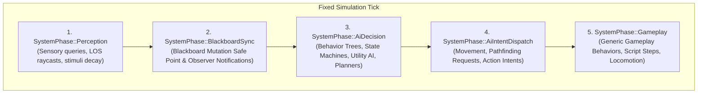

# ADR-021: Gameplay AI Ownership, Scheduling and Behavior Boundary

- **Status**: Proposed
- **Date**: 2026-08-28
- **Supersedes**: None
- **Scope**: Gameplay AI runtime (`HoroAI`), agent brain state, blackboard storage and transactions, perception memory, simulation fixed-tick phases, task scheduler sharing, and separation from editor AI tooling.
- **Issue**: [#1309](https://github.com/abdullahbodur/horo-engine/issues/1309) ([GAI-001.1])
- **JIRA**: HORO-1309
- **Normative documents**:
  - [Navigation And AI Architecture](../architecture/runtime/navigation-and-ai-architecture.md)
  - [Gameplay Behavior Authoring](../architecture/extensions/gameplay-behavior-authoring.md)
  - [Scene Runtime](../architecture/runtime/scene-runtime.md)
  - [Runtime Lifecycle](../architecture/runtime/runtime-lifecycle.md)
  - [Concurrency And Job System](../architecture/foundation/concurrency-and-jobs.md)
  - [Editor AI Agent Architecture](../architecture/editor/editor-ai-agent-architecture.md)

## Context

`docs/architecture/runtime/navigation-and-ai-architecture.md` defines the baseline for NavMesh generation, pathfinding, perception, and high-level behavior integration. As Horo Engine expands its gameplay AI capability (`GAI-001`), the architecture requires explicit boundaries governing state ownership, simulation scheduling, memory lifetime, task execution, and authoring integration.

Without explicit boundaries, gameplay AI risks several common architectural pitfalls:

1. **Ambiguous State Ownership and Aliasing**: AI runtime state (`AiBrainState`, `BlackboardState`, `PerceptionMemory`) living in uncontrolled manager singletons or outliving active scenes, causing stale entity references or memory leaks across scene transitions and Play-In-Editor (PIE) sessions.
2. **Nondeterministic Mutation and Race Conditions**: Senses, behavior trees, and background pathfinding tasks mutating blackboards or ECS components concurrently or mid-tick without explicit safe points.
3. **Competing Task Schedulers**: AI sub-modules introducing bespoke thread pools or background task executors that compete with the Foundation `JobSystem` and violate cancellation and budget guarantees.
4. **Boundary Confusion with Editor AI**: Conflating deterministic gameplay AI (decision graphs, state machines, perception, NavMesh navigation) with editor/IDE LLM agent tooling (`AIA-001` / MCP chat assistant), leading to bloated runtime dependencies or nondeterministic runtime behavior.
5. **Divergent Behavior Primitives**: Generic gameplay behavior authoring and AI decision authoring inventing incompatible blackboard structures, parameter passing, or scheduling nodes.

[GAI-001.1] requires an authoritative architecture decision that ratifies strict scene-generation ownership, establishes discrete fixed-tick execution phases with safe points, enforces complete separation from editor LLM tooling, and mandates shared behavior/blackboard primitives on top of the Foundation job system.

## Decision

**Gameplay AI runtime (`HoroAI`) state is owned strictly by the active `SceneRuntime` generation and bound to generation-checked `EntityId`s. AI execution is partitioned into discrete fixed-tick simulation phases with deterministic blackboard mutation safe points. Gameplay AI is strictly decoupled from Editor LLM/Agent infrastructure. AI decision nodes and generic Gameplay Behaviors share typed execution contexts, schedule node identities, and blackboard key-value semantics without duplicating task scheduler runtimes.**

### Ratify-or-revise outcomes

| Area | Current state | Outcome |
|---|---|---|
| AI State Ownership | Informally described as scene-associated | **Ratified and enforced.** All AI state (`AiBrainState`, `BlackboardState`, `PerceptionMemory`, `AiTaskState`) is strictly owned by the active `SceneRuntime` generation. Entities are referenced via generation-checked `EntityId`s. |
| Fixed-Tick Scheduling | High-level update during behavior pass | **Revised into explicit fixed-tick phases.** Discrete phases: `Perception Update` -> `Blackboard Mutation Safe Point` -> `Decision Evaluation` -> `Action/Navigation Intent Dispatch` -> `Behavior Script Step`. |
| Blackboard Mutation | Ad-hoc property writes | **Revised with transactional safe points.** Blackboard mutations are batched and committed at deterministic synchronization safe points; observers fire only at safe points. |
| Scene ECS Mutation | Direct modification possible | **Restricted.** AI decisions and tasks never mutate ECS topology directly; mutations are queued into `SceneCommandBuffer` and committed at Scene synchronization points. |
| Editor AI / LLM Separation | Separate documents exist | **Ratified and strictly isolated.** `HoroAI` (runtime gameplay AI) is fully decoupled from `HoroEditor` AI agent (`AIA-001`). Packaged games and servers never link Editor LLM / MCP tooling. |
| Task Scheduling Runtime | Potential for independent async executors | **Ratified as single scheduler.** AI background work (pathfinding, perception raycasts, spatial queries) uses Foundation `JobSystem` with scene-scoped cancellation. No secondary thread pools or task managers are permitted. |
| Behavior Primitive Sharing | Separate behavior and AI blackboard structures | **Unified.** Generic gameplay behaviors and AI decision graphs share typed `BlackboardSchema`, `BlackboardKey`, `BlackboardValue` storage, and `ScheduleNodeId` descriptors. |

---

### 1. AI Runtime Ownership and Scene-Generation Binding

All gameplay AI runtime components, controllers, blackboard instances, perception memories, and task execution states are owned exclusively by the active `SceneRuntime` generation:

```text
SceneRuntime (Generation N)
  │
  ├── AiAgentComponent / AiControllerComponent (bound to EntityId)
  ├── AiBrainState (Behavior Tree / State Machine / Utility / Planner instance)
  ├── BlackboardState (instantiated from BlackboardSchema)
  ├── PerceptionMemory (sensed stimuli, age, last known locations)
  └── AiTaskScheduler (scene-scoped async pathfinding/query task tracker)
```

1. **Generation Validation**: Every AI component and runtime structure references entities using generation-checked `EntityId` (or `EntityRef { SceneRuntimeId, EntityId }`). Stale handles from destroyed entities or previous scene generations are immediately detected and rejected.
2. **Scene Lifecycle Boundary**:
   - Activating a scene generation constructs AI agent brains and blackboards from immutable schema descriptors.
   - Deactivating, transitioning, or destroying a scene generation unconditionally cancels all outstanding AI jobs and synchronously releases all AI state, perception memories, and blackboards.
   - Play-In-Editor (PIE) creates an isolated runtime scene clone; AI state exists only in the runtime clone and never mutates the authoring scene document.
3. **No Process-Global AI State**: There is no ambient singleton or global registry holding live agent state. All queries are scoped to the active `SceneRuntimeAccess`.

---

### 2. Fixed-Tick Execution Phases and Mutation Safe Points

To guarantee determinism, avoid race conditions, and support parallel execution across independent agents, the simulation fixed tick is partitioned into discrete, ordered phases:



#### Phase Breakdown

1. **`SystemPhase::Perception` (Perception Update)**:
   - Evaluates spatial candidate broadphase, line-of-sight raycasts, and sensory stimuli (sight, hearing, damage, proximity, team comms).
   - Ingests new stimuli, updates age/decay in `PerceptionMemory`.
   - Read-only with respect to scene ECS transforms and physics state; writes only to agent-private `PerceptionMemory`.

2. **`SystemPhase::BlackboardSync` (Blackboard Mutation Safe Point)**:
   - Processes batched external blackboard writes and perception stimulus reflections into blackboard keys.
   - Validates values against `BlackboardSchema`.
   - Executes registered blackboard change observers deterministically.
   - Freezes blackboard state for the upcoming decision phase.

3. **`SystemPhase::AiDecision` (Decision Evaluation)**:
   - Evaluates high-level decision graphs (Behavior Trees, Hierarchical State Machines, Utility AI, HTN/GOAP planners).
   - Reads frozen `BlackboardState` and `PerceptionMemory`.
   - Evaluates conditional decorators and selector nodes.
   - Generates action and navigation intents; does **not** directly step physical movement or mutate scene hierarchy.

4. **`SystemPhase::AiIntentDispatch` (Action/Navigation Intent Dispatch)**:
   - Translates decision outputs into actionable requests: pathfinding requests (`PathfindingRequest`), steering intents, combat actions, or animation triggers.
   - Submits pathfinding and spatial analysis requests to scene navigation services.

5. **`SystemPhase::Gameplay` (Behavior Script Step & Integration)**:
   - General gameplay behaviors (`IBehaviorInstance::OnFixedUpdate`), script behaviors, and character controllers step.
   - Consumes action/navigation intents, updates kinematics, triggers gameplay events.
   - Writes deferred structural changes to `SceneCommandBuffer`.

#### Mutation Safe Point Invariant

- AI decision nodes and async tasks cannot directly add/remove ECS components, create/destroy entities, or mutate scene hierarchy mid-tick.
- All structural changes must use `SceneCommandBuffer` and commit at standard Scene Runtime synchronization points (`CommitDeferredLifecycleChanges`).

---

### 3. Strict Separation Between Gameplay AI and Editor AI / LLM Tooling

Horo Engine strictly isolates runtime gameplay AI from editor LLM/agent tooling:

```text
┌───────────────────────────────────────────────┐  ┌───────────────────────────────────────────────┐
│           Gameplay AI (HoroAI)                │  │       Editor AI Agent (HoroEditor AI)         │
├───────────────────────────────────────────────┤  ├───────────────────────────────────────────────┤
│ • Native C++20 Runtime (HoroEngine::AI)       │  │ • Authoring Assistant (Editor Layer / GUI)    │
│ • Local, deterministic decision graphs        │  │ • LLM / Cloud / Local Neural Models          │
│ • Behavior Trees, State Machines, Utility AI  │  │ • MCP Tool Bridge (scene query, build, edit)  │
│ • Hard frame budgets, zero heap allocations   │  │ • Human-in-the-loop interactive requests     │
│ • Ships in packaged games & dedicated servers │  │ • Never compiled into packaged games/servers  │
└───────────────────────────────────────────────┘  └───────────────────────────────────────────────┘
```

1. **No LLM in Gameplay AI Runtime Core**: The core gameplay AI runtime (`HoroAI`) contains only deterministic algorithms (finite state machines, behavior trees, utility evaluators, pathfinding, perception spatial queries). Packaged games and dedicated servers do not link editor AI or MCP bridges.
2. **Optional NPC LLM Dialogue Seam**: If a project uses generative AI for dynamic NPC dialogue or high-level narrative reasoning (`GAI-007.4`), it interacts strictly through a bounded, asynchronous gameplay capability (`INpcDialogueService`). This service operates over network/async jobs with explicit fallback behaviors, never blocking the fixed simulation tick or holding direct pointers into live ECS memory.
3. **Editor Tooling for AI Authoring**: The Editor AI Agent (`AIA-001`) may assist developers in authoring Behavior Trees, Blackboard Schemas, or NavMesh configurations via MCP tools. However, these tools emit standard declarative asset files (`.horo_bt`, `.horo_bb`, `.horo_nav`), which are validated and compiled through the asset pipeline like any other asset.

---

### 4. Shared Primitives with Generic Gameplay Behavior

Gameplay AI and generic gameplay behavior authoring share common foundational primitives to prevent duplicated runtime architectures:

1. **Shared Blackboard Key-Value Model**:
   - `BlackboardKey` (stable 64-bit hashed identifier from string name).
   - `BlackboardValue` (bounded, schema-typed variant supporting primitives, `EntityId`, `WorldCoordinate`, vectors, and asset handles).
   - `BlackboardSchema` (immutable asset descriptor declaring keys, types, default values, and replication/persistence flags).
   - Both `BehaviorComponent` and `AiControllerComponent` can bind to and read/write blackboard instances using identical access APIs.

2. **Unified Scheduling and Dependency Identity**:
   - Both systems use `ScheduleNodeId` within `SystemPhase` descriptors.
   - Declarative `reads`, `writes`, `before`, and `after` dependencies allow the scene phase scheduler to interleave or batch behavior systems, perception updates, and AI decision systems safely without order ambiguity.

3. **Single Task Scheduler Runtime (Foundation `JobSystem`)**:
   - Asynchronous AI computations (asynchronous NavMesh pathfinding, perception candidate visibility raycasts, tactical environment query grids) must execute via the Foundation `JobSystem`.
   - AI systems do not spawn independent threads or embed bespoke task queues.
   - All AI background jobs capture a `CancellationToken` tied to the active scene generation and submit completion payloads back to the owner thread via bounded queues to be applied at designated phase safe points.

4. **Execution Context Parity**:
   - `AiExecutionContext` is modeled consistently with `BehaviorContext`: providing `SceneRuntimeAccess`, `EntityId`, `AssetAccess`, `GameplayInputAccess`, `SceneCommandBuffer`, and `RuntimeDiagnostics`, without exposing raw renderer, GUI, or editor internals.

---

## Consequences

### Positive

- **Guaranteed Determinism and Replayability**: Partitioned fixed-tick phases and blackboard safe points ensure AI decisions evaluate consistently without race conditions.
- **Lifetime Safety**: Strict scene-generation binding prevents dangling entity pointers, stale blackboard references, and cross-scene state leakage.
- **Zero Runtime Bloat**: Complete isolation from Editor LLM/MCP tooling keeps packaged games and dedicated server binaries lightweight and secure.
- **Resource Efficiency**: Reusing Foundation `JobSystem` and shared blackboard primitives eliminates redundant scheduler and memory overhead.
- **Modular Extensibility**: Clear extension points for custom perception senses, decision evaluators, and planning providers without breaking core invariants.

### Negative / Trade-offs

- **Deferred Mutation Latency**: Structural ECS changes requested by AI decisions cannot take effect immediately mid-tick; they must wait for the command buffer synchronization point.
- **Phase Scheduling Discipline**: Developers cannot write ad-hoc perception raycasts directly inside decision evaluation callbacks without violating phase boundaries; spatial queries must be gathered during perception/query phases or scheduled as async jobs.

---

## Rejected Alternatives

1. **Process-Global AI Service Singleton**:
   - *Rejected*: Storing agent state, perception memory, and blackboards in an engine-global singleton leads to complex lifetime tracking, memory leaks across scene transitions, and severe issues during multi-scene or PIE execution.
2. **Direct Asynchronous ECS / Blackboard Mutation**:
   - *Rejected*: Allowing background pathfinding or perception worker threads to mutate blackboard values or scene components directly causes data races, nondeterministic behavior, and crashes.
3. **Embedding LLM / Agentic Tooling in Gameplay AI Runtime**:
   - *Rejected*: Coupling runtime gameplay AI to editor LLM agents or MCP protocols introduces massive dependencies, network latency, nondeterminism, and severe security risks to packaged games and dedicated servers.
4. **Bespoke AI Task Thread Pool**:
   - *Rejected*: Creating a separate thread pool for navigation/AI duplicates OS thread resources, bypasses engine-wide concurrency budgets, and prevents unified job observability and cancellation.
