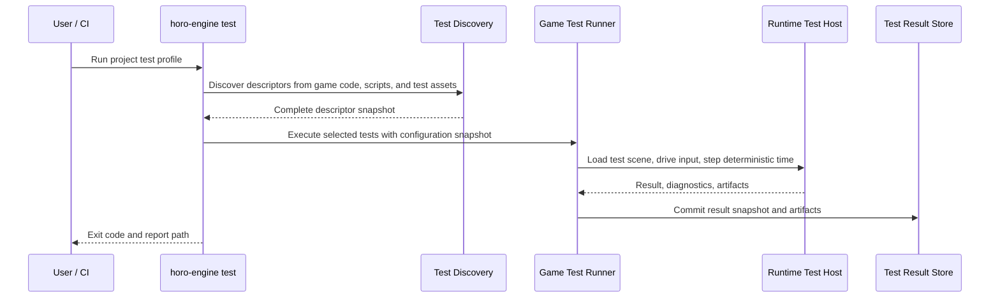

# Game Project Testing Architecture

## Purpose

This document defines how games built with Horo Engine author, discover, run,
report, and automate their own tests. Engine tests protect engine contracts;
game project tests protect game-specific gameplay, content, scenes, input,
builds, and packaged-player behavior.

Game tests are first-class project assets and source code. A Horo game project
must be able to run tests from the editor, CLI, CI, and packaged-player harness
without copying engine test internals or depending on an active GUI.

## Design Context

Horo separates engine tests from project tests and exposes several levels of
automation. The goal is not one universal test type. Real game workflows need a
small taxonomy: fast code tests, editor/content tests, multi-frame play tests,
visual checks, content stress validation, and packaged-build automation.

Test discovery must be visible in the editor, while reports and CI output remain
standard, deterministic, and machine-readable. Editor workflows, CLI runs,
headless CI, and packaged-player harnesses consume the same project test
descriptors and result schema.

## Scope

This architecture covers tests authored inside a game project:

- gameplay unit tests
- component and system tests
- scene and content validation tests
- play-mode/runtime tests across multiple frames
- input and behavior automation
- asset import/cook/package validation for the project
- screenshot or golden-frame checks where deterministic enough
- packaged-player smoke tests
- CI result reporting

It does not replace Horo Engine's own module tests. Engine tests continue to live
in the engine repository and validate public SDK, editor, runtime, and pipeline
contracts. Game tests consume those contracts as a downstream project.

## Test Taxonomy

| Layer | Runs in | Purpose | Typical speed |
|---|---|---|---|
| Game unit | Native test executable or script test runner | Pure gameplay rules, math, state machines, save-data transforms | milliseconds |
| Game integration | Headless runtime with test project loaded | Components, systems, assets, scene conversion, runtime service boundaries | milliseconds to seconds |
| Edit-mode project | Editor/headless authoring host | Import settings, scene validation, project settings, generated descriptors | seconds |
| Play-mode | Runtime scene loop in editor or headless player mode | Multi-frame behavior, input actions, physics, animation, triggers, game rules | seconds |
| Content stress | Headless/editor batch | Load all scenes, import/cook assets, validate references, compile scripts/shaders | minutes |
| Visual/screenshot | Renderer-backed test host | UI/gameplay rendering regressions with per-platform tolerances | seconds to minutes |
| Packaged-player smoke | Built game executable | Startup, default scene, input bootstrap, asset archive lookup, crash-free exit | seconds |

Fast lanes run on every local/PR cycle. Slow, renderer, content-stress, and
packaged-player lanes run in protected, scheduled, or release gates.

## Project Layout

A generated or user-authored Horo game project owns its tests under the project
root:

```text
MyGame/
|-- CMakeLists.txt
|-- src/
|   |-- gameplay/
|   |-- systems/
|   |-- components/
|   `-- tests/
|       |-- test_player_controller.cpp
|       `-- test_inventory_rules.cpp
|
|-- assets/
|   |-- scenes/
|   `-- tests/
|       |-- fixtures/
|       `-- scenes/
|           |-- movement_smoke.scene.json
|           `-- combat_trigger.scene.json
|
|-- tests/
|   |-- integration/
|   |-- playmode/
|   |-- visual/
|   |-- packaged/
|   `-- fixtures/
|
`-- .horo/
    |-- project.json
    `-- test_profiles.json
```

Rules:

- Game tests live with the game project and version with game code/content.
- Engine-private headers are not included by game tests.
- Tests link public SDK targets and the game module, not editor internals.
- Test scenes and fixtures use stable project-relative paths.
- Generated starter templates include a minimal test target and one runtime smoke
  test so new projects start with a working pattern.

## Public SDK Test Surface

Horo provides a small public test SDK for downstream projects:

```cpp
namespace Horo::Test {

struct GameTestContext {
    ProjectPath projectRoot;
    ConfigurationSnapshot configuration;
    RuntimeClock& clock;
    InputTestDriver& input;
    SceneTestDriver& scene;
    DiagnosticSink& diagnostics;
};

class SceneTestDriver {
public:
    Result<void> LoadScene(ProjectPath scenePath);
    Result<void> StepFrames(uint32_t frameCount);
    Result<void> StepSeconds(float seconds);
    EntityId FindEntity(std::string_view stableName) const;
};

class InputTestDriver {
public:
    void PressAction(std::string_view actionName);
    void ReleaseAction(std::string_view actionName);
    void MoveAxis(std::string_view axisName, float value);
};

} // namespace Horo::Test
```

The test SDK is runtime-facing. It may drive input, time, scene loading,
diagnostics, and asset lookup through public contracts. It must not expose
private ECS storage, renderer backend objects, editor widget internals, or
platform-specific handles.

Native downstream tests link the public `HoroEngine::TestSdk` CMake target plus
the game's own gameplay module. They do not link editor, GUI, MCP, or
engine-private test helper targets.

```cmake
add_executable(MyGameTests
    src/tests/test_player_controller.cpp
)

target_link_libraries(MyGameTests
    PRIVATE
        MyGame::Gameplay
        HoroEngine::TestSdk
)
```

Generated starter templates include this wiring so a new project has a compiling
test target and a descriptor that `horo-engine test` can discover.

## Authoring Model

Native game tests use the same test framework as engine tests when linked as C++
test executables. Script-authored or visual-authored behaviors may use a Horo
script test runner, but the test result schema is shared.

Example native test:

```cpp
#include <Horo/Test/GameTest.h>
#include <catch2/catch_test_macros.hpp>

TEST_CASE("Player jumps when grounded", "[game][playmode][movement]") {
    Horo::Test::GameTestContext ctx = Horo::Test::CreateGameTestContext();
    REQUIRE(ctx.scene.LoadScene("assets/tests/scenes/movement_smoke.scene.json"));

    const EntityId player = ctx.scene.FindEntity("Player");
    REQUIRE(player != INVALID_ENTITY);

    ctx.input.PressAction("Jump");
    REQUIRE(ctx.scene.StepFrames(2));

    CHECK(ctx.scene.GetVelocity(player).y > 0.0f);
}
```

Multi-frame tests advance deterministic test time. They do not sleep on wall
clock time and do not depend on host frame rate.

## Discovery And Profiles

Project test discovery is descriptor-based. The build system and runtime scanner
produce a complete test descriptor snapshot before execution:

```json
{
  "horoVersion": "0.0.1",
  "persistentContract": "sha256:5ef87e96e24c0a3a5e44f4dee182dbd3bfb5402e08e07aaf3d64d4a3ff24ae6d",
  "profiles": {
    "fast": {
      "includeTags": ["game", "unit", "integration"],
      "excludeTags": ["slow", "visual", "packaged"]
    },
    "playmode": {
      "includeTags": ["playmode"],
      "timeoutSeconds": 120
    },
    "release-smoke": {
      "includeTags": ["packaged", "smoke"],
      "requiresPackagedBuild": true
    }
  }
}
```

Profiles live in `.horo/test_profiles.json`. They select tests, timeout policy,
target platform, renderer/null-renderer requirement, and whether a packaged build
is required. CLI arguments may override the selected profile for one invocation
without mutating the project file.

## Execution Surfaces

Every game test lane must run from CLI and CI. Editor integration is an observer
and convenience surface, not the only execution path.

```bash
horo-engine test --project /path/to/MyGame --profile fast
horo-engine test --project /path/to/MyGame --profile playmode
horo-engine test --project /path/to/MyGame --profile release-smoke \
    --package build/release/MyGame
horo-engine test --project /path/to/MyGame --list --format json
```

Editor surface:

```text
Tests
  Profiles: Fast | Play Mode | Content Stress | Visual | Packaged Smoke
  Filter: [tag/name/search]
  Run Selected | Run Profile | Stop
  Results: passed, failed, skipped, duration
  Details: diagnostics, logs, captured screenshot, reproduction command
```

The editor reads result snapshots from the test service. It does not own test
execution semantics and does not make a test pass or fail based on widget state.

## Data Flow



The test runner updates an authoritative result store. GUI, CLI, MCP, and CI
adapters query the store or consume exported reports. High-volume logs,
screenshots, traces, and profiler captures remain artifact files or bounded
stores; events carry only revisions and summaries.

## Reporting

Reports support:

- human terminal output
- machine-readable JSON
- JUnit XML for CI systems
- optional HTML summary for local inspection
- artifact paths for screenshots, logs, replay data, and profiler captures

Exit codes are stable:

```text
0  all selected tests passed or were skipped by policy
1  one or more selected tests failed
2  discovery, configuration, or environment error
3  infrastructure timeout or runner crash
4  invalid CLI invocation
```

Test results include stable IDs, tags, owning source location, duration,
diagnostics, captured operation/job IDs, and artifact references. They do not
embed unbounded logs or secret values.

## Determinism Rules

Game tests must be deterministic by default:

- fixed seed unless the test declares fuzzing and records the seed
- deterministic test clock instead of wall-clock sleeps
- explicit input events instead of polling physical devices
- sorted asset and scene discovery
- no dependency on current locale, home directory, or host-specific absolute path
- renderer tests use per-platform baselines and tolerances
- physics and network tests declare deterministic mode or allowed tolerance
- flaky reruns are diagnostic only; a passing rerun does not erase the original
  failure without marking the test flaky

## Content And Packaged Testing

Content tests validate game data, not only code:

- all referenced assets exist and resolve through project-relative IDs
- all scenes load in headless mode unless marked editor-only
- generated behavior descriptors match the loaded game module fingerprint
- import and cook settings are valid for selected target platforms
- packaged archives contain every runtime-required asset
- packaged executable starts, loads the default scene, runs a bounded frame
  count, and exits cleanly in smoke mode

Packaged-player smoke tests must use the same asset-provider path as real player
startup. They must not fall back to source-tree assets unless the profile is
explicitly a development profile.

## CI Policy

Recommended lanes:

| Lane | Runs | Gate |
|---|---|---|
| PR fast | game unit, fast integration, descriptor discovery | required |
| PR optional | play-mode smoke on null renderer | advisory or required by project policy |
| Protected branch | full play-mode, content validation, selected visual tests | required |
| Nightly | content stress, all scenes, platform matrix, packaged smoke | required for release readiness |
| Release | packaged-player smoke on every release-supported target platform | required |

Game projects may tighten these gates, but the engine should provide the common
runner, report schema, and CI examples.
Experimental cross-compilation targets are advisory until they are promoted into
the release support matrix. A planned Android, iOS, or WebAssembly preset does
not automatically make that platform a required release gate.

## Anti-Patterns

- Do not require the graphical editor to run game tests.
- Do not test gameplay only through screenshots or manual QA.
- Do not let game tests include engine-private headers.
- Do not make tests depend on real wall-clock sleeps, real input devices, or
  filesystem enumeration order.
- Do not allow packaged smoke tests to pass by loading source-tree assets.
- Do not hide failing first attempts behind automatic reruns without reporting
  the flake.
- Do not use logs as the pass/fail contract.

## Testing The Test System

The engine's own validation for this feature must cover:

- generated game project includes a compiling test target
- project test discovery finds native and script descriptors deterministically
- tag/profile filtering
- deterministic time stepping and input injection
- scene load and multi-frame play-mode execution
- content validation diagnostics with source locations
- JUnit XML and JSON report schema
- packaged smoke test uses packaged asset provider
- timeout, cancellation, runner crash, and infrastructure error mapping
- editor test panel observes result store without owning execution semantics

## Related Documents

- [Testing Architecture](./testing-architecture.md)
- [Quality And CI](./quality-and-ci.md)
- [Build System](./build-system.md)
- [Build Cache](./build-cache.md)
- [Developer Environment](./developer-environment.md)
- [Gameplay Module](../extensions/gameplay-module.md)
- [Gameplay Module Boundary](../extensions/gameplay-module-boundary.md)
- [Gameplay Runtime Integration](../extensions/gameplay-runtime-integration.md)
- [Runtime Lifecycle](../runtime/runtime-lifecycle.md)
- [Input Architecture](../runtime/input-architecture.md)
- [Asset Pipeline](../runtime/asset-pipeline.md)
- [Concurrency And Job System](../foundation/concurrency-and-jobs.md)
