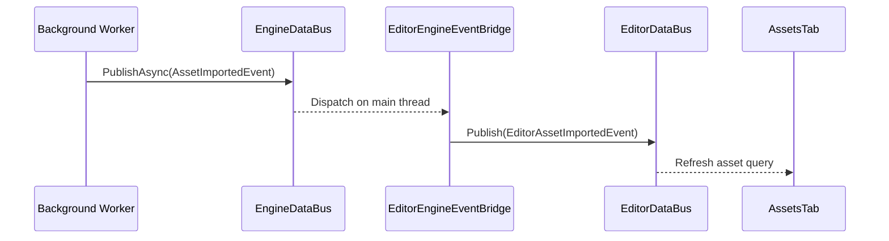

# Editor Data Bus Architecture

## Purpose

This document defines the canonical notification model between editor panels,
tabs, modal workflow surfaces, workspace surfaces, and editor-session services
inside the Horo graphical host.

The editor is a collection of focused UI surfaces that react to shared
editor-session state without holding pointers to each other. The
`EditorDataBus` provides a typed, session-scoped publish/subscribe channel for
notifications such as selection changes, document changes, and viewport-state
changes.

The bus carries notifications that state changed. It does not execute commands
and it is not the authority for that state.

## Scope

The editor data bus is owned by the active `EditorWorkspaceController`. It is
created when an editor workspace session becomes active and destroyed when that
session ends.

The bus is **not**:

- a process-global event system
- a facade that automatically forwards every editor event to `EngineDataBus`
- a request/response or command-dispatch mechanism
- a cross-process transport
- a substitute for application use-case results
- a substitute for direct callbacks inside one tightly coupled UI surface
- a state authority

Opening, closing, stacking, and focusing editor modals are direct
`EditorModalHost` operations and are not bus events.

Editor-local events remain inside the active editor session. Process-level
events are imported through an explicit bridge with an allowlist of event types.
Editor-local events are exported to `EngineDataBus` only when a documented
process-level observer requirement exists.

## Ownership

```text
HoroEditorApp
    |
    +-- EditorLayer                     GUI composition root
            |
            +-- EditorWorkspaceController
            |       |
            |       +-- SceneDocument
            |       +-- EditorSelectionModel
            |       +-- EditorViewportModel
            |       +-- EditorHistory
            |       +-- EditorDataBus
            |       +-- EditorEngineEventBridge
            |
            +-- EditorPanelHost
                    |
                    +-- EditorTab subclasses
```

- `Application` owns the process-scoped `EngineDataBus`.
- `EditorWorkspaceController` owns editor-session models, command routing, and
  `EditorDataBus`.
- `EditorEngineEventBridge` subscribes to selected `EngineDataBus` events and
  republishes editor-facing notifications on `EditorDataBus`.
- `EditorPanelHost` owns tab lifetime and injects a stable `EditorTabContext`.
- The controller and editor bus outlive every attached tab.
- Plugin-provided tabs, panels, modal pages, and settings pages receive the same
  bus through their approved editor-surface context and release subscriptions
  before their provider module is shut down.

## Independent Session Bus

`EditorDataBus` uses the same typed subscription concepts as `EngineDataBus`,
but it owns an independent handler registry. Publishing a selection or viewport
event must not make that event visible to CLI, MCP transport, welcome screens,
other editor sessions, or runtime subsystems.

```cpp
class EditorDataBus {
public:
    template<typename EventT, typename Handler>
    Subscription Subscribe(Handler&& handler);

    template<typename EventT>
    void Publish(const EventT& event);

    void Clear();
};
```

`Subscription` is a move-only RAII token. Destroying or resetting the token
unsubscribes the handler. The token does not outlive the bus that created it;
the workspace shutdown order guarantees tabs release subscriptions first.

Manual numeric handler IDs are not exposed to tabs. This prevents missed
`Unsubscribe()` calls and reduces lifetime coupling between tab implementations
and the bus.

## Process Event Bridge

Editor tabs do not subscribe directly to `EngineDataBus`. The bridge translates
only the process-level events required by the editor:

```cpp
class EditorEngineEventBridge {
public:
    EditorEngineEventBridge(EngineDataBus& engineBus,
                            EditorDataBus& editorBus);

    void Attach();
    void Detach();
};
```

Initial inbound allowlist:

- `ProjectOpenedEvent`
- `ProjectClosedEvent`
- `AssetImportedEvent`
- `AssetReloadedEvent`
- `OperationStoreRevisionChangedEvent`
- `ConsoleLogEvent`
- `MetricsChangedEvent`
- `ProfilerCaptureStateEvent`
- `McpToolInvocationEvent`

The bridge may normalize payloads into editor-specific notification types when
the process event exposes data that UI surfaces should not depend on directly.
Adding a bridge mapping requires a documented editor consumer and a test.
Extension packages may request additional process-event imports in their
descriptors, but the host still owns the bridge allowlist. Approval requires a
declared UI consumer, a safe editor-facing payload shape, permission coverage,
and a regression test. Extensions do not attach GUI handlers directly to
`EngineDataBus`.

This boundary exists because GUI extension surfaces are editor-session objects,
while `EngineDataBus` is process-scoped. Direct process-bus subscriptions from a
tab or modal page would leak events across workspaces, expose process-level
payloads that are not UI contracts, complicate permission review, and make
plugin teardown depend on process shutdown order. The bridge converts approved
process notifications into editor-facing, session-scoped invalidation events.
If an add-on truly needs process-level observation, it declares a separate
process-observer contribution or event-import request; the host then grants a
restricted capability or bridges the event explicitly.



There is no default outbound bridge. If an editor action invokes an application
use case, that use case publishes its own process-level lifecycle event after it
commits. The editor does not mirror its local notification as a second event.

## State Authorities

The authoritative editor-session models are:

- `SceneDocument`: editable scene contents and dirty state
- `EditorSelectionModel`: selected objects, selected asset, and primary selection
- `EditorViewportModel`: editor camera/navigation state
- `EditorHistory`: undo/redo ordering and transactions
- typed editor settings stores and `ResolvedEditorSettings`
- editor services: import, serialization, and other use-case coordination

Each authority mutates its state first and then publishes one notification. A
notification tells subscribers what category changed and identifies the
authority to query; it is not a full state snapshot.

```cpp
struct SelectionChangedEvent {
    SelectionRevision revision;
    SelectionChangeKind kind;
};

struct SceneDocumentChangedEvent {
    DocumentRevision revision;
    DocumentChangeKind kind;
    bool dirty;
    AffectedObjectSummary affected;
};

struct ViewportChangedEvent {
    ViewportRevision revision;
    ViewportChangeKind kind;
};
```

Revisions are monotonic within one editor session. They support cache
invalidation and diagnostics, but subscribers must not assume they receive or
process every intermediate revision.
`SceneDocumentChangedEvent::affected` is an advisory invalidation hint for tabs
that can cheaply refresh a subset of their presentation. Subscribers must
tolerate incomplete summaries and query `SceneDocument` for authoritative state.

## Selection Model

Selection is shared editor-session state, not state owned by `HierarchyTab` or
`ViewportPanel`.

```cpp
class EditorSelectionModel {
public:
    const SelectionSnapshot& Current() const noexcept;

    void SetObjects(std::vector<ObjectId> objectIds,
                    std::optional<ObjectId> primary);
    void SetAsset(std::optional<AssetId> assetId);
    void Clear();
};
```

Hierarchy picking, viewport picking, asset browsing, MCP-driven editor actions,
and restoration from workspace state all update this model on the editor thread.
The model validates references against the active project/document, commits the
new selection atomically, increments its revision, and publishes one
`SelectionChangedEvent`.

A tab attaching after an earlier selection event reads `Current()` immediately.
Correctness never depends on replaying a previous event.

## Commands, Use Cases, And Notifications

UI interaction follows this flow:

```text
component result
    |
    v
EditorWorkspaceController
    |
    +-- editor-local mutation --> EditorHistory command
    |
    +-- shared engine operation --> Application use case
                                      |
                                      v
                              typed Result<T, Error>

owning model/service commits state
    |
    v
notification bus publishes completion/change event
```

Rules:

- Menu bars, toolbars, tabs, and panels do not publish command events.
- Modal workflow surfaces do not publish open/close command events.
- Tabs, panels, and modals may subscribe to typed notifications they observe.
  They may publish notifications only for transient or authoritative state they
  own.
- Operations that return a result are direct typed calls.
- Undoable scene edits execute through `EditorHistory`.
- GUI, CLI, and MCP invoke the same application use cases for shared operations.
- The model or service that commits the state is the only publisher of the
  corresponding change notification.
- Failed operations return typed errors and do not publish success/change events.

Example:

```cpp
void PropertiesTab::CommitTransform(ObjectId objectId, Transform next) {
    m_context->commands.Execute(
        SetTransformCommand{objectId, std::move(next)});
}

void SetTransformCommand::Execute(EditorCommandContext& context) {
    context.document.SetTransform(m_objectId, m_next);
    context.document.NotifyChanged(
        DocumentChangeKind::Transform,
        context.editorBus);
}
```

`Execute()`, `Undo()`, and `Redo()` all use the same document notification path.
Tabs do not publish an additional `SceneDocumentChangedEvent`.

## Tab Contract

Every attached tab receives stable references through `EditorTabContext`:

```cpp
struct EditorTabContext {
    EditorDataBus& events;
    SceneDocument& document;
    EditorSelectionModel& selection;
    EditorViewportModel& viewport;
    EditorCommandDispatcher& commands;
};
```

The context exposes cohesive models and command surfaces rather than pointers to
other tabs, status bars, transport controllers, or an omnibus application
service. A concrete tab receives any feature-specific application capability,
such as `AssetQueries` or `AssetImportOperations`, through its constructor or
registration factory.

Editor modals follow the same command and notification rules through
`EditorModalContext`, but their lifecycle and exclusive focus are owned by
`EditorModalHost`, not by this bus.

For example, `SettingsModal` subscribes to external settings or project
lifecycle changes and participates in publishing settings notifications:

- its modal-owned preview session publishes `Preview` and `Reverted`
  notifications
- the typed settings store publishes `Committed` notifications after persistence
- tabs and panels subscribe, then query `ResolvedEditorSettings`

This lets inactive and interaction-blocked workspace surfaces update their
presentation while the modal remains the sole focus owner.

Tabs must:

- store subscriptions as RAII tokens
- query authoritative models when attaching and after notifications
- route mutations through typed models, commands, or application use cases
- keep presentation-only state private
- keep handlers cheap and non-throwing

Tabs must not:

- hold pointers to other tabs
- treat event payloads as authoritative state
- mutate `SceneDocument` outside the command/undo path
- publish process events for application operations
- depend on global GUI state

Plugin-provided surfaces follow the same rules. Their event handlers are part of
the editor frame budget, so they must invalidate caches or enqueue approved work
rather than perform I/O, compilation, asset scanning, network calls, or blocking
tool execution inline.

```cpp
class PropertiesTab : public EditorTab {
public:
    void OnAttach(EditorTabContext& context) override {
        m_context = &context;
        m_selectionChanged = context.events.Subscribe<SelectionChangedEvent>(
            [this](const SelectionChangedEvent&) { RefreshSelection(); });
        m_documentChanged = context.events.Subscribe<SceneDocumentChangedEvent>(
            [this](const SceneDocumentChangedEvent&) { RefreshDocumentFields(); });
        RefreshSelection();
    }

    void OnDetach() override {
        m_documentChanged.Reset();
        m_selectionChanged.Reset();
        m_context = nullptr;
    }

private:
    EditorTabContext* m_context = nullptr;
    Subscription m_selectionChanged;
    Subscription m_documentChanged;
};
```

## Threading

`EditorDataBus`, editor models, and attached tabs are editor/main-thread only.
Their `Subscribe`, `Publish`, mutation, and detach operations are not
thread-safe and assert editor-thread affinity in development builds.

Background workers publish process-level events through
`EngineDataBus::PublishAsync()`. `Application` dispatches the queued event on the
main thread; `EditorEngineEventBridge` then publishes the editor-facing
notification synchronously.

High-frequency editor interactions such as gizmo drags do not enqueue one event
per pointer movement. The owning model may coalesce notifications at frame or
transaction boundaries while keeping its current state immediately queryable.

## Performance Contract

`EditorDataBus` is an in-memory notification path for responsive editor
coordination. It does not serialize editor-local events, cross a process
boundary, or route them through the asynchronous engine queue.

Steady-state dispatch follows these requirements:

- event lookup is keyed by event type and is proportional only to subscribers of
  that type
- publishing does not scan unrelated event types
- synchronous `Publish()` delivers during the call on the editor thread
- subscription and unsubscription may allocate, but ordinary publication avoids
  heap allocation after the handler snapshot/dispatch storage has reached its
  steady-state capacity
- payloads are small typed values, revisions, identifiers, or change
  classifications rather than copied model snapshots
- handlers invalidate local presentation caches and query authorities; they do
  not perform blocking I/O, parsing, asset loading, or job execution
- development builds can record per-handler duration and report handlers above
  a configurable slow-handler threshold

The bus is the notification plane, not a byte stream. High-volume data such as
console records, profiler samples, file-watch batches, or build output lives in
an owning bounded buffer or queryable service. The bus publishes a revision,
range, or availability notification, and subscribers read the data they need.
This prevents a slow or hidden panel from forcing large payload copies through
every subscriber.

Primitive UI components are not bus participants. They return local interaction
results to their owning screen, panel, tab, or modal. Feature surfaces use the
bus only after an authority commits state or for explicitly owned transient
preview state.

## Dispatch Semantics

- Dispatch is synchronous and depth-first on the editor thread.
- Handler invocation order is unspecified.
- Subscribers may publish another event type immediately. Recursive publication
  of the event type currently being dispatched is queued and delivered after the
  current dispatch completes.
- Subscription changes during dispatch take effect on the next publication.
- Exceptions are isolated and reported; one handler does not prevent remaining
  handlers from running.
- A handler must not perform blocking I/O or long-running work.

When strict sequencing is required, use a coordinator or command transaction,
not subscriber order.

## Lifecycle

Workspace startup:

1. Create editor-session models and services.
2. Create `EditorDataBus`.
3. Create and attach `EditorEngineEventBridge`.
4. Create `EditorPanelHost` and register tabs.
5. Create `EditorModalHost`.
6. Restore workspace state through `EditorWorkspaceController`.

Workspace shutdown:

1. Stop accepting new editor commands.
2. Cancel or transfer session-owned asynchronous work.
3. Resolve and close the modal stack.
4. Gather and persist workspace state while tabs and models are still available.
5. Detach and destroy tabs and dedicated panels in reverse registration order.
6. Detach `EditorEngineEventBridge`.
7. Clear `EditorDataBus`.
8. Destroy editor-session models and services.

No bus callback may run after its owning session begins destruction.

## Testing

Required coverage:

- session-local events never appear on `EngineDataBus`
- bridge allowlisted events reach editor subscribers on the main thread
- unlisted engine events are not forwarded
- RAII subscriptions detach on token destruction
- recursive same-type publication is deferred until the active dispatch completes
- a newly attached tab reads current selection without event replay
- one command produces one document-change notification
- failed commands and failed use cases do not publish success notifications
- settings preview, commit, and revert update subscribers from the resolved
  settings authority
- publication dispatches only to subscribers of the matching type
- steady-state publication meets the no-allocation contract
- high-frequency authorities coalesce notifications without losing current
  queryable state
- slow-handler diagnostics identify the event type and subscriber
- workspace shutdown leaves no live handlers

## Dependencies

- `EditorDataBus` and editor event types belong to the editor model/services
  boundary and do not depend on ImGui.
- `EditorEngineEventBridge` depends on editor events and application-level engine
  events.
- GUI tabs depend on editor models/services and the GUI design system.
- Editor models and services do not depend on tabs, panels, or ImGui.
- Extension-provided editor surfaces depend on the editor surface ABI/context and
  approved capability interfaces, not on concrete built-in tab classes.

## Related Documents

- [Engine Data Bus](../foundation/engine-data-bus.md): process-scoped lifecycle events and
  asynchronous dispatch.
- [Editor Panel Host](./editor-panel-host.md): workspace layout and tab lifetime.
- [Editor Modal Host](./editor-modal-host.md): modal lifecycle, focus, and input
  exclusivity.
- [Editor Document Model](./editor-document-model.md): command transactions,
  history, save, autosave, and document authority.
- [Project Model](./project-model.md): persisted workspace document ownership.
- [Configuration System](../foundation/configuration-system.md): committed settings
  snapshots and change notifications.
- [GUI Design System](./ui-design-system.md): component and screen boundaries.
- [System Design](../foundation/system-design.md): module dependency direction.
