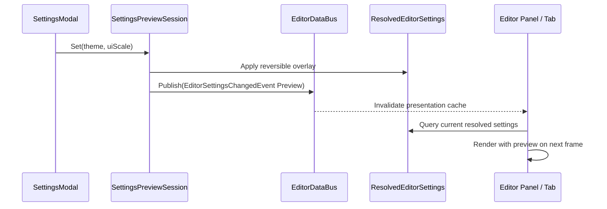
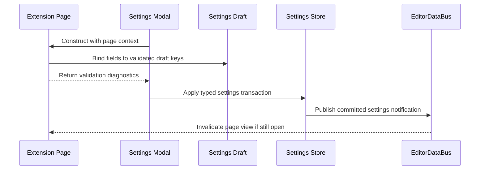

# Editor Modal Host Architecture

## Purpose

This document defines editor modal workflow surfaces: temporary, screen-like
interfaces rendered above the editor workspace that own exclusive interaction
and focus while open.

Examples include:

- Editor Settings
- Build & Release
- Import Asset
- Generate Diagnostic Bundle
- project or scene creation workflows
- destructive-action confirmations
- credential and file-picker dialogs

These surfaces may be visually large and contain navigation, forms, tabs,
progress, logs, and footer actions. They are still modals rather than editor tabs
or application screens because the editor workspace remains mounted and visible
behind them.

## Surface Categories

The GUI uses four distinct surface categories:

| Surface                | Lifetime and placement                                                     | Interaction                                       |
| ---------------------- | -------------------------------------------------------------------------- | ------------------------------------------------- |
| Screen                 | Replaces the current application route, such as Welcome or Project Browser | Owns the application content area                 |
| Panel or tab           | Persistent member of the editor workspace layout                           | Shares interaction with other workspace surfaces  |
| Modal workflow surface | Temporary screen-like surface above the workspace                          | Exclusively owns editor interaction while open    |
| Widget popup           | Short-lived menu, combo, tooltip, or context menu owned by one surface     | Scoped to its owning screen, panel, tab, or modal |

An editor modal:

- is not an `EditorTab`
- is not registered in the `EditorPanelHost` layout tree
- is not persisted as an open workspace surface
- cannot be docked, rearranged, or activated as a tab
- may contain its own internal navigation and widget popups
- blocks interaction with the workspace until it closes

## Ownership

```text
HoroEditorApp
    |
    +-- EditorLayer                         GUI composition root
            |
            +-- EditorWorkspaceController   editor-session state and commands
            +-- EditorPanelHost             persistent workspace surfaces
            +-- EditorModalHost             exclusive modal workflow stack
                    |
                    +-- SettingsModal
                    +-- BuildReleaseModal
                    +-- ImportAssetModal
                    +-- DiagnosticBundleModal
                    +-- child ConfirmationModal / FilePickerModal
```

`EditorLayer` owns `EditorModalHost` because modal composition, focus, and
interaction routing are GUI responsibilities. `EditorWorkspaceController` does
not depend on modal types or ImGui.

The modal host receives borrowed references to:

- `EditorWorkspaceQueries`
- editor-session models and `EditorDataBus`
- GUI navigation, focus, and input-routing services

Each concrete modal receives only its required domain capabilities through its
constructor. For example, `BuildReleaseModal` receives release submission and
job-query interfaces; `SettingsModal` receives typed settings stores. The modal
context is not a service locator.

The modal host and all open modals are destroyed before the editor workspace
controller and referenced services.

## Modal Host Interface

Only one root workflow modal may be open at a time. A root modal may push a child
modal for a confirmation, credential prompt, or file picker. Unrelated root
modals are not queued implicitly; `OpenRoot()` returns `ModalHostError::Busy` so
the caller can keep the current modal, close it deliberately, or report that the
requested workflow is unavailable.

```cpp
class EditorModalHost {
public:
    Result<void, ModalHostError>
    OpenRoot(std::unique_ptr<EditorModal> modal);

    Result<void, ModalHostError>
    PushChild(ModalId parentId, std::unique_ptr<EditorModal> modal);

    Result<void, ModalHostError>
    RequestClose(ModalId modalId, ModalCloseReason reason);

    bool HasOpenModal() const noexcept;
    std::optional<ModalId> TopModalId() const;

    EditorInteractionScope InteractionScope() const noexcept;

    void OnUpdate(float dt);
    void Draw();
    Result<void, ModalHostError> RequestCloseAllForShutdown();
    void ForceDetachAllForShutdown();
};
```

`ModalId` is a validated stable value type. Duplicate IDs in the active stack,
opening a child from a non-top parent, and closing a non-top modal return typed
errors. The host never silently changes stack order.

Open and close requests are structurally committed at the modal frame boundary
so the stack is not mutated while it is being drawn. An accepted root-open
request activates a pending modal interaction gate immediately and consumes the
input transitions that opened it. A root-close request keeps the old gate active
until the next input boundary. This prevents both open-frame and close-frame
interaction from reaching the workspace.

## Modal Contract

```cpp
class EditorModal {
public:
    virtual ~EditorModal() = default;

    virtual ModalId Id() const = 0;
    virtual ModalPresentation Presentation() const = 0;
    virtual ModalClosePolicy ClosePolicy() const = 0;

    virtual Result<void, ModalError>
    OnOpen(EditorModalContext& context) = 0;
    virtual void OnUpdate(float dt) {}
    virtual ModalFrameResult Draw() = 0;
    virtual CloseDecision CanClose(ModalCloseReason reason) = 0;
    virtual void OnClose(ModalCloseReason reason) {}
};
```

`ModalFrameResult` may request no action, request close, or provide local
presentation state for the host. Stack mutations requested during `Draw()` are
deferred until the modal frame boundary. A modal pushes a child through
`EditorModalContext::modals`; it does not directly own another modal object.

`EditorModalContext` exposes cohesive interfaces rather than pointers to editor
tabs:

```cpp
struct EditorModalContext {
    EditorWorkspaceQueries& workspace;
    EditorCommandDispatcher& commands;
    EditorDataBus& events;
    EditorModalHost& modals;
    FocusService& focus;
};
```

The shared context contains editor-session and modal-host capabilities only.
Concrete workflows receive narrow application capabilities through their
factory or constructor. For example, `SettingsModal` receives an
`EditorSettingsStore`, while `BuildReleaseModal` receives
`ReleaseJobOperations`; neither receives an omnibus application service.

Modals are first-class `EditorDataBus` participants. Through `events`, a modal
may both:

- subscribe to editor-session notifications required by its workflow
- publish notifications for transient state that the modal itself owns

Subscriptions use the same move-only RAII tokens as tabs and panels. `OnClose()`
may release them explicitly; any remaining tokens are destroyed immediately
after `OnClose()` when the modal is removed. A modal does not need a direct
pointer to a tab or panel to notify it.

Authoritative notifications still follow ownership:

- a settings store publishes committed settings changes
- a release service publishes release-job changes
- a scene document publishes document changes
- a modal-owned draft or preview session may publish preview and rollback
  notifications

The modal must not impersonate another authority by publishing its committed
event type directly.

Modal-owned notifications are explicitly transient through either a dedicated
event type, such as `ImportPreviewChangedEvent`, or a typed phase such as
`SettingsChangePhase::Preview`. A modal-owned publisher must not emit the
committed phase or committed-only event type owned by an authoritative model or
service.

`OnOpen()` is called exactly once after the host accepts the modal. If `OnOpen()` fails before the modal's first draw, the pending interaction gate is cancelled at the same frame boundary and the previous interaction scope is restored before the next input boundary. The host removes and destroys the failed modal without changing focus scope.
`OnClose()` is called exactly once before destruction.

## Modal Results

A modal may complete with a typed result before or during close. Result delivery
is explicit and happens at most once. Closing a modal without completion reports
a cancellation result only when the opener requested one.

Result callbacks must not mutate the modal stack immediately; stack changes are
deferred through the host frame-boundary mechanism.

Concrete modals return workflow results through typed completion callbacks or
handles supplied to their constructor. Results are not published on a generic
event bus and are never represented by a central variant containing every modal
type.

## Presentation

`ModalPresentation` describes window-level behavior:

```cpp
struct ModalPresentation {
    ModalSizePolicy size = ModalSizePolicy::Large;
    bool dimWorkspace = true;
    FocusTarget initialFocus;
};
```

Supported size policies are token-driven and responsive:

- `Compact`: confirmations and short forms
- `Medium`: import and creation workflows
- `Large`: settings and multi-step tools
- `Workspace`: near-full editor client area with a required visible margin

Settings and Build & Release use `Large` or `Workspace`. Their content may use
internal side navigation or workflow steps, but this navigation remains local to
the modal and does not change the application route.

Modal bounds:

- are constrained to the editor client area
- preserve a visible workspace margin at normal desktop sizes
- become scrollable or use the `Workspace` policy on small viewports
- never place footer actions outside the visible area
- use semantic design tokens for dimming, spacing, border, size, and focus

## Exclusive Interaction And Focus

When the first root modal opens, `EditorModalHost` creates an exclusive
`EditorInteractionScope`.

```cpp
enum class EditorInteractionScopeKind {
    Workspace,
    Modal,
    NativeDialog
};
```

The scope carries the active modal ID where applicable. A pending accepted modal
open is treated as `Modal` even before its first draw.

While the scope is active:

- only the top modal receives pointer and keyboard input
- editor panels, tabs, viewport controls, toolbar, status bar, and in-window menu
  bar cannot be clicked or focused
- native menu commands that mutate editor state are disabled
- editor keyboard shortcuts, gizmos, picking, drag/drop, and context menus are
  suppressed before their handlers run
- the background workspace remains mounted and rendered
- model notifications, job progress, rendering, and non-interactive updates
  continue
- opening the modal cancels active pointer capture, gizmo drags, drag/drop
  payloads, and incomplete text composition owned by the workspace

Input blocking is enforced by the central GUI input router, not only by drawing
a transparent blocker or relying on ImGui hover state. Every GUI command source
checks the active interaction scope before dispatch. Automated tests verify
input blocking at the command-dispatch boundary, not only through visual hit
testing.

External command sources such as MCP and automation still pass through the
workspace command policy on the editor owner thread. Commands that would
invalidate the active modal workflow are rejected with a typed error, deferred
until the workflow closes, or routed through the same close and transition
policy. Read-only queries and operations proven independent of the modal
workflow may continue. Deferred commands are revalidated against the current
workspace and document session before execution.

The dim layer covers the editor client area and consumes outside pointer input.
Outside clicks do not close workflow modals unless their presentation explicitly
allows it. The Settings and Build & Release modals do not dismiss on outside
click.

## Focus Lifecycle

Opening the root modal:

1. Capture the currently focused workspace surface and widget identity.
2. Cancel workspace pointer capture and active drag operations.
3. Activate the modal interaction scope before processing further frame input.
4. Focus the modal's declared initial target on its first rendered frame.

While modals are stacked:

- keyboard focus and accessibility traversal remain inside the top modal
- `Tab` and `Shift+Tab` cycle only through focusable controls in that modal
- a child modal suspends its parent modal's interaction without destroying it
- closing a child restores focus to the control in its parent that opened it
- each workflow modal exposes an accessible title, description, initial focus,
  and close or cancel action
- child modals identify themselves as modal descendants and hide suspended
  parent and workspace controls from accessibility traversal

Closing the root modal:

1. Consume the pointer and keyboard transitions that caused the close.
2. Remove the modal interaction scope at the next input boundary.
3. Restore focus to the captured workspace widget when it still exists.
4. Otherwise focus the owning panel/tab, then the viewport as final fallback.

The close frame cannot click through, trigger a shortcut, accept a drop, or
activate a workspace control behind the modal.

## Modal Stack

The stack contains:

```text
Root workflow modal
    |
    +-- optional child modal
            |
            +-- optional child confirmation
```

The modal stack has a small configured maximum depth. Exceeding it returns
`ModalHostError::StackLimitReached` and reports a development diagnostic.

Only the top modal is interactive. Suspended parents remain rendered beneath the
top modal with an additional dim layer and continue receiving non-interactive
state updates.

A child modal must be causally owned by the current top modal. Examples:

- Settings -> Discard Changes confirmation
- Build & Release -> Select Signing Credential
- Import Asset -> Native/GUI file picker

Opening Settings while Build & Release is active is not a child relationship and
returns `Busy`.

Widget popups such as combo lists, tooltips, and context menus are not entries in
the modal stack. They are owned by the top modal's local popup layer and cannot
escape its focus or clipping scope.

A native OS dialog opened from a modal keeps the editor modal interaction scope
active until the platform dialog completes. The native dialog temporarily owns
OS focus; its result is returned to the top modal, and focus is restored inside
that modal rather than to the workspace.

Platform dialogs use asynchronous integration where available. If a platform
dialog blocks the GUI thread, rendering and main-thread event dispatch may pause,
but the modal interaction scope remains active and is restored before workspace
input resumes.

## Close Policy

`ModalClosePolicy` defines allowed close sources:

```cpp
struct ModalClosePolicy {
    bool allowCloseButton = true;
    bool allowEscape = true;
    bool allowOutsideClick = false;
    bool allowApplicationShutdown = true;
    bool requireDecisionForDirtyDraft = false;
    bool requireDecisionForRunningOperation = false;
};
```

All close paths call `CanClose()`:

- title-bar close button
- footer Cancel or Close action
- `Escape`
- editor workspace transition
- project close
- application shutdown

`CanClose()` returns one of:

- `Allow`
- `Deny`
- `RequireChildConfirmation`

A dirty form or an operation that cannot be safely abandoned pushes a child
confirmation. Close policy is not bypassed by application shutdown; shutdown may
replace the normal confirmation with a shutdown-specific decision surface.

## Settings Modal

See the HTML reference design: [settings-modal.html](./settings-modal.html).

Editor Settings owns a draft settings model:

```text
persisted settings
      |
      v
SettingsDraft
      |
      +-- SettingsPreviewSession
      +-- validation diagnostics
      +-- dirty state
```

The effective settings read by GUI surfaces are resolved from:

```text
committed editor settings
        |
        +-- active reversible preview overlay
        |
        v
ResolvedEditorSettings
```

Only one active settings preview overlay may exist per editor session.
Opening another settings workflow while preview is active is rejected or resumes
the existing modal.

Tabs and panels query `ResolvedEditorSettings`; they do not read the modal draft.

Settings notifications are editor-session events:

```cpp
enum class SettingsChangePhase {
    Preview,
    Committed,
    Reverted
};

struct EditorSettingsChangedEvent {
    SettingsRevision revision;
    SettingsChangePhase phase;
    SettingsDomainSet changedDomains;
};
```

`changedDomains` identifies areas such as theme, UI scale, logging, MCP, build,
or toolchain settings. It is an invalidation hint, not a settings snapshot.

Rules:

- Opening copies the current typed settings into `SettingsDraft`.
- Controls modify the draft, not persisted settings directly.
- Previewable visual settings are applied through `SettingsPreviewSession`,
  which updates `ResolvedEditorSettings` and publishes
  `EditorSettingsChangedEvent{phase = Preview}`.
- `Apply` validates and commits the draft through the typed settings store. The
  store updates committed state and publishes
  `EditorSettingsChangedEvent{phase = Committed}` without closing the modal.
- `OK` follows the same commit path and then closes.
- `Cancel` discards the draft, removes the preview overlay, and the preview
  session publishes `EditorSettingsChangedEvent{phase = Reverted}`.
- Failed validation keeps the modal open, focuses the first invalid control, and
  reports typed diagnostics.
- Closing a dirty draft requires confirmation unless the close action already
  means Cancel.

Example:



This update still occurs while modal focus blocks panel interaction. Background
panels cannot be clicked, but they continue rendering with the new resolved
settings.

MCP, appearance, build, platform, and toolchain sections are internal navigation
destinations of the same Settings modal. They are not editor tabs.

### Extension Settings And Modal Pages

The Settings modal and selected workflow modals may expose typed page extension
points. This allows an add-on package to contribute a settings section, import
wizard page, diagnostics page, or tool-specific configuration page without
forking the owning modal.

Page contributions are descriptors, not imperative UI mutations:

```cpp
struct EditorModalPageContribution {
    ContributionId id;
    ModuleId provider;
    ModalExtensionPoint target;
    std::string_view titleKey;
    std::string_view iconToken;
    std::span<const SettingKeyId> settingKeys;
    CapabilityRequestSet capabilities;
};
```

The owning modal validates and orders pages, constructs page instances through
registered factories, and controls navigation, validation, dirty state, preview,
apply, cancel, and close policy. Extension pages cannot directly close the root
modal, bypass confirmation policy, commit settings, or publish committed
authority events.



Extension pages may subscribe to `EditorDataBus` for the same invalidation model
as built-in pages. They receive only page-scoped capabilities and must release
subscriptions before the page or provider module is destroyed.

## Build And Release Modal

Build & Release is a presentation adapter over the shared release services
defined in [Release Architecture](../release/release.md).

The modal owns:

- request draft and validation presentation
- selected internal workflow step
- filters and expanded log rows
- the job IDs it is observing

It does not own:

- release execution
- authoritative progress or job history
- cancellation state
- artifacts or logs

```text
BuildReleaseModal
    |
    +-- ReleaseRequestDraft
    +-- ReleaseService::Submit(request)
    +-- ReleaseJobQuery / ReleaseJobId
```

Starting a release:

1. Validate the typed draft.
2. Submit it to `ReleaseService`.
3. Store the returned job ID.
4. Observe authoritative job state through query APIs and process-event
   notifications.
5. Render target, configuration, signing, logs, progress, cancellation, and
   final result from the job model.

Closing the modal does not destroy or implicitly cancel a submitted release job.
If a job is running, close policy presents explicit choices supported by the
job: keep running in background, request cancellation, or remain in the modal.
Reopening Build & Release reconnects to active/recent jobs through
`ReleaseService`; correctness does not depend on replaying progress events.

If the release service is unavailable or the job store cannot be queried,
the modal shows a recoverable disconnected state rather than inventing local job
state.

## Commands And Notifications

Opening and closing modals are direct typed GUI operations:

```cpp
modalHost.OpenRoot(std::make_unique<SettingsModal>(initialSection));
```

They are not `EditorDataBus` command events.

Inside a modal:

- local navigation and form interaction use local state or callbacks
- editor-local mutations use `EditorCommandDispatcher`
- shared project, asset, build, and release operations use narrow application
  capabilities and typed use cases
- modals may subscribe to and publish typed `EditorDataBus` notifications
- `EditorDataBus` and `EngineDataBus` carry notifications after state commits
- modal completion returns a typed result to its opener when a result is needed

No handler relies on event subscriber order to drive a modal workflow.

## Frame Order

Each editor frame follows this order:

1. Dispatch queued process events on the main thread.
2. Update editor-session models and authoritative jobs.
3. Determine the active or pending modal interaction scope.
4. Process input through the scope-aware GUI input router.
5. Update and draw the persistent editor workspace.
6. Draw the workspace dim layer when a modal is active.
7. Update and draw the modal stack from root to top.
8. Commit deferred modal stack operations while preserving the input gate rules.
9. Render feedback overlays allowed above modals.

Only critical feedback owned by the active modal or application shutdown may
render above the top modal. Ordinary workspace tooltips, popups, snackbars, and
context menus remain below it or are deferred.

## Persistence

Open modal state is not stored in `.horo/editor_workspace.json`. Restarting or
reopening a project does not restore a modal on top of the workspace.

Durable data belongs to its authority:

- committed editor preferences -> user settings
- committed project settings -> project model
- release jobs and history -> release service/job store
- modal draft, focus, navigation step, and child stack -> transient GUI state

Application recovery may offer to reopen an interrupted durable job, but it does
so through an explicit recovery workflow rather than serialized modal state.

## Threading And Shutdown

`EditorModalHost` and modal lifecycle methods run on the GUI/editor thread.
Worker threads never open, close, or mutate a modal directly. They update
authoritative job state or publish process events that are dispatched on the
main thread.

Shutdown order:

1. Stop accepting new root modal requests.
2. Ask the top modal to resolve dirty drafts and running-operation policy.
3. Persist or discard transient drafts according to the user's decision.
4. Detach modal subscriptions and close the stack from top to root.
5. Destroy `EditorModalHost`.
6. Continue editor workspace shutdown.

Forced shutdown may skip presentation but must still detach subscriptions and
leave durable jobs in a valid cancelled, detached, or recoverable state.

`RequestCloseAllForShutdown()` follows the normal `CanClose()` policy for dirty
drafts and running operations. `ForceDetachAllForShutdown()` is reserved for
forced shutdown after interactive resolution is no longer possible; it skips
presentation but still runs required detach and durable-work cleanup.

## Testing

Required coverage:

- opening a root modal blocks every workspace pointer and keyboard interaction
- toolbar, viewport, native/in-window menu commands, shortcuts, and drag/drop do
  not execute while a modal owns focus
- workspace rendering and job/model updates continue behind the modal
- focus enters the initial modal control and cannot escape through keyboard
  traversal
- accessibility traversal exposes only the top modal with its title,
  description, and close or cancel action
- child modal focus returns to its parent opener
- root close restores workspace focus with the documented fallback
- the close frame cannot click through to the workspace
- unrelated root modal requests return `Busy`
- outside clicks do not dismiss Settings or Build & Release
- dirty Settings drafts apply, cancel, validate, preview, and confirm correctly
- subscribed tabs and panels update after Settings preview, commit, and revert
- modal subscriptions are removed on close and cannot receive later events
- modal-owned publishers cannot emit authoritative committed phases or
  committed-only event types
- release jobs survive modal close and reconnect when reopened
- shutdown detaches all modal subscriptions and resolves running-operation policy
- forced shutdown detaches safely without presenting close confirmation
- compact and workspace-sized modals remain usable at supported UI scales and
  viewport sizes
- `OnOpen()` failure restores the previous interaction scope safely
- modal result callback is delivered at most once
- child modal cannot be pushed by a non-top parent
- stack depth limit reports a typed error
- native dialog keeps modal input scope active until completion
- blocking native dialog restores modal scope before workspace input resumes
- MCP and automation commands that invalidate the active modal are rejected,
  deferred, or routed through close policy
- modal close during pending stack mutation does not corrupt stack order
- Settings preview overlay is reverted on failed/cancelled close
- Build & Release reconnect handles missing/deleted job IDs gracefully

GUI screenshot scenarios cover Settings, Build & Release, nested confirmation,
validation errors, running progress, and disabled background interaction.

## File Mapping

```text
gui/screens/editor/
    EditorLayer.h/cpp
    EditorModalHost.h/cpp
    EditorModal.h
    EditorModalContext.h
    modals/
        SettingsModal.h/cpp
        BuildReleaseModal.h/cpp
        ImportAssetModal.h/cpp
        DiagnosticBundleModal.h/cpp
        ConfirmationModal.h/cpp
```

## Related Documents

- [Editor Panel Host](./editor-panel-host.md): persistent workspace layout and tab
  lifecycle.
- [Editor Data Bus](./editor-data-bus.md): editor-session notifications and
  authoritative state.
- [GUI Design System](./ui-design-system.md): modal primitives, focus, tokens,
  and accessibility.
- [Editor Modal Host Examples](./editor-modal-host-example.html): HTML reference
  designs for alert, confirmation, and large workspace modals.
- [GUI Screen Host](./gui-screen-host.md): top-level routes and the distinction
  between screens and modal workflows.
- [Input Architecture](../runtime/input-architecture.md): central interaction scopes,
  capture cancellation, and modal input routing.
- [Configuration System](../foundation/configuration-system.md): Settings draft, preview,
  validation, and atomic snapshot commit.
- [Release Architecture](../release/release.md): authoritative release request and job
  model.
- [Testing Architecture](../delivery/testing-architecture.md): GUI workflow and focus
  testing.
- [System Design](../foundation/system-design.md): dependency and ownership boundaries.
- [Observability Architecture](../observability/observability.md): logging settings, persistent
  stores, and diagnostic-bundle contents.
