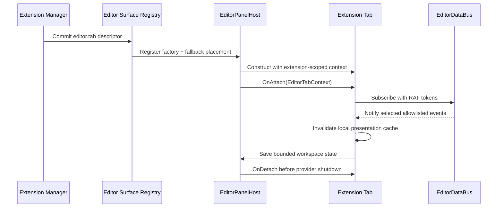

# Editor Panel and Tab Architecture

## Purpose

This document defines the layout model for the Horo Editor workspace: how panels,
tabs, docks, and toolbars are composed into the main editing screen. It is a
companion to [Editor Data Bus](./editor-data-bus.md), which defines how tabs
communicate.

The editor workspace shown in the screenshots is structured as:

```text
+----------------------------------------------------------+
|  System menu bar (File / Edit / Assets / GameObject / Component / Window / Build / Help)             |
+----------------------------------------------------------+
|  Toolbar (Select / Move / Rotate / Scale / Play / Scene) |
+----------+-------------------------------+---------------+
|          |                               |               |
|  Left    |                               |   Right       |
|  Dock    |        Viewport               |   Dock        |
|          |                               |               |
|  -       |                               |  Properties   |
|  Hierar- |                               |               |
|  chy     |                               |               |
|  -       |                               |               |
|  Project |                               |               |
|          |                               |               |
+----------+-------------------------------+---------------+
|  Bottom Dock (Assets / Console / MCP / Performance)      |
+----------------------------------------------------------+
|  Status bar                                              |
+----------------------------------------------------------+
```

Each visible region has a clear architectural owner.

## Top-Level Owners

```text
EditorLayer
    |
    +-- EditorWorkspaceController owns editor-session state and command routing
    |       |
    |       +-- SceneDocument
    |       +-- EditorSelectionModel
    |       +-- EditorHistory
    |       +-- EditorDataBus
    |
    +-- EditorMenuBar            system menu bar (File, Edit, Assets, GameObject, Component, Window, Build, Help)
    +-- EditorToolbar            top icon bar (select, transform, play, scene)
    +-- EditorPanelHost          owns layout tree and tab containers
    |       |
    |       +-- RootSplit (vertical)
    |               |
    |               +-- MainRowSplit (horizontal)
    |               |       |
    |               |       +-- LeftSplit (vertical)
    |               |       |       +-- HierarchyTabStack
    |               |       |       +-- ProjectTabStack
    |               |       |
    |               |       +-- ContentSplit (horizontal)
    |               |               +-- ViewportPanel
    |               |               +-- PropertiesTabStack
    |               |
    |               +-- BottomTabStack
    |                       +-- AssetsTab
    |                       +-- ConsoleTab
    |                       +-- McpTab
    |                       +-- PerformanceTab
    |
    +-- EditorModalHost          exclusive modal workflows above the workspace
    |
    +-- EditorStatusBar          bottom status line
```

`EditorLayer` is the GUI composition root. It creates the workspace controller,
panel host, modal host, menu bar, toolbar, status bar, and viewport render
integration, then forwards frame lifecycle calls.

`EditorLayer` is also the GUI coordinator for top-level presentation actions. It
consumes typed results from the menu bar and toolbar, opens GUI-only surfaces
through `EditorModalHost` or `EditorPanelHost`, and forwards editor-session
operations to `EditorWorkspaceController`. It does not implement domain
operations itself. `EditorWorkspaceController` is not a GUI coordinator and
does not depend on menu, toolbar, panel, or modal types.

```cpp
class EditorLayer {
private:
    void Handle(const EditorMenuResult& result);
    void Handle(const EditorToolbarResult& result);
};
```

These handlers perform routing only. Each result remains a narrow type owned by
its source surface; the editor does not introduce one central variant containing
every possible GUI or domain action.

`EditorWorkspaceController` owns:

- the active `SceneDocument`
- the authoritative `EditorSelectionModel`
- the command dispatcher and `EditorHistory`
- the `EditorDataBus`
- editor-session services
- borrowed application use-case and process-service interfaces
- editor-session lifecycle and workspace state coordination

`EditorPanelHost` owns layout and tab lifetime. Individual tabs own only their
presentation state and drawing.

`EditorModalHost` is a separate overlay owner. Settings, Build & Release, import,
and confirmation workflows are not tabs or layout nodes. While a modal is open,
the panel host remains mounted and rendered but receives no user interaction.
Tabs and panels remain subscribed to `EditorDataBus`, so presentation changes
published by the modal or an owning settings service can update the background
workspace while its interaction is blocked.
See [Editor Modal Host](./editor-modal-host.md).

## Panel Host

> [!NOTE]
> **Phase 1 Implementation Status:** 
> The architecture described below (with dynamic Layout Trees, `EditorPanelHost`, and `EditorTab` virtual interfaces) outlines the long-term target architecture. 
> 
> Currently, the editor uses a simplified **Phase 1** implementation:
> - Layout regions are defined by a fixed enum: `WorkspaceDockArea` (Left, Right, Bottom, Document).
> - Panels are registered via `WorkspacePanelRegistry` using the `WorkspacePanelInfo` struct, which relies on `std::function` callbacks (`drawPanel`, `drawIcon`) for immediate-mode rendering rather than full object-oriented interfaces.
> - The `EditorWorkspaceView` acts as the Layout Manager (`EditorPanelHost` equivalent), automatically querying the registry, drawing `Ui::DrawDockTabs`, and managing child windows for the active panel content.
> - Active tab state per dock area is stored in `EditorWorkspaceViewModel` and mutated via `EditorWorkspaceViewCommand::ChangeActivePanel`.
>
> The advanced node tree layout below will be introduced when custom draggable window layouts are implemented.

`EditorPanelHost` is a thin layout and tab-lifecycle manager. It knows:

- the workspace layout tree
- which tabs live in each tab stack
- which tab is active in each tab stack
- split direction, ratios, minimum sizes, and collapsed state
- tab registration, attachment, detachment, and destruction order

It does **not** know:

- what a SceneDocument contains
- what the current selection means
- how to render a gizmo
- how to import an asset
- how to execute an MCP command
- how to execute editor or application commands

### Layout Model

The layout is a tree rather than a fixed list of left/right/bottom regions. This
allows the current workspace and future workspaces to compose nested split views,
tab stacks, and dedicated panels without changing the host interface.

```cpp
struct LayoutNode;

struct SplitNode {
    LayoutNodeId id;
    SplitAxis axis;
    float ratio = 0.5f;
    float firstMinimumSize = 160.0f;
    float secondMinimumSize = 160.0f;
    std::unique_ptr<LayoutNode> first;
    std::unique_ptr<LayoutNode> second;
};

struct TabStackNode {
    LayoutNodeId id;
    std::vector<TabId> tabs;
    std::optional<TabId> activeTab;
    bool collapsed = false;
};

struct PanelNode {
    LayoutNodeId id;
    PanelId panel;
};

struct LayoutNode {
    std::variant<SplitNode, TabStackNode, PanelNode> value;
};
```

The viewport is a `PanelNode`, not a special hard-coded dock. The default editor
layout places it in the center of the tree, but alternative workspace layouts
may place other dedicated panels there.

### Host Interface

```cpp
struct TabPlacement {
    LayoutNodeId stack;
    std::optional<size_t> index; // No index appends to the stack.
};

struct TabRegistration {
    TabPlacement fallbackPlacement;
    bool openByDefault = true;
};

struct PanelRegistration {
    LayoutNodeId fallbackNode;
};

class EditorPanelHost {
public:
    Result<void, PanelHostError>
    RegisterTab(std::unique_ptr<EditorTab> tab,
                const TabRegistration& registration);
    Result<void, PanelHostError>
    RegisterPanel(std::unique_ptr<EditorPanel> panel,
                  const PanelRegistration& registration);
    Result<void, PanelHostError> UnregisterTab(TabId tabId);
    Result<void, PanelHostError> UnregisterPanel(PanelId panelId);
    Result<void, PanelHostError> OpenTab(TabId tabId, TabPlacement placement);
    Result<void, PanelHostError> MoveTab(TabId tabId, TabPlacement placement);
    Result<void, PanelHostError> CloseTab(TabId tabId);
    Result<void, PanelHostError> SetActiveTab(LayoutNodeId stackId, TabId tabId);

    EditorTab* FindTab(TabId tabId);
    EditorPanel* FindPanel(PanelId panelId);

    LayoutLoadReport LoadLayout(const WorkspaceLayout& layout);
    WorkspaceLayout SaveLayout() const;

    void OnUpdate(float dt);
    void Draw();
};

enum class PanelHostErrorCode {
    DuplicateSurfaceId,
    UnknownSurface,
    UnknownLayoutNode,
    InvalidPlacement,
    TabNotInStack,
    SurfaceStillReferenced
};

struct PanelHostError {
    PanelHostErrorCode code;
    std::optional<TabId> tab;
    std::optional<PanelId> panel;
    std::optional<LayoutNodeId> node;
};

enum class LayoutLoadIssueCode {
    UnsupportedSchema,
    InvalidNode,
    MissingSurface,
    GeometryClamped
};

struct LayoutLoadIssue {
    LayoutLoadIssueCode code;
    std::optional<TabId> tab;
    std::optional<PanelId> panel;
    std::optional<LayoutNodeId> node;
};

struct LayoutLoadReport {
    bool usedDefaultLayout = false;
    std::vector<LayoutLoadIssue> issues;
};
```

`TabPlacement` identifies the target stack and optional insertion index.
Placement is validated before any layout mutation. An out-of-range explicit
index, a non-stack target, or a target that cannot accept the tab returns
`InvalidPlacement`.

`PanelRegistration::fallbackNode` names a dedicated `PanelNode` declared by the
versioned default layout or by the provider's transactionally registered layout
extension. Registering a panel does not create arbitrary split nodes implicitly.

Errors and load issues include stable codes plus relevant surface or node IDs
for diagnostics. Callers never parse an error message to determine recovery.

`TabId`, `PanelId`, and `LayoutNodeId` are validated value types backed by stable
serialized strings. Duplicate surface IDs, unknown node kinds, invalid node
references, and attempts to activate a tab outside its stack return
`PanelHostError`; they do not silently modify the layout. Dedicated panels
implement the same attach, update, draw, and detach lifecycle as tabs but do not
expose a tab label or participate in a `TabStackNode`.

Loaded splitter ratios and dimensions are clamped against the current window
size, UI scale, and node minimum sizes. Structurally invalid or incompatible
layouts fall back to the versioned default layout while preserving recoverable
surface state. References to temporarily unavailable optional surfaces are
reported in `LayoutLoadReport` and skipped without making the remaining layout
invalid.

Registration makes a surface available and attaches its lifecycle; placement is
a separate layout operation. `TabRegistration` and `PanelRegistration` provide
fallback placement metadata for new workspaces, schema migration, and newly
available extensions. Fallback placement does not reopen a tab recorded as
closed in persisted workspace state. `OpenTab()` places an already registered
tab, `MoveTab()` changes its stack and index, and `CloseTab()` removes it from
the visible layout without unregistering or destroying it. `UnregisterTab()` and
`UnregisterPanel()` detach and destroy the registered surface after removing all
layout references.

### Panel and Tab Service Provisioning (Registry Architecture)

To support modular addition of workspace panels (such as `HierarchyPanel`,
`InspectorPanel`, `ConsoleTab`, or third-party package dashboards) without
passing a monolithic context object or modifying `EditorWorkspaceController`
for each new surface, panel construction uses composition-time service
provisioning (`EditorServiceRegistry`).

```cpp
using TabFactory = std::function<std::unique_ptr<EditorTab>(
    const EditorServiceRegistry& services)>;
using PanelFactory = std::function<std::unique_ptr<EditorPanel>(
    const EditorServiceRegistry& services)>;
```

- **Scoped Dependency Injection:** When `EditorLayer` activates the workspace, `EditorWorkspaceController` populates the session `EditorServiceRegistry` with narrow capabilities (`EditorDataBus&`, `SceneDocument&`, `EditorSelectionModel&`).
- **Dynamic Surface Instantiation:** Each panel or tab descriptor registers its factory function with `PanelRegistry`. `EditorPanelHost` constructs registered surfaces by supplying only the required services, avoiding tight coupling between panels and preventing header bloat at the workspace composition root.

## Surface Contracts

Tabs implement `EditorTab`; dedicated panels implement `EditorPanel`:

```cpp
enum class EditorSurfaceVisibility {
    Visible,
    Hidden
};

class EditorTab {
public:
    virtual ~EditorTab() = default;

    virtual Horo::Editor::TabId Id() const = 0;
    virtual std::string_view TabLabel() const = 0;

    virtual void OnAttach(EditorTabContext& ctx) {}
    virtual void OnDetach() {}
    virtual void OnVisibilityChanged(EditorSurfaceVisibility visibility) {}
    virtual void OnUpdate(float dt, EditorSurfaceVisibility visibility) {}
    virtual void Draw() = 0;

    virtual TabWorkspaceState SaveWorkspaceState() const { return {}; }
    virtual void LoadWorkspaceState(const TabWorkspaceState& state) {}
};

struct EditorPanelContext {
    EditorDataBus& events;
    SceneDocument& document;
    EditorSelectionModel& selection;
    EditorViewportModel& viewport;
    EditorCommandDispatcher& commands;
};

class EditorPanel {
public:
    virtual ~EditorPanel() = default;

    virtual Horo::Editor::PanelId Id() const = 0;

    virtual void OnAttach(EditorPanelContext& ctx) {}
    virtual void OnDetach() {}
    virtual void OnVisibilityChanged(EditorSurfaceVisibility visibility) {}
    virtual void OnUpdate(float dt, EditorSurfaceVisibility visibility) {}
    virtual void Draw() = 0;
};
```

Tabs receive:

- a stable `EditorTabContext` containing references to editor models, the
  command dispatcher, and `EditorDataBus`
- feature-specific application capabilities through the concrete tab factory or
  constructor

Dedicated panels receive an `EditorPanelContext` governed by the same rules:
cohesive editor-session queries, models, commands, and notifications belong in
the stable context; feature-specific application or rendering capabilities are
provided through the concrete panel factory or constructor.

Tabs request state changes through typed models, editor commands, or application
use cases. They subscribe to notifications they need to react to.

Lifecycle guarantees:

- `OnAttach()` is called exactly once after successful surface registration.
- A failed registration never attaches or retains the surface.
- `OnDetach()` is called exactly once before unregistering or destroying an
  attached surface.
- Tabs and dedicated panels are detached in reverse registration order before
  the context, editor bus, models, or services are destroyed.
- The host supplies visibility state and reports visibility transitions for
  tabs and dedicated panels.
- After `OnAttach()`, the host delivers the initial visibility before the first
  `OnUpdate()`. Later visibility transitions are delivered before the next
  update or draw for that surface.
- `OnVisibilityChanged()` runs once for each visibility transition and is used
  to acquire or release visibility-scoped presentation resources.
  `OnUpdate()` receives the current visibility every update so ordinary
  per-frame work can remain explicit without querying host internals.
- A tab is visible only when it is active in a non-collapsed stack with visible
  layout bounds. A dedicated panel is visible when its node and all ancestors
  are non-collapsed and have visible bounds. Modal interaction blocking does not
  by itself change surface visibility.
- Hidden surfaces remain attached and receive notifications for invalidation,
  but they do not perform expensive refreshes, thumbnail generation, filesystem
  scans, render-target work, or metric queries until visible or explicitly
  scheduled as a bounded background job.
- Subscriptions use move-only RAII tokens so tab destruction cannot leave
  dangling handlers.

## Extension Surfaces

Built-in and plugin-provided tabs and panels register through explicit editor
extension points and follow the same ID, capability, lifecycle, input, and
data-bus rules. Factories provide fallback placement metadata; they do not
mutate the active layout directly.

The panel host is the IDE surface integration point. It must be capable of
hosting first-party tabs and external add-on tabs through the same registration
path. A package can add a new tab, dedicated panel, diagnostics view, asset tool,
profiler view, or project utility without requiring a new `EditorLayer` member
or a hard-coded branch in the workspace layout code.

Extension tab descriptors declare:

- stable contribution ID and provider module ID;
- display label, icon token, and localization key;
- fallback tab stack or dedicated panel node;
- whether the surface opens by default in new workspaces;
- requested editor-session events and process-event bridge imports;
- required capabilities such as scene queries, selection queries, asset queries,
  log queries, metric queries, or specific editor commands;
- workspace-state schema version and byte limits.

The host validates the descriptor, resolves capabilities, creates the surface
factory, and then calls the ordinary `RegisterTab()` or `RegisterPanel()` path.
The factory receives an extension-scoped context; it does not receive the whole
`EditorLayer`, raw ImGui dock IDs, renderer backend objects, or process-global
services.



Requested event subscriptions are advisory for validation, diagnostics, and
permission review. A tab still performs subscription through the typed
`EditorDataBus` API at attach time. Event payloads remain invalidation hints;
the tab queries the authoritative model or store for the data it needs.

Extensions may contribute new editor-local event types only under their stable
module prefix. Those events are visible only to the active editor session unless
an explicit process-level bridge is documented and approved.

Persisted layouts may reference a surface whose provider is not currently
available. The host reports the missing ID in `LayoutLoadReport`, skips it
safely, and retains its serialized placement as unresolved layout metadata.
`EditorWorkspaceController` preserves the unavailable surface's bounded opaque
workspace state so both can be restored if the provider becomes available in a
later session.

Plugin disable, update, and removal normally take effect after restart. During
shutdown, plugin surfaces detach before plugin shutdown callbacks. If a future
plugin API explicitly supports safe runtime unload, all contributed surfaces
must be detached and destroyed, subscriptions and registered callbacks must be
removed, extension registrations must be withdrawn transactionally,
plugin-owned asynchronous work must be cancelled or joined, and queued callbacks
into plugin code must be drained before the plugin code is unloaded. Failure to
prove any invariant rejects runtime unload and leaves restart as the only
supported path.

## Mapping to the UI

### Left Dock

Visible in the screenshot as the tall panel on the left, split into two
sections:

- **Hierarchy tab**: shows the scene object tree (`Room`, `floor_000`, `wall_north`,
  etc.) and the search filter.
  - Owner: `HierarchyTab`
  - Writes selection through: `EditorSelectionModel`
  - Subscribes to: `SceneDocumentChangedEvent`

- **Project tab**: shows the project file tree (`assets`, `shaders`, `src`,
  `CMakeLists.txt`).
  - Owner: `ProjectTab`
  - Writes asset selection through: `EditorSelectionModel`
  - Opens files through: typed editor/application commands
  - Subscribes to: `ProjectOpenedEvent`

## Embedded Source Editor

The editor workspace includes source-editing surfaces for project scripts,
native behavior templates, generated-code previews, shader source, package
manifests, and diagnostics-linked text files. These surfaces are editor panels or
modal-owned editors; they are not separate top-level screens and they are not a
replacement for an external IDE.

Initial source editor integration uses **Zep** as the preferred embedded editor
widget, wrapped behind Horo-owned source-editor interfaces. Zep was selected over
`goossens/ImGuiColorTextEdit` for the first code-oriented editor surface because
it is more aligned with engine IDE workflows: embeddable core, ImGui renderer,
tabs and splits, modal/modeless editing modes, key mapping, search, markers,
REPL/live-coding orientation, and broader adoption. The research snapshot used
for this decision was collected on `2026-07-05T11:45:01Z`:

| Candidate | Stars | License | Recent activity | Fit |
|---|---:|---|---|---|
| `Rezonality/zep` | 1030 | MIT | pushed 2026-05-23 | Preferred code editor foundation |
| `goossens/ImGuiColorTextEdit` | 218 | MIT | pushed 2026-06-29 | Good lightweight text/diff widget, fallback or specialized read-only/editor-lite use |

GitHub stars are a weak popularity signal, not an architecture requirement. The
selection is based on embedding model, feature surface, license, maintenance,
and expected extension path. If Zep integration proves too invasive, the fallback
is `goossens/ImGuiColorTextEdit` for a narrower text editor while Horo-owned IDE
services remain unchanged.

Zep and any future text editor library remain private to the editor source-editor
adapter target. Public Horo headers expose Horo value types only:

```cpp
struct SourceEditorDocumentId;
struct SourceEditorCursor;
struct SourceEditorSelection;
struct SourceDiagnosticMarker;

class ISourceEditorSurface {
public:
    virtual void SetText(std::string_view text) = 0;
    virtual SourceEditSnapshot CaptureSnapshot() const = 0;
    virtual void ApplyDiagnostics(std::span<const SourceDiagnosticMarker>) = 0;
};
```

AI-assisted editing, code completion, IntelliSense, refactoring, and agent mode
are not implemented inside Zep. The source editor widget is the presentation and
text interaction surface only. Intelligence is provided by Horo-owned services:

- `SourceDocumentService` owns document identity, snapshots, dirty state,
  encoding, and save/reload coordination.
- `LanguageServiceClient` owns LSP-style completion, hover, go-to-definition,
  rename, diagnostics, semantic tokens, and formatting integration.
- `AiCodeAssistService` owns prompt construction, context selection, tool
  approvals, patch preview, and agent-mode sessions.
- `SourceEditorController` coordinates editor commands, selections, diagnostics,
  and inline assistant results without exposing third-party editor internals.

Completion and AI results are applied as explicit editor commands with previews,
undo entries, and diagnostics. Agent mode may propose multi-file changes, but it
does not mutate source files directly from the widget callback. All writes go
through project document/application services and the same approval policy used
by MCP or other automation surfaces.

Required source editor constraints:

- no third-party editor type in public Horo APIs;
- no direct filesystem writes from the widget;
- diagnostics use typed source ranges, not parsed console strings;
- completion/AI providers are cancellable and tied to document revision;
- stale completion or agent results are rejected when the source snapshot changes;
- large files use bounded memory and may open in read-only or external-editor
  mode until a streaming editor contract exists;
- editor shortcuts participate in the workspace shortcut conflict policy.

## Embedded Node Editors

Node-based authoring surfaces appear inside workspace panels or dedicated editor
tabs. They are used for shader/material graphs, behavior graphs, state machines,
and future audio/procedural graphs. The node widget is presentation only; graph
asset schemas, validation, compilation, and runtime execution are owned by the
relevant subsystem.

Initial node editor integration uses **imgui-node-editor** for production graph
surfaces and keeps **imnodes** as the lightweight fallback/prototype option. The
research snapshot used for this decision was collected on `2026-07-05T11:45:01Z`:

| Candidate | Stars | License | Recent activity | Fit |
|---|---:|---|---|---|
| `thedmd/imgui-node-editor` | 4447 | MIT | pushed 2026-03-29 | Preferred production graph editor foundation |
| `Nelarius/imnodes` | 2462 | MIT | pushed 2026-05-13 | Lightweight fallback/prototype/simple graph surfaces |

`imgui-node-editor` has the stronger adoption signal and is designed as a richer
node editor layer on Dear ImGui. `imnodes` is smaller and explicitly immediate
mode, which is useful for prototypes or simple internal tools, but Horo's graph
surfaces need stable persisted node/link IDs, navigation, selection, context
menus, graph validation overlays, and complex interaction policies.

Graph editor library types remain private to Horo adapter targets. Public graph
surfaces exchange Horo graph documents:

```cpp
struct GraphDocumentId;
struct GraphNodeId;
struct GraphPinId;
struct GraphLinkId;
struct GraphDiagnostic;

class INodeGraphSurface {
public:
    virtual void SetGraphSnapshot(const GraphViewSnapshot&) = 0;
    virtual std::vector<GraphEditCommand> DrainUserCommands() = 0;
    virtual void ApplyDiagnostics(std::span<const GraphDiagnostic>) = 0;
};
```

The widget may produce user-intent commands such as create node, connect pins,
move selection, rename node, or open context menu. It does not validate gameplay,
shader, material, audio, or procedural semantics itself. Subsystem validators own
type checking, cycle rules, asset references, feature requirements, code/shader
generation, and runtime compatibility.

## Viewport Panel

The viewport panel owns rendering of the active scene camera or game camera in
the center and does not participate in tab stacking.

- Owner: `ViewportPanel`
- Responsibilities:
  - render the scene through the render target
  - draw gizmos and selection highlights
  - handle viewport navigation input
  - route picking through `EditorSelectionModel`
  - route drag-drop mutations through editor commands
- Writes viewport state through: `EditorViewportModel`
- Subscribes to: selection and document notifications

`ViewportPanel` owns viewport presentation state and input mapping. Renderer
backend resources and render-target lifetime belong to the editor render
integration and renderer services. The panel receives a typed render-target
handle or view and never stores backend-specific renderer objects directly.

### Right Dock

Visible as the Properties panel.

- **Properties tab**: shows transform, components, and asset fields for the
  current selection.
  - Owner: `PropertiesTab`
  - Reads selection from: `EditorSelectionModel`
  - Subscribes to: selection and document notifications
  - Executes: undoable editor commands when values are edited

### Bottom Dock

Visible as the Workspace panel with four tabs:

- **Assets tab**: thumbnail browser for project assets.
  - Owner: `AssetsTab`
  - Writes asset selection through: `EditorSelectionModel`
  - Subscribes to: bridged `AssetImportedEvent`

- **Console tab**: engine log output.
  - Owner: `ConsoleTab`
  - Subscribes to: bridged `ConsoleLogEvent`
  - The process composition root owns `ObservabilityRuntime`, which owns the
    optional bounded `StructuredLogStore`. The tab receives a narrow log-query
    capability through its factory or constructor.
  - The logging system appends structured records to `StructuredLogStore`.
    `StructuredLogEventAdapter` publishes a small revision/count
    `ConsoleLogEvent` on `EngineDataBus`, and the editor bridge republishes it
    on `EditorDataBus`. The tab queries the store for the required range.
  - Clearing or filtering the tab changes presentation state; it does not delete
    persistent log files or change logger configuration implicitly.

- **MCP tab**: MCP command history and activity.
  - Owner: `McpTab`
  - Subscribes to: bridged `McpCommandExecutedEvent`

- **Performance tab**: CPU, memory, frame, and subsystem metrics.
  - Owner: `PerformanceTab`
  - Subscribes to: coalesced bridged `MetricsChangedEvent` and profiler
    capture-state notifications
  - The process composition root owns `MetricsStore` and
    `ProfilerCaptureService` through `ObservabilityRuntime`. The tab receives
    narrow metric-query and capture-operation capabilities through its factory
    or constructor.
  - Queries: bounded ranges from `MetricsStore`
  - Executes: typed start/stop capture operations through
    `ProfilerCaptureService`
  - Does not receive one data-bus event per metric sample or profiler zone

### Toolbar

Top icon bar with select, move, rotate, scale, play, pause, scene dropdown,
help, and settings.

- Owner: `EditorToolbar`
- Returns typed interaction results to the `EditorLayer` GUI coordinator
- The coordinator opens GUI-only workflows through `EditorModalHost`
- Domain operations are routed to `EditorWorkspaceController` or application
  use cases directly
- Does not own document state

### Menu Bar

The system menu bar at the top of the window (File, Edit, Assets, GameObject, Component, Window, Build, Help on macOS).

- Owner: `EditorMenuBar`
- Returns typed interaction results to the `EditorLayer` GUI coordinator
- The coordinator opens Settings and Build & Release through `EditorModalHost`
- Save, undo, and other domain operations are routed to typed commands or
  application use cases
- On macOS this maps to the native system menu bar; on Windows and Linux it is
  rendered inside the application window
- Does not own document state

`EditorMenuBar` and `EditorToolbar` route actions through the same interaction
scope policy as panels. When `EditorModalHost` owns interaction,
workspace-mutating menu and toolbar actions are disabled or rejected before
command dispatch.

### Status Bar

Bottom line with `Sel: 0`, `Dirty: no`, `Nav: idle`, `Reload: idle`, `Render: OpenGL`.

- Owner: `EditorStatusBar`
- Subscribes to: `SelectionChangedEvent`, `SceneDocumentChangedEvent`,
  `EditorOperationEvent`

## Data Flow Example: Selecting an Object

1. User clicks `wall_north` in `HierarchyTab` (left panel).
2. `HierarchyTab` calls `EditorSelectionModel::SetObjects(...)`.
3. `EditorSelectionModel` atomically updates the authoritative selection.
4. The selection model publishes `SelectionChangedEvent` on `EditorDataBus`.
5. `PropertiesTab` queries the selection model and refreshes inspected fields.
6. `ViewportPanel` queries the selection model and syncs the gizmo.
7. `StatusBar` queries the selection model and updates `Sel: 1`.

No tab knows the others exist. The event producer does not know which panel
will consume the event, and tabs attaching later can query the current selection
without replaying old events.

## Data Flow Example: Editing a Transform

1. User drags a value in `PropertiesTab`.
2. `PropertiesTab` creates a `SetTransformCommand` and submits it through
   `EditorTabContext::commands`.
3. `EditorHistory` executes the command inside an editor transaction.
4. After the transaction commits, `SceneDocument` increments its revision and
   publishes one `SceneDocumentChangedEvent` through the editor bus.
5. `HierarchyTab` receives it and refreshes dirty indicators.
6. `StatusBar` receives it and shows `Dirty: yes`.
7. The viewport renders the updated object on the next frame through the
   existing runtime binding.

GUI interactions, MCP tools, CLI commands, and scripted batch operations invoke
the same application use cases. Editor-local undoable edits additionally pass
through `EditorHistory`.

## Layout Persistence

The panel host persists only the layout slice of workspace state:

- the versioned layout tree
- tab placement and active tab per tab stack
- splitter ratios and collapsed state
- explicitly closed tab IDs

The host exposes `LoadLayout` and `SaveLayout` to read and write this state:

```cpp
struct WorkspaceLayout {
    uint32_t schemaVersion = 1;
    LayoutNode root;
    std::vector<TabId> closedTabs;
};

struct TabWorkspaceState {
    uint32_t schemaVersion = 1;
    SerializedObject payload;
};
```

`SerializedObject` is a JSON-compatible object value with deterministic
serialization. It contains data only: bounded strings, numbers, booleans,
arrays, nested objects, and null. It cannot contain executable callbacks, raw
pointers, borrowed handles, or capability-bearing objects.

Workspace loading enforces configured per-surface and aggregate byte limits,
nesting-depth limits, collection-size limits, and string-length limits before a
payload reaches a tab. Oversized or malformed payloads produce structured
diagnostics and are ignored. Plugin state for an unavailable provider remains
opaque but is retained only within the same limits.

`EditorWorkspaceController` owns the complete workspace document and asks the
panel host to serialize or restore its layout slice. Tabs serialize their
project-scoped presentation state into per-tab workspace entries. Personal,
cross-project preferences remain in `EditorUserSettings`.

The persistence boundary is:

- `TabWorkspaceState` stores project-scoped or workspace-instance presentation,
  such as the current Console filter, expanded Project tree nodes, selected
  Performance graphs, and per-project column layout.
- `EditorUserSettings` stores cross-project defaults and behavior preferences,
  such as the default Console severity filter, preferred graph units, and
  whether a tool tab opens automatically in new workspaces.
- domain, document, asset, release, log, metric, and profiler data remain in
  their authoritative models and stores; tab state may contain only stable
  references and presentation choices.

Each tab owns migration of its versioned presentation state. Unknown or
unsupported tab-state versions for an available tab are ignored with structured
diagnostics instead of blocking workspace load. State for an unavailable
provider remains opaque and is not interpreted by the host. State payloads never
grant capabilities or bypass normal validation when converted back into runtime
presentation state.

## Testing

Required coverage:

- structurally invalid layouts fall back to the versioned default layout
- splitter ratios are clamped by current window size, UI scale, and minimums
- duplicate `TabId`, `PanelId`, and `LayoutNodeId` values return typed errors
- activating a tab outside its stack fails without modifying the layout
- registration and placement remain separate operations
- tab placement validates target stack and insertion index atomically
- failed registration does not call `OnAttach()`
- dedicated panels follow the documented attach, visibility, update, draw, and
  detach lifecycle
- attached surfaces detach exactly once in reverse registration order
- hidden surfaces receive notifications but skip visible-only expensive work
- layout save/load preserves tab placement, active tabs, collapsed state, and
  explicitly closed tabs
- unsupported tab workspace-state versions produce diagnostics and are ignored
- malformed, oversized, or over-nested serialized tab state is rejected before
  delivery to a tab
- `LayoutLoadReport` identifies each missing plugin-provided surface and its
  skipped placement while opaque state is preserved
- `SaveLayout()` to `LoadLayout()` round trips explicitly closed tab IDs without
  reopening them through fallback placement
- modal interaction scope prevents menu, toolbar, and panel command dispatch
- editor data-bus notifications still reach attached background tabs while a
  modal blocks their interaction
- viewport panels receive a render-target view without owning backend resources
- transform editing publishes one document event only after transaction commit

## Why Not Put This in Application?

`Application` owns the process, the window, and the frame loop. It must remain
agnostic to editor UI structure so that:

- game-only and headless hosts can reuse the same `Application` base
- welcome and project-browser screens are not burdened with editor panel state
- editor layout changes do not require `Application` recompilation
- a tab in any panel can communicate with a tab in any other panel without the
  host layer knowing either tab exists

The editor workspace is a higher-level concern composed on top of
`Application`. Cross-panel notification flow lives entirely below
`EditorLayer`.

## Relationship to `ui-design-system.md`

- Design tokens, primitives, and composite components live in the GUI module.
- Panels and tabs use those components.
- This document defines how those components are assembled into the editor
  workspace.
- Modal workflow surfaces are assembled above the workspace by
  `EditorModalHost`; they are outside the layout tree.

## File Mapping

Proposed layout:

```text
src/editor/app/
    EditorLayer.h/cpp
src/editor/document/
    EditorWorkspaceController.h/cpp
src/editor/data_bus/
    EditorDataBus.h/cpp
src/editor/panels/
    EditorPanelHost.h/cpp
    EditorTab.h
    EditorTabContext.h
    EditorSelectionModel.h/cpp
    EditorViewportModel.h/cpp
    EditorMenuBar.h/cpp
    EditorToolbar.h/cpp
    EditorStatusBar.h/cpp
    tabs/
        HierarchyTab.h/cpp
        ProjectTab.h/cpp
        PropertiesTab.h/cpp
        AssetsTab.h/cpp
        ConsoleTab.h/cpp
        McpTab.h/cpp
        PerformanceTab.h/cpp
    panels/
        ViewportPanel.h/cpp
src/editor/modals/
    EditorModalHost.h/cpp
    EditorModal.h
    EditorModalContext.h
    SettingsModal.h/cpp
    BuildReleaseModal.h/cpp
    ImportAssetModal.h/cpp
    ConfirmationModal.h/cpp
src/editor/design_system/components/
    ...
```

## See Also

- [Editor Workspace Layout](./editor-workspace.html): HTML reference design for the
  full editor workspace with menu bar, toolbar, docks, viewport, and status bar.
- [Welcome Screen](./welcome-screen.html): HTML reference design for the startup
  surface with recent projects, new/open actions, and news feed.
- [Asset Browser](./asset-browser.html): HTML reference design for the main asset
  browser with folder tree, asset grid, and preview pane.
- [Editor Data Bus](./editor-data-bus.md)
- [Editor Modal Host](./editor-modal-host.md)
- [Settings Modal](./settings-modal.html): HTML reference design for the editor
  settings workflow surface.
- [Editor Document Model](./editor-document-model.md)
- [GUI Screen Host](./gui-screen-host.md)
- [GUI Design System](./ui-design-system.md)
- [System Design](../foundation/system-design.md)
- [Observability Architecture](../observability/observability.md)
- [Extension System](../extensions/plugin-system.md)
