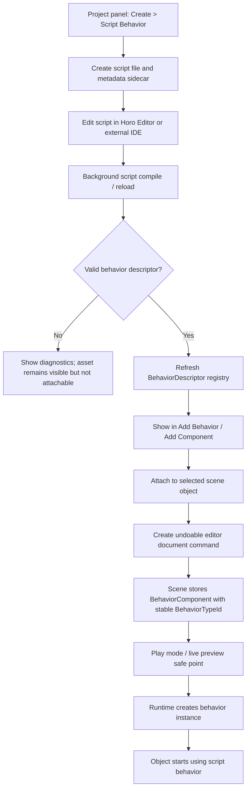

# Gameplay Behavior Authoring

## Purpose

This document defines Horo's behavior-authoring experience: editor/IDE
integration, build feedback, object-attached behaviors, script discovery, visual
scripting, play-in-editor behavior, and editor separation.

## Editor And IDE Scope

Horo Editor is the primary application for scene editing, component and behavior
attachment, asset browsing, play-in-editor, build feedback, and runtime preview.
It may embed code-editing surfaces, or it may integrate with an external IDE such
as VS Code, CLion, Xcode, Visual Studio, or another tool.

The architecture does not require a separate Horo IDE process. When an external
IDE is used, Horo Editor remains the authoritative project/session host and
communicates through explicit project files, build diagnostics, file watching,
and optional editor integration protocols. External IDEs do not mutate scene
state directly.

The user-facing contract is:

```text
write behavior code
  -> build or script reload runs in the background
  -> descriptors refresh
  -> behavior appears in Add Behavior/Add Component
  -> attach to object
  -> press Play or keep live preview running
```

Build errors, script diagnostics, descriptor errors, and reload failures are
reported inside Horo Editor without closing the project or discarding scene
state.

## Build Integration

Gameplay build integration is part of the editor iteration contract. Opening a
project starts or connects to a project build session:

```text
Open project
  -> validate toolchain profile
  -> configure CMake/build graph when stale
  -> start background build service
  -> watch gameplay source, script, project, and generated binding inputs
  -> run incremental builds or script reloads after debounced changes
  -> publish diagnostics to the editor
  -> refresh descriptors and request safe reload when output is valid
```

The build service is owned by the project/editor session, not by gameplay code.
It may be implemented as an in-process service or an external daemon, but it
uses the same project model, toolchain profile, and build-system contracts as
CLI builds. It never mutates runtime scenes directly.

Native C++ gameplay changes use incremental builds of the project gameplay
module. On success, the editor validates the new module descriptor and attempts
native hot reload at the next safe point. On failure, the previous loaded module
continues running if it is still valid, and diagnostics are shown in the editor
with file, line, target, and toolchain metadata.

Generated bindings, reflection data, behavior descriptors, and script glue are
build artifacts. They are regenerated as part of the same build session and are
versioned by the SDK boundary. A stale or failed generation step blocks reload
and reports diagnostics, but it does not corrupt the open scene.

The build service produces structured diagnostics:

```cpp
struct BuildDiagnostic {
    BuildDiagnosticCode code;
    DiagnosticSeverity severity;
    SourceLocation source;
    BuildTargetId target;
    std::string message;
};
```

Presentation layers may show inline squiggles, a Problems panel, status bar
state, or toast notifications. Scripts and automation consume the typed
diagnostic stream rather than scraping compiler text.

## Object-Attached Behaviors

Horo supports object-attached gameplay behavior through explicit behavior
components. A behavior is game-owned code attached to a scene object by adding a
serializable behavior component in the editor or during scene construction.

Behavior authoring may come from several sources:

- native C++ classes compiled into the primary gameplay module
- script files compiled or interpreted by a scripting runtime
- visual scripting graphs compiled to generated behavior code or interpreted by
  a graph runtime

All sources produce the same runtime shape: a stable `BehaviorTypeId`, an
authoring metadata descriptor, serialized fields, declared access/dependencies,
and a factory or runner that creates scene-scoped behavior instances. Scene files
store the behavior type and fields, not the authoring language implementation
detail.

Behavior attachment is data-driven:

```cpp
struct BehaviorComponent {
    BehaviorTypeId typeId;
    bool enabled = true;
    SerializedObject fields;
};

struct BehaviorPhaseDescriptor {
    SystemPhase phase;
    ScheduleNodeId nodeId;
    ComponentAccessSet reads;
    ComponentAccessSet writes;
    std::span<const ScheduleNodeId> after;
    std::span<const ScheduleNodeId> before;
};

struct BehaviorDescriptor {
    BehaviorTypeId typeId;
    uint32_t schemaVersion;
    AuthoringMetadata authoring;
    std::span<const BehaviorPhaseDescriptor> phases;
    BehaviorDependencySet dependencies;
    BehaviorFactoryBinding factoryBinding;
};
```

`BehaviorComponent` is the persistent scene data. It stores the stable behavior
type ID, enabled state, and serialized authoring fields. It does not store a C++
class name, function pointer, vtable pointer, script file path as identity, or
runtime address.

Behavior descriptors reach the registry only through generated native annotation
output, script asset discovery, or visual graph discovery. Project code does not
manually register object-attached behaviors. The editor may show registered
behaviors in an "Add Behavior" or "Add Component" flow and attach them to any
compatible scene object. The generic inspector edits the behavior's declarative
authoring fields. Custom inspectors still belong to the editor extension contract.

### Native C++ Behavior Example

A native behavior is ordinary gameplay code compiled into the project gameplay
module. The preferred authoring path uses a C++ annotation-style macro so the
behavior code and its editor/runtime metadata live together. The C++ class name
is not persistent identity; the stable `id` in the behavior annotation is.
The SDK owns the exact supported macro syntax; the important contract is that
metadata is declared next to the behavior type and consumed at build time.

```cpp
HORO_BEHAVIOR(DoorControllerBehavior,
    id = "game.my_game.door_controller",
    displayName = "Door Controller",
    category = "Gameplay/Interaction",
    phase Gameplay {
        reads = Components<TransformComponent>(),
        writes = Components<DoorState>(),
        after = ScheduleNodes{"engine.transform.sync"}
    }
)
class DoorControllerBehavior final : public IBehaviorInstance {
public:
    void OnFixedUpdate(BehaviorContext& context, FixedDeltaTime dt) override
    {
        if (context.input.WasPressed("game.my_game.interact")) {
            context.commands.SetComponent(context.entity, DoorState{.open = true});
        }
    }
};
```

The macro is declarative metadata, not runtime registration logic. The build
pipeline scans annotated native behavior types, validates their IDs and
dependencies, and emits generated descriptor registration code for the gameplay
module. The macro supports a shorthand: `reads`, `writes`, `after`, `before`, and
`node` declared outside a phase block apply to the default fixed gameplay phase
(`SystemPhase::Gameplay`). Explicit phase blocks override the shorthand and are
required for presentation or any non-default phase. A developer should not
hand-write one `Register()` entry per native behavior.

The generated descriptor is equivalent to:

```cpp
BehaviorDescriptor{
    .typeId = "game.my_game.door_controller",
    .schemaVersion = 1,
    .authoring = AuthoringMetadata{
        .displayName = "Door Controller",
        .category = "Gameplay/Interaction",
        .fields = {
            FieldMetadata{
                .name = "openSpeed",
                .type = FieldType::Float,
                .defaultValue = 2.0f,
            },
        },
    },
    .phases = {
        BehaviorPhaseDescriptor{
            .phase = SystemPhase::Gameplay,
            .nodeId = ScheduleNodeId{"game.my_game.door_controller"},
            .reads = ComponentAccessSet::Read<TransformComponent>(),
            .writes = ComponentAccessSet::Write<DoorStateComponent>(),
            .after = {ScheduleNodeId{"engine.transform.sync"}},
        },
    },
    .factoryBinding = BehaviorFactoryBinding{
        .typeId = "game.my_game.door_controller",
        .factory = MakeBehaviorFactory<DoorControllerBehavior>(),
    },
}
```

Normal native gameplay behavior authoring is:

```text
Create > Native C++ Behavior
  -> editor creates behavior source file(s) with HORO_BEHAVIOR metadata
  -> background build scans annotations
  -> generated descriptor registration is rebuilt
  -> Door Controller appears in Add Behavior / Add Component
  -> user attaches it to a scene object
```

The default template may be a single `.cpp` file. A header is only needed when
the behavior type or shared helper declarations must be referenced by other
translation units.

A native behavior without `HORO_BEHAVIOR` metadata is not an attachable editor
behavior. It may still be ordinary helper C++ code, but it does not appear in
Add Behavior/Add Component and is not serialized through `BehaviorComponent`.

Equivalent script or visual-script behavior must produce the same descriptor
shape and obey the same lifecycle and access rules. The editor does not need to
know whether a behavior is implemented by C++, script, or generated code in
order to attach it to an object.

At runtime, the scene instantiates behavior objects from registered descriptors.
Behavior instances are scene-scoped unless explicitly documented otherwise and
follow the same module ownership and hot-reload rules as systems. Native C++,
future script runtimes, and generated visual-scripting code all use this same
behavior descriptor and lifecycle contract; scripting is an implementation of
the behavior boundary, not a second hidden lifecycle.

The runtime schedules behavior lifecycle callbacks through the same phase and
access validator used for systems. `OnFixedUpdate` runs in `SystemPhase::Gameplay`
unless the descriptor explicitly selects another deterministic fixed-step phase.
`OnPresentationUpdate` runs in `SystemPhase::Presentation`. Descriptor
`after`/`before` dependencies order behavior callbacks for a phase relative to
registered systems and other behavior batches in that phase. Registration fails
on dependency cycles, duplicate IDs, or incompatible read/write declarations.

`ScheduleNodeId` is the shared scheduling identity for systems, behavior
batches, and generated behavior runners. The scheduler validates that every
`after`/`before` dependency names a registered schedule node in a compatible
phase. Missing nodes, cycles, or references to a node that cannot order with the
current phase fail registration with a typed diagnostic.

Schedule node IDs live in the same stable namespace as other descriptors:
engine-owned nodes use `engine.*`; project-owned nodes use
`game.<project_or_module>.*`. Generated behavior runners derive their schedule
node ID from the stable `BehaviorTypeId` unless the descriptor explicitly
declares a different node ID. Duplicate schedule node IDs fail descriptor
validation before scene activation.

A generated behavior runner schedules one batch per `BehaviorTypeId` per phase.
Instances inside a batch are processed in stable scene/entity order unless the
descriptor explicitly declares that instance order is irrelevant. Behavior code
must not rely on ordering between instances of the same `BehaviorTypeId`; any
cross-instance coordination belongs in a system or service with explicit
scheduling dependencies.

Behavior lifecycle is driven by scene phases:

```cpp
class IBehaviorInstance {
public:
    virtual ~IBehaviorInstance() = default;

    virtual void OnCreate(BehaviorContext&) {}
    virtual void OnStart(BehaviorContext&) {}
    virtual void OnEnable(BehaviorContext&) {}
    virtual void OnDisable(BehaviorContext&) {}
    virtual void OnFixedUpdate(BehaviorContext&, FixedDeltaTime) {}
    virtual void OnPresentationUpdate(BehaviorContext&, FrameDeltaTime) {}
    virtual void OnDestroy(BehaviorContext&) {}
};
```

- `OnCreate` runs while activating the runtime scene after all required
  descriptors are available. It runs even when the serialized component starts
  disabled.
- `OnEnable` runs whenever a disabled behavior becomes enabled, including initial
  activation of an enabled component. It may run multiple times per instance.
- `OnStart` runs once per instance lifetime after the behavior first becomes
  enabled and before its first eligible fixed gameplay update. If a behavior is
  created disabled, `OnStart` is delayed until the first enable.
- `OnFixedUpdate` runs in deterministic fixed-step gameplay phases.
- `OnPresentationUpdate` runs for interpolation, camera-facing presentation, or
  visual-only state and must not mutate simulation-authoritative state.
- `OnDisable` and `OnDestroy` run before the runtime removes the behavior
  instance, unloads the scene, stops the module, or unloads the dynamic library.

Lifecycle ordering for one behavior instance is:

```text
descriptor validated
  -> dependencies resolved
  -> behavior instance constructed
  -> OnCreate
  -> OnEnable if enabled
  -> OnStart before the first eligible fixed gameplay tick after first enable
  -> zero or more OnFixedUpdate / OnPresentationUpdate callbacks
  -> OnDisable when disabled or removed while active
  -> OnDestroy before instance storage is released
```

`OnStart` is not re-run after later disable/enable cycles. `OnDisable` runs only
for an instance that is currently enabled. `OnDestroy` always runs once for every
constructed instance, including instances that were never enabled.

`OnCreate` is for local initialization that only requires descriptors,
serialized fields, and resolved dependencies. `OnStart` is for initialization
that may depend on the activated runtime scene and other created behavior or
system instances. For a spawned prefab, the same sequence runs after the spawn
command commits. For an additive scene, the sequence runs for that scene after
its activation dependencies are ready. In play-in-editor, the sequence runs on
the runtime clone, not on the authoring document. See
[Prefab Architecture](../runtime/prefab-architecture.md).

Behavior code mutates scene state only through `BehaviorContext`, declared
component access, and the scene command buffer. It may change component values
when its descriptor declares write access. Entity creation, destruction, and
component topology changes are buffered and committed at Scene Runtime
synchronization points. Behavior constructors and destructors do not perform
scene mutation, service lookup, or scheduling side effects.

`BehaviorContext` is narrower than `GameRuntimeContext`:

```cpp
struct BehaviorContext {
    SceneRuntimeAccess& scene;
    EntityId entity;
    AssetAccess& assets;
    GameplayInputAccess& input;
    RuntimeDiagnostics& diagnostics;
    SceneCommandBuffer& commands;
};
```

It does not expose editor, GUI, renderer backend, MCP, or global service lookup.
If a behavior needs a game service, the service is provided through an explicit
module-owned capability or dependency declared by the behavior descriptor.
`BehaviorContext` intentionally does not expose `JobSubmission`: per-object
behaviors should not spawn unbounded background work. Long-running work is
coordinated by systems or services that own cancellation, budgets, and scene
lifetime.

Behavior dependencies are resolved before the behavior instance is created:

```cpp
struct BehaviorDependencySet {
    std::span<const GameServiceId> services;
    std::span<const CapabilityId> capabilities;
};

struct BehaviorConstructionContext {
    BehaviorDependencyView dependencies;
};
```

The factory receives only the dependencies declared by the descriptor. Missing
or incompatible dependencies fail scene activation before `OnCreate()` runs. A
behavior that needs asynchronous work depends on a gameplay service or system,
such as a pathfinding, dialogue, or asset-streaming service, that exposes a
bounded request API and owns job cancellation.

Dependency views expose stable service handles or narrow capability interfaces,
not raw ownership. A behavior may keep only the handles it receives through
`BehaviorConstructionContext`. Required services outlive every behavior instance
that depends on them during normal scene shutdown: behavior disable/destroy runs
before dependent scene-scoped services are torn down, and module-owned services
are stopped after dependent scene instances and jobs have been drained. If a
service cannot satisfy that lifetime for a scene, scene activation fails with a
typed dependency diagnostic instead of creating the behavior.

If a behavior type is missing or incompatible, editor surfaces preserve the
serialized `BehaviorComponent` payload as an unknown behavior. They may show it
as missing and allow safe removal or repair, but they must not execute it,
rewrite its fields, or silently replace its `typeId`.

## Authoring Metadata

Runtime game modules may provide declarative authoring metadata for generic
editor tools:

- localized display keys and descriptions
- field names and stable serialized property IDs
- ranges, units, defaults, and enum choices
- validation rules and suggested fixes
- schema and upgrade information

Authoring metadata is editor-neutral data. Custom editor widgets, inspectors,
gizmos, or ImGui presentation belong to the editor extension contract and
are not linked into packaged runtime modules.

## Editor Separation

Game code may expose metadata used by generic editor property and scene tools.
Editor-specific presentation extensions belong to the editor extension
contract and are not linked into game runtime modules.

A packaged game does not depend on ImGui or editor targets unless the product
explicitly includes a development overlay.

Runtime debug draw is a runtime diagnostic capability and may be exposed through
approved diagnostics APIs when enabled by build or session policy. Editor gizmos,
viewport overlays, custom inspectors, property drawers, and authoring-only
manipulators belong to the editor extension contract. Runtime gameplay
modules may provide declarative metadata consumed by those editor extensions,
but they do not link editor UI code into packaged gameplay modules.

Editor property changes to behavior fields are normal editor document commands.
They go through the editor command/history system, produce a document revision,
and are undoable. Runtime behavior code does not push to editor undo/redo. If a
play-session result should become authoring data, an explicit editor command
performs that import after validation.

## Missing Or Incompatible Game Modules

Basic project metadata may be inspected without starting gameplay code. Runtime
scene activation requires all referenced game-owned component descriptors,
behavior descriptors, system descriptors, conversion adapters, and asset
handlers to be available.

If a game module is missing or incompatible, editor surfaces may open the
project in degraded mode. They may list project metadata, preserve unknown
serialized component and behavior payloads, and show diagnostics, but they
cannot execute, convert, validate semantics for, or rewrite unknown game-owned
payloads until the module loads successfully. Saving a scene with unknown
game-owned data must preserve that opaque payload byte-for-byte or fail with a
typed diagnostic.

## Scripted Behaviors

Script-authored behavior is a first-class authoring goal because it provides the
fastest iteration loop for designers and gameplay programmers. The exact first
runtime, such as Lua, C#, or another embedded runtime, is selected by a separate
scripting-runtime decision. This document defines the invariants that every
scripting runtime must satisfy.

Scripted behaviors register `BehaviorDescriptor` records and attach to scene
objects exactly like native behaviors. Script source files may be interpreted,
bytecode-compiled, or translated to generated code, but scene documents still
store stable behavior type IDs and serialized fields.

The selected scripting runtime supplies a runtime adapter behind the descriptor
factory or runner. That adapter is allowed to manage bytecode, reflection data,
debug hooks, and language-specific state, but it must present the same
`BehaviorDescriptor`, lifecycle hooks, dependency declarations, and safe-point
reload semantics as native behavior. Choosing Lua, C#, or another runtime may
change the adapter implementation and syntax, but it must not change scene
serialization or editor attachment semantics.

The concrete scripting-runtime decision must define the adapter shape used by
generated descriptors, including bytecode/module lifetime, debug hook ownership,
state preservation hooks, and how script call frames map to behavior lifecycle
diagnostics. Those details are runtime-specific, but they cannot add a second
scene serialization model or a separate editor attachment path.

The minimum authoring workflow is:



The generated files are project assets:

```text
assets/scripts/DoorController.horo_script
assets/scripts/DoorController.horo_script.meta
```

Script-authored behaviors are discovered by scanning script assets:

```text
scan assets/scripts/**/*.horo_script
  -> parse behavior declarations
  -> pair each script with its metadata sidecar
  -> validate fields, lifecycle hooks, dependencies, and schema
  -> generate BehaviorDescriptor records
  -> refresh the behavior registry
```

The script declaration is the author-facing source for display name, fields,
default values, lifecycle hooks, dependencies, component access, and validation
metadata. Developers should not maintain a second manual registry entry for each
script behavior.

The script metadata sidecar stores the stable `BehaviorTypeId`, script runtime
kind, schema version, import/reload metadata, and any generated-cache keys. The
script source may be renamed or moved without changing identity as long as the
sidecar moves with it. Scene files reference the stable behavior type ID, not the
visible file name.

The sidecar is the canonical source of `BehaviorTypeId`. If the script language
allows an `id` field in the source declaration, that field is an author-facing
assertion and must match the sidecar. A mismatch is a typed diagnostic and the
descriptor is not activated. This keeps rename, move, generated-cache, and
migration behavior stable even when source text is edited manually.

Changing the visible behavior name in the script updates authoring metadata only.
It does not change persistent identity. Changing `BehaviorTypeId` is an explicit
editor migration operation, such as "Rename Behavior Type", that updates or
validates every scene, prefab, visual graph, and saved reference that points at
the old ID. A plain text edit must not silently strand existing scene references.

### Script Behavior Declaration Example

The default script template must declare its editor-facing metadata next to the
script code and be immediately attachable after a successful compile. The script
declaration is scanned into a generated `BehaviorDescriptor`; the developer does
not add a parallel manual C++ registration entry.

```text
behavior DoorController {
    id: "game.my_game.door_controller"
    displayName: "Door Controller"
    category: "Gameplay/Interaction"

    field openSpeed: float = 2.0

    phase Gameplay {
        reads: ["engine.transform"]
        writes: ["game.my_game.door_state"]
        after: ["engine.transform.sync"]
    }

    function OnFixedUpdate(ctx, dt) {
        if ctx.input.wasPressed("game.my_game.interact") {
            ctx.commands.setComponent(ctx.entity, "game.my_game.door_state", {
                open: true
            })
        }
    }
}
```

The syntax above is illustrative; the selected scripting runtime owns the final
language syntax. The required behavior is not illustrative: the script source is
the author-facing source for display name, fields, lifecycle hooks, phase
access, and schedule dependencies, while the metadata sidecar remains the
canonical source of stable identity and migration history. Newly created script behaviors are
discoverable in the editor, attachable to scene objects, reloadable without
restarting the editor when compatible, and preserved as unknown behavior
payloads when their runtime or descriptor is unavailable.

Editor attachment is an undoable document command. If a script is selected in
the Project panel and a scene object is selected, the editor may offer "Attach to
Selected Object". If the script has compile errors, the editor still shows the
asset and diagnostics, but it does not expose it as an attachable runtime
behavior until a valid descriptor exists.

Script reload should be fast and local:

```text
script file changes
  -> scripting runtime validates/compiles
  -> descriptors refresh
  -> compatible behavior instances reload at a safe point
  -> incompatible changes require scene or play-session restart
```

Compatible script reload may preserve explicitly declared behavior state.
Incompatible schema, field, dependency, or lifecycle changes produce diagnostics
and keep the previous valid script implementation active when possible.

Reload compatibility is determined from descriptor diffs:

| Change                                                                                                      | Compatibility                                                                                                |
| ----------------------------------------------------------------------------------------------------------- | ------------------------------------------------------------------------------------------------------------ |
| function body change with the same descriptor                                                               | compatible                                                                                                   |
| display name, category, description, or editor-only metadata change                                         | compatible                                                                                                   |
| adding a field with a default value and stable property ID                                                  | compatible with field migration                                                                              |
| removing a field, changing a field type, or changing a stable property ID                                   | incompatible unless an explicit migration is provided                                                        |
| changing `BehaviorTypeId`                                                                                   | explicit rename/migration operation, not hot reload                                                          |
| adding declared read access                                                                                 | compatible when the scheduler revalidates access at a reload safe point                                      |
| adding declared write access, lifecycle hooks that change phase participation, or new required dependencies | incompatible for active instances unless the runtime can restart the play scene safely                       |
| changing `after`/`before` dependencies                                                                      | compatible only at a reload safe point when the scheduler validates the new order before the next fixed tick |

Behavior field schema upgrades use stable property IDs and descriptor
`schemaVersion`. A migration may transform serialized `BehaviorComponent.fields`
and explicitly declared runtime-preserved state. Without a migration, the editor
keeps the previous valid implementation active for the current play/live-preview
session and reports the incompatible change.

Reload validation runs only at reload safe points between fixed ticks. The
scheduler revalidates read/write access and `after`/`before` ordering before the
next fixed tick starts. If the new descriptor cannot be scheduled without
reordering work that is already executing or without violating declared access,
the reload is rejected with a typed diagnostic and the previous valid descriptor
remains active for the current session.

Behavior field migrations are generated descriptors, not ad hoc script code at
scene load time:

```cpp
struct BehaviorFieldMigrationDescriptor {
    BehaviorTypeId typeId;
    uint32_t fromSchemaVersion;
    uint32_t toSchemaVersion;
    BehaviorFieldMigrationFactory migration;
};
```

Native annotations, script declarations, or visual graph metadata may declare
migrations. The build/discovery pipeline emits them into the generated gameplay
descriptor bundle. Script sidecars store stable identity and import metadata;
they may reference migration declarations, but they are not the only migration
source. A `schemaVersion` bump without a complete migration path for existing
serialized fields makes the descriptor incompatible with existing content until
the migration is supplied.

Scripts use the same registration, runtime capability, scene mutation,
scheduling, diagnostics, and hot-reload safe point rules as native gameplay
code. A scripting runtime must not introduce a second hidden lifecycle, direct
editor access, global service lookup, raw platform access, or stringly typed
mutation path around the descriptor model.

## Visual Scripting

Visual scripting is a designer-facing authoring layer over the same behavior
boundary. A graph asset generates a behavior descriptor with events, fields,
dependencies, and declared component access. Runtime execution may interpret the
graph or run generated code, but the resulting scene component is still a
`BehaviorComponent`.

The minimum visual graph discovery path is:

```text
assets/graphs/DoorController.horo_graph
assets/graphs/DoorController.horo_graph.meta
  -> VisualBehaviorGraphScanner
  -> node/schema validation
  -> generated BehaviorDescriptor
  -> graph runner or generated code binding
  -> BehaviorRegistry
```

Visual graph nodes are validated before play. Invalid graphs produce editor
diagnostics and cannot activate runtime behavior. Node validation checks missing
pins, type mismatches, unavailable actions, undeclared component access,
dependency cycles, and references to missing assets or behavior types. Graph hot
reload follows the same safe-point and state-preservation rules as scripted
behavior: compatible graph rewrites may keep declared state, while schema,
dependency, or scheduling changes require a scene/play-session restart or an
explicit migration.

The visual graph editor uses the shared editor graph surface described in
[Editor Panel and Tab Architecture](../editor/editor-panel-host.md). The first
production graph surface is built on `imgui-node-editor` through a private Horo
adapter. Graph widget IDs are presentation IDs; persisted graph identity remains
`BehaviorTypeId`, stable node IDs, stable pin IDs, property IDs, and schema
versions owned by the behavior graph asset. The widget may emit create/connect/
move/rename/delete commands, but the behavior subsystem owns validation,
descriptor generation, scheduling metadata, diagnostics, migration, and runtime
activation.

AI-assisted graph editing follows the same rule as source editing: an assistant
may propose graph edits, generated behavior code, or node rewrites, but changes
are applied only through explicit graph edit commands with preview, undo, and
validation. Agent mode cannot bypass behavior access declarations or write graph
assets directly from a UI callback.

## Play-In-Editor And Live Preview

Play-in-editor creates a full runtime scene clone from the authoring document
and runs gameplay lifecycle normally. Runtime mutations stay inside the
play-session scene unless an explicit editor import command copies a result back
to the authoring document.

Live preview is an editor-owned runtime preview for faster feedback. It uses the
same descriptor validation, dependency resolution, command buffering, and
safe-point reload rules, but it may run a reduced simulation scope selected by
the editor surface. Live preview never writes directly to the authoring
document; authoring changes still go through editor document commands. A
behavior must not branch on whether it is running in play-in-editor or live
preview except through explicit runtime configuration exposed by the host.

Reduced simulation scope is explicit runtime configuration, not hidden editor
state:

```cpp
struct RuntimeExecutionConfig {
    RuntimeExecutionMode mode; // PlayInEditor, LivePreview, Game
    SimulationScopeId simulationScope;
    bool allowPresentationOnlySystems;
};
```

The host selects the scope before activation and exposes it through
`RuntimeConfiguration`. Systems and behaviors may declare that they require full
simulation, fixed-step gameplay, presentation-only execution, or a named
capability. Activation fails with a typed diagnostic when the live-preview scope
cannot satisfy a required dependency. A behavior may read the explicit
configuration to disable optional effects, but it must not infer preview mode
from editor globals or mutate authoring state directly.

## Developer Iteration Model

Horo targets three gameplay iteration speeds:

| Tier   |         Target | Examples                                                                                      | State policy                                                                |
| ------ | -------------: | --------------------------------------------------------------------------------------------- | --------------------------------------------------------------------------- |
| Fast   | under 1 second | editor property changes, behavior field edits, compatible script reload, simple asset reload  | preserve editor selection, scene document, play session where safe          |
| Medium |   2-10 seconds | native gameplay module rebuild/reload, shader reload, scene reload, generated binding refresh | preserve explicitly declared state or restart play session with diagnostics |
| Slow   |  10-60 seconds | full rebuild, SDK boundary change, engine update, platform cook/package                       | restart affected editor/runtime sessions                                    |

Fast iteration should not require a manual command-line build. The editor watches
declared source roots and either reloads directly, schedules a background build,
or reports why automatic reload is unsafe. The editor remains interactive while
builds, script compilation, and asset reloads run.

The core script loop is part of the fast tier: creating a script behavior,
editing it, compiling/reloading it, attaching it to a selected object, and seeing
it run in play mode or live preview should not require restarting the editor or
manually touching CMake/native build commands when the change is compatible.

The reload path always prefers preserving useful state, but correctness wins:
when a descriptor schema, module boundary, dependency graph, or unload
precondition is incompatible, the editor reports the reason and requests a
play-session or process restart rather than attempting unsafe live mutation.

## Related Documents

- [Gameplay Behavior Editor](./gameplay-behavior-editor.html): HTML reference
  design for the node-based behavior graph editor (behavior tree, state machine,
  and visual scripting surfaces).
- [Editor Workspace Layout](../editor/editor-workspace.html): HTML reference design for
  the embedded Inspector dock and behavior component fields.
- [Gameplay Module Overview](./gameplay-module.md)
- [Gameplay Module Boundary](./gameplay-module-boundary.md)
- [Gameplay Runtime Integration](./gameplay-runtime-integration.md)
- [Editor Document Model](../editor/editor-document-model.md)
- [Extension System](./plugin-system.md)
- [Horo Package System](../packages/package-system.md): library-provided behaviors
