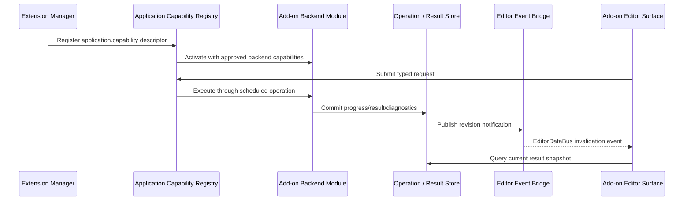
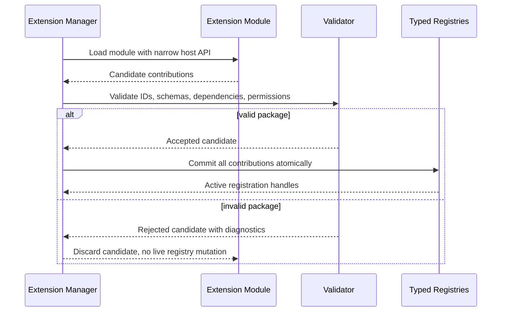
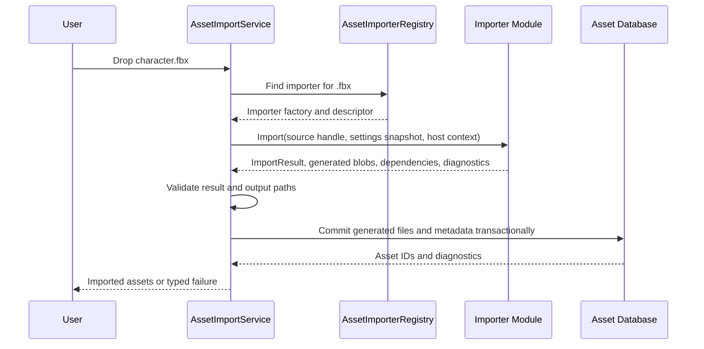

# Extension System Architecture

## Purpose

This document defines Horo's extension system: installable packages that add
modules and typed contributions to editor, tooling, asset-pipeline, MCP, and
approved runtime surfaces.

The user-facing goal is a Lego-like model: install an extension, enable it for a
project, and attach its capabilities to the appropriate part of the engine. The
engine-facing rule is stricter: extensions can only contribute to explicit,
typed extension points with validated descriptors, narrow host APIs, and clear
ownership.

Core engine correctness, project opening, and build execution do not depend on a
marketplace or network service. Marketplace discovery is optional; local and
project-declared packages remain first-class.

## Scope

This system covers:

- editor and tool extension packages
- asset importers, cookers, validators, commands, panels, tabs, modal pages,
  settings pages, status-bar items, menu items, toolbar actions, and MCP tools
- install, enable, trust, update, disable, and project requirement flows
- marketplace-backed package discovery using GitHub-hosted registry metadata
- runtime-facing contributions only when they use runtime-approved extension
  points and obey gameplay module boundaries

This system does not turn arbitrary native code into a sandbox. Native extension
modules are trusted code. High-risk or untrusted integrations require an
out-of-process helper model rather than pretending in-process dynamic libraries
are isolated.

Gameplay behavior authoring and project-owned gameplay modules are defined by
[Gameplay Module](./gameplay-module.md) and
[Gameplay Module Boundary](./gameplay-module-boundary.md). This document defines
how installable packages contribute modules and extension-point descriptors.

## Terminology

| Term | Meaning |
|---|---|
| Extension package | Installable distribution artifact with a manifest, binaries or scripts, resources, licenses, and contribution descriptors. |
| Module | A code/lifecycle boundary inside a package or project. Native modules may be dynamic libraries; script modules may be interpreted or compiled by a host runtime. |
| Contribution | A manifest-declared item added to a typed extension point, such as an asset importer or editor panel. |
| Extension point | A host-owned slot with a public descriptor contract and registry validation rules. |
| Registry | Host-owned typed table that stores accepted contributions after validation. |
| Marketplace | Optional package discovery layer. It helps users find packages; it is not required for local package loading. |

The practical model is:

```text
Extension Package
  contains Modules
  declares Contributions
  targets typed Extension Points
  receives narrow Host APIs
  commits transactionally into host Registries
```

Use these names deliberately:

- **Module** for code boundaries such as `Horo.Network`, `MyGame.Gameplay`, or
  `Vendor.FbxImporter`.
- **Extension point** for engine slots such as `asset.importer`,
  `editor.panel`, or `network.transport`.
- **Extension package** for something a user installs, trusts, enables, updates,
  or removes.

## Core Decisions

- Built-in features, official add-ons, and external packages use the same typed
  contribution and registry concepts.
- An extension package may contain one or more modules and one or more
  contributions.
- Extension packages may be backend-only, frontend-only, or hybrid. GUI support
  is optional presentation over host-approved backend capabilities; it is not
  the definition of an extension.
- External binary tool/editor modules cross a versioned C ABI entry point; STL
  types, exceptions, allocators, and C++ object ownership do not cross this ABI.
- Project gameplay modules may use the SDK-generation C++ module boundary from
  [Gameplay Module Boundary](./gameplay-module-boundary.md), but that is not a
  long-term binary extension ABI.
- Contributions are declarative. The host validates all IDs, capabilities,
  dependencies, permissions, and schema versions before committing anything to
  live registries.
- A module receives narrow API tables for the extension points it contributes to,
  not engine internals or a service locator.
- Project package requirements are portable configuration, but trust decisions
  are local user/workspace state. Cloning a repository must not auto-load native
  code.
- Runtime unload is not generally supported. Disable, update, and removal take
  effect after restart unless a specific API proves safe live unload.

## Ownership

```text
User / Project
  -> declares package requirements in .horo/plugins.json

Extension Manager
  -> discovers packages
  -> validates manifests and package integrity
  -> resolves versions and dependencies
  -> checks local trust and permissions
  -> loads modules through the proper ABI boundary
  -> builds a candidate contribution set

Typed Registries
  -> own accepted descriptors and factories
  -> expose stable lookup APIs to engine subsystems
  -> reject duplicate, incompatible, or unauthorized contributions

Engine Subsystems
  -> call registries through normal services
  -> never depend on marketplace availability
```

The host owns all engine registries, project state, GUI hosts, asset database
mutation, and runtime scene activation. Extension modules may create opaque
instances through host-provided allocator and destroy callbacks, but they do not
own engine registries and do not mutate project state directly unless an API
explicitly grants that authority.

## Package Layout

```text
FbxImporter/
  extension.json
  bin/
    macos-arm64/libhoro_fbx_importer.dylib
    linux-x64/libhoro_fbx_importer.so
    windows-x64/horo_fbx_importer.dll
  resources/
    icons/fbx.svg
  licenses/
```

Paths in the manifest are normalized and must remain inside the package root.
Symlinks, `..` traversal, absolute paths, and platform-specific path tricks do
not bypass containment checks.

## Manifest Schema

The manifest separates package identity, modules, contributions, permissions,
and marketplace metadata:

```json
{
  "id": "com.vendor.fbx-importer",
  "displayName": "FBX Importer",
  "version": "1.2.0",
  "apiVersion": 1,
  "engineVersion": ">=0.8 <0.9",
  "publisher": "Vendor",

  "modules": [
    {
      "id": "com.vendor.fbx-importer.native",
      "kind": "native",
      "entry": "bin/${platform}-${arch}/horo_fbx_importer"
    }
  ],

  "contributions": [
    {
      "type": "asset.importer",
      "id": "com.vendor.fbx-importer.importer",
      "module": "com.vendor.fbx-importer.native",
      "fileExtensions": [".fbx"],
      "assetTypes": ["StaticMesh", "SkeletalMesh", "AnimationClip"]
    },
    {
      "type": "editor.panel",
      "id": "com.vendor.fbx-importer.settings-panel",
      "module": "com.vendor.fbx-importer.native",
      "placement": "ProjectSettings/Importers"
    }
  ],

  "permissions": [
    "project.read",
    "project.write.generated"
  ],

  "licenses": ["licenses/LICENSE.txt"]
}
```

Validation rules:

- Package IDs, module IDs, and contribution IDs are globally canonical and
  stable.
- Module IDs belong to exactly one package.
- Contribution IDs are unique across all active packages and built-in
  contributions.
- A contribution may only reference a module in the same package unless the
  extension point explicitly allows cross-package composition.
- Required permissions must be declared at package level and approved by trust
  policy before load.
- Unknown manifest fields are preserved only in documented extension namespaces;
  unknown required fields reject the package.

## Extension Point Catalog

Initial editor and tool extension points:

| Extension point | Purpose | Typical host authority |
|---|---|---|
| `asset.importer` | Convert source files into typed asset import results. | Host owns asset database writes and generated output placement. |
| `asset.cooker` | Convert imported assets into runtime-ready platform variants. | Host owns cook graph, cache keys, and output commits. |
| `project.validator` | Validate project configuration, assets, or package requirements. | Host owns diagnostics and project mutation policy. |
| `application.capability` | Add a headless use-case capability that GUI, CLI, MCP, or other approved contributions can call. | Application layer owns operation IDs, scheduling, cancellation, permission checks, and result storage. |
| `process.observer` | Observe approved process-level lifecycle or operation notifications. | Host owns event allowlists, payload shape, threading, and teardown. |
| `pipeline.step` | Add a build, cook, validation, or packaging step to a declared pipeline phase. | Pipeline owns ordering, cache keys, inputs, outputs, and rollback. |
| `toolchain.provider` | Provide compiler, SDK, signing, or packaging toolchain discovery. | Toolchain service owns credential policy, platform filtering, and selected profile state. |
| `editor.panel` | Add dockable editor panels or tabs. | `EditorPanelHost` owns layout, focus, and persistence. |
| `editor.tab` | Add a tab to a host-owned tab stack. | `EditorPanelHost` owns placement, activation, and workspace state limits. |
| `editor.modal` | Add modal workflow factories. | `EditorModalHost` owns exclusivity and input capture. |
| `editor.modal_page` | Add a page inside an existing extensible modal workflow. | Owning modal controls navigation, validation, and commit policy. |
| `editor.settings_page` | Add settings UI backed by typed configuration descriptors. | Configuration service owns validation, persistence, and reload policy. |
| `editor.inspector` | Add custom inspector presentation for declared component, behavior, asset, or project types. | Inspector host owns selection, document commands, validation, and undo routing. |
| `editor.property_drawer` | Add field-level presentation for declared property descriptors. | Property host owns value binding, validation, localization, and fallback rendering. |
| `editor.viewport_overlay` | Add bounded viewport presentation such as labels, guides, or diagnostics. | Viewport host owns draw ordering, visibility policy, and input routing. |
| `editor.gizmo` | Add authoring-only manipulators for declared editable types. | Gizmo host owns picking, transform transactions, snapping, and undoable commands. |
| `editor.asset_preview` | Add preview renderers or summaries for declared asset types. | Asset browser owns preview cache, resource budgets, and fallback thumbnails. |
| `editor.status_item` | Add bounded status-bar presentation. | Status bar owns ordering, visibility, and click routing. |
| `editor.activity_item` | Add an icon button to the activity bar (left or right side) that toggles a drawer or switches a view. | `EditorActivityBar` owns side placement, ordering, activation state, drawer binding, and tooltip. |
| `editor.menu_item` | Add a menu or command-palette entry. | Host owns command routing, shortcuts, and permission checks. |
| `editor.toolbar_action` | Add an optional toolbar action. | Toolbar host owns grouping, overflow, and interaction policy. |
| `command` | Add typed commands and menu contributions. | Host owns command routing, undo policy, and shortcuts. |
| `project.browser_action` | Add project-browser actions. | Host owns selected project context and confirmation UI. |
| `mcp.tool` | Add MCP tools subject to permission policy. | MCP host owns transport, schema, and authorization. |

`editor.status_item` contributions are declarative bounded snapshots; they do
not receive ImGui callbacks. The shell owns validation, active-panel visibility,
width admission, overflow, localization, modal input exclusion, and typed
invocation routing. Phase 1 renders any non-empty icon resource ID as a semantic
dot; a host icon registry is a future extension. See
[Editor Status Bar](../editor/editor-status-bar.md).

Runtime-facing extension points are stricter and must also satisfy gameplay and
runtime lifecycle contracts:

| Extension point | Purpose | Related architecture |
|---|---|---|
| `runtime.system` | Register runtime systems with phase/access descriptors. Disabled for arbitrary marketplace packages until runtime participation, shipping, lifetime, fingerprint, unload, and permission contracts are fully implemented. Limited to first-party or explicitly trusted runtime packages in the initial contract. | [Gameplay Module Boundary](./gameplay-module-boundary.md) |
| `behavior.provider` | Deferred runtime-facing point for script or graph runtime adapters and generated descriptor providers. It is disabled in the initial contract unless the provider also satisfies gameplay module validation, trust, `runtime.participate` permission, module fingerprint, lifetime, and safe-reload rules. | [Gameplay Behavior Authoring](./gameplay-behavior-authoring.md) |
| `asset.runtime_loader` | Load game-owned asset types at runtime. | [Gameplay Runtime Integration](./gameplay-runtime-integration.md) |
| `network.transport` | Provide approved network transport implementations. | [Runtime Lifecycle](../runtime/runtime-lifecycle.md) |

The catalog is intentionally typed. A package cannot draw arbitrary UI, mutate
scene state, or open sockets merely because it is installed. It must contribute
to the matching extension point and receive the matching approved permissions.

`behavior.provider` is not a shortcut around project gameplay module boundaries.
An extension package may provide a scripting or visual-graph runtime adapter, or
a descriptor generator, but it cannot directly register object-attached gameplay
behavior by load order. Any runtime behavior descriptors accepted from an
extension provider must flow through the same generated descriptor bundle
validation, trust policy, `runtime.participate` permission, fingerprint/lifetime
checks, and reload-safe-point rules used by project gameplay modules. Until that
contract is implemented and tested, the extension point remains future/deferred.

`runtime.system` is not a shortcut around project gameplay module boundaries
either. An extension package may provide an approved runtime-system
implementation, but it cannot register arbitrary runtime systems by load order.
Any `runtime.system` contribution from an extension package must satisfy the
same runtime participation, shipping, lifetime, fingerprint, unload, and
permission contracts required for `runtime.participate`. Until those contracts
are implemented and tested, the extension point is limited to first-party or
explicitly trusted runtime packages.

Game-owned asset type descriptors and extension-package asset importer/cooker
contributions commit into host-owned asset registries. Duplicate asset type IDs
fail validation. File-extension conflicts require explicit priority, user
selection, or project policy; registration order is never used as the tie
breaker. Project gameplay modules cannot override trusted package importers or
cookers implicitly by loading later.

## Backend, Frontend, And Hybrid Packages

An add-on is not synonymous with an editor panel. Packages fall into three
normal shapes:

| Shape | Examples | Required boundary |
|---|---|---|
| Backend-only | asset importer, cooker, project validator, network transport, build pipeline step, toolchain provider | Declares backend contribution, capability, permissions, errors, settings, observability, and optional process-event imports. |
| Frontend-only | diagnostics tab over existing stores, command-palette shortcut, Settings page for built-in capability | Declares editor contribution and consumes existing approved capabilities. |
| Hybrid | shader tools with compile service plus inspector tab, network transport plus connection diagnostics panel, importer plus import-settings page | Declares backend contribution and separate GUI/MCP/CLI-facing contributions over the backend capability. |

The backend side is authoritative. It owns state transitions, jobs, cache keys,
generated outputs, and operation results through host APIs. The frontend side is
a presentation adapter: it observes revisions, queries bounded stores, and calls
typed capabilities. A hybrid package must not hide backend work inside a GUI tab
factory; the headless contribution must remain usable from CLI, MCP, automation,
and tests when no editor surface is open.



This keeps GUI, CLI, MCP, and headless hosts aligned. The same backend capability
can be invoked from multiple frontends without duplicating business logic or
requiring ImGui to exist in the process.

## Discovery And Resolution

Packages are discovered from:

1. packaged built-in extension directory
2. user-installed extension directory
3. project-declared package requirements after trust approval
4. explicit development package path

Arbitrary current-directory scanning is forbidden.

Project requirements live in `.horo/plugins.json`:

```json
{
  "required": [
    {
      "id": "com.vendor.fbx-importer",
      "version": "^1.2.0"
    }
  ],
  "optional": [
    {
      "id": "com.horo.network.enet",
      "version": ">=0.3 <0.4"
    }
  ]
}
```

This file is portable project intent, not a trust grant and not a resolved local
path. The Extension Manager resolves package IDs and versions against installed
packages, development overrides, and optional marketplace metadata. Duplicate
package IDs, conflicting version ranges, missing dependencies, or incompatible
platform assets fail before any binary loads.

## Trust And Permissions

Permissions are capability-oriented:

```text
project.read
project.write
project.write.generated
process.execute
process.thread
network.client
network.server
credential.request
mcp.register_tool
runtime.participate
```

Trust decisions are local user/workspace state. A project can request a package,
but it cannot force another machine to trust or load native code. First load of a
native package must show package identity, publisher, version, source,
permissions, and contributions before approval.

The host denies undeclared capabilities. Native packages remain trusted code;
permissions reduce accidental authority and support informed decisions, but they
are not a memory-safety sandbox.

## Module Loading And ABI Boundary

Tool/editor native modules use a stable C ABI entry point:

```c
typedef struct HoroExtensionHostApiV1 HoroExtensionHostApiV1;
typedef struct HoroExtensionModuleApiV1 HoroExtensionModuleApiV1;

HORO_EXTENSION_EXPORT HoroExtensionStatus
horo_extension_load_v1(const HoroExtensionHostApiV1* host,
                       HoroExtensionModuleApiV1* module);
```

ABI structures include `size`, `version`, and reserved fields for append-only
extension. Function tables use C-compatible types and explicit ownership
callbacks. The host rejects:

- unsupported API versions
- structure size mismatch
- missing required functions
- incompatible platform, architecture, or build profile
- invalid manifest and binary identity binding
- required permissions not approved by trust policy

No STL containers, exceptions, RTTI-dependent ownership, allocator ownership, or
C++ object deletion crosses this ABI. Module-allocated memory is released by the
module through module-provided callbacks. Host-allocated memory is released by
the host.

Project gameplay modules may use the SDK-generation C++ boundary documented in
[Gameplay Module Boundary](./gameplay-module-boundary.md). That boundary is
rebuilt with the project and SDK generation; it is not the same compatibility
promise as marketplace-distributed binary tool modules.

## Contribution Registration Transaction

Module load builds a candidate contribution set. The host validates the complete
set before committing anything to live registries:



Failure discards the complete candidate. Other packages and engine subsystems
never observe partial registration.

## Asset Importer Example

A file-type importer is the reference extension use case. The package declares an
`asset.importer` contribution for one or more file extensions. The host owns all
project mutation; the module owns only the conversion logic.



Importer modules should receive:

- read-only source file access through a host-provided file handle or path token
- an immutable import-settings snapshot
- a diagnostic sink
- a bounded output writer or memory blob API
- stable asset type descriptors for the asset types they emit

Importer modules should return:

- typed imported asset records
- generated blob payloads or host-owned output intents
- dependency records for incremental reimport
- warnings and errors with stable diagnostic codes

Importer modules must not:

- write arbitrary files into the project tree
- update the asset database directly
- retain borrowed host pointers past the callback
- spawn untracked background work
- infer trust from a project manifest request

The host commits generated files, metadata, and asset registry updates in one
transaction. If validation or writing fails, the asset database remains in its
previous state and diagnostics identify the rejected contribution or output.

## Network Module Example

Networking is a module concern first and an extension point second. A first-party
`Horo.Network` module may ship with the engine or SDK, while optional packages
can contribute implementations to typed network slots:

```text
com.horo.network.enet
  -> module: Horo.Network.Enet
  -> contribution: network.transport

com.vendor.steam-networking
  -> module: Vendor.SteamNetworking
  -> contribution: network.transport
  -> contribution: editor.panel for connection diagnostics
```

Runtime network contributions require stricter approval because they can open
sockets, create threads, affect determinism, and ship with packaged games. A
network package manifest should declare runtime support explicitly:

```json
{
  "id": "com.horo.network.enet",
  "version": "0.3.0",
  "runtime": {
    "shippingSupported": true,
    "platforms": ["windows-x64", "linux-x64", "macos-arm64"],
    "linkage": "dynamic"
  },
  "contributions": [
    {
      "type": "network.transport",
      "id": "com.horo.network.enet.transport",
      "module": "com.horo.network.enet.native",
      "protocols": ["udp"]
    }
  ],
  "permissions": ["network.client", "network.server", "process.thread"]
}
```

The engine must not reduce this to a generic extension hook. Network transports need
explicit lifecycle, threading, packet ownership, platform, packaging, and
security contracts before they can be enabled for runtime use.

## GUI And IDE Extensions

Horo's editor is extensible by design. Add-on packages may introduce new IDE
features such as dockable tabs, dedicated panels, modal workflow pages, Settings
sections, status-bar widgets, menu items, command-palette actions, toolbar
actions, diagnostics views, and MCP-backed tools. Built-in editor features and
external add-ons use the same contribution model; first-party code does not get
a private UI integration path that packages cannot use.

GUI modules register factories and metadata. The normal `EditorPanelHost`,
`EditorModalHost`, design system, input scope, localization, configuration, and
data-bus rules still apply. The extension contributes a surface; the host owns
where that surface lives, when it is constructed, what capabilities it receives,
and when it is destroyed.

Example contribution set:

```json
{
  "contributions": [
    {
      "type": "editor.tab",
      "id": "com.vendor.shader-tools.shader-inspector",
      "module": "com.vendor.shader-tools.native",
      "label": "Shader Inspector",
      "fallbackPlacement": "bottom.tools",
      "openByDefault": false
    },
    {
      "type": "editor.settings_page",
      "id": "com.vendor.shader-tools.settings",
      "module": "com.vendor.shader-tools.native",
      "settingsPrefix": "vendor.shader_tools",
      "placement": "ProjectSettings/Tools"
    },
    {
      "type": "mcp.tool",
      "id": "com.vendor.shader-tools.compile-preview",
      "module": "com.vendor.shader-tools.native",
      "schema": "schemas/compile-preview.schema.json"
    }
  ]
}
```

The tab, settings page, and MCP tool are separate contributions even if one
module implements all three. Each receives only the capabilities required for
its extension point. A shader-inspector tab may receive asset-query,
shader-compile, log-query, and editor-notification capabilities; it does not
receive raw access to editor internals, renderer backend objects, or the whole
application service graph.

### Extension Surface Context

Editor UI contributions receive an extension-scoped context shaped by their
descriptor:

```cpp
struct EditorExtensionSurfaceContext {
    ExtensionId extension;
    EditorDataBus& editorEvents;
    EditorSurfaceQueries& surfaceQueries;
    EditorCommandDispatcher* commands;
    CapabilityTable capabilities;
    WorkspaceStateStore& workspaceState;
};
```

The context is not a service locator. `CapabilityTable` contains only validated,
permission-approved interfaces named by the contribution descriptor. Examples:

- `SceneQueries` for read-only scene inspection;
- `SelectionQueries` and selected editor commands for selection-aware tools;
- `AssetQueries` or `AssetImportOperations` for asset tools;
- `LogQuery` and `MetricsQuery` for diagnostic panels;
- `ConfigurationDraftPage` for Settings-page contributions;
- `McpToolRegistration` for protocol tools.

The host may provide null or restricted capabilities when a project, workspace,
or trust policy does not allow the requested operation. The contribution must
render a disconnected or permission-required state instead of probing global
state.

### Data Bus Participation

Extension surfaces are normal `EditorDataBus` subscribers. They may observe
allowlisted editor-session notifications, invalidate local presentation caches,
and query authoritative stores. They may publish only event types they own or
notifications for transient state they own.

Rules:

- Extension tabs and panels subscribe through move-only RAII tokens and release
  them during detach.
- An extension does not subscribe directly to `EngineDataBus` from a GUI surface;
  process events enter the editor through `EditorEngineEventBridge` allowlists.
- Extension event types use the extension's stable module ID as a prefix and are
  declared in the package descriptor before activation.
- High-volume data such as logs, file-watch batches, profiler samples, compiler
  output, or asset thumbnails remains in host-owned bounded stores. The data bus
  carries revisions, ranges, or invalidation hints.
- Event handlers must be cheap, non-blocking, and non-throwing. Expensive work
  goes through approved job or application capabilities.
- Subscriber order is not part of the contract. Coordination that requires a
  result uses typed commands or use cases, not event ordering.

GUI surfaces use `EditorDataBus` rather than direct `EngineDataBus`
subscriptions because their lifetime is tied to one editor session, not the
whole process. Process-level events that matter to UI are imported through an
allowlisted bridge so payloads can be permission-checked, redacted, normalized,
and scoped to the active workspace. Add-ons that need true process-level
observation declare a separate process-observer contribution or event-import
request instead of hiding that dependency inside a tab factory.

### Modal And Settings Page Contributions

`editor.modal` contributes a complete root workflow factory. `editor.modal_page`
contributes a page to an existing extensible workflow, such as an import wizard
or diagnostics workflow. `editor.settings_page` contributes a Settings page whose
fields are backed by typed configuration descriptors.

The owning modal controls navigation, dirty state, validation, preview, apply,
cancel, and close policy. Extension pages provide page content, validation
diagnostics, and draft-field bindings; they do not commit settings directly or
close the root modal by mutating modal-host state.

Extension modal pages may subscribe to `EditorDataBus` through their provided
context. They follow the same interaction and focus rules as built-in modal
content and cannot bypass the active modal scope.

### Activity Bar Contributions

The activity bar is the vertical icon strip on the left and right edges of the
editor workspace. Modules contribute icon buttons through `editor.activity_item`.
Each button can:

- Toggle a side drawer (left or right panel) owned by the module
- Switch the active view or tab in the main editor area
- Open a modal workflow

The activity bar host (`EditorActivityBar`) owns:

- **Side placement**: each item declares `side: "left"` or `"right"`. Left-side
  items are grouped above the spacer; right-side items appear after the spacer
  (or on the dedicated right activity bar).
- **Ordering**: declared via `order` (lower values appear first). Unordered
  items append after ordered items in registration order.
- **Activation state**: only one item per side is active at a time. Activating
  an item deactivates the previous one and toggles its bound drawer. Clicking
  the active item closes the drawer and clears activation.
- **Drawer binding**: each item declares a `drawerId` matching a drawer
  registered via `editor.panel`. The host opens and closes the drawer when the
  item is toggled.
- **Tooltip**: the `label` field provides the hover tooltip and ARIA label.

Example contribution:

```json
{
  "type": "editor.activity_item",
  "id": "com.vendor.curve-tools.activity",
  "module": "com.vendor.curve-tools.native",
  "side": "right",
  "order": 10,
  "label": "Curve Editor",
  "drawerId": "com.vendor.curve-tools.drawer",
  "icon": "icons/curve-editor.svg"
}
```

The icon is an SVG resource bundled with the package. The host renders it at a
fixed size inside the activity button. When the drawer is open, the button
receives the `active` state and `aria-pressed="true"`.

Module authors combine `editor.activity_item` with `editor.panel` (for the
drawer content) and `editor.toolbar_action` (for toolbar buttons inside the
drawer or main view) to deliver a complete side-panel tool.

### Drawer Content (Panel UI)

When the activity bar icon is clicked, the bound drawer opens. The module owns
the entire content area of that drawer. Horo provides two paths for building the
panel UI:

**1. Declarative field layout (preferred for data-driven panels)**

Modules register a typed field schema. The host renders standard Horo form
controls — text inputs, dropdowns, checkboxes, sliders, color pickers — without
the module writing any ImGui code. The schema supports conditional visibility,
read-only states, and validation.

```cpp
// Module registers field descriptors — host handles layout and rendering
struct CurveEditorFields {
    static constexpr std::string_view PanelId = "com.vendor.curve-tools.drawer";

    static std::vector<EditorFieldDescriptor> Describe() {
        return {
            EditorFieldDescriptor::Float("tension", 0.5f, 0.0f, 1.0f),
            EditorFieldDescriptor::Float("bias", 0.0f, -1.0f, 1.0f),
            EditorFieldDescriptor::Bool("closedLoop", false),
            EditorFieldDescriptor::Enum("interpolation", {"Linear","CatmullRom","Bezier"}, 1),
        };
    }
};
```

**2. Custom ImGui rendering (for graphical or interactive panels)**

Modules receive an `EditorDrawerContext` with a dedicated ImGui container.
They can draw any ImGui content — plots, node graphs, custom widgets — inside
that region. The host owns the window, scroll, focus, and teardown; the module
owns the pixels inside the content area.

```cpp
// Module receives a render callback inside the drawer
class CurveEditorDrawer : public IEditorDrawerSurface {
public:
    void OnDraw(EditorDrawerContext& ctx) override {
        ImGui::Text("Curve Editor");
        ImGui::SliderFloat("Tension", &mTension, 0.0f, 1.0f);
        ImGui::PlotLines("##curve", mSamples.data(), mSamples.size());
        // ... custom ImGui content
    }
private:
    float mTension = 0.5f;
    std::vector<float> mSamples;
};
```

Modules can mix both approaches — use declarative fields for simple property
editing and reserve custom ImGui for visualization or bespoke interaction.
The host guarantees that only the active drawer receives render calls, and that
drawers are detached cleanly on disable, update, or unload.

Users discover and install these modules through the Plugin Manager
(`Window → Plugin Manager`), which fetches package metadata from the
[registry](#marketplace-and-github-registry). After install, trust, and enable,
the activity bar icon appears without restarting the editor.

### Layout, State, And Teardown

The host owns layout persistence, focus routing, docking, shortcut conflicts,
workspace-state byte limits, and safe teardown. Extension surfaces persist only
bounded presentation state under their contribution ID. State for a missing
provider remains opaque and cannot grant capabilities when the provider returns.

GUI modules do not draw outside their assigned surface, bypass modal interaction
exclusivity, install process-global shortcuts, or retain direct editor internals.
During disable, update, shutdown, or future live unload, contributed surfaces are
detached before module shutdown and all subscriptions, callbacks, jobs, and
queued continuations into module code are drained or rejected.

## Marketplace And GitHub Registry

The marketplace is a package discovery and trust-assistance layer, not a hard
runtime dependency. The first implementation should be registry-as-code hosted on
GitHub:

```text
github.com/horo-engine/extension-registry
  registry.json
  packages/
    com.vendor.fbx-importer.json
    com.horo.network.enet.json
```

Each package entry points to immutable GitHub Release artifacts:

```json
{
  "id": "com.vendor.fbx-importer",
  "latest": "1.2.0",
  "versions": {
    "1.2.0": {
      "manifestUrl": "https://github.com/vendor/horo-fbx/releases/download/v1.2.0/extension.json",
      "packageUrl": "https://github.com/vendor/horo-fbx/releases/download/v1.2.0/horo-fbx-1.2.0.zip",
      "sha256": "...",
      "signature": "...",
      "engineVersion": ">=0.8 <0.9",
      "platforms": ["windows-x64", "linux-x64", "macos-arm64"]
    }
  }
}
```

Registry pull requests must be validated by CI:

- schema-valid package metadata
- reachable immutable release URLs
- SHA-256 match for downloadable packages
- package manifest ID/version match registry metadata
- valid engine semantic version range
- platform artifacts present for declared platforms
- license file present
- no path traversal or absolute paths in the package archive
- declared permissions and contribution types known to the current registry
- signature verification when package signing is enabled

CLI surface:

```bash
horo extension search fbx
horo extension info com.vendor.fbx-importer
horo extension install com.vendor.fbx-importer@1.2.0
horo extension trust com.vendor.fbx-importer
horo extension enable com.vendor.fbx-importer --project .
horo extension list
horo extension update
```

Editor surface:

```text
Extensions
  Installed
  Available
  Project Required
  Updates
  Trust & Permissions
```

Offline, private, and enterprise projects can use local package directories or a
private registry mirror with the same metadata schema.

## Lifecycle

```text
Discovered -> Resolved -> Validated -> Trusted -> Loaded -> Registered -> Active
```

Disable, update, and removal operations are staged and applied on restart by
default. Shutdown reverses active registrations before host registries disappear,
then invokes module shutdown. Dynamic libraries remain loaded until process exit
unless a future API explicitly proves safe unload.

Safe runtime unload requires all of the following to be proven for a specific
module API:

- contributed GUI surfaces are detached and destroyed
- subscriptions and registered callbacks are removed
- queued callbacks into module code are drained
- module-owned asynchronous work is cancelled or joined
- host registries no longer retain module pointers, deleters, spans, string
  views, or function pointers
- localization, configuration, and layout snapshots no longer require executable
  module code

If any invariant cannot be proven, restart remains the only supported unload
path.

## Failure Isolation

Extension callbacks are guarded at host boundaries. A module error disables the
affected contribution when safe and records a diagnostic. Callback failures must
not corrupt registries, asset database state, panel layout state, or runtime
scene activation.

Native memory corruption cannot be fully isolated in-process. Packages that need
strong isolation, untrusted execution, or crash containment should run in a
separate helper process and communicate through a bounded protocol.

## Anti-Patterns

- Do not expose a global service locator to extension modules.
- Do not let modules mutate project files or registries directly when a host
  transaction should own the mutation.
- Do not auto-load native code merely because a project file requests a package.
- Do not promise C++ ABI compatibility across independent compiler, standard
  library, or SDK generations.
- Do not support arbitrary current-directory scanning for packages.
- Do not implement runtime unload before every callback, async job, registry,
  and snapshot lifetime has a proven teardown path.
- Do not treat marketplace availability as required for local development,
  offline projects, or private enterprise registries.

## Testing

Required tests cover:

- manifest schema validation and path containment
- package archive traversal rejection
- ABI version, structure-size, and required-function rejection
- manifest-to-binary identity mismatch rejection
- dependency resolution, duplicate IDs, and incompatible version ranges
- permission denial and trust-required flows
- transactional registration rollback
- asset importer result validation and asset database rollback
- backend-only packages run in headless hosts without constructing GUI or ImGui
- hybrid packages keep backend capabilities callable from GUI, CLI, MCP,
  automation, and tests through the same typed operation path
- application capability, pipeline step, process observer, and toolchain provider
  registrations validate permissions, scheduling policy, result storage, and
  teardown
- GUI focus, layout, workspace-state, and data-bus behavior for extension tabs,
  panels, modal pages, settings pages, status items, menu items, and toolbar
  actions
- extension process-event bridge requests require allowlist approval, safe
  payload shape, permission coverage, and tests
- extension surface handlers cannot perform blocking work inline and are reported
  by slow-handler diagnostics
- callback error mapping and contribution disable behavior
- restart-required update, disable, and removal
- shutdown ordering and no host callbacks after module teardown
- no STL, exceptions, or cross-allocator ownership in ABI fixtures
- marketplace registry schema, SHA-256, signature, and release URL validation

## Related Documents

- [Plugin Manager UI](./plugin-manager.html): HTML reference design for installed
  plugins, marketplace, updates, and dependency diagnostics.
- [Configuration System](../foundation/configuration-system.md)
- [Application Security](../security/application-security.md)
- [Gameplay Module](./gameplay-module.md)
- [Gameplay Module Boundary](./gameplay-module-boundary.md)
- [Gameplay Runtime Integration](./gameplay-runtime-integration.md)
- [GUI Screen Host](../editor/gui-screen-host.md)
- [Editor Panel Host](../editor/editor-panel-host.md)
- [Editor Modal Host](../editor/editor-modal-host.md)
- [Asset Pipeline](../runtime/asset-pipeline.md)
- [MCP Architecture](../interfaces/mcp-architecture.md)
- [Horo Package System](../packages/package-system.md): game and hybrid packages that may declare editor extensions