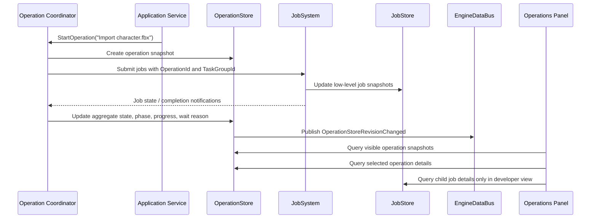

# Concurrency And Job System Architecture

## Purpose

This document defines asynchronous work, worker scheduling, thread affinity,
cancellation, progress, backpressure, context propagation, and shutdown for
Horo Engine.

The job system executes work. Data buses publish notifications after state
changes. They are separate mechanisms.

## Core Decisions

- Each process owns one job system composed by the host.
- Jobs use structured ownership through task groups and operation handles.
- Detached application threads are forbidden.
- Mutable editor, window, input, and graphics state remains on its owning
  thread.
- Cancellation is cooperative and distinct from failure.
- Queues are bounded and expose overload behavior.
- Diagnostic context and configuration snapshots are captured at submission.
- Waiting from the main or render thread is restricted and observable.

## Thread Model

```text
Main / Editor Thread
    window events, input, editor models, ImGui, command commit

Render-Capable Thread
    graphics context and backend work
    normally the main thread unless a backend contract says otherwise

Worker Pool
    import, cook, serialization preparation, hashing, validation,
    CPU-side asset processing, background queries

I/O Service
    blocking filesystem, process pipes, and network transport where required

Transport Threads
    MCP connection I/O; requests marshal into application operations
```

The architecture does not require one physical thread per role. It requires
that affinity and synchronization are explicit.

## Job System Interface

Implementation status on 18 July 2026: the FND-001A baseline implements the
bounded worker queue, result-returning submissions, parent cancellation and the
non-movable operation-owned `TaskGroup` below. Priority, affinity, configuration
snapshot capture, main-thread pumping and the richer operation store remain
later Foundation work; examples later in this document describe that target and
must not be read as already implemented.

```cpp
class JobSystem {
public:
    Result<JobHandle> Submit(JobDescriptor descriptor, VoidJobFunction work);
    Result<JobHandle> SubmitResult(JobDescriptor descriptor, JobFunction work);

    Result<void> RequestCancel(JobId id);
    JobSnapshot Query(JobId id) const;
    void Shutdown(ShutdownPolicy policy);
};

enum class WaitPolicy {
    WorkerOnly,           // allowed from worker threads only
    MainThreadPumpAllowed,// main thread may pump bounded continuations only
    ForbiddenOnOwnerThread// the thread that submitted must never wait here
};

struct JoinOptions {
    WaitPolicy waitPolicy;
    Duration timeout;
    bool publishWaitReason = true;
};
```

`JobHandle` is move-only and refers to a durable in-process job record. Dropping
the handle does not implicitly cancel a job unless the descriptor explicitly
uses scoped cancellation.

`WorkerCount()` exposes the immutable configured capacity for admission checks;
it is not a load metric. An operation job that synchronously joins nested
`TaskGroup` work must require at least one additional worker or fail admission
with a typed capacity diagnostic instead of deadlocking a single-worker pool.

## Job Descriptor

```cpp
struct JobDescriptor {
    CancellationToken parentCancellation;
};
```

The implemented descriptor intentionally contains only parent cancellation.
Additional scheduling metadata is introduced only with its owning scheduler
policy and tests.

Priorities are coarse and starvation-safe:

- `Interactive`: work blocking direct user feedback
- `Normal`: ordinary engine and editor work
- `Background`: indexing, cache cleanup, and speculative preparation

Priority does not bypass resource limits or affinity.

## State Machine

```text
Queued -> Running -> Succeeded
   |         |  \-> Failed
   |         \----> Cancelled
   \--------------> Cancelled
```

Every accepted job reaches exactly one terminal state. Submission rejection is
returned directly and does not create a job record.

Terminal results are immutable. Progress is monotonic within one phase and may
reset only when the job advances to a named new phase.

## Structured Concurrency

Operations that spawn related work own a `TaskGroup`:

```cpp
class TaskGroup {
public:
    Result<JobId> Spawn(JobDescriptor descriptor, JobFunction work);
    void RequestCancel();
    Result<void> Join();
};
```

`TaskGroup` is non-copyable and non-movable. Its injected `JobSystem` must outlive
it. Admission rejection does not create or retain a child. `Join()` is
idempotent and reports child failure in deterministic spawn order. `FailFast`
requests sibling cancellation on the first observed failure; `CollectAll` joins
all accepted children without early sibling cancellation. Destruction closes
admission, requests cancellation and joins every accepted child.

A parent operation cannot report completion while required child work remains
unaccounted for. Child failures follow the task group's declared policy:

- fail fast and cancel siblings
- collect all diagnostics
- allow optional children to fail independently

Raw `std::thread`, `detach()`, and unowned futures are not used for application
work.

## Cancellation

Cancellation tokens are cheap to query and propagate from:

- host shutdown
- modal or CLI cancellation
- MCP request cancellation
- parent task groups
- timeout policy

Jobs check cancellation at bounded intervals and before committing persistent
or authoritative state. Cancellation after an irreversible commit returns the
committed result rather than falsely reporting cancellation.

External subprocesses receive graceful termination first, then a bounded
forced-termination policy owned by the platform process service.

Every process request launched by a job receives the job's cancellation token.
Process termination reasons map to job terminal state:

- graceful cancellation before work completes -> `job.cancelled`;
- timeout reached -> `job.cancelled` with cause `platform.process.timeout`;
- forced termination after cancellation -> `platform.process.terminated`;
- non-zero exit without cancellation -> `platform.process.failed`.

The operation coordinator surfaces the mapped result in `OperationStore` without
exposing raw platform exit codes as operation state.

## Progress And Results

Jobs update an authoritative `JobStore`:

```cpp
struct JobSnapshot {
    JobId id;
    JobState state;
    JobPhase phase;
    ProgressValue progress;
    std::optional<Error> error;
    JobTiming timing;
};
```

`EngineDataBus` publishes lightweight operation or job revision
notifications. GUI, CLI, and MCP query the authoritative stores for complete
state. High-frequency output, logs, and samples remain in bounded stores rather
than event payloads.

## Operation Visibility

The job system is the execution layer. GUI surfaces observe user-facing
operations, not every internal worker item. An operation is a named unit of work
that a user or subsystem can understand, such as importing an asset, cooking a
project, building a release, indexing files, validating a project, or generating
behavior descriptors.

Internal jobs may be numerous and short-lived. Showing every worker callback,
coalesced telemetry task, or main-thread continuation in the editor creates
noise and makes the scheduler part of the public UI contract. The editor shows
operation aggregates by default and exposes low-level jobs only in developer or
profiler views.

```text
User-facing operation
  Import character.fbx
    -> Read source file job
    -> Parse FBX job
    -> Generate mesh blobs job
    -> Write metadata job
    -> Main-thread preview update continuation
```

This mirrors production IDE behavior: status bars and background-task panels
show meaningful operations; output consoles show logs; profilers show raw thread,
task, lock, and timing detail.

## Operation Store

`OperationStore` owns user-facing operation snapshots. `JobStore` owns
low-level job records.

`JobSystem` is the execution layer. It owns job scheduling, lifetime, and the
`JobStore`. It does not aggregate user-facing operation state. An
`OperationCoordinator` (or equivalent application service) creates operation
snapshots, submits jobs through `JobSystem`, observes `JobStore` revisions and
job completion, and updates `OperationStore`. This keeps scheduler internals out
of the UI contract and keeps `OperationStore` updates explicit and testable. The two stores are related by operation and task-group
IDs, but they serve different readers:

```cpp
struct OperationSnapshot {
    OperationId id;
    std::string title;
    OperationKind kind;
    OperationState state;
    OperationPhase phase;
    ProgressValue progress;
    JobPriority priority;
    std::optional<Error> error;
    OperationTiming timing;
    std::vector<JobId> childJobs;
    bool cancellable;
};
```

Operation states are user-facing:

```text
Queued -> Running -> Waiting -> Cancelling -> Succeeded
                         |             |----> Cancelled
                         |------------> Failed
```

`Waiting` is explicit because it is actionable in an editor. A running operation
may wait for an I/O slot, subprocess slot, memory reservation, GPU upload slot,
main-thread continuation, or dependency job. The wait reason is part of the
operation snapshot so the UI can explain stalls without exposing scheduler
internals by default.

Operations aggregate child job progress according to the operation's declared
policy. Linear pipelines may weight phases manually. Fan-out workloads may use
completed child weight. Unknown work uses indeterminate progress but still
reports phase, timing, and cancellation state.

## GUI Observation

The editor observes jobs through an Operations surface:

```text
Status Bar
  2 running | 1 queued | 1 failed

Bottom Panel: Operations
  Active | Queued | Failed | Recent

Details Drawer
  selected operation summary
  child jobs when developer details are enabled
  diagnostics summary
  wait reason
  actions: Cancel, Retry, Open Log, Copy Diagnostics
```

Default columns are intentionally high-signal:

- state
- operation title
- phase
- progress
- duration
- cancellable/result indicator

Developer details may add operation ID, job ID, task group, priority, affinity,
queue wait time, resource wait reason, configuration revision, and diagnostic
context. Raw worker thread IDs, lambda names, per-frame telemetry jobs, and every
micro-job remain hidden unless a profiler capture or developer diagnostics mode
is active.

The Operations panel is not the log viewer. It may show a bounded diagnostic
summary or recent output preview, but full logs stay in the console/output-log
store and timelines stay in the profiler.

## Observation Data Flow

Stores own data; the data bus announces revisions. GUI, CLI, and MCP consumers
query snapshots from the authoritative stores instead of receiving large log or
progress payloads through the bus.



Revision notifications are coalesced and rate-limited so a fast job cannot flood
the UI thread. Slow or closed consumers do not delay job execution.

## Retention And Noise Control

Operation visibility is bounded:

- active operations remain visible until terminal
- recent terminal operations keep a fixed-size ring buffer
- failed operations remain visible until dismissed or retention expires
- high-frequency logs, samples, and profiler events stay in bounded specialized
  stores
- internal/coalesced jobs are collapsed into their owning operation by default

Suggested defaults:

```text
recent terminal operations: 200
failed operation retention: 100 or until dismissed
inline output preview: last 20 lines or equivalent bounded bytes
full logs: output-log retention policy
profiler samples: capture-session retention policy
```

Persistent history is reserved for operations that matter after restart, such as
builds, release packaging, long imports, and validation reports. Ordinary
background indexing and speculative cache cleanup are transient.

## Main-Thread Handoff

Workers do not mutate editor documents, ImGui state, window state, input state,
or graphics resources directly. They return immutable prepared data and enqueue
a typed continuation to the owning thread.

The main thread processes continuations at documented synchronization points
with a time or count budget. One producer cannot monopolize a frame.

## Backpressure

Each queue has a configured capacity and one explicit full-queue policy:

- reject submission
- block only a non-critical producer for a bounded duration
- replace a stale coalescible job
- drop optional telemetry work and increment a dropped-work metric

Interactive, main-thread, and render threads do not block indefinitely on a
full queue.

## Waiting Rules

- Workers may wait only through task-group primitives that allow helping or
  deadlock detection.
- The main/editor thread does not synchronously wait for ordinary worker jobs.
  It may only pump bounded continuations through an explicit owner-thread wait
  scope configured with `WaitPolicy::MainThreadPumpAllowed`.
- The render-capable thread does not wait on a job that requires a render-thread
  continuation.
- Unbounded `Join()` is forbidden from main, editor, render-capable, and
  transport-owner threads.
- Shutdown joins work in dependency order with bounded diagnostics for stalls.

Any permitted wait above a configured threshold emits a profiler span and
metric. Every owner-thread wait publishes a wait reason into `OperationStore` so
UI stalls are explainable.

## Context Propagation

Submission captures:

- MDC and tracing context
- operation, request, job, project, and asset identifiers
- the immutable configuration revision
- cancellation ancestry

Workers install the captured context for the callback and restore their previous
context afterward. Context does not leak between jobs reusing a worker thread.

## Resource Scheduling

CPU worker count alone is insufficient for expensive pipelines. Jobs may also
acquire bounded resources:

- filesystem I/O slots
- subprocess slots
- memory budget reservations
- GPU upload slots
- per-tool or per-project serialization locks

Resource acquisition is cancellation-aware and uses a globally documented order
to prevent deadlocks.

When a job needs more than one bounded resource, it acquires them in this order:

1. per-project or per-tool serialization lock
2. memory budget reservation
3. filesystem or archive I/O slot
4. subprocess or external-tool slot
5. network transport slot
6. GPU upload or render-capable handoff slot

A job that cannot acquire the next resource without blocking beyond policy
releases already acquired resources, records a bounded diagnostic, and retries
or fails according to its descriptor. Jobs do not acquire resources in reverse
order for follow-up work; they schedule a new job or release and reacquire
resources in the documented order.

## Shutdown

Shutdown order is:

1. stop accepting external work
2. cancel host-scoped task groups
3. stop transport request submission
4. drain required main-thread and render-thread continuations
5. join workers and I/O services
6. finalize job records and observability
7. destroy referenced services

No callback executes against a destroyed service. Forced abandonment is allowed
only for process termination paths and is recorded.

## Testing

Required tests cover:

- exactly-once terminal transition
- cancellation before start and during work
- task-group child failure policies
- queue saturation and backpressure
- main-thread affinity enforcement
- shutdown with queued and running work
- diagnostic context isolation between reused workers
- configuration snapshot capture
- progress monotonicity
- deadlock-prone wait rejection
- multi-resource acquisition follows the documented global order
- deterministic single-worker test mode
- operation snapshot aggregation from child jobs
- operation wait reasons for bounded resources and main-thread continuations
- operation cancellation button state and cooperative cancellation transition
- revision notifications remain lightweight and do not carry logs or samples
- internal jobs are hidden from default GUI snapshots
- recent and failed operation retention policies are bounded

## Related Documents

- [Engine Data Bus](./engine-data-bus.md)
- [Error And Diagnostics](./error-and-diagnostics.md)
- [Configuration System](./configuration-system.md)
- [Observability Architecture](../observability/observability.md)
- [Runtime Lifecycle](../runtime/runtime-lifecycle.md)
