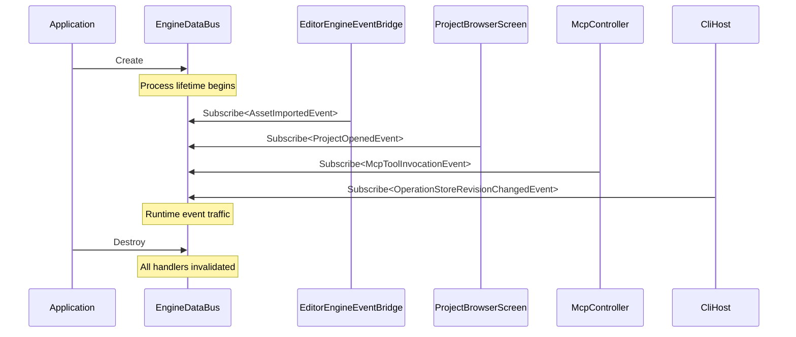
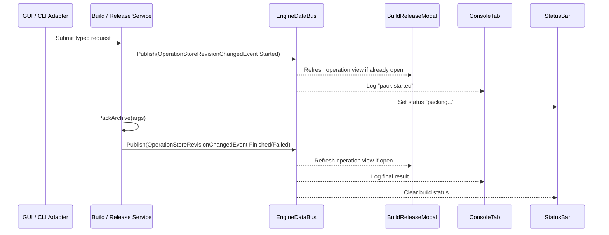
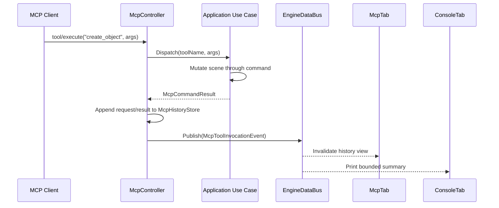

# Engine Data Bus

## Purpose

The `EngineDataBus` is the process-scoped, typed publish/subscribe notification
channel for cross-domain communication inside a running Horo process. It carries
**notifications** that something has happened, not the operations themselves.

Producers and consumers include:

- editor-session bridges and GUI workflow coordinators
- welcome and project-browser screens
- MCP command handlers
- CLI tool execution
- background jobs and build pipelines
- runtime diagnostics and logging subsystems

The bus is backend-neutral: the same event type can be published by GUI, CLI,
or MCP code through the appropriate thread-affinity path. Main-thread publishers
use synchronous publish when allowed; worker and transport threads enqueue
notifications for dispatch at the owning synchronization point.

Logging is independent from bus delivery. A process can write persistent logs
before the bus exists and while the bus is shutting down.

## Scope

The engine data bus exists for the lifetime of the process. It is created before
`Application::Run()` and destroyed after clean shutdown.

It is **not**:

- a request/response mechanism
- a state authority (it does not own `SceneDocument`, project model, or assets)
- a substitute for direct parent/child UI callbacks
- a logging, profiler, or telemetry buffer (those systems own bounded queryable
  stores and publish availability notifications)

## Ownership

```text
Application
    |
    +-- EngineDataBus          process-scoped, created in Application::OnInit
            |
            +-- EditorEngineEventBridge
            +-- Welcome / ProjectBrowser screens
            +-- McpController    publishes command lifecycle summaries
            +-- BuildPipeline    publishes operation-store revisions
            +-- StructuredLogEventAdapter    publishes store revisions
            +-- CliHost          publishes command lifecycle events
```

`Application` (or a thin `EngineContext` owned by `Application`) owns the bus.
Subsystems receive a non-owning pointer. The bus outlives every subsystem so that
shutdown-time notifications can still be delivered safely.

No subsystem other than `Application` creates or destroys the bus.

Subscriptions are resources. Surfaces, adapters, modules, and jobs that
subscribe receive a move-only RAII `SubscriptionToken` and release it during
deactivation or destruction. Raw handler IDs are diagnostic identities, not the
primary lifetime mechanism. A module unload, editor-session close, MCP connection
close, or panel destruction must be able to revoke every subscription it
installed without relying on bus shutdown.

`StructuredLogStore` is an observability sink owned by the process composition
root, not by `EngineDataBus`. `StructuredLogEventAdapter` observes committed
store revisions and publishes small availability events when a GUI consumer is
present.



## Design

### Type-Erased Bus Surface

The public API is fully typed, but the implementation is type-erased so that new
event types can be added in any module without modifying a central `std::variant`
or recompiling unrelated targets.

### Stable Type Identification

`TypeId` is derived from an explicit event type name declared by the event, not
from RTTI, compiler-specific type names, dynamic-library-local counters, or
source-location strings. A per-process counter is **not** used because static
local variables in templates do not share state across dynamic libraries.

```cpp
// foundation/event_bus/TypeId.h
#pragma once
#include <cstdint>
#include <string_view>

namespace horo {

using TypeId = std::uint64_t;

constexpr TypeId HashTypeName(std::string_view name) noexcept {
    // FNV-1a 64-bit
    TypeId hash = 14695981039346656037ull;
    for (char c : name) {
        hash ^= static_cast<TypeId>(c);
        hash *= 1099511628211ull;
    }
    return hash;
}

class TypeRegistry {
public:
    template<typename T>
    static TypeId Get() noexcept {
        static const TypeId id = HashTypeName(TypeName<T>::Value);
        return id;
    }

private:
    template<typename T>
    struct TypeName {
        static constexpr std::string_view Value = T::HoroEventTypeName;
    };
};

} // namespace horo
```

Every event type declares a stable type name:

```cpp
struct OperationStoreRevisionChangedEvent {
    static constexpr std::string_view HoroEventTypeName =
        "horo::OperationStoreRevisionChangedEvent";
    // ... fields
};
```

This guarantees that the same event type loaded from different modules receives
the same `TypeId`.

The declared name is part of the event contract. Renaming a C++ type without
changing `HoroEventTypeName` preserves the event identity; changing
`HoroEventTypeName` creates a new event identity and must be treated as a
compatibility break for subscribers.

Module-owned event names are prefixed by the module's stable ID. Built-in engine
events use the `horo::` prefix; project gameplay and extension packages use
their validated module prefix. The host rejects duplicate event names during
module descriptor validation before any handler is activated.

The event registry stores both the `TypeId` and the declared type name. If two
different names hash to the same `TypeId`, activation fails with a typed
diagnostic. Dispatch tables may use `TypeId` for lookup only after this collision
validation succeeds; the declared name remains the canonical identity for
diagnostics and persisted event routing.

### Bus Configuration

Bus behavior is configured at construction time so that production hosts can
opt into observability without recompiling:

```cpp
struct EngineDataBusConfig {
    // What to do when an event is published with no subscribers.
    enum class DeadEventPolicy { Silent, Log, Assert };
    // Development/editor defaults may use Log to catch missing subscribers early.
    // Production and headless hosts should default to Silent unless the event
    // descriptor explicitly requests logging.
    DeadEventPolicy deadEventPolicy = DeadEventPolicy::Silent;
    std::unordered_set<TypeId> loggedDeadEventTypes; // events where Log is expected

    // Whether to record handler timing and emit slow-handler warnings.
    bool enableHandlerTiming = false;
    std::chrono::microseconds slowHandlerThreshold{1000};

    // Backpressure policy for the async queue.
    enum class BackpressurePolicy { DropNewest, DropOldest, Merge };
    BackpressurePolicy defaultBackpressurePolicy =
        BackpressurePolicy::DropNewest;
    std::unordered_map<TypeId, BackpressurePolicy> eventBackpressurePolicies;
    std::size_t maxAsyncQueueSize = 1024;
};
```

### EngineDataBus Interface

```cpp
// foundation/event_bus/EngineDataBus.h
#pragma once
#include "TypeId.h"

#include <chrono>
#include <functional>
#include <mutex>
#include <optional>
#include <string_view>
#include <unordered_map>
#include <vector>

namespace horo {

class SubscriptionToken {
public:
    SubscriptionToken();
    ~SubscriptionToken();

    SubscriptionToken(SubscriptionToken&&) noexcept;
    SubscriptionToken& operator=(SubscriptionToken&&) noexcept;

    // Explicitly release the subscription before destruction.
    void Release();

    // Diagnostic identity only. Do not use as a lifetime handle.
    uint64_t DiagnosticId() const;

private:
    struct Impl;
    std::unique_ptr<Impl> m_impl;
};

class EngineDataBus {
public:
    using HandlerId = uint64_t;

    explicit EngineDataBus(const EngineDataBusConfig& config = {});
    ~EngineDataBus();

    // Subscribe to a typed event. The returned SubscriptionToken owns the
    // subscription; destroying or releasing it revokes the handler. The handler
    // is invoked on the publisher's thread for synchronous Publish(), or on the
    // main thread for events that were queued with PublishAsync().
    template<typename EventT, typename Handler>
    SubscriptionToken Subscribe(Handler&& handler);

    // Synchronous publish. The caller thread must be the main thread if any
    // subscriber expects main-thread dispatch (editor UI, ImGui).
    template<typename EventT>
    void Publish(const EventT& event);

    // Queue an event from any thread. It is dispatched the next time
    // DispatchQueued() is called from the main thread.
    template<typename EventT>
    void PublishAsync(EventT event);

    // Dispatch events queued by PublishAsync(). Must be called every frame from
    // the main thread. Does not block; only processes events already queued.
    void DispatchQueued();

    // Observability. Available according to config and build type.
    struct TraceRecord {
        std::string_view typeName;
        std::size_t handlerCount;
    };
    std::vector<TraceRecord> TraceSubscriptions() const;

    struct HandlerTiming {
        std::string_view typeName;
        std::chrono::nanoseconds elapsed;
    };
    std::vector<HandlerTiming> RecentSlowHandlers() const;

private:
    friend class SubscriptionToken;

    using HandlerFunc = std::function<void(const void*)>;

    struct HandlerRecord {
        HandlerId id;
        HandlerFunc func;
    };

    struct QueuedEvent {
        TypeId type;
        std::shared_ptr<void> payload; // erased event copy
        std::string_view typeName;     // for dispatch lookup
    };

    std::unordered_map<TypeId, std::vector<HandlerRecord>> m_handlers;
    std::vector<QueuedEvent> m_queue;
    mutable std::mutex m_mutex;
    HandlerId m_nextId = 1;
    EngineDataBusConfig m_config;

    EngineDataBusConfig::BackpressurePolicy QueuePolicyFor(TypeId type) const;
    void InvokeHandler(const HandlerFunc& handler, const void* raw,
                       std::string_view typeName);
    void ReportDeadEvent(std::string_view typeName);
    void OnSlowHandler(std::string_view typeName,
                       std::chrono::nanoseconds elapsed);
};

template<typename EventT, typename Handler>
SubscriptionToken EngineDataBus::Subscribe(Handler&& handler) {
    const TypeId type = TypeRegistry::Get<EventT>();
    auto wrapper = [h = std::forward<Handler>(handler)](const void* raw) {
        h(*static_cast<const EventT*>(raw));
    };

    std::lock_guard lock(m_mutex);
    const HandlerId id = m_nextId++;
    m_handlers[type].push_back(HandlerRecord{id, std::move(wrapper)});
    return SubscriptionToken(this, type, id);
}

template<typename EventT>
void EngineDataBus::Publish(const EventT& event) {
    const TypeId type = TypeRegistry::Get<EventT>();
    std::vector<HandlerFunc> snapshot;
    {
        std::lock_guard lock(m_mutex);
        auto it = m_handlers.find(type);
        if (it == m_handlers.end()) {
            snapshot.clear();
        } else {
            snapshot.reserve(it->second.size());
            for (const auto& record : it->second) {
                snapshot.push_back(record.func);
            }
        }
    }
    if (snapshot.empty()) {
        ReportDeadEvent(EventT::HoroEventTypeName);
        return;
    }
    for (const auto& handler : snapshot) {
        InvokeHandler(handler, &event, EventT::HoroEventTypeName);
    }
}

template<typename EventT>
void EngineDataBus::PublishAsync(EventT event) {
    const TypeId type = TypeRegistry::Get<EventT>();
    auto copy = std::make_shared<EventT>(std::move(event));

    std::lock_guard lock(m_mutex);
    if (m_queue.size() >= m_config.maxAsyncQueueSize) {
        switch (QueuePolicyFor(type)) {
            case EngineDataBusConfig::BackpressurePolicy::DropNewest:
                return;
            case EngineDataBusConfig::BackpressurePolicy::DropOldest:
                m_queue.erase(m_queue.begin());
                break;
            case EngineDataBusConfig::BackpressurePolicy::Merge:
                // Replace the newest existing event of the same type.
                for (auto it = m_queue.rbegin(); it != m_queue.rend(); ++it) {
                    if (it->type == type) {
                        *it = QueuedEvent{type, copy, EventT::HoroEventTypeName};
                        return;
                    }
                }
                // No event of this type can be coalesced without discarding an
                // unrelated event. Preserve the existing queue.
                return;
        }
    }
    m_queue.push_back(QueuedEvent{type, copy, EventT::HoroEventTypeName});
}

} // namespace horo
```

The code above is illustrative. A production implementation must not call
diagnostic, logging, or subscriber code while holding the bus registry lock.

The illustrative `std::function`, `std::shared_ptr`, `std::unordered_map`, and
`std::mutex` choices are not a blanket performance contract. A production bus
keeps the same semantic boundary but is free to use small-buffer handler storage,
intrusive queued-event storage, pre-reserved tables, per-event queues, or other
allocator-aware structures when profiling shows that the generic containers are
too expensive. In particular:

- synchronous publish must not allocate after subscription state has stabilized;
- async publish must have a bounded allocation policy or preallocated queue for
  event classes used from jobs, frame loops, or file watchers;
- handler dispatch must not hold the registry lock;
- the public subscription contract is a move-only RAII `SubscriptionToken`;
  handler IDs are diagnostic identities only;
- subscription tokens must revoke on destruction/release without relying on bus
  shutdown so module and UI teardown cannot leave dangling handlers;
- backpressure decisions must be observable through counters, not silent data
  loss;
- high-frequency events use revision/coalescing semantics instead of one payload
  per sample.

This keeps the bus modular and observable without making it the engine's data
plane or a hidden frame-time tax.

### Handler Isolation

Every handler runs inside a try/catch block. If a handler throws, the exception
is logged and the remaining handlers still run. This prevents one broken tab or
service from silencing every other observer of the same event.

```cpp
void EngineDataBus::InvokeHandler(const HandlerFunc& handler, const void* raw,
                                  std::string_view typeName) {
    const auto start = m_config.enableHandlerTiming
                           ? std::chrono::steady_clock::now()
                           : std::chrono::steady_clock::time_point{};
    try {
        handler(raw);
    } catch (const std::exception& e) {
        LogError("Event handler failed", typeName, e.what());
    } catch (...) {
        LogError("Event handler failed with unknown exception", typeName);
    }

    if (m_config.enableHandlerTiming) {
        const auto elapsed = std::chrono::steady_clock::now() - start;
        if (elapsed > m_config.slowHandlerThreshold) {
            OnSlowHandler(typeName, elapsed);
        }
    }
}
```

### Event Versioning

In-process C++ event types do not need runtime versioning because the compiler
enforces the contract. New fields can be added safely using `std::optional` with
a default value; existing subscribers recompile together with the event
definition.

Events that are mirrored to process boundaries, persisted, or exported must
carry their own schema version in that external representation. The adapter
that owns the external representation owns the schema version, not
`EngineDataBus`.

```cpp
struct McpToolInvocationEvent {
    static constexpr std::string_view HoroEventTypeName =
        "horo::McpToolInvocationEvent";

    RequestId requestId;
    std::string toolName;
    OperationState state;
    McpHistoryRevision historyRevision;
};
```

If the MCP adapter exports the same notification to JSON for diagnostics or
history replay, the JSON representation has its own schema:

```json
{
    "schemaVersion": 1,
    "requestId": "mcp-42",
    "toolName": "create_object",
    "state": "succeeded",
    "historyRevision": 17
}
```

This separation keeps the in-process bus simple while allowing protocol-level
evolution.

### Notification Plane And High-Volume Data

`EngineDataBus` is the process notification plane. It carries lifecycle,
completion, invalidation, and availability signals. It is not the data plane for
an unbounded or high-frequency stream.

For logs, profiler samples, file-watch results, process output, and similar
traffic:

1. The producing subsystem appends records to an owning bounded buffer or
   queryable service.
2. It commits a new monotonic revision.
3. It publishes a small event containing the revision and optional appended
   range/count.
4. Subscribers query only the records they need.

This model preserves low-latency in-memory updates without copying every record
through every handler. It also allows hidden GUI surfaces, CLI observers, and
MCP adapters to consume at different rates. Buffer overflow, retention, paging,
and durable export are policies of the owning store, not of the event bus.

`MetricsStore` follows the same pattern. `MetricsChangedEvent` contains a store
revision and optional changed metric groups; it does not contain time-series
samples. `ProfilerCaptureStateEvent` reports capture lifecycle changes; detailed
zones, allocation events, and callstacks remain in the capture backend.

An individual event may carry a small self-contained value when the value is the
notification itself. Large output, complete snapshots, and byte streams remain
behind typed query interfaces.

### Event Types

Events are strongly typed value objects. They carry the minimum data needed to
describe the change. The authoritative state remains in the owning model or
service; subscribers query the authority if they need more than the event
payload.

Application-level events live in `application/events/` and are published through
the `EngineDataBus`:

```cpp
// application/events/ProjectEvents.h
struct ProjectOpenedEvent {
    static constexpr std::string_view HoroEventTypeName =
        "horo::ProjectOpenedEvent";

    std::filesystem::path projectRoot;
};

struct ProjectClosedEvent {
    static constexpr std::string_view HoroEventTypeName =
        "horo::ProjectClosedEvent";
};

// application/events/BuildEvents.h
struct OperationStoreRevisionChangedEvent {
    static constexpr std::string_view HoroEventTypeName =
        "horo::OperationStoreRevisionChangedEvent";

    OperationStoreRevision revision;
    std::optional<OperationId> operationId;
    OperationState state;
};

// application/events/LogEvents.h
struct ConsoleLogEvent {
    static constexpr std::string_view HoroEventTypeName =
        "horo::ConsoleLogEvent";

    LogBufferRevision revision;
    std::size_t appendedCount;
};

// application/events/McpEvents.h
struct McpToolInvocationEvent {
    static constexpr std::string_view HoroEventTypeName =
        "horo::McpToolInvocationEvent";

    RequestId requestId;
    std::string toolName;
    OperationState state;
    McpHistoryRevision historyRevision;
};

// application/events/AssetEvents.h
struct AssetImportedEvent {
    static constexpr std::string_view HoroEventTypeName =
        "horo::AssetImportedEvent";

    std::string assetId;
    std::string assetType;
};
```

Editor-scoped events such as selection, scene-document changes, and viewport
navigation live in `editor/events/` and remain on the independent,
session-scoped `EditorDataBus`. They are not automatically published on
`EngineDataBus`. See [Editor Data Bus](../editor/editor-data-bus.md).

## Threading

| Operation | Thread |
|---|---|
| `Subscribe` / `Unsubscribe` | Any thread (must not race with itself) |
| `Publish` | Main thread for events consumed by UI |
| `PublishAsync` | Any thread |
| `DispatchQueued` | Main thread only |

Background jobs must not call `Publish()` directly from worker threads. They use
`PublishAsync()` or an explicit job handle polled on the main thread, which then
calls `Publish()`.

`PublishAsync()` uses a strictly bounded queue with configurable per-event
backpressure. The default policy is `DropNewest`: if the queue is full, the
newest event is discarded. High-frequency revision types such as
`OperationStoreRevisionChangedEvent` should override the default with `Merge`,
replacing the newest queued event of the same type. If no matching event exists,
the new event is dropped rather than evicting an unrelated event.

Events that require guaranteed delivery, such as a durable operation result,
must not rely on this lossy notification queue. Their authoritative result lives
in the owning job/use-case state and remains queryable after a progress event is
dropped.

```mermaid
sequenceDiagram
    participant Worker as Worker Thread
    participant Bus as EngineDataBus
    participant Loop as Main Thread Loop
    participant Modal as BuildReleaseModal
    participant Log as ConsoleLog

    Worker->>Bus: PublishAsync(OperationStoreRevisionChangedEvent)
    Bus->>Bus: Lock queue, apply backpressure policy
    Note over Bus: Bounded queue, Merge for revision events

    Loop->>Bus: DispatchQueued()
    Bus->>Bus: Swap queue under lock
    Bus-->>Modal: Dispatch OperationStoreRevisionChangedEvent when open
    Modal->>Modal: Invalidate cached operation view
    Bus-->>Log: Dispatch OperationStoreRevisionChangedEvent
    Log->>Log: Invalidate build activity view
```

```cpp
void BuildReleaseModal::OnOperationStoreRevisionChanged(
    const OperationStoreRevisionChangedEvent& event) {
    if (event.operationId && m_observedOperations.contains(*event.operationId)) {
        m_operationsNeedingRefresh.insert(*event.operationId);
    }
}

void BuildReleaseModal::RefreshOperation(OperationId operationId) {
    m_operationViews[operationId] = m_operations.Query(operationId);
}
```

The owning build/release service publishes progress after updating its
authoritative operation and job state. The modal never publishes completion on
behalf of the operation and remains correct if revision events are merged or
dropped.

## Rules

- Events are value types. They carry data, not behavior or virtual calls.
- Handlers receive `const&` and must not mutate the event.
- Handlers must be cheap. Expensive work belongs in services, jobs, or use cases.
- Handlers must not throw. If one does, it is isolated and logged; other
  handlers still run.
- Subscribers clean up in their destructor or detach path.
- Do not use the bus for request/response. Use services or direct function calls
  for operations that need a result.
- Do not publish UI commands such as save, undo, open settings, or add object.
  Invoke typed editor commands or application use cases directly.
- Do not use the bus for one-to-one tightly coupled UI interactions (e.g., a
  button inside a modal updating a label in the same modal). Use direct callbacks
  or local state for those.
- Do not put full state snapshots into events. Reference the authority and let
  subscribers query it.
- Do not publish one event payload per log line, profiler sample, or output
  chunk. Append to an owning bounded store and publish a revision/range
  notification.
- Do not rely on handler invocation order. If ordering is required, use
  multi-phase events or a dedicated coordinator service.
- Always declare `HoroEventTypeName` on event types so that `TypeId` is stable
  across module boundaries.

## CLI Integration

CLI commands publish the same lifecycle event types as the GUI so observers in
that process behave consistently. An in-process GUI workflow and an in-process
CLI adapter may share one bus. Separate processes never share an
`EngineDataBus`; subprocess progress requires an explicit IPC or process-output
adapter.

Example: the pack application use case invoked by the GUI or CLI adapter:



```cpp
int HoropakMain(const std::vector<std::string>& args) {
    auto result = GetBuildService().PackArchive(ParsePackRequest(args));
    return result.ok ? 0 : 1;
}
```

The service updates durable operation/job state and publishes lifecycle revision
events. A GUI adapter may open `BuildReleaseModal` before submission, but receiving a
`OperationStoreRevisionChangedEvent` never opens or focuses a modal automatically.

When running as a standalone CLI process, the bus may have no subscribers. The
configured `DeadEventPolicy` controls whether this is silent, logged, or
asserted. This keeps publishers decoupled from observer count while still
allowing operators to detect misconfigurations.

## MCP Integration

MCP commands execute against application use cases. When a command changes
state, the MCP controller updates an owning bounded history store and publishes
a summary event:



```cpp
McpCommandResult McpController::ExecuteCommand(std::string_view toolName,
                                               const nlohmann::json& args) {
    auto result = Dispatch(toolName, args);
    const auto revision = m_history.Append(toolName, args, result);

    m_engineBus->Publish(McpToolInvocationEvent{
        .requestId = result.requestId,
        .toolName = std::string(toolName),
        .state = result.ok ? OperationState::Succeeded : OperationState::Failed,
        .historyRevision = revision
    });

    return result;
}
```

The MCP activity tab subscribes to `McpToolInvocationEvent` and queries
`McpHistoryStore` for the bounded details it needs. The console tab may
subscribe to the same event and print a short summary. Full request arguments,
result payloads, and redacted diagnostics remain in the MCP-owned store instead
of being copied through every bus handler.

## Debug And Observability

Bus observability is controlled by `EngineDataBusConfig` and is available in
both development and production builds according to policy. Production hosts
opt in to tracing and slow-handler detection when diagnosing issues.

Provided tooling:

- `TraceSubscriptions()` returns every event type with a registered handler and
  the handler count.
- `DeadEventPolicy` logs or asserts when an event type is published with no
  subscribers.
- `RecentSlowHandlers()` returns handlers whose execution exceeded the
  configured threshold.
- Handler exceptions are isolated: one failing handler does not prevent others
  from running.

This tooling is essential once the codebase grows beyond a few dozen event types.

## Relationship To Editor Data Bus

- `EngineDataBus` is process-scoped and owns application-level event types.
- `EditorDataBus` is editor-session-scoped and owns editor-local notifications.
- `EditorEngineEventBridge` explicitly imports an allowlist of process events
  into an active editor session.
- Editor tabs see only editor models, commands, and `EditorDataBus`.
- MCP, CLI, application services, GUI workflow coordinators, and runtime systems
  use `EngineDataBus` for process-level lifecycle notifications.

See [Editor Data Bus](../editor/editor-data-bus.md).

Editor modal open/close and focus changes are not process events. See
[Editor Modal Host](../editor/editor-modal-host.md).

Structured record ownership, sinks, retention, and diagnostic context are
defined by [Observability Architecture](../observability/observability.md).

## Why Not A Global Singleton?

A global singleton would make every subsystem depend on ambient state,
complicate tests, and hide coupling. The bus is owned by `Application` and
injected so that:

- tests can create a bus, publish events, and assert subscriber reactions;
- subsystems declare their dependency explicitly;
- specialized tests and narrowly scoped tool hosts can provide a minimal stub
  when they do not compose process-level notifications;
- shutdown order is predictable and traceable.

## Testing

Required tests cover:

- stable `TypeId` generation across module boundaries
- synchronous publish snapshotting without invoking handlers under the registry
  lock
- async queue backpressure, merge, and drop policies
- handler exception isolation
- dead-event policy behavior in subscribed and unsubscribed hosts
- high-volume data staying in owning stores with bus events carrying only
  revisions or summaries
- MCP invocation summaries invalidating `McpHistoryStore` views without copying
  full request or result payloads through the bus

## Related Documents

- [Editor Data Bus](../editor/editor-data-bus.md): editor-session notification boundary.
- [Concurrency And Job System](./concurrency-and-jobs.md): work execution,
  progress stores, cancellation, and owner-thread handoff.
- [Error And Diagnostics](./error-and-diagnostics.md): typed operation results
  that do not travel as command events.
- [Runtime Lifecycle](../runtime/runtime-lifecycle.md): frame synchronization and
  shutdown order.
- [Observability Architecture](../observability/observability.md): event diagnostics and
  high-volume signal ownership.
