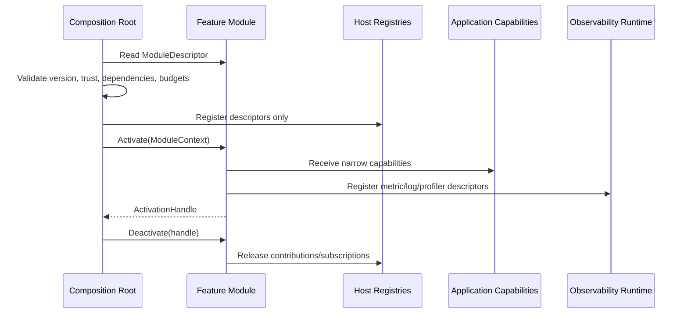

# System Design

## Product Model

Horo Engine has two supported hosts:

- `HoroEditor`: the complete graphical host
- `horo-engine`: the terminal and headless host

Both hosts expose MCP. MCP is a standard engine capability, not a separate
product mode.

`horopak` is a purpose-built packaging executable, not a third engine host. It
composes pipeline and platform capabilities for deterministic package creation
and does not expose the full application surface, an interactive runtime, or an
MCP service.

The graphical host is one application. Project browsing, project creation,
recent projects, onboarding, and scene editing are screens and workspaces inside
`HoroEditor`. Editor Settings and Build & Release are modal workflows above the
editor workspace. There is no separate launcher application, launcher module, or
launcher lifecycle.

Top-level route ownership follows
[GUI Screen Host](../editor/gui-screen-host.md). Persistent workspace surfaces follow
[Editor Panel Host](../editor/editor-panel-host.md), and exclusive editor workflows
follow [Editor Modal Host](../editor/editor-modal-host.md).

```text
HoroEditor                           horo-engine
  |                                    |
  +-- ImGui GUI                        +-- CLI commands
  +-- MCP service                      +-- MCP service
          \                              /
           +------ application --------+
                        |
          scene, assets, build, release,
          renderer-neutral engine services
```

GUI actions, CLI commands, and MCP tools must use the same application-level
operations. A capability must not be implemented independently in an ImGui
callback, CLI handler, or MCP handler.

Inside the graphical host, the application-owned `GuiScreenHost` is the GUI composition root and
`EditorWorkspaceController` owns the active editor session. The controller
coordinates the scene document, selection, viewport state, undo/redo commands,
workspace persistence, and editor-local notifications. GUI panels and tabs do
not become application-layer state authorities.

`EditorModalHost`, owned by application composition and borrowed by `GuiScreenHost`, composes transient screen-like
workflows above the editor workspace. It owns modal focus and interaction
exclusivity but not editor, project, build, or release state.

## Architecture Style

The engine is a layered modular monolith. Modules are separate CMake targets
with explicit APIs and dependency direction. Applications compose these modules
into the required host.

The design favors:

- compile-time dependency enforcement
- typed contracts between modules
- explicit ownership and lifetime
- backend-neutral engine APIs
- testable application use cases
- reusable presentation components
- headless operation without UI or GPU requirements

## Module Contract

Horo is both a game engine and an IDE. Modularity is therefore not limited to
renderer backends or project gameplay code; every editor feature, tool surface,
runtime service, and extension point must be composed through explicit module
contracts.

A module contract has two parts:

- a compile-time target boundary: public headers, private implementation, and
  declared CMake dependencies;
- a runtime contribution boundary: descriptors for capabilities, settings,
  commands, panels, MCP tools, asset importers, metrics, and extension points.

The runtime boundary exists because Horo is also an IDE. The editor cannot grow
by hard-coding every feature into `EditorLayer`, the command palette, the MCP
adapter, the Settings modal, and the Operations panel independently. A feature
module declares what it contributes, the host validates those descriptors, and
the composition root wires the accepted contributions into the appropriate
surfaces.

A module is allowed to expose one or more of these surfaces:

| Surface | Purpose | Constraints |
|---|---|---|
| `api` | Stable value types, handles, descriptors, and narrow service interfaces | No backend, GUI, transport, or host dependencies |
| `runtime` | Authoritative state transitions and execution | Depends only on its API/model contracts and lower layers |
| `backend` | Concrete OS/API/device implementation | Selected only by the composition root |
| `presentation` | GUI, CLI, MCP, or scripting adapter | Translates to application use cases; does not own business rules |
| `extension point` | Manifest-declared contribution boundary | Versioned, permission-gated, and observable |

Required rules:

- New engine capabilities start as a narrow API or application capability, not as
  an editor panel, MCP handler, or singleton service.
- Presentation modules may be optional. Removing GUI, MCP, CLI, Python tooling,
  or a plugin host must not remove the authoritative engine operation.
- A feature-specific vertical slice may own several targets, but dependency
  direction remains API/model -> runtime -> adapter/backend -> app composition.
- Extension packages contribute descriptors, assets, commands, or code through
  declared extension points. They do not reach into editor internals, renderer
  backend internals, global state, or unversioned C++ implementation details.
- Public module headers define stable contracts. Private implementation headers
  do not leak through transitive includes or public CMake dependencies.
- Module registration is explicit at composition time. Ambient discovery through
  process-global registries, static initialization side effects, or service
  locator lookups is not part of the architecture.
- IDE contributions are descriptor-driven. A module may contribute an editor
  panel, command-palette action, Settings page, MCP tool, CLI command, asset
  importer, or diagnostic view only through a host-owned extension point with a
  typed descriptor and activation policy.
- Add-on packages may be backend-only, frontend-only, or hybrid. Backend
  contributions expose headless application capabilities, pipeline steps,
  importers, validators, providers, or runtime slots. Frontend contributions are
  presentation adapters over those capabilities and must not be the only place
  where the business operation exists.
- Descriptors are inert data. They may name factories, permissions,
  configuration keys, metric instruments, and dependency requirements, but they
  do not mutate global registries during static initialization.
- Activation is separate from discovery. The host validates dependency version,
  trust, permissions, resource budget, and feature flags before constructing
  runtime objects.
- Deactivation and hot reload must unregister subscriptions, revoke capabilities,
  cancel or drain owned jobs, and leave no dangling UI, MCP, CLI, data-bus, or
  observability hooks.

This contract is stricter than ordinary application modularity because an IDE
has many observers of the same state: panels, modals, command palettes, MCP
clients, CLI commands, asset pipelines, test hosts, and project extensions. The
owning model or application use case remains the authority; every observer reads
snapshots or query interfaces and performs mutations through typed commands.

### Module Lifecycle

Every runtime-composed module follows the same lifecycle:

```text
Discover descriptor
  -> validate contract, version, dependencies, trust, and resource policy
  -> register descriptors into host-owned registries
  -> activate factories with explicit capabilities
  -> observe through bounded stores, metrics, and revision events
  -> deactivate in reverse dependency order
```



`ModuleContext` is not a service locator. It is a narrow construction-time bundle
owned by the composition root and shaped by the descriptors the module declared.
If a module needs project mutation, asset import, renderer resources, or MCP
publication, that dependency appears explicitly in its descriptor and constructor
surface. Runtime code does not ask a global context for arbitrary services.

Required module metadata:

| Metadata | Purpose |
|---|---|
| stable module ID | Namespaces settings, errors, metrics, events, and extension contributions |
| semantic contract version | Allows host compatibility checks before activation |
| dependency list | Declares required modules and minimum contract versions |
| capability requirements | Defines the narrow application services needed at activation |
| resource budget hints | Queue, memory, job, thread-affinity, and capture-cost expectations |
| observability descriptors | Log categories, metric instruments, profiler zones, and diagnostic bundle hooks |

This prevents the IDE side of the engine from becoming a monolithic tangle while
still keeping hot runtime paths explicit and optimizable.

## Performance And Observability Contract

The foundation layer must make performance measurable without turning
observability into the hot path.

Required rules:

- Hot paths do not allocate, format strings, take contended locks, or dispatch
  through virtual/plugin boundaries unless that cost is part of the documented
  contract and has a measured budget.
- Always-on observability is bounded: counters, histograms, operation state,
  queue depth, wait reasons, and error summaries are retained in fixed-size or
  policy-bounded stores.
- Detailed profiling is explicit and capture-scoped. CPU zones, GPU timestamps,
  allocation callstacks, and lock timelines are enabled by profile policy or a
  developer action, not by every production frame.
- Application operations, jobs, and subsystem services carry diagnostic context
  and stable operation IDs so GUI, CLI, MCP, logs, metrics, and profiler captures
  can correlate the same work without copying large payloads through events.
- Slow consumers never stall producers. GUI panels, MCP clients, and CLI views
  observe revisions and query authoritative stores at their own cadence.
- Module boundaries expose performance counters where they own resources:
  queue length, drop count, wait reason, memory budget, cache hit/miss, frame
  cost, GPU upload pressure, and backend failure state.

Performance-sensitive modules document their expected synchronization points,
allocation domains, and observability cost. If a module cannot be observed
without perturbing frame time or editor responsiveness, the design is incomplete.

## Source Layout

```text
src/
  foundation/          math, identifiers, results, logs/metrics/profiler facade
  platform/            window, filesystem, process, keychain, OS log sinks
  asset/               archive, import, metadata, cooked assets
  scene/
    model/              durable runtime scene definitions
    runtime/            ECS, lifecycle, systems
  physics/             backend-neutral contracts and the canonical physics runtime
  audio/
    api/                backend-neutral audio contracts
    runtime/            voices, mixer, streaming coordination
    backends/
      platform/         selected native device implementation
      null/             deterministic headless/test implementation
  network/
    api/                transport and protocol contracts
    runtime/            typed sessions, queues, protocol coordination
    backends/
      sockets/          optional native socket/TLS implementation
  render/
    api/                backend-neutral contracts and value types
    frontend/           render submission and resource coordination
    backends/
      opengl/
      null/
      vulkan/
  pipeline/             build, package, toolchain, release
  application/          use cases, diagnostics, profiler and support services
  editor/
    app/                HoroEditor composition and frame integration
    screens/            welcome, projects, editor workspace routes
    design_system/      theme, tokens, fonts, icons, and reusable ImGui components
    localization/       UI message resources, locale resolution, and fallback
    document/           editor document and commands
    data_bus/           editor-session notifications
    panels/             persistent editor workspace panes and tabs
    modals/             settings, build/release, import, and confirmation workflows
    project_model/      project settings, workspace persistence, and asset index
    mcp_bridge/         editor-facing MCP adapter over application use cases
    state/              GUI navigation and presentation state
  transport/
    mcp/
  extensions/
    gameplay/           public game module registration contracts
    extension-system/   versioned external extension package ABI and host registry
  apps/
    HoroEditor/          HoroEditor composition root
    horo-engine/         terminal/headless composition root
    horopak/             packaging tool composition root
```

## CMake Targets

```text
HoroEngine::Foundation
HoroEngine::Platform
HoroEngine::Runtime
HoroEngine::Assets
HoroEngine::SceneModel
HoroEngine::RuntimeScene
HoroEngine::Physics
HoroEngine::AudioApi
HoroEngine::AudioRuntime
HoroEngine::AudioPlatform
HoroEngine::AudioNull
HoroEngine::NetworkApi
HoroEngine::NetworkRuntime
HoroEngine::NetworkSockets
HoroEngine::RenderApi
HoroEngine::RenderFrontend
HoroEngine::RenderModuleAbi
HoroEngine::RenderModuleHost
HoroEngine::RenderOpenGL
HoroEngine::RenderNull
HoroEngine::RenderVulkan
HoroEngine::RenderMetal
HoroEngine::RenderD3D12
HoroEngine::Pipeline
HoroEngine::Application
HoroEngine::ProjectMigrations
HoroEngine::EditorModel
HoroEngine::EditorServices
HoroEngine::Gui
HoroEngine::Mcp
HoroEngine::GameplayApi
HoroEngine::ExtensionApi
HoroEngine::ExtensionHost
```

`HoroEngine::Application` owns project version/compatibility plus the
backend-neutral migration registry, planner, typed pipeline, deterministic
inventory and verified dry-run executor. `HoroEngine::ProjectMigrations` depends
on Application and owns only build-generated core definition composition;
Application never depends back on that concrete catalog target. The PRJ-001A
platform baseline owns native durability and lock handles; EditorServices owns
the shared project-mutation coordinator and MIG-001C journaled transaction
service. EditorServices also owns the GUI-neutral MIG-001D `ProjectOpenService`;
the service schedules one operation-owned job, installs prepared derived state on
the owner thread, and publishes a generation-safe project-session candidate. The
GUI screen only projects progress and performs candidate-backed final
route/restart actions. `Gui` cannot construct a workspace from a raw project path.

Executable composition targets are:

```text
HoroEditor
horo-engine
horopak
```

`AudioPlatform` selects only the native implementation for the target platform;
native audio headers remain private to that target. `NetworkSockets` owns the
optional native socket and TLS implementation and remains separate from typed
session/protocol coordination in `NetworkRuntime`. `GameplayApi` owns the public
registration, descriptor, behavior, and runtime-capability contracts used by
project gameplay modules. Generated project modules link this API rather than
`ExtensionApi` or editor internals.

Physics intentionally starts as one backend-neutral `Physics` target containing
the canonical runtime and solver boundary. If interchangeable third-party
physics backends are introduced, it must first split into explicit API, runtime,
and backend targets; callers must not infer those layers from directory symmetry
alone.

Each target owns an explicit source list and the smallest practical public
include surface. Production targets are linked into tests; production sources
are not recompiled as part of test-only libraries.

`HoroEngine::Assets` is implemented as a backend-neutral Foundation-only target.
Its current AST-001A surface owns stable asset/type identities, immutable
registry snapshots, sidecar/index persistence, cooked-byte providers, and the
bounded job-system load coordinator. Importer, cooker, archive, cache, hot
reload, and Content Browser remain later consumers or targets; they must not be
folded into Foundation or a renderer backend. `HoroEngine::RuntimeScene` consumes
Assets one-way for AST-001B snapshot-pinned scene preparation; Assets never
depends on RuntimeScene.

## Dependency Direction

Arrows point from the dependent target to the target that defines the contract:

```text
platform -----------------------------------------------> foundation

runtime -----------------------------------------------> foundation

assets / scene-model / render-api / audio-api /
network-api / gameplay-api / extension-api -------------> foundation

physics / audio-runtime / network-runtime /
render-frontend / pipeline ------------------------------> neutral APIs and models

runtime-scene -------------------------------------------> runtime + assets + foundation

audio-platform / audio-null / network-sockets /
render-opengl / render-null / render-vulkan ------------> platform + owning API

application / editor-model / editor-services -----------> neutral APIs,
                                                          runtimes, and pipeline

gui / mcp / extension-host -----------------------------> application, editor,
                                                          and extension APIs

apps ---------------------------------------------------> runtime + adapters + platform
                                                          + selected backends
```

Required rules:

- Foundation does not depend on platform, scene, renderer, editor, MCP, or UI.
- The foundation logging facade and structured record model do not depend on
  GUI, editor, transport, or a concrete sink backend.
- Foundation metric descriptors, aggregation, and profiler instrumentation do
  not depend on GUI, editor, transport, or a concrete capture backend.
- Scene runtime does not depend on editor, GUI, MCP, or ImGui.
- Render API does not expose OpenGL, Vulkan, GLAD, windowing, or editor types.
- Audio and network APIs do not expose native device, socket, TLS, or platform
  event-loop types.
- Pipeline does not depend on GUI or a renderer backend.
- MCP and GUI depend on application use cases; application use cases do not
  depend on MCP or ImGui.
- The `Application`, editor, scene, and runtime library targets do not link a
  concrete renderer, audio-device, or network-transport backend.
- Executable application targets are composition roots and select concrete
  platform and backend implementations.
- Gameplay modules depend only on public runtime capabilities. External extension
  packages cross the versioned extension ABI and do not expose a C++ ABI between
  releases.

## Application Layer

The application layer exposes typed use cases for:

- creating, opening, saving, and validating projects
- loading, inspecting, converting, and mutating scenes
- importing, querying, cooking, and packaging assets
- building and releasing projects
- querying diagnostics and operation progress

Operations return typed results and structured errors. Long-running operations
support progress reporting and cancellation without requiring an active GUI.

The common contracts are defined by
[Error And Diagnostics](./error-and-diagnostics.md),
[Configuration System](./configuration-system.md), and
[Concurrency And Job System](./concurrency-and-jobs.md).

The GUI, CLI, and MCP layers translate the same result types into presentation,
terminal, or protocol output.

GUI menu, toolbar, panel, and modal interactions invoke typed editor commands or
application use cases directly. Publish/subscribe buses carry lifecycle and
state-change notifications after an owning model or use case commits; they do
not dispatch operations that require a result.

Opening and closing an editor modal is a direct GUI operation. It is not an
application use case or data-bus command.

### UI Adapter Capabilities

GUI features depend on the smallest application capability required by their
workflow. A shared `ApplicationUseCases` service locator or an application
object exposing every operation is not injected into every screen, tab, panel,
or modal.

Examples of narrow capability surfaces include:

```cpp
class ProjectOperations;
class SceneQueries;
class AssetQueries;
class AssetImportOperations;
class ReleaseJobOperations;
class EditorSettingsStore;
```

Common editor-session dependencies such as selection, document, history,
viewport state, and notification access may be grouped in an
`EditorTabContext` or `EditorModalContext`. Feature-specific application
capabilities are supplied to the concrete feature at construction or
registration time.

The separation is:

- application and editor-model code owns validation, state transitions,
  business rules, persistence coordination, and typed errors
- GUI presentation code owns widget composition, local draft state, formatting,
  focus, navigation, and mapping interaction results to typed calls
- thin GUI adapters translate application results and model snapshots into
  presentation state
- shared primitive components know neither application capabilities nor data
  buses

Application use cases and presentation-state reducers are testable without
ImGui. Drawing functions remain thin and consume already prepared view data.
This keeps GUI automation focused on interaction and rendering instead of being
the only way to verify business behavior.

## MCP

MCP is composed into both engine hosts.

In `HoroEditor`, MCP uses the running graphical host's application services and
queues state mutations onto the owning GUI/editor thread.

In `horo-engine`, MCP uses headless application services. It does not require
ImGui, a window, or a graphics backend unless the requested operation explicitly
requires rendering.

MCP owns:

- transport and session lifecycle
- protocol schemas
- request validation
- serialization of protocol responses

MCP does not own engine business rules and must not mutate editor, scene,
renderer, or asset state directly from a transport thread.

## Scene Boundary

Editor documents are converted into runtime-owned definitions before entering
the runtime:

```text
Editor::SceneDocument
        |
        | editor service conversion
        v
RuntimeSceneDefinition
        |
        v
SceneRuntimeCoordinator
```

Scene runtime APIs consume runtime models and remain independent of editor
serialization and UI state.

See [Scene Runtime](../runtime/scene-runtime.md) for ECS ownership, system scheduling,
scene transitions, and runtime identity. Authoring commands and persistence
follow [Editor Document Model](../editor/editor-document-model.md).

## Renderer Boundary

The arrows below mean compile-time `depends on`; they do not represent runtime
callback direction:

```text
runtime-scene -----------+
                         |
render-frontend ---------+---> render-api
                         |
render-module-host ------+
                         |
render-opengl -----------+
render-null -------------+
render-vulkan -----------+

apps ---> render-frontend + render-module-host
```

Backend selection occurs during host startup. Backend-specific handles,
resources, headers, and system libraries remain private to the owning backend.
Renderer backends implement `RenderApi` contracts and do not depend on
`RenderFrontend`. Installed product composition resolves one independently
installed, verified, ABI-compatible, successfully probed renderer component;
`RenderModuleHost` loads its exact path and adapts it into the in-process render
registry. Development and test hosts may link a backend directly without making
that static path the installed-product architecture.

Renderer component lifecycle follows
[Renderer Distribution And Availability](../runtime/renderer-distribution-and-availability.md).
Equal backend behavior follows
[Render Backend Parity Contract](../runtime/render-backend-parity-contract.md).

The null renderer is a supported implementation for headless execution and
tests.

Frame extraction, pass execution, resource lifetime, resize, and backend failure
behavior follow [Rendering Architecture](../runtime/rendering-architecture.md).

## Platform Boundary

Window creation, OS dialogs, process execution, filesystem integration,
credential storage, and graphics-context bootstrapping are platform-owned
responsibilities.

Foundation, assets, pipeline, and headless application use cases remain usable
without SDL3, OpenGL, or ImGui unless their explicit operation contract requires
one of those capabilities.

Filesystem, process, window, event, clock, dialog, credential, and crash-service
contracts follow [Platform Abstraction](./platform-abstraction.md).

## Ownership And Threading

- Owning handles create, release, and shut down their resources.
- Borrowed references never release the referenced resource.
- Mutable editor document state is owned by the editor thread.
- Each process composition root owns one observability runtime and shuts it down
  after producers stop but before process services are destroyed.
- The observability runtime owns bounded metric history and profiler capture
  lifecycle; GUI panels are query/presentation clients.
- Active editor-session state is owned by `EditorWorkspaceController`; layout
  and tab lifetime are delegated to `EditorPanelHost`.
- Modal stack, focus trapping, and workspace interaction blocking are owned by
  `EditorModalHost`.
- Renderer and graphics-context work is owned by the render-capable host thread.
- MCP and background workers cross ownership boundaries through commands,
  immutable snapshots, queues, or explicit synchronization.
- Shutdown drains queued work before destroying services and their dependencies.

Detailed ownership and scheduling rules are defined by
[Ownership And Resource Lifetime](./ownership-and-resource-lifetime.md),
[Concurrency And Job System](./concurrency-and-jobs.md), and
[Runtime Lifecycle](../runtime/runtime-lifecycle.md).

## Build Interface Rules

- Every module has its own `CMakeLists.txt`.
- Sources are listed explicitly per target.
- `PUBLIC`, `PRIVATE`, and `INTERFACE` dependencies match header exposure.
- Third-party dependencies remain private unless present in a public contract.
- ImGui is private to the GUI target.
- GLAD and system graphics libraries are private to renderer backends.
- Public headers compile independently.
- CI rejects forbidden target and include dependency directions.

See [Observability Architecture](../observability/observability.md) for shared C++/Python record
contracts, CPU/memory metrics, profiler captures, context propagation, and
storage policy.

CLI parsing, output, exit status, and cancellation follow
[CLI Architecture](../interfaces/cli-architecture.md). Runtime input and physics behavior
follow [Input Architecture](../runtime/input-architecture.md) and
[Physics Architecture](../runtime/physics-architecture.md).

Optional runtime audio and networking follow
[Audio Architecture](../runtime/audio-architecture.md) and
[Networking Architecture](../runtime/networking-architecture.md). Project-owned native
game code follows [Gameplay Module](../extensions/gameplay-module.md), while editor
and tooling extensions follow [Extension System](../extensions/plugin-system.md).

Running-host trust policy follows
[Application Security](../security/application-security.md). Installation and updater
behavior follows [Distribution And Update](../release/distribution-and-update.md).

## Related Documents

- [Ownership And Resource Lifetime](./ownership-and-resource-lifetime.md)
- [Platform Abstraction](./platform-abstraction.md)
- [Concurrency And Job System](./concurrency-and-jobs.md)
- [Runtime Lifecycle](../runtime/runtime-lifecycle.md)
- [Scene Runtime](../runtime/scene-runtime.md)
- [Rendering Architecture](../runtime/rendering-architecture.md)
- [Observability Architecture](../observability/observability.md): signal
  ownership, process runtime, and reading paths
- [Observability Metrics And Profiling](../observability/observability-performance.md):
  metric storage, memory accounting, and profiler capture contracts
- [Extension System](../extensions/plugin-system.md)
- [Gameplay Module](../extensions/gameplay-module.md)
