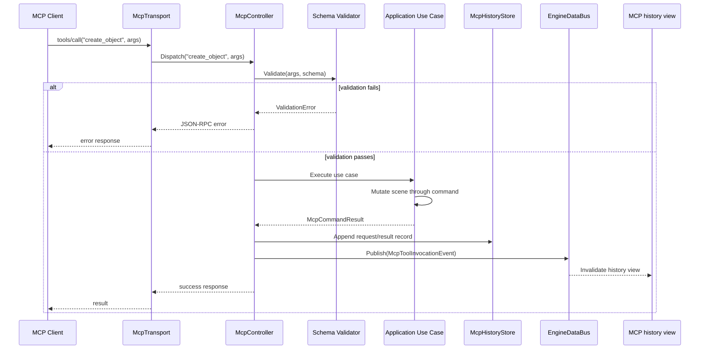

# MCP Architecture

## Purpose

This document defines the Model Context Protocol (MCP) integration in Horo
Engine. MCP exposes editor, scene, asset, build, and release operations to
external clients through a stable, typed protocol. The same application use
cases power GUI, CLI, and MCP interactions; MCP does not implement engine
business logic independently.

## Scope

MCP is available in both supported hosts:

- `HoroEditor`: the graphical host
- `horo-engine`: the terminal and headless host

MCP owns:

- transport and session lifecycle
- protocol schema and request/response serialization
- tool registry and dispatch
- request validation and error translation

MCP does **not** own:

- engine business rules
- direct mutation of scene, asset, renderer, or editor state from a transport
  thread
- ImGui or terminal presentation logic

## Ownership

```text
HoroEditor                    horo-engine
    |                             |
    +-- McpServer                 +-- McpServer
            |                             |
            +-- McpController             +-- McpController
                    |                             |
                    +-- Application Use Cases ----+
                            |
                    Scene, Asset, Build, Release, Diagnostics
```

`McpServer` owns the transport lifecycle. `McpController` owns tool dispatch
and protocol-level validation. Application use cases own the actual operations.

## Transport Layer

Horo Engine supports stdio transport for local clients and SSE (Server-Sent
Events) over HTTP for remote or web clients. The transport layer is swappable
and does not depend on the engine module.

```cpp
class IMcpTransport {
public:
    virtual ~IMcpTransport() = default;
    virtual void Start(IMcpMessageHandler& handler) = 0;
    virtual void Send(const nlohmann::json& message) = 0;
    virtual void Stop() = 0;
};
```

_stdio transport_ reads JSON-RPC messages from `stdin` and writes responses to
`stdout`. It is the default for CLI and local editor integration.

_SSE transport_ runs an HTTP server that emits server-sent events. It is used
for web-based clients and remote automation.

## Session Lifecycle

1. Host starts `McpServer` during initialization.
2. `McpServer` creates the configured transport.
3. Client connects and sends `initialize` request.
4. Server responds with capabilities and tool list.
5. Client calls `tools/list` and `tools/call`.
6. On host shutdown, server drains in-flight requests and closes transport.

All engine mutations triggered by MCP are queued onto the main thread in the
GUI host. The CLI host runs them on the host's main thread directly.

## Tool Registry

Tools are registered in `McpController` by name. Every MCP tool is described by a
validated `McpToolDescriptor`. The descriptor is the protocol contract; the
handler is only the adapter that invokes the application use case.

```cpp
struct McpToolDescriptor {
    std::string name;
    std::string description;
    nlohmann::json inputSchema;
    nlohmann::json outputSchema;
    CapabilitySet capabilities;
    HostAvailability hosts;
    SideEffectPolicy sideEffects;
    CancellationPolicy cancellation;
    TimeoutPolicy timeout;
    RateLimitPolicy rateLimit;
    McpToolVisibility visibility;
};
```

```cpp
// mcp/tools/CreateObjectTool.h
struct CreateObjectTool {
    static constexpr std::string_view Name = "create_object";

    static McpToolDescriptor Descriptor() {
        return {
            .name = std::string(Name),
            .description = "Create a scene object of a declared type",
            .inputSchema = R"({
                "type": "object",
                "properties": {
                    "name": { "type": "string" },
                    "primitiveId": {
                        "type": "string",
                        "description": "primitive catalog identifier"
                    }
                },
                "required": ["name", "primitiveId"]
            })"_json,
            .outputSchema = R"({
                "type": "object",
                "properties": {
                    "objectId": { "type": "string" }
                },
                "required": ["objectId"]
            })"_json,
            .capabilities = CapabilitySet{Capability::SceneMutation},
            .hosts = HostAvailability::Both,
            .sideEffects = SideEffectPolicy::ProjectWrite,
            .cancellation = CancellationPolicy::Cooperative,
            .timeout = TimeoutPolicy::FromDescriptor,
            .rateLimit = RateLimitPolicy::Default,
            .visibility = McpToolVisibility::Public
        };
    }

    static McpCommandResult Execute(Application& app, const nlohmann::json& args);
};
```

The set of supported `primitiveId` values is generated from the
`PrimitiveCatalog` defined in
[Built-In Scene Primitives](../runtime/built-in-scene-primitives.md). Hardcoded
object type lists in tool schemas are not permitted.

Registration:

```cpp
mcpController.RegisterTool<CreateObjectTool>();
mcpController.RegisterTool<ImportAssetTool>();
mcpController.RegisterTool<BuildProjectTool>();
```

The host validates tool names, schemas, capabilities, side-effect policy,
supported hosts, and permission requirements before advertising the tool to a
client.

## Request Lifecycle



## Tool Result Envelope

Tool results use a stable envelope unless the tool descriptor declares a custom
schema.

```json
{
  "schemaVersion": 1,
  "requestId": "mcp-42",
  "tool": "build_project",
  "status": "succeeded",
  "result": {},
  "diagnostics": [],
  "operationId": null
}
```

- `schemaVersion`, `requestId`, `tool`, and `status` are always present.
- `result` follows the tool's declared output schema.
- `diagnostics` contain safe, structured diagnostics.
- `operationId` is set when the tool created a long-running operation.

Failures use JSON-RPC error envelopes. The `error.data` field contains the
canonical Horo error payload. Protocol-level errors use the JSON-RPC error code;
engine-level errors use `-32000` with the structured error payload.

## Long-Running Tool Lifecycle

MCP tools that start long-running operations return an operation-aware result.
A tool may either:

1. complete synchronously within the request budget, or
2. create an application operation and return an `operationId`.

Long-running tools expose:

- request ID
- operation ID
- cancellation token
- timeout policy
- progress subscription or polling tool
- final result query

Example response for a long-running tool:

```json
{
  "schemaVersion": 1,
  "requestId": "mcp-42",
  "tool": "build_project",
  "status": "running",
  "result": null,
  "diagnostics": [],
  "operationId": "op-123"
}
```

Transport threads must not block indefinitely waiting for long-running engine
work. The application use case creates jobs and operation records; MCP reports
operation progress through declared protocol messages or explicit query tools.

## Request Cancellation

Every accepted MCP request owns or joins a cancellation token. If the client
sends a cancellation notification, disconnects, or the request timeout expires,
the controller requests cooperative cancellation on the associated application
operation or task group.

Cancellation maps to the canonical Horo `job.cancelled` or timeout/platform
error codes and is returned through the JSON-RPC error/data payload or the
operation status query.

Cancellation rules:

- a cancelled synchronous tool returns a JSON-RPC error with `job.cancelled`;
- a cancelled long-running tool updates its operation state and exposes the
  cancellation through the operation status tool;
- forced termination after cancellation maps to `platform.process.terminated`;
- client disconnect detaches or cancels according to the tool's detach policy.

## Threading

MCP transport threads must not mutate engine or editor state directly.

In `HoroEditor`:

- transport receives requests on its own thread
- requests are queued to the GUI/editor main thread
- use cases execute on the main thread
- responses are sent from the transport thread

In `horo-engine`:

- transport receives requests on its own thread
- the CLI host has a single main thread that processes the queue
- use cases execute on the main thread

```cpp
McpCommandResult McpController::ExecuteCommand(std::string_view toolName,
                                               const nlohmann::json& args) {
    // Transport thread
    auto future = m_mainThreadQueue.Post([this, toolName, args]() {
        return DispatchOnMainThread(toolName, args);
    });

    auto result = future.get();
    const McpHistoryRevision revision = m_history->Append(toolName, args, result);

    m_engineBus->Publish(McpToolInvocationEvent{
        .requestId = result.requestId,
        .toolName = std::string(toolName),
        .state = result.ok ? OperationState::Succeeded : OperationState::Failed,
        .historyRevision = revision
    });

    return result;
}
```

## Error Handling

MCP errors are translated into JSON-RPC error objects:

| Error            | Code   | Meaning                            |
| ---------------- | ------ | ---------------------------------- |
| Parse error      | -32700 | Invalid JSON                       |
| Invalid request  | -32600 | Malformed JSON-RPC                 |
| Method not found | -32601 | Unknown tool                       |
| Invalid params   | -32602 | Schema validation failed           |
| Internal error   | -32603 | Unexpected engine failure          |
| Engine error     | -32000 | Use case returned structured error |

Application use cases return typed `Result<T, Error>` values. `McpController`
translates engine errors into JSON-RPC payloads without leaking internal
implementation details.

## Adding A New MCP Tool

1. Define the tool struct in `mcp/tools/<Name>Tool.h`.
2. Implement `Execute` in `<Name>Tool.cpp` using application use cases only.
3. Register the tool in `McpController::RegisterDefaultTools()`.
4. Add a contract test in `tests/contract/mcp/`.
5. Add a protocol test in `tests/mcp/`.
6. Update MCP tool documentation if the tool is user-facing.

## Capabilities

The server advertises the following capabilities:

- `tools`: list and call tools
- `logging`: stream authorized, filtered, and redacted structured log messages
- `prompts`: optional prompt templates for common workflows

Resources are not exposed through MCP; scene and asset data are accessed
through tools, not resource URIs.

## Bounded Query Results

Tools that return scene, asset, diagnostics, log, or operation data must use
bounded result sets.

Query tools support:

- `limit`
- `cursor` or `pageToken`
- revision number where applicable
- stable ordering
- partial result metadata

Tools must not return unbounded scene graphs, logs, profiler data, or asset
lists in one response. Streaming JSONL tools declare a per-record schema and
bounded chunk size.

## MCP History Retention And Redaction

`McpHistoryStore` stores bounded request summaries, not arbitrary full payloads.

The store records:

- request ID
- tool name
- timing
- status
- operation ID
- safe diagnostics summary

Tool arguments and results are redacted according to the tool descriptor.
Secrets, credentials, raw file contents, and large payloads are never retained
in history by default. History retention is policy-bounded by count, age, and
storage budget.

## Security

- MCP transport does not accept anonymous remote connections in production.
- The SSE transport requires authentication when exposed beyond localhost.
- Tool arguments are validated against JSON Schema before execution.
- Long-running tools support cooperative cancellation.
- Secrets are never returned in tool results or logs.

## Remote Transport Policy

SSE transport binds to localhost by default. Binding to non-loopback interfaces
requires explicit configuration, authentication, and project trust approval.

Remote transports enforce:

- authentication
- optional origin allowlist
- request body size limits
- per-client concurrency limits
- per-tool rate limits
- idle timeout
- redacted audit logging

See [Release Security](../release/release-security.md) for signing and transport trust.

## Testing

MCP tests are organized into three layers:

1. **Protocol tests**: validate JSON-RPC framing and error codes.
2. **Tool tests**: validate individual tool behavior in isolation.
3. **Contract tests**: validate that GUI, CLI, and MCP produce the same results
   for the same operation.

Required additional coverage:

- client disconnect cancels or detaches according to tool policy
- cancellation of long-running build/import/release tools
- timeout maps to stable Horo error payload
- remote transport authentication and origin policy
- rate-limit and body-size enforcement
- bounded query pagination and stable ordering
- history redaction of secrets and large payloads

Run MCP tests:

```bash
python3 scripts/dev.py test -- test_mcp
python3 scripts/dev.py test -- contract
```

## Debugging

Enable focused MCP protocol logging through the shared observability runtime:

```bash
HORO_LOG_LEVEL=info \
HORO_LOG_LEVELS=mcp.protocol=trace \
build/debug/bin/horo-engine mcp serve
```

The canonical user-facing command is `horo-engine mcp serve`; legacy aliases may
exist only as compatibility shims and must resolve to the same typed command
request.

`HORO_MCP_LOG=1` may remain as a compatibility alias for
`mcp.protocol=trace`. MCP records use the canonical structured schema, log
directory, rotation, context propagation, and redaction rules. Protocol logs
record frame boundaries, request IDs, tool names, timings, sizes, and result
status; they do not blindly persist complete request or response payloads.

## Adapter Equivalence

GUI, CLI, and MCP adapters must call the same application use cases for the same
business operation. Differences are limited to:

- input parsing and validation envelope
- presentation format
- transport/protocol error envelope
- interactive prompting policy
- progress delivery mechanism

They must not implement separate business rules, scene mutation paths, asset
import logic, build behavior, or release policy.

## Related Documents

- [MCP Panel](./mcp-panel.html): HTML reference design for MCP sessions,
  tool-call history, approval queue, request inspection, and audit surface.
- [System Design](../foundation/system-design.md): host boundaries and dependency direction.
- [Engine Data Bus](../foundation/engine-data-bus.md): how MCP publishes history
  revision notifications.
- [CLI Architecture](./cli-architecture.md): shared headless host behavior and
  protocol-safe output separation.
- [Built-In Scene Primitives](../runtime/built-in-scene-primitives.md): object
  creation primitive catalog and MCP schema source.
- [Error And Diagnostics](../foundation/error-and-diagnostics.md): application error and
  protocol error mapping.
- [Concurrency And Job System](../foundation/concurrency-and-jobs.md): request cancellation,
  task ownership, and owner-thread handoff.
- [Testing Architecture](../delivery/testing-architecture.md): MCP test layers and
  harnesses.
- [Release Security](../release/release-security.md): transport and signing trust.
- [Application Security](../security/application-security.md): runtime authentication,
  capability, project trust, rate-limit, and remote-binding policy.
- [Observability Architecture](../observability/observability.md): levels, categories, MDC,
  storage, and protocol-log redaction.
