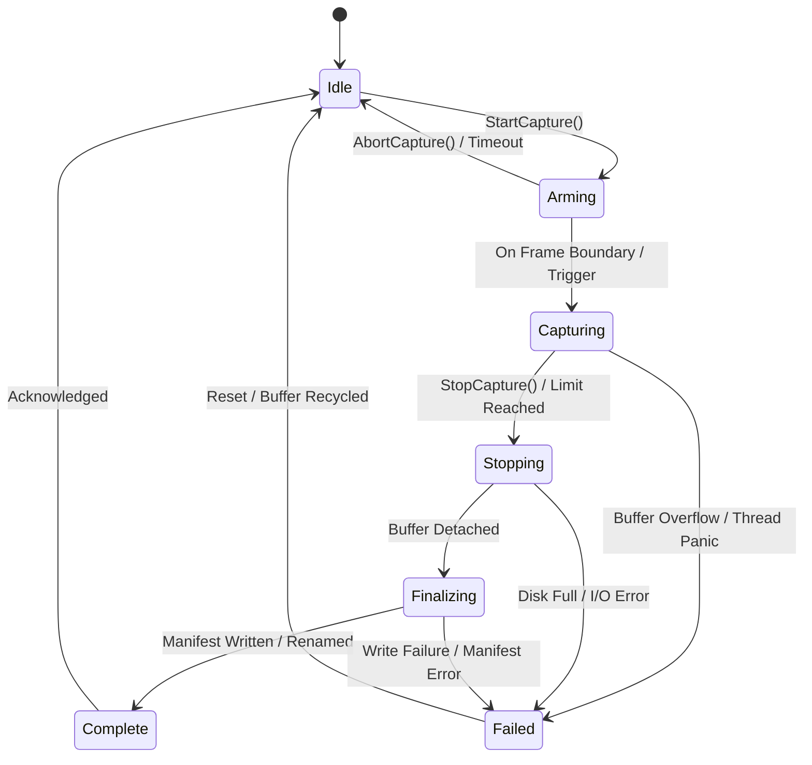

# Observability Metrics And Profiling Contract

## Purpose

This document defines the detailed metrics and profiler contract for Horo
Engine, HoroEditor, Python tooling, release jobs, and generated games.

Start with [Observability Architecture](./observability.md) for the decision
summary. Structured logs, MDC propagation, persistent session layout, privacy,
and diagnostic bundles are defined in
[Logging, Context, And Diagnostics Contract](./observability-logging.md).

Metrics provide bounded continuous health history. Profiler captures provide
explicit high-detail timelines. Neither signal is transported as one data-bus
event per sample or zone.

## Ownership

The process composition root owns `MetricsRegistry`, `MetricsStore`, platform
samplers, and `ProfilerCaptureService`. Engine modules publish measurements
through typed handles. GUI surfaces query narrow read/control capabilities.

`MetricsEventAdapter` emits coalesced store-revision notifications.
`ProfilerCaptureStateEvent` reports capture lifecycle. Samples, timing zones,
allocation events, and callstacks remain in their owning store/backend.

## Metrics Architecture

Metrics answer bounded numeric questions such as:

- How much CPU capacity is this process using?
- What are current and peak resident/committed memory values?
- What are frame-time p50, p95, p99, and worst values?
- Which engine subsystem owns reserved or used memory?
- How many jobs, assets, draw calls, physics bodies, or queued operations exist?
- Did a release stage become slower or use more memory than its budget?

Metrics do not explain one individual failure as richly as logs, and they do not
reconstruct a call timeline like a profiler trace. A metric is never emitted by
formatting a log line and parsing it later.

### Metric Instruments

The canonical instrument types are:

| Instrument | Meaning | Example |
|---|---|---|
| `Counter` | Monotonic cumulative total | imported assets, failed jobs, bytes read |
| `UpDownCounter` | Additions and removals from a current total | active jobs, loaded assets |
| `Gauge` | Latest sampled value | resident memory, queue depth, FPS |
| `Histogram` | Distribution of observed values | frame time, import duration, allocation size |

Rates, averages, percentiles, and deltas are calculated from these instruments
by the store or presentation layer. Producers do not maintain competing rolling
average implementations.

Every metric has one immutable descriptor:

```cpp
enum class MetricKind {
    Counter,
    UpDownCounter,
    Gauge,
    Histogram,
};

enum class MetricUnit {
    Count,
    Bytes,
    Seconds,
    Ratio,
};

struct MetricDimensionDescriptor {
    std::string_view key;
    std::span<const std::string_view> allowedValues;
};

struct MetricDescriptor {
    MetricId id;
    std::string_view name;
    MetricKind kind;
    MetricUnit unit;
    std::string_view description;
    MetricChannel channel;
    MetricAvailability availability;
    std::span<const MetricDimensionDescriptor> dimensions;
    uint32_t maxSeries;
};

enum class MetricAvailability {
    Required,   // metric must be available; failure is a diagnostic event
    Optional,   // metric may be unavailable depending on platform or profile
    DebugOnly   // metric is published only in development/diagnostic profiles
};

enum class MetricAvailabilityState {
    Available,
    TemporarilyUnavailable,
    UnsupportedByPlatform,
    UnsupportedByBackend,
    DisabledByProfile,
    PermissionDenied,
    SamplerFailed
};

struct MetricAvailabilitySnapshot {
    MetricId metric;
    MetricAvailabilityState state;
    std::optional<DiagnosticCode> reason;
    MetricsRevision revision;
};
```

Metric names are stable, lowercase, dot-separated, and unit-free:

```text
process.cpu.utilization
process.cpu.core_equivalent
process.memory.resident
process.memory.committed
engine.frame.cpu_time
engine.frame.gpu_time
engine.jobs.queued
renderer.draw_calls
asset.import.duration
memory.engine.used
memory.renderer.reserved
```

The descriptor carries the unit, so suffixes such as `_ms`, `_bytes`, and
`_percent` are not part of canonical names. Display adapters choose human units
without changing the stored value.

```cpp
MetricDescriptor{
    .id = "asset.import.duration",
    .name = "asset import duration",
    .kind = MetricKind::Histogram,
    .unit = MetricUnit::Seconds,
    .description = "Time spent importing one asset.",
    .channel = MetricChannel::AlwaysOn,
    .availability = MetricAvailability::Required,
    .dimensions = {
        MetricDimensionDescriptor{
            .key = "asset.type",
            .allowedValues = {"texture", "mesh", "audio", "unknown"}
        },
        MetricDimensionDescriptor{
            .key = "outcome",
            .allowedValues = {"success", "failed", "cancelled"}
        },
    },
    .maxSeries = 32,
};
```

Allowed dimensions and `maxSeries` prevent high-cardinality time series from
growing without bound.

### Metric Dimensions

Metrics support a small fixed set of low-cardinality dimensions:

```text
subsystem=renderer
backend=vulkan
profile=development
outcome=success
stage=cook
queue=asset-import
```

Metric dimensions do not automatically inherit MDC. Values such as
`operation.id`, `request.id`, `asset.id`, file paths, entity IDs, user values,
or arbitrary strings would create unbounded time series and are prohibited as
metric dimensions.

High-cardinality correlation belongs in logs and profiler traces. A log can
reference a metric/capture session, while a profiler capture can carry the
active `operation.id`. Metrics remain aggregate and bounded.

Each descriptor declares its allowed dimension keys and maximum series count.
Registering an unknown dimension or exceeding the series budget produces a
rate-limited diagnostic and drops the new series rather than growing memory
without bound.

### C++ Metrics API

The Horo facade exposes typed handles resolved once during initialization:

```cpp
const CounterHandle importedAssets =
    metrics.Counter("asset.import.completed", MetricUnit::Count);

const HistogramHandle importDuration =
    metrics.Histogram("asset.import.duration", MetricUnit::Seconds);

importedAssets.Add(1, {{"outcome", "success"}});
importDuration.Observe(duration, {{"asset.type", assetType}});
```

Hot paths do not perform string lookup on every update. Static descriptors and
dimension value IDs are registered ahead of measurement. Handle operations use
thread-local or sharded accumulation where contention would otherwise affect
frame work.

Convenience RAII timers are available for operation durations:

```cpp
{
    MetricTimer timer(importDuration, {{"asset.type", assetType}});
    ImportAsset(request);
}
```

Metrics are not used for control flow. A subsystem queries its owning model or
service, not a metric, when making a correctness decision.

## Required Core Metrics

Every supported host publishes a core set according to its build profile.

### Process CPU

The platform sampler records:

- `process.cpu.user_time`: cumulative user-mode CPU seconds
- `process.cpu.system_time`: cumulative kernel/system CPU seconds
- `process.cpu.core_equivalent`: CPU-time delta divided by wall-time delta; `1.0`
  means one logical core was fully occupied and values may exceed `1.0`
- `process.cpu.utilization`: core-equivalent divided by available logical CPU
  count, clamped to `[0, 1]`
- `process.thread.count`: current process thread count

The two CPU utilization metrics prevent the common ambiguity where “100% CPU”
means either one saturated core or the entire machine. Samples use monotonic
time and deltas; they are not derived from instantaneous scheduler guesses.

CPU hardware-wide utilization, temperatures, frequencies, and unrelated process
usage are outside the default application sampler. Platform-specific diagnostic
extensions require explicit support and privacy review.

When play-in-editor runs in the editor process, process CPU metrics describe the
combined process. Runtime/editor breakdowns come from scoped timing metrics and
profiler zones. A separately launched game has its own process metrics and
session identity. The UI must not label an in-process runtime estimate as
operating-system process CPU.

### Process And Engine Memory

The platform sampler records, where the operating system exposes reliable
values:

- `process.memory.resident`: physical memory currently resident for the process
- `process.memory.resident_peak`: peak resident memory
- `process.memory.committed`: committed/private memory charged to the process
- `process.memory.virtual`: virtual address space mapped or reserved

These values are not interchangeable. The editor labels them explicitly and
does not present one generic “memory usage” number.

Engine allocators additionally publish:

- `memory.engine.used`
- `memory.engine.reserved`
- `memory.renderer.used`
- `memory.renderer.reserved`
- `memory.assets.used`
- `memory.scene.used`
- `memory.physics.used`
- `memory.audio.used`
- `memory.jobs.scratch_used`

Allocator metrics use a bounded scoped-tag model. A nested allocation inherits
the current memory tag through RAII:

```cpp
{
    ScopedMemoryTag tag(MemoryTag::AssetTexture);
    UploadTexture(texture);
}
```

Tagged totals are continuously available when the owning allocator can account
for them cheaply. Per-allocation callstacks, lifetime reconstruction, and leak
queries belong to opt-in memory profiling, not always-on metrics.

Memory views state their accounting boundary. Engine allocator totals are not
added to process resident/committed values as if they were independent, and
renderer/asset child tags are not double-counted in a parent total. Untracked
native or third-party allocations explain why tagged engine usage may be lower
than process memory.

GPU memory is reported separately as `gpu.memory.*` only when the backend and
platform expose a trustworthy value. The determination of trustworthiness is
standardized across backends:

- **Vulkan**: Requires the `VK_EXT_memory_budget` extension. Memory usage is
  retrieved from `VkPhysicalDeviceMemoryBudgetPropertiesEXT` fields.
- **OpenGL**: Checks for NVidia (`GL_NVX_gpu_memory_info`) or AMD/ATI
  (`GL_ATI_meminfo`) extensions.

If none of these APIs/extensions are supported by the active GPU driver or
platform, the metric is reported as `Unavailable` rather than falling back to a
misleading `0`. A future backend may add its own adapter, but it must provide a
trustworthy resident/budget definition before it can publish `gpu.memory.*`.

## Metric Availability And Degraded Sampling

Every sampled metric has an availability state. The same availability model
applies to CPU, memory, GPU time, platform-specific samplers, and any optional
backend sampler.

The runtime state is represented by `MetricAvailabilityState`, described in
[Metric Instruments](#metric-instruments). `MetricAvailability` in the descriptor
declares the module's intent; `MetricAvailabilityState` reports the current
runtime condition.

Rules:

- unavailable metrics are represented as unavailable, not as zero;
- UI surfaces show the reason when useful;
- startup records the effective metric availability set;
- repeated sampler failures are rate-limited and summarized;
- recovery from temporary unavailability publishes a metrics revision;
- unsupported metrics do not continuously log warnings after the initial status.

### Frame And Engine Health

Render-capable editor and game hosts publish:

- `engine.frame.cpu_time`
- `engine.frame.gpu_time`, when supported
- `engine.frame.present_time`
- `engine.frame.count`
- `engine.frame.missed_budget`
- `engine.update.time`
- `engine.physics.time`
- `engine.render_submission.time`
- `engine.jobs.queued`
- `engine.jobs.running`
- `engine.jobs.wait_time`
- `renderer.draw_calls`
- `renderer.triangles`
- `renderer.resources.count`
- `scene.objects.count`
- `asset.loaded.count`

Frame and subsystem durations are histograms. The editor derives FPS and
p50/p95/p99/worst frame times over selected windows. Average FPS alone is not a
sufficient performance signal because it hides spikes.

CPU frame time, GPU frame time, and presentation/wait time remain separate.
Adding them together is not generally meaningful because CPU and GPU work can
overlap.

### Hitch And Budget Analysis

Frame metrics must preserve enough distribution information to diagnose hitches,
not just average frame rate. The standard frame budget view reports:

- target budget in milliseconds for the active presentation mode
- p50, p95, p99, worst, and sample count for CPU frame time
- p50, p95, p99, worst, and sample count for GPU frame time when available
- missed-budget count and longest consecutive missed-budget streak
- top contributing subsystem histograms for update, physics, render submission,
  jobs, asset streaming, audio update, and networking update
- presentation wait time separately from CPU simulation and render submission

A single hitch creates one bounded diagnostic record with frame number, runtime
mode, active scene ID when safe, budget, elapsed values, and capture suggestion.
It does not emit one log line per subsystem every frame. Repeated hitches are
rate-limited and summarized with first/latest occurrence and suppressed count.

The performance view may expose a "capture next hitch" control. This arms a
bounded profiler trigger and starts capture on the next frame that exceeds the
configured budget threshold. The trigger is owned by `ProfilerCaptureService`,
not by the UI graph.

Application and project modules may register custom metrics under owned prefixes
such as `game.ai.*`, `game.network.*`, or `pipeline.release.*`, subject to the
same descriptor and cardinality rules.

## Sampling And Aggregation

Metrics use two collection paths:

1. **Event-fed instruments** update counters and histograms when work occurs.
2. **Sampled instruments** query process/platform state at a bounded interval.

Default intervals:

| Source | Default |
|---|---:|
| Process CPU and memory | 1000 ms |
| Queue, object, and resource gauges | 250 ms |
| Frame timing | observed each frame, aggregated into 250 ms and 1 s windows |
| Expensive platform/GPU queries | 1000 ms or backend-defined safe cadence |

Sampling is scheduled outside critical render work. A sampler that misses its
deadline records the actual interval and skips catch-up bursts.

`MetricsStore` owns a bounded multi-resolution ring:

- high-resolution recent samples
- one-second aggregates for medium history
- one-minute aggregates for long diagnostic history

Downsampling preserves count, minimum, maximum, sum, and configured histogram
buckets so percentiles remain meaningful. The store has explicit byte and
series limits. Oldest high-resolution data is compacted or evicted first.

Metrics updates do not publish one data-bus event per sample. `MetricsEventAdapter`
publishes a coalesced revision notification at most once per presentation frame
or configured UI interval. Tabs query the store for new ranges.

```cpp
struct MetricsChangedEvent {
    MetricsRevision revision;
    MetricGroupSet changedGroups;
};
```

`changedGroups` is an invalidation hint such as process, memory, frame,
renderer, or jobs. It is not a sample payload.

## Metrics Store

`MetricsStore` is the bounded in-memory authority for recent metric series. It
governs concurrency, data retention, and event propagation as follows:

### Concurrency And Write Semantics

To prevent lock contention on hot engine threads (e.g., render, update):
- **Thread-Local Accumulators**: Hot-path metrics (such as draw calls, frames, and allocation counters) write directly to thread-local or sharded atomic slots.
- **Periodic Aggregation**: The central `MetricsStore` aggregates these sharded buffers at a fixed rate (e.g., once per frame for frame metrics, or every 500ms for system/process counters) using a readers-writer lock (`std::shared_mutex`).
- **Query Path**: Reads and presentation queries acquire a shared lock (`shared_lock`), while the aggregator thread acquires a unique write lock (`unique_lock`) only during flush phases.

### Dropped Sample Accounting

- **Cardinality Limits**: To prevent memory leaks, a metric series has a strict limit on active dimensions (default 100 distinct series per metric). If a producer attempts to write a new series that violates this limit, the write is dropped.
- **Dropped Counter**: Saturated or dropped samples are accumulated in a dedicated process-wide counter `process.metrics.dropped_samples` and logged as a warning at the end of the collection interval.

### Metrics Changed Events

When new samples are flushed to the `MetricsStore`, the store increments its
global monotonic revision number. A background adapter coalesces these updates
and publishes a `MetricsChangedEvent` carrying the list of modified metric groups
(subsystems like `renderer`, `process.memory`, or `jobs`). Sinks and tabs (e.g.,
`PerformanceTab`) check the `changedGroups` list to selectively refresh only
active graphs.

The store is not a general database. It does not retain unbounded per-session
history or accept arbitrary dynamic labels. Editor charts request downsampled
data appropriate to their pixel width instead of copying every raw frame sample.

Optional persistent metric summaries use `metrics.jsonl`, with one versioned
aggregate record per interval rather than one record per frame. Detailed
profiler captures use a dedicated binary capture format and manifest because
timeline, callstack, and allocation data are not log records.

Session directories, approved output roots, retention, redaction, and
diagnostic-bundle rules are defined in
[Logging, Context, And Diagnostics Contract](./observability-logging.md).

## Profiler Traces

Profiler traces answer “where was time or memory spent?” and are more detailed
than metrics.

Supported capture channels are:

- CPU scope zones and thread timelines
- GPU zones and frame correlation when the backend supports timestamps
- jobs/tasks, queue handoffs, and worker execution
- locks, contention, and waits
- frame markers and screenshots where explicitly enabled
- custom counters/plots
- allocation/free events, memory tags, and optional callstacks

The Horo API provides compile-time gated instrumentation:

```cpp
HORO_PROFILE_FRAME("Main");
HORO_PROFILE_SCOPE("Scene.Update");
HORO_PROFILE_SCOPE_DYNAMIC(assetType);
HORO_PROFILE_COUNTER("renderer.draw_calls", drawCalls);
HORO_PROFILE_MEMORY_ALLOC(pointer, size, MemoryTag::AssetTexture);
HORO_PROFILE_MEMORY_FREE(pointer);
```

Static scope names are preferred. Dynamic names are bounded, interned, and
prohibited in hot paths when they derive from IDs or user input.

Detailed captures follow a strict session state machine:



### State Transitions

- **Idle**: Profiler hooks are inactive; no memory overhead.
- **Arming**: Triggered by `StartCapture()`. Pre-allocates capture memory buffers and prepares hook registrations. If the trigger condition is not met within a configured timeout, or if aborted via `AbortCapture()`, the system cleans up and returns to `Idle`.
- **Capturing**: Active profiling. Hooks write trace data (CPU/GPU/locks/allocations) directly into the pre-allocated ring buffer. If the buffer fills completely and the policy is "Abort on Saturation", it transitions to `Failed`.
- **Stopping**: Initiated via manual stop, elapsed duration, or buffer limit. Profiler hooks are unregistered, and any pending active transactions are resolved.
- **Finalizing**: Writes buffered trace records to a temporary file (`.tmp`). Once written, it generates the JSON metadata manifest containing platform, session, clock, and channel settings.
- **Complete**: Renames the temporary file to the final capture name (`.htrace`) and moves it to the target directory.
- **Failed**: Cleans up resources, detaches hooks, recycles allocated memory, and publishes the failure diagnostic code via `ProfilerCaptureStateEvent` before returning to `Idle`.

```cpp
struct ProfilerCaptureStateEvent {
    CaptureId captureId;
    ProfilerCaptureState state;
    std::optional<DiagnosticCode> failure;
};
```

CPU scope capture and custom counters may be enabled in development/profile
builds with low but non-zero overhead. Allocation events and callstacks can be
substantially more expensive and require an explicit memory channel. Full memory
tracking starts at process launch when accurate lifetime reconstruction requires
seeing every allocation.

### Capture File Contract

Every completed capture is a directory with an immutable manifest and one or
more payload files:

```text
captures/<timestamp>_<capture-id>/
  manifest.json
  capture.htrace
  screenshots/          optional, explicitly enabled
```

The manifest records:

- capture schema version and capture ID
- originating session ID, process role, product profile, and build identity
- enabled channels, memory mode, and trigger reason
- wall-clock start/end time and monotonic clock domain metadata
- frame number range and runtime mode when applicable
- backend availability flags for GPU timestamps, allocation callstacks, and
  screenshots
- payload file names, sizes, checksums, and redaction/privacy level
- failure or truncation status when the capture stopped early

Capture payloads are written to temporary files and atomically renamed only after
the manifest can be made consistent. A failed finalization publishes one capture
state event and leaves either no visible capture or a clearly marked failed
directory; it does not leave a plausible-looking partial success.

### Clock And GPU Correlation

CPU scope timestamps use one monotonic clock domain per process. Worker-thread
events include thread identity and sequence order so the viewer can sort events
without relying on wall time.

GPU timestamps are valid only after backend calibration for the active device and
queue. The capture records calibration metadata and marks GPU zones unavailable
if timestamp frequency, reset behavior, or queue correlation cannot be trusted.
CPU/GPU overlap is visualized as separate tracks; summaries do not add CPU and
GPU durations into a fake total.

An external profiler backend may stream live data to a local profiler process,
but remote listening is disabled by default and requires explicit user action,
authentication where applicable, and a non-shipping build policy.

### Metrics Versus Profiler Availability

| Product profile | Core CPU/memory metrics | Frame metrics | CPU/GPU zones | Allocation callstacks |
|---|---|---|---|---|
| Local Debug/test | On | On | Available, off by default | Available, explicit |
| Local Release/profile | On | On | Available, off by default | Available, explicit |
| Packaged HoroEditor | On | On | Selected channels available | Diagnostics build only |
| Game Development | On | On | Available, off by default | Available, explicit |
| Game Profile | On | On | Available, off by default | Available, explicit |
| Game Shipping | Low-rate core set | Low-rate summary | Compiled out | Compiled out |
| Diagnostics build | On | On | Available | Available, explicit |

Shipping metrics remain local and bounded. They do not imply telemetry upload.
Shipping builds do not expose an unauthenticated profiler listener or arbitrary
capture path.

## Metrics And Profiler Configuration

Canonical command-line options:

```text
--metrics on|off
--metrics-sample-ms <milliseconds>
--metrics-history-seconds <seconds>
--profile-capture <seconds|manual>
--profile-channels <comma-separated channels>
--profile-output <path>
--profile-memory off|tags|allocations|callstacks
```

Canonical environment variables:

```text
HORO_METRICS=on|off
HORO_METRICS_SAMPLE_MS=1000
HORO_METRICS_HISTORY_SECONDS=900
HORO_PROFILE=off|on
HORO_PROFILE_CHANNELS=cpu,gpu,jobs,counters,memory
HORO_PROFILE_OUTPUT=/absolute/path
HORO_PROFILE_MEMORY=off|tags|allocations|callstacks
```

Configuration precedence follows logging: command line, environment, persisted
editor/game diagnostics settings, then product-profile defaults. Product safety
bounds clamp sample intervals, history size, capture duration, and output path.

Examples:

```bash
# Run the editor with normal metrics and a 20-second CPU/GPU/jobs capture.
HoroEditor \
  --metrics on \
  --profile-capture 20 \
  --profile-channels cpu,gpu,jobs,counters

# Capture allocation callstacks from process startup.
HORO_PROFILE=on \
HORO_PROFILE_CHANNELS=cpu,memory \
HORO_PROFILE_MEMORY=callstacks \
build/profile/bin/MyGame

# Keep a longer low-rate history for an intermittent editor issue.
HORO_METRICS_SAMPLE_MS=1000 \
HORO_METRICS_HISTORY_SECONDS=3600 \
python3 scripts/dev.py run editor

# Run a Python helper with timing metrics in the same session directory.
HORO_METRICS=on \
HORO_LOG_LEVEL=info \
python3 scripts/generate-sbom.py
```

If a requested profiler channel was compiled out or is unsupported by the
active platform/backend, startup reports the effective channel set. It does not
silently emit zero-valued data.

## Editor Performance View

HoroEditor provides a dockable `PerformanceTab`, not an exclusive modal. It can
remain visible while the user interacts with the editor or runs the game.

The tab presents:

- process CPU core-equivalent and normalized utilization
- resident, committed, peak, and tagged engine memory
- CPU/GPU frame-time graphs with p50, p95, p99, worst, and budget misses
- update, physics, renderer, job-system, asset, and scene counters
- metric availability and actual sampling cadence
- start/stop profiler capture controls
- capture status, size, channels, and an "Open Capture Folder" action

The tab queries `MetricsStore` and receives only coalesced revision
notifications. Rendering a graph does not alter collection cadence. Hidden tabs
do not perform expensive per-series formatting or copy full histories.

Profiler capture control is a typed observability operation. Starting or
stopping a capture is not encoded as a data-bus command. Capture state is owned
by `ProfilerCaptureService`; notifications publish state changes after commit.

Editor Settings may configure safe defaults for metric history, graph windows,
and available capture channels. Settings cannot enable a channel compiled out of
the active product profile.

## Game Performance View

Standalone game builds may expose an overlay for diagnostic feedback:

- **Displayed values**: FPS derived from frame histograms, CPU/GPU frame time,
  resident/committed memory, active jobs, draw calls, asset streaming pressure,
  and capture status.
- **Update cadence**: Overlay text and graph formatting are throttled to 2 Hz by
  default. The underlying metric store keeps its configured cadence; opening the
  overlay does not increase sampler frequency.
- **Focus and cost**: Passive overlays do not take gameplay focus. Interactive
  panels are routed through the runtime debug-console focus contract and dim the
  fullscreen game view when they own input.
- **Access gating**: Development and Profile builds can toggle the overlay via
  the runtime console or launch flag. Shipping builds compile it out unless the
  product explicitly enables an authenticated diagnostics surface.

## Python Metrics

Python tools use `horo_metrics.py` with the same names, units, instrument kinds,
dimension rules, and session metadata:

```python
from horo_metrics import counter, histogram, timed

files_scanned = counter("python.sbom.files_scanned", unit="count")
step_duration = histogram("python.sbom.step_duration", unit="seconds")

with timed(step_duration, stage="parse"):
    result = parse_manifests()

files_scanned.add(len(result.files), stage="parse")
```

Python timers use `time.perf_counter_ns()` to guarantee high-resolution monotonic time measurements unaffected by system clock adjustments.

### Registry Thread Safety

To support concurrent scripts and parallel task executions (e.g. `multiprocessing` or `threading` wrappers in release jobs):
- **Locking**: The Python metrics registry in `horo_metrics.py` implements a global `threading.Lock` protecting the creation and updating of instrument handles.
- **Process Sampler Platform Behavior**: Process CPU and resident memory usage collection uses `psutil` if available. On Linux systems where `psutil` is absent, it parses `/proc/self/stat` directly. On macOS systems without `psutil`, CPU and memory stats default to `Unavailable`. The script will gracefully mark them unavailable without raising import or runtime errors.

Python metrics use the same bounded local store/export rules. Arbitrary task,
path, package, or file names are not metric dimensions. Detailed Python
profiling is a separate opt-in capture and does not turn every logging call into
a timing event.

## Testing

Metrics and profiler tests use deterministic clocks, scripted samplers, bounded
stores, counting allocators, and a fake capture backend.

| Capability | Unit proof | Integration proof | Host acceptance |
|---|---|---|---|
| Instruments | counter/gauge/histogram math and dimensions | sharded updates and compaction | Performance tab shows correct units |
| Process metrics | CPU normalization and unavailable values | platform sampler adapter | packaged host exposes required core set |
| History | aggregation and series limits | bounded multi-resolution queries | hidden/visible tab behavior |
| Profiler | channel gating and state machine | capture finalization and manifest | shipping rejects unavailable channels |
| Memory tags | nesting and restoration | allocator accounting | tagged totals do not double-count |

Process metrics use scripted cumulative values:

```cpp
TEST_CASE("CPU metrics distinguish core equivalent from utilization",
          "[observability][metrics]") {
    FakeClock clock;
    FakeProcessMetricsSampler sampler{
        CpuSnapshot{.totalCpu = 10s, .logicalCpus = 8},
        CpuSnapshot{.totalCpu = 12s, .logicalCpus = 8},
    };

    MetricsRuntime metrics{clock, sampler};
    metrics.Sample();
    clock.Advance(1s);
    metrics.Sample();

    REQUIRE(metrics.Latest("process.cpu.core_equivalent") == Approx(2.0));
    REQUIRE(metrics.Latest("process.cpu.utilization") == Approx(0.25));
}
```

Memory tests separately assert resident, committed, virtual, peak, and tagged
allocator values. Unsupported platform fields produce `Unavailable`, not zero.

Profiler tests drive:

```text
Idle -> Arming -> Capturing -> Stopping -> Finalizing -> Complete
```

The fake backend injects failure at every transition. Tests verify bounded
cleanup, size/duration limits, manifest identity, and rejection of compiled-out
channels without creating an empty capture.

Python tests use a fake monotonic clock and scripted process sampler for timer,
schema, dimension, unsupported-platform, and bounded-history behavior.

Benchmarks report median/high-percentile latency, allocation count, sample loss,
series count, producer count, and capture volume for:

- metric counter and histogram contention
- process-sampler cadence cost
- compaction and range queries
- disabled profiler scopes
- enabled CPU scopes
- memory allocation and callstack capture

Budgets are platform-specific or compared to checked-in baselines with explicit
tolerance.

## Related Documents

- [Observability Architecture](./observability.md)
- [Logging, Context, And Diagnostics Contract](./observability-logging.md)
- [Engine Data Bus](../foundation/engine-data-bus.md)
- [Editor Panel Host](../editor/editor-panel-host.md)
- [Runtime Debug Console And Development Overlays](../runtime/debug-console-and-overlays.md)
- [Developer Environment](../delivery/developer-environment.md)
- [Testing Architecture](../delivery/testing-architecture.md)
- [Quality And CI](../delivery/quality-and-ci.md)
