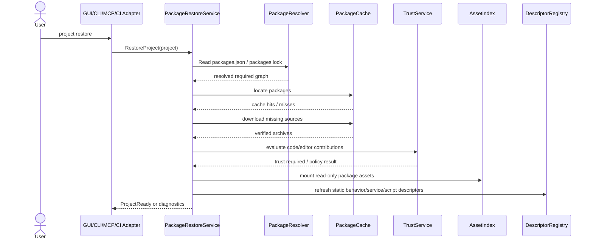

# Package Restore

## Purpose

This document defines project package restore: clean-machine bootstrap, CI
restore, offline restore, package source recovery, non-interactive policy,
cache verification, and project-ready state.

## Core Decision

Horo projects must be restorable on a clean machine from committed project
metadata plus declared package sources.

Package artifacts do not need to be committed into the project repository, but
every required non-vendored package dependency must have a portable,
verifiable source in `packages.json` or `packages.lock`.

Bootstrap, CI, CLI, MCP, and editor project-open flows use the same
`PackageRestore` operation.

## Restore Use Case

`project restore` is separate from package install. Restore reconstructs the
project's package graph and mounted content on a machine that may not have any
packages cached.



## Restore Steps

1. Read `.horo/packages.json` and `.horo/packages.lock`.
2. Treat `packages.lock` as authoritative when present.
3. Validate lockfile compatibility with the current platform and engine runtime.
4. Locate required packages in the local/global cache.
5. Download or locate missing packages from declared portable sources.
6. Verify artifact hash, manifest hash, signature, package format version, and
   extracted layout.
7. Mount `MountReadOnly` package assets without copying.
8. Prepare `ImportCopy` samples/assets only when requested by policy or user.
9. Evaluate trust for script, native, gameplay, and editor contributions.
10. Refresh asset index and static behavior, service, and script descriptors.
11. Report project-ready state or blocking diagnostics.

Restore may read static descriptors, manifests, generated metadata, and asset
indexes. Restore must not load native libraries, initialize script runtimes,
execute package code, instantiate services, open editor panels, or run custom
package hooks. Code-bearing contributions activate only during the activation
phase after trust and enablement checks.

## Readiness Profiles

Restore reports readiness by operation profile:

| Profile | Meaning |
|---|---|
| `InspectReady` | Metadata can be inspected safely. |
| `EditReady` | Project can open for editing, possibly with optional editor tools disabled. |
| `PlayReady` | Runtime-required assets, scripts, behaviors, and services are restored. |
| `BuildReady` | Build-time package inputs and game libraries are restored. |
| `ReleaseReady` | Frozen lockfile, package closure, licenses, and release inputs are verified. |

A project may be inspectable while not playable or releasable.

## Project Ready Policy

A project is not ready if a required package cannot be restored exactly.

Restore may continue in degraded mode only for:

- optional packages
- samples
- documentation
- editor-only contributions when the selected operation allows editor-disabled
  mode

Required runtime asset packages, required game libraries, required script
modules, and required services block project readiness when missing or invalid.

## Failure Cases

| Failure | Result |
|---|---|
| Package source returns 404 | Required dependency blocks restore |
| Hash mismatch | Security failure; package is quarantined |
| Signature invalid | Security failure; package is quarantined |
| Local `.horopkg` missing | Required dependency blocks restore |
| Git revision missing | Required dependency blocks restore |
| Package yanked | Existing lockfile may restore only if artifact is still available and policy permits; new resolution rejects it |
| Deprecated package | Warning unless policy marks it forbidden |
| CI network disabled | Restore succeeds only from vendored/offline sources |
| Lockfile out of date | Non-interactive restore fails; interactive restore may offer resolution |

## Non-Interactive Restore

```bash
horo project restore --non-interactive
```

Policy:

- `DataOnly` packages may restore and mount after verification.
- Code, native, or editor contributions that require new trust fail unless a
  user-local trust decision or CI allowlist already exists.
- Prompts are forbidden.
- Machine stdout uses the CLI structured output envelope.
- Missing required packages fail the command.

CI uses the same behavior. CI must not grant trust implicitly because a package
appears in the lockfile.

## Offline And Air-Gapped Restore

Offline restore disables network access:

```bash
horo package vendor --lock .horo/packages.lock --output vendor/packages/
horo project restore --offline
```

Vendored layout:

```text
vendor/packages/
  index.json
  com.vendor.weapon-pack-2.0.0.horopkg
  com.horo.audio-1.0.4.horopkg
```

Offline mode:

- accepts only local vendored packages and local static indexes
- verifies hashes and signatures exactly as online restore does
- fails on missing packages
- does not consult network registries, URLs, or Git remotes

## Development Overrides

Portable dependencies belong in `.horo/packages.json`. Local development
overrides belong in user-local state:

```json
{
  "devOverrides": {
    "com.myteam.weapon-pack": "../weapon-pack"
  }
}
```

Overrides:

- are never required for portable restore
- must not be written into `packages.lock`
- must not appear in committed project metadata
- are shown in diagnostics so developers know the graph differs from portable
  restore

## Package Asset Reference Modes

Mounted package assets use portable package URLs:

```text
package://com.vendor.humanoid-animation-pack/animations/walk.anim
```

On a new machine, restore fetches the package and the reference resolves again.
Imported project assets use project GUIDs and keep source-package provenance as
metadata only.

## Bootstrap Integration

New machine flow:

```bash
git clone ...
cd MyGame
horo project restore
```

Repository setup may delegate to the same operation:

```text
scripts/dev.py bootstrap
  -> toolchain check
  -> engine dependencies restore
  -> project packages restore
  -> asset/package cache verify
  -> optional cook/index
```

The package cache is never a substitute for verification.

## CLI And MCP Surface

Minimum CLI surface:

```bash
horo project restore
horo project validate --packages
horo package inspect <file-or-source>
horo package verify <file-or-source>
horo package restore
horo package list
horo package graph
horo package cache list
horo package cache clean
```

MCP exposes the same use cases through capability-gated tools. Destructive or
state-changing operations require explicit capability and confirmation policy.

## Required Tests

- clean-machine restore
- offline restore
- missing package failure
- source unavailable failure
- hash mismatch quarantine
- invalid signature quarantine
- lockfile out-of-date failure in non-interactive mode
- native contribution without trust fails non-interactive restore
- poisoned cache is rejected by verification
- private package auth uses credential handles without logging secrets
- `package://` mounted references resolve through lockfile after restore
- restore descriptor refresh does not execute scripts, native libraries, hooks, or editor panels
- readiness profiles distinguish inspect/edit/play/build/release readiness

## Related Documents

- [Horo Package System](./package-system.md)
- [Package Lifecycle](./package-lifecycle.md)
- [Package Release Integration](./package-release-integration.md)
- [Developer Environment](../delivery/developer-environment.md)
- [CLI Architecture](../interfaces/cli-architecture.md)
- [Application Security](../security/application-security.md)
