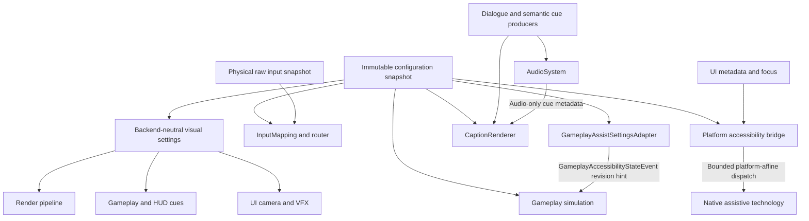

# Accessibility Architecture

## Purpose

This document defines the normative architecture for the accessibility subsystem in
Horo Engine. It establishes feature family ownership, typed transport contracts,
configuration provenance, strict data-bus boundaries, and the non-gating policy across
all product tiers, platforms, and render backends.

Accessibility encompasses both **player accessibility** (closed captions, subtitles,
colorblind color transforms, high contrast, input affordances, screen reader bridge,
gameplay assists, visual safety) and **developer accessibility** (contrast verification,
colorblind viewport simulation, screen reader logging, control scheme validation).

## Architecture Principles

1. **Authority per datum and behavior**: Each setting key, semantic event, and
   runtime behavior has one owner. Feature families can span producers, consumers
   and presenters; they do not imply joint mutable ownership. There is no global
   `AccessibilityManager`.
2. **Typed transports**: Domain data uses narrow typed interfaces. DataBus carries
   coarse asynchronous cross-domain notifications, never authoritative state,
   captions, raw input, UI trees or frame data. The only currently approved
   accessibility event is `GameplayAccessibilityStateEvent`; additional events
   require an explicit architecture review of their owner and transport needs.
3. **Configuration authority**: Domains provide inert typed descriptors; Foundation
   provides generic schema/snapshot infrastructure. Host composition registers and
   validates unique setting owners. Immutable snapshots own desired preferences;
   consumers own only derived behavior at their frame/tick boundary.
4. **Availability and budgets**: Accessibility semantics are independent of graphics
   quality. Native integration reports actual platform capability. Accessibility
   work cannot introduce unbounded waits into core loops or reverse dependencies.

[ADR-161](../../adr/161-xr-interaction-runtime-ui-locomotion-and-accessibility-ownership.md)
extends this non-gating rule to XR comfort. When an experience provides artificial
movement or rotation, its declared disable/snap-turn, speed/handedness, seated/standing/
recenter, motion-reduction and teleport/continuous-mode controls remain semantically
available across renderer/device quality tiers. Configuration owns preferences;
Gameplay, Character, Camera/Renderer and Runtime UI apply them only at their own
boundaries. Missing authored alternatives are explicit limitations, not silent fallbacks.

## Runtime UI Semantic And Capability Boundary

[ADR-082](../../adr/082-runtime-ui-accessibility-capability-and-ownership.md)
assigns typed role/state/action/relationship metadata, semantic focus and immutable
per-audience semantic snapshots to Runtime UI. Snapshots publish from the same
element, localization, style, layout, route, interaction and presentation evidence
as visible UI; Renderer never reconstructs semantics from draw commands.

Configuration remains preference authority, ADR-081 Localization resolves owned
accessible text, Input/Runtime UI routing owns actions and focus, and Platform owns
native capability, mapping, thread-affine dispatch and native lifetime. Platform
receives only bounded Horo snapshots/commands and cannot inspect mutable widgets or
invoke gameplay.

Semantic model, navigation, visual preferences, captions, headless export and native
screen-reader integration are reported independently. Native status is Supported,
Unavailable, Unsupported or host-level NotComposed and is separate from user
preference. Null and recording adapters do not constitute native qualification;
each Supported manifest entry requires platform and real assistive-technology
evidence.



`GameplayAssistSettingsAdapter` is a gameplay-owned instance composed by the host.
It observes committed configuration revisions and publishes revision hints only;
it is not a global coordinator and does not own another settings store. Gameplay
also receives a read-only configuration provider to acquire the authoritative
snapshot at tick start.

## Subsystem Feature Families And Typed Transports

### 1. Closed Captions And Subtitles

#### Ownership (Captions)

- **Semantic producer**: Dialogue/gameplay owns cue identity, content key and
  intended timing. Its typed cue is delivered independently to Audio and caption
  presentation, so muting, playback failure or missing audio hardware cannot
  suppress subtitles. Non-audio gameplay/environment cues use the same contract.
- **Audio producer**: Audio owns metadata for genuinely audio-only cues and optional
  timing observations for existing semantic cues; it does not recreate dialogue.
- **Presenter**: UI `CaptionRenderer` owns localization, layout and display state.

#### Typed Transport (Captions)

Semantic producers enqueue `CaptionEvent` directly through a bounded domain queue.
Audio-only cues use `AudioEventSnapshot`; neither uses DataBus. A stable cue ID is
assigned before fan-out and retained by any audio timing observation. The presenter
merges observations by that ID rather than displaying a second caption. Cue timing
uses the simulation clock (explicit start and duration), not device playback state.
Localization resolves stable keys using a locale snapshot captured by the UI for
that frame; audio callbacks never format or own localized strings.

[ADR-068](../../adr/068-music-transport-and-cross-system-ownership.md) fixes the
cross-system handoff. The semantic producer fans the same stable cue ID separately
to Audio and captions. Audio may publish actual timing observations keyed by that
ID, but the presenter merges rather than duplicates them, and mute, virtualization,
missing media/device, or Audio failure never suppresses required caption delivery.

```cpp
enum class CaptionEventType : uint8_t {
    Dialogue,        // Spoken voice lines
    AmbientSound,    // Environmental audio cues (e.g. footsteps, explosion)
    MusicCue         // Music transitions or thematic audio
};

enum class CaptionPosition : uint8_t {
    Bottom,          // Anchored to lower safe area
    Top,             // Anchored to upper safe area
    FollowSpeaker    // 2D screen-projected tag near speaker entity
};

inline constexpr std::size_t kMaxCaptionEventsPerSnapshot = 32;

// Schematic fixed-size domain IDs; speakerKey value zero means "no speaker".
// Content-key storage is retained by the cue queue until consumers release it.
struct CaptionCueId {
    uint64_t sessionGeneration;
    uint64_t sequence;
};
struct CaptionTextKey { uint64_t value; };

struct CaptionEvent {
    CaptionCueId     cueId;             // unique within the host session
    CaptionEventType type;
    CaptionTextKey   speakerKey;
    CaptionTextKey   textKey;
    Vector3         sourceWorldPos;
    uint64_t        startSimulationTick;
    float           durationSeconds;
    float           emphasis;          // semantic importance, independent of mute
};

struct AudioEventSnapshot {
    FrameNumber frame;
    std::array<CaptionEvent, kMaxCaptionEventsPerSnapshot> captionEvents;
    std::size_t captionEventCount{0};
};

struct ClosedCaptionSettings {
    bool            enabled;
    float           fontSize;
    Color           textColor;
    Color           backgroundColor;
    float           backgroundOpacity;
    CaptionPosition position;
    bool            showSpeakerName;
    bool            showSoundDescriptions;
    bool            showDirectionalIndicators;
    float           safeAreaMarginPercent;
};
```

#### Invariants (Captions)

- Queued payloads contain values and stable IDs, never views into stack, mixer,
  localization or widget storage. The queue retains the associated content catalog
  until drain/cancellation, so delayed localization cannot read released assets.
- Mixer publication uses preallocated storage with fixed-size payloads. No string
  allocation/deallocation, reference-count destruction of assets, blocking lock,
  I/O or font layout may occur inside the real-time callback. Catalog pinning and
  reclamation happen on the control/consumer side outside that callback.
- Each producer uses a bounded queue; the presenter merges at the HUD frame
  boundary. Ordering is by start tick then cue ID. Audio observation updates cannot
  restart a semantic cue. Producer IDs include a host-session generation so stale
  observations from a previous session are rejected.
- A full queue drops the newest cue, increments a bounded diagnostic counter, and
  never blocks. Capacity and overflow are exposed for testing; this contract does
  not promise lossless captions under overload. UI layout is bounded per frame.
- `captionEventCount` identifies the populated prefix and cannot exceed capacity.
  Captions respect display safe areas and remain eligible when audio is muted.

---

### 2. Colorblind Support And Visual Accessibility

#### Ownership (Colorblind)

- **Settings authority**: The backend-neutral visual-settings domain declares
  desired colorblind settings; UI visual settings declare contrast preferences.
- **Behavior owners**: Render owns shader application; UI/gameplay owns palettes,
  patterns, icons and other non-color cues. Camera/VFX owns safety suppression.

#### Typed Transport (Colorblind)

The render pipeline applies the colorblind transform as
[ADR-037](../../adr/037-scene-color-and-hdr-architecture.md) `ColorPipelinePlan`
step 6: after creative look/grading, the ACES output transform, and
display-referred UI composition, covering the complete composed image including
HUD. Creative grading (`ColorGradingSettings` / cooked look LUTs) remains
ADR-037 step 3 and is not this transform. Scene-linear EXR captures are taken
before the output transform and therefore do not include the colorblind pass.
Gameplay and HUD read desired settings from `IColorAccessibilityQuery`, a narrow
backend-neutral settings contract, without depending on rendering or UI implementation
modules. Its implementation retains one `ConfigurationSnapshotRef` and never
queries live render state. All getters refer to that same immutable revision.
Main, UI and worker consumers can read their captured view concurrently without
cross-thread dispatch or waits; acquisition/replacement happens at each consumer's
owned frame/tick boundary. Render independently captures the settings for its pass.
The query reports desired preferences, not whether a GPU pass has completed.

```cpp
enum class ColorblindMode : uint8_t {
    None,
    Protanopia,      // Red-blind / red-weak (L-cone deficiency)
    Deuteranopia,    // Green-blind / green-weak (M-cone deficiency)
    Tritanopia,      // Blue-blind / blue-weak (S-cone deficiency)
    Achromatopsia,   // Monochromacy / complete color blindness
    CustomMatrix     // User-defined 3x3 simulation / correction matrix
};

struct Matrix3x3 {
    float m[3][3];
};

struct ColorblindSettings {
    ColorblindMode mode;
    float          severity;       // [0.0, 1.0] interpolation factor
    Matrix3x3      customMatrix;   // Validated user matrix
};

class IColorAccessibilityQuery {
public:
    virtual ~IColorAccessibilityQuery() = default;
    [[nodiscard]] virtual ColorblindMode GetActiveColorblindMode() const noexcept = 0;
    [[nodiscard]] virtual float GetColorblindSeverity() const noexcept = 0;
    [[nodiscard]] virtual bool IsHighContrastEnabled() const noexcept = 0;
};
```

#### Visual Safety And Overrides

```cpp
struct VisualAccessibilitySettings {
    float uiScale;                 // Global UI scale multiplier [0.5, 3.0]
    bool  highContrastMode;        // High contrast palette across native and token layers
    float textContrastMultiplier;  // Minimum text-to-background contrast enforcement
    bool  reduceMotion;            // Suppress screen shake and non-essential UI animations
    bool  disableFlashEffects;     // Suppress high-frequency luminance flashes (photosensitivity)
    float cameraShakeMultiplier;   // Scale camera shake [0.0, 1.0]
};
```

#### Invariants (Colorblind)

- Colorblind transformations are applied as ADR-037 step 6 without CPU-GPU
  synchronization stalls or readbacks, and they include composed UI.
- Games must provide non-color visual indicators (patterns, icons, shapes, text tags)
  selected using the snapshot-backed `IColorAccessibilityQuery`.
- Motion and flash suppression settings provide explicit hooks in camera and particle
  systems to clamp or skip strobe effects.

---

### 3. Control Remapping And Assist Affordances

#### Ownership (Remapping)

- **Layer 1 (`RawInputCollector`)**: Owns physical device state and transitions,
  preserving facts in immutable `RawInputSnapshot` without synthesizing sticky or
  toggle state.
- **Layer 3 (`InputMapping` / `InputRouter`)**: Owns remapping, sticky modifiers,
  hold/repeat thresholds, toggle action state, and gyro interpretation after raw
  collection and before semantic action-frame publication.

#### Typed Transport (Remapping)

Accessibility controls extend semantic mapping, following
[Input Layer Ownership](./input-layer-ownership.md). No per-key DataBus events are
published and no raw snapshot is rewritten by an accessibility consumer.

```cpp
struct AccessibilityControls {
    bool  allowFullRemapping;
    bool  enableToggleActions;     // Converts hold-actions into toggle-actions
    bool  enableStickyKeys;        // Sequential modifier keys instead of simultaneous chords
    float holdDurationSeconds;     // Adjustable threshold to register a "hold"
    float repeatDelaySeconds;      // Delay before repeated input begins
    float repeatRateSeconds;       // Interval for repeating actions
    bool  enableGyroAim;           // Motion-assisted pointer / aiming
    float gyroSensitivity;         // Sensitivity multiplier for motion hardware
    bool  invertXAxis;
    bool  invertYAxis;
};
```

#### Invariants (Remapping)

- Sticky keys permit sequential activation of modifiers (`Shift`, `Ctrl`, `Alt`)
  followed by an action key, resolved deterministically in `InputMapping`.
- Toggle actions maintain active semantic state in `InputRouter` until a subsequent
  press triggers release.
- Focus loss, device disconnect, binding replacement and context removal clear
  synthetic held/toggle state, emitting releases before another context receives
  actions. Physical key facts remain unchanged. Processing has no per-event heap
  allocation or unbounded waits; setup may allocate bounded mapping storage.
- Remapping validations detect conflicting or missing essential bindings before sealing
  binding profiles.

---

### 4. Screen Reader And Assistive Bridge

#### Ownership (Screen Reader)

- **Metadata owner**: UI owns node identity, focus and accessible text.
- **Dispatch owner**: Platform owns `PlatformAccessibilityBridge`, native capabilities
  and OS thread/run-loop affinity; it does not own widget state.
- **Consumers**: Runtime Game UI, HUD, and Editor shared components.

#### Typed Transport (Screen Reader)

UI elements register structured metadata with the `PlatformAccessibilityBridge`. The bridge
dispatches focus changes and announcements to the host OS accessibility APIs
(macOS NSAccessibility, Windows UI Automation, Linux AT-SPI).

```cpp
enum class AccessibilityBridgeCapability : uint8_t {
    Supported,      // native integration is available
    Unavailable,    // supported integration is temporarily unavailable
    Unsupported     // no native integration for this host/backend
};

enum class AccessibilityEnqueueResult : uint8_t {
    Accepted,
    QueueFull,
    Unavailable,
    Unsupported,
    ShuttingDown
};

enum class AccessibilityRole : uint8_t {
    Button,
    Checkbox,
    Slider,
    TextInput,
    StaticText,
    Dialog,
    Panel,
    Menu,
    MenuItem,
    TreeItem,
    List
};

enum class AnnouncePriority : uint8_t {
    Polite,     // Wait until current speech finishes
    Assertive,  // Interrupt current speech immediately
    SystemAlert // Critical gameplay or modal warning
};

struct AccessibilityNodeDescriptor {
    std::string       elementId;  // owned; valid across async OS dispatch
    AccessibilityRole role;
    std::string       label;
    std::string       value;
    std::string       helpText;
    bool              focused;
    bool              disabled;
    bool              checked;
};

class IScreenReader {
public:
    virtual ~IScreenReader() = default;
    [[nodiscard]] virtual AccessibilityBridgeCapability Capability() const noexcept = 0;
    [[nodiscard]] virtual AccessibilityEnqueueResult Announce(std::string_view text, AnnouncePriority priority) = 0;
    [[nodiscard]] virtual AccessibilityEnqueueResult SetFocus(std::string_view elementId) = 0;
    [[nodiscard]] virtual AccessibilityEnqueueResult UpdateNode(const AccessibilityNodeDescriptor& descriptor) = 0;
    [[nodiscard]] virtual AccessibilityEnqueueResult RemoveNode(std::string_view elementId) = 0;
};
```

#### Invariants (Screen Reader)

- `AccessibilityNodeDescriptor` string fields are owned `std::string` (or interned
  process-stable ids). They must not be `std::string_view` into widget-local, stack, or
  ImGui-frame storage. The descriptor remains valid after the producing widget is gone
  and across asynchronous platform dispatch.
- `IScreenReader` `std::string_view` parameters are call-duration only. Implementations
  copy into owned storage before returning if dispatch is asynchronous.
- Submission is bounded and non-blocking. Admission checks message count and byte
  limits before copying; oversize/full messages return `QueueFull`, never wait.
  FIFO order preserves accepted node/focus/removal sequences. Rejected updates
  leave the UI authoritative; it retries a bounded node resynchronization at a
  later frame. Announcements are not automatically replayed on overflow.
- Node identity includes the UI session and a generation; removals retire that
  generation so stale queued focus/updates cannot target a reused widget ID.
- Native calls run on the OS-required thread/run loop, outside audio, input and
  render work. When the OS requires the main thread, a bounded platform event-loop
  phase performs submission without waiting for native acknowledgement; such
  calls cannot be moved arbitrarily onto a worker. A native API requiring blocking
  work on an engine-critical phase is not eligible for that adapter.
- This contract bridges existing screen readers/assistive technology. Engine-owned
  dialogue TTS synthesis is outside scope and requires an Audio speech-service
  decision; screen-reader availability is not a claim of a TTS synthesizer.
- `NullPlatformAccessibilityBridge` performs no OS effects, stores no diagnostic
  log, and returns `Unsupported`. A separate test-only
  `RecordingPlatformAccessibilityBridge` captures bounded messages and capabilities
  under an explicit test scheduler; it never invokes native APIs.
- Shared controls must produce metadata. CI coverage described below is a required
  implementation follow-up, not an existing detector claimed by this ADR.

#### Async, Cancellation And Shutdown (Screen Reader)

[ADR-010](../../adr/010-job-waiting-and-operation-store-ownership.md) and
[ADR-018](../../adr/018-command-registration-permissions-threading-and-packaged-build-policy.md)
apply. CPU preparation may dispatch to `JobSystem` and return `JobId`; native calls
still use the platform-affine dispatcher. Ordinary node/focus/announcement messages
are bounded notifications, not tracked user operations. If a long-running tool
exposes status/cancellation, its authorized application/feature coordinator creates
an `OperationId` in the application-owned `OperationStore`. Workers and native
callbacks post typed completions to that owner and never mutate a separate store.
No ordinary main/render/transport path waits on jobs or native acknowledgement.

Shutdown stops admission (`ShuttingDown`), invalidates the UI session, cancels
pending notifications and retires their owned payloads on the dispatcher owner.
The host retains dispatcher resources until in-flight native callbacks finish or
are detached through an owner-lifetime token. Any permitted bounded shutdown drain
runs only in an ADR-010 allowed shutdown phase; ordinary frames never join it.

---

### 5. Gameplay Difficulty And Timing Assists

#### Ownership (Gameplay Assists)

- **Preference authority**: Immutable `ConfigurationSnapshot`.
- **Behavior owner**: Gameplay Simulation applies supported assists under its normal
  authority rules.
- **Publisher**: Host-composed, gameplay-owned `GameplayAssistSettingsAdapter`.
- **Transport**: `GameplayAccessibilityStateEvent` is a coarse revision hint only.

#### Typed Transport (Gameplay Assists)

```cpp
struct GameplayAccessibilityStateEvent {
    static constexpr std::string_view HoroEventTypeName =
        "horo::GameplayAccessibilityStateEvent";
    ConfigurationRevision revision;
};
```

The adapter observes successfully published configuration revisions and notifies
consumers. No assist values are copied into this event. It is the only currently
approved accessibility event on `EngineDataBus`, whose purpose is asynchronous
cross-domain notification rather than state storage.

#### Invariants (Gameplay Assists)

- At every simulation tick start, gameplay acquires the authoritative snapshot,
  compares its revision to the retained one, and captures updated values when
  needed. Notifications only hint that a revision changed; coalescing, loss, late
  subscription or stale/out-of-order notifications cannot prevent refresh.
- One snapshot governs the entire tick. No settings callback mutates gameplay
  mid-tick. All local consumers share the tick's captured revision.
- Desired preferences persist in user settings. Applying an assist still respects
  game/server authority and supported capabilities; accessibility labeling cannot
  bypass configuration or ADR-018 command authorization.

---

## Strict Anti-Pattern Rules

1. **No Universal DataBus Dumping Ground**:
   - The `EngineDataBus` must **never** be used as a catch-all channel for high-frequency
     audio streams, UI widget hierarchies, per-keystroke inputs, or post-process matrices.
   - Pushing raw caption text or input chords through the bus violates domain boundaries,
     causes memory allocations, and introduces lock contention.
2. **No Monolithic Manager God-Class**:
   - Do not construct a global `AccessibilityManager` that pulls in Audio, Render, Input,
     and UI dependencies.
   - Each subsystem implements its own typed accessibility contract.
3. **No String-Based Property Maps**:
   - All settings and transports use strongly-typed C++ structs. Ad hoc string-key maps
     (e.g., `map<string, string>`) are forbidden in runtime accessibility paths.

---

## Non-Gating Policy And Parity

### 1. Semantic Availability And Native Capability

Accessibility semantics are not gated by product editions or graphics quality.
The existing `es3`, `dx11`, `dx12_vulkan`, and `high_end` labels in
[Post-Processing And Effects](./post-processing-and-effects-architecture.md#performance-and-feature-tiers)
are rendering quality labels, not accessibility or navigation compute tiers. This
policy applies to every backend regardless of those labels. Algorithms may vary
(e.g. a compact shader transform), but reducing quality must not disable configured
caption, remapping, color-cue or safety behavior. Headless hosts evaluate settings
and logic without claiming visible output.

Native screen-reader integration reports `Supported`, `Unavailable`, or
`Unsupported` separately from the user's enabled preference. Adapters use the
strongest supported integration and expose limitations; they do not silently
claim success on a platform with no native support.

### 2. Core Loop Non-Blocking Invariant

- **Audio callback**: No heap allocation/deallocation, blocking locks, I/O or text
  layout; only fixed-size metadata enters preallocated queues.
- **Input**: Accessibility mapping adds no per-event allocation or unbounded wait.
  Raw collection preserves physical state without semantic transforms.
- **Render**: Accessibility shader parameters add no synchronous CPU/GPU readback.
- **UI**: Bounded queue admission never waits for native acknowledgement.
- **Simulation**: Snapshot capture occurs at tick start, never mid-tick.

These are path-specific guarantees, not a claim that all engine rendering/input
work is universally lock-free or allocation-free. Setup may allocate.

### 3. Headless And Test Parity

- `NullPlatformAccessibilityBridge` is a deterministic no-op with explicit
  `Unsupported` results. It is not a recording mock or proof of native integration.
- Test-only `RecordingPlatformAccessibilityBridge` records owned metadata under a
  deterministic dispatcher with the same admission/order/cancellation contract.
- Semantic caption tests inject cues directly and do not require an audio device.
  `NullAudioDevice` tests missing-device behavior, not invented playback events.
- Headless tests can validate configuration, layout inputs, contrast calculations,
  remapping and cue identity; native accessibility needs platform-specific tests.

### 4. Dependency Direction Discipline

- Semantic cue contracts are backend-neutral; dialogue feeds Audio and caption UI
  independently. Audio never depends on UI. Audio-only metadata has a typed queue.
- Gameplay, render and UI consume the backend-neutral visual-settings contract.
  Gameplay has no dependency on PostProcessing or renderer-owned live state.
- Platform dispatch and operation tracking are host-composed; domains do not
  discover global accessibility services.

---

## Configuration Schema And Provenance

Domain-owned inert descriptors declare accessibility options under
`accessibility.*` (editor diagnostics under `editor.accessibility.*`). Foundation
owns `ConfigurationSchema` infrastructure, not these feature keys. Host composition
validates types, defaults, value ranges, reload policies and a unique owner for each
key before publication, following [ADR-009](../../adr/009-configuration-schema-precedence-and-secret-boundary.md).
Consumers of a shared preference never register another descriptor for it.

| Namespace | Descriptor authority | Read-only consumers |
|---|---|---|
| `accessibility.captions.*` | Caption presentation domain | UI/HUD |
| `accessibility.colorblind.*` | Backend-neutral visual-settings domain | Render, UI, gameplay |
| `accessibility.visual.ui.*` | UI visual-settings domain | UI/HUD, semantic contrast query |
| `accessibility.visual.safety.*` | Backend-neutral visual-settings domain | UI animation, Camera, VFX |
| `accessibility.input.*` | Input mapping domain | Router/action resolution |
| `accessibility.screen_reader.*` | Platform accessibility domain | Bridge and UI settings |
| `accessibility.gameplay.*` | Gameplay domain | Tick-boundary assist consumers |
| `editor.accessibility.*` | Editor diagnostics | Editor tools |

Subnamespace ownership is exclusive; composition rejects duplicate keys or a key
outside its declared owner's namespace. Broad `accessibility.visual.*` registration
is forbidden. The previously proposed flat `visual.ui_scale`, `visual.high_contrast`,
`visual.reduce_motion` and `visual.flash_suppression` keys move to the subnamespaces
below. No dual live aliases remain; if a prototype persisted the old keys, import
migrates them once before validation (an explicitly supplied new key wins).

| Setting Key | Type | Default | Scope | Description |
|---|---|---|---|---|
| `accessibility.captions.enabled` | `bool` | `false` | `User` | Master closed captions toggle |
| `accessibility.captions.font_size` | `float` | `1.0` | `User` | Caption text scale multiplier |
| `accessibility.captions.show_speaker` | `bool` | `true` | `User` | Show speaker name prefix |
| `accessibility.colorblind.mode` | `enum` | `None` | `User` | Colorblind filter mode |
| `accessibility.colorblind.severity` | `float` | `1.0` | `User` | Color transform strength |
| `accessibility.input.sticky_keys` | `bool` | `false` | `User` | Enable sequential modifier chords |
| `accessibility.input.toggle_actions` | `bool` | `false` | `User` | Enable toggle mode for held actions |
| `accessibility.input.hold_duration` | `float` | `0.4` | `User` | Hold action duration threshold (seconds) |
| `accessibility.screen_reader.enabled` | `bool` | `false` | `User` | Master screen reader bridge toggle |
| `accessibility.visual.ui.ui_scale` | `float` | `1.0` | `User` | Global UI scaling factor |
| `accessibility.visual.ui.high_contrast` | `bool` | `false` | `User` | High contrast UI mode |
| `accessibility.visual.safety.reduce_motion` | `bool` | `false` | `User` | Suppress non-essential motion/shake |
| `accessibility.visual.safety.flash_suppression`| `bool`| `false` | `User` | Clamp high-frequency flashes |
| `accessibility.gameplay.aim_assist` | `float` | `0.0` | `User` | Aim assist strength |
| `accessibility.gameplay.skip_qte` | `bool` | `false` | `User` | Automatically pass QTE events |

### Provenance And Synchronization

1. Settings are loaded from platform user configuration files and sealed before resolution.
2. Updates commit a new monotonic `ConfigurationSnapshot`.
3. Subsystems capture snapshots at frame boundaries (`BeginFrame` / tick start), ensuring
   atomic, tear-free application.

---

## Developer Tooling And Conformance

Editor tools should provide colorblind viewport previews, contrast measurement,
control-scheme validation and a bounded optional screen-reader diagnostic recorder.
That recorder is a decorator/test facility, not behavior of the null bridge.
Product/platform compliance targets and legal applicability require separate
assessment; this architecture alone neither certifies compliance nor promises
native features that a platform cannot provide.

### Required Implementation Validation

The following are acceptance obligations for implementation work, not tests or CI
checks implemented by this documentation-only decision:

- Schema composition rejects duplicate owners, invalid values and overlapping
  visual namespaces; migration of legacy flat keys preserves explicit new values.
- Captions remain eligible with mute, failed playback and no device; semantic and
  audio observations of the same cue do not duplicate or restart text. Test stale
  session IDs, catalog lifetime, localization, bounded ordering and queue overflow.
- Instrument callback/mapping allocations and wait paths; no mixer string lifetime
  cleanup or render readback is introduced by accessibility code.
- Gameplay and color queries retain a consistent snapshot across a tick/frame;
  missing/coalesced/stale bus hints still converge at the next boundary. An isolated
  consumer of the visual-settings contract must not link rendering/UI implementations.
- Input tests preserve raw snapshots and verify sticky/hold/toggle behavior plus
  releases on focus loss, context removal, disconnect and binding replacement.
- Native adapters test thread affinity and capability reporting. Recording tests
  exercise bounded message/byte capacity, node generations, order, resynchronization,
  cancellation and shutdown. Null tests assert no output and `Unsupported`.
- Visual checks cover semantic parity at each supported quality configuration;
  headless checks validate logic, while actual assistive-technology interoperability
  is validated separately on each supported platform.

---

## Related Documents

- [ADR-015: Accessibility Ownership, Typed Transport and Non-Gating Policy](../../adr/015-accessibility-ownership-typed-transport-and-non-gating-policy.md)
- [Audio Architecture](./audio-architecture.md): Audio-only cue metadata and independent semantic captions
- [Post-Processing And Effects Architecture](./post-processing-and-effects-architecture.md): Color grading and post-process passes
- [Input Architecture](./input-architecture.md): Input context and rebinding
- [Input Layer Ownership](./input-layer-ownership.md): `RawInputCollector` and `InputRouter` contracts
- [Game UI And HUD](./game-ui-and-hud.md): UI screen reader node metadata and caption rendering
- [Engine Data Bus](../foundation/engine-data-bus.md): Notification plane and `GameplayAccessibilityStateEvent`
- [UI Design System](../editor/ui-design-system.md): High contrast tokens and editor accessibility
- [Configuration System](../foundation/configuration-system.md): Schema and immutable snapshots
