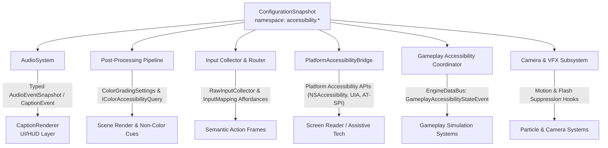

# Accessibility Architecture

## Purpose

This document defines the normative architecture for the accessibility subsystem in
Horo Engine. It establishes feature family ownership, typed transport contracts,
configuration provenance, strict data-bus boundaries, and the non-gating policy across
all product tiers, platforms, and render backends.

Accessibility encompasses both **player accessibility** (closed captions, subtitles,
colorblind color transforms, high contrast, input affordances, screen reader bridge,
gameplay assists, visual safety) and **developer accessibility** (contrast verification,
colorblind viewport simulation, screen reader logging, control scheme validation).

## Architecture Principles

1. **Domain Subsystem Ownership**: Accessibility features are owned directly by their
   respective domain subsystems (Audio, Post-Processing/Render, Input, UI/Platform,
   Simulation). There is no monolithic `AccessibilityManager` God-class.
2. **Narrow Typed Transports**: Producers and consumers interact across explicit,
   strongly typed interfaces rather than untyped message dictionaries.
3. **Strict DataBus Boundary**: The general `EngineDataBus` is **not** a universal
   accessibility dumping ground. It is reserved exclusively for gameplay difficulty
   assist notifications (`GameplayAccessibilityStateEvent`). All other features use direct
   typed subsystem transports.
4. **Non-Gating Policy**: Accessibility features never gate core engine loops, must be
   available across all product tiers and platforms without tier restrictions, and must
   never introduce consumer-to-consumer circular dependencies.
5. **Immutable Configuration Snapshots**: Accessibility preferences are registered under
   the `accessibility.*` configuration schema and consumed via immutable snapshots,
   guaranteeing tear-free frame updates.



## Subsystem Feature Families And Typed Transports

### 1. Closed Captions And Subtitles

#### Ownership (Captions)

- **Producer**: `AudioRuntime` / `AudioSystem` emits dialogue and sound event metadata.
- **Consumer**: `CaptionRenderer` in the Game UI / HUD layer formats and displays text.

#### Typed Transport (Captions)

Captions consume typed `AudioEventSnapshot` and `CaptionEvent` queues directly from the
audio system. They are **not** routed through the general process data bus.

```cpp
enum class CaptionEventType : uint8_t {
    Dialogue,        // Spoken voice lines
    AmbientSound,    // Environmental audio cues (e.g. footsteps, explosion)
    MusicCue         // Music transitions or thematic audio
};

enum class CaptionPosition : uint8_t {
    Bottom,          // Anchored to lower safe area
    Top,             // Anchored to upper safe area
    FollowSpeaker    // 2D screen-projected tag near speaker entity
};

inline constexpr std::size_t kMaxCaptionEventsPerSnapshot = 32;

struct CaptionEvent {
    uint64_t         sequenceId;
    CaptionEventType type;
    std::string      speakerName;       // owned; never a view into mixer/transient storage
    std::string      text;              // owned localized caption; independent of producer lifetime
    Vector3          sourceWorldPos;    // 3D position for directional cues / projection
    float            durationSeconds;   // Display duration
    float            loudness;          // Relative volume for visual emphasis
};

struct AudioEventSnapshot {
    FrameNumber                frame;
    std::vector<CaptionEvent>  captionEvents;  // fixed capacity; reserved at AudioSystem init
};

struct ClosedCaptionSettings {
    bool            enabled;
    float           fontSize;
    Color           textColor;
    Color           backgroundColor;
    float           backgroundOpacity;
    CaptionPosition position;
    bool            showSpeakerName;
    bool            showSoundDescriptions;
    bool            showDirectionalIndicators;
    float           safeAreaMarginPercent;
};
```

#### Invariants (Captions)

- `CaptionEvent::speakerName` and `CaptionEvent::text` are owned `std::string` (or
  interned process-stable string ids). They must not be `std::string_view` into mixer
  scratch, stack, localization temporaries, or any buffer that dies before the UI
  drain. A published caption outlives the producer callback.
- `AudioEventSnapshot::captionEvents` is a fixed-capacity, preallocated container.
  Capacity is reserved at `AudioSystem` initialization (`kMaxCaptionEventsPerSnapshot`)
  and must not grow on the mixer thread. Overflow drops the newest event and records
  a diagnostic.
- The real-time audio mixer thread pushes `CaptionEvent` objects into that preallocated
  ring/snapshot storage; it never heap-allocates, reallocates the vector, or performs
  font layout. String members are interned or reserved before the callback so assignment
  on the mixer thread does not allocate.
- The UI layer drains `AudioEventSnapshot` on the main thread during HUD rendering.
- Captions respect screen safe-area margins across all display aspect ratios.

---

### 2. Colorblind Support And Visual Accessibility

#### Ownership (Colorblind)

- **Owner**: Post-Processing & Effects Subsystem / Render Pipeline.
- **Consumers**: Render Graph post-process pass, Gameplay/HUD visual styling.

#### Typed Transport (Colorblind)

Colorblind modes are implemented as 3×3 color transformation matrices applied in the
post-processing pipeline immediately after tonemapping via `ColorGradingSettings`.
Gameplay and HUD systems query the active mode synchronously via `IColorAccessibilityQuery`.

```cpp
enum class ColorblindMode : uint8_t {
    None,
    Protanopia,      // Red-blind / red-weak (L-cone deficiency)
    Deuteranopia,    // Green-blind / green-weak (M-cone deficiency)
    Tritanopia,      // Blue-blind / blue-weak (S-cone deficiency)
    Achromatopsia,   // Monochromacy / complete color blindness
    CustomMatrix     // User-defined 3x3 simulation / correction matrix
};

struct Matrix3x3 {
    float m[3][3];
};

struct ColorblindSettings {
    ColorblindMode mode;
    float          severity;       // [0.0, 1.0] interpolation factor
    Matrix3x3      customMatrix;   // Validated user matrix
};

class IColorAccessibilityQuery {
public:
    virtual ~IColorAccessibilityQuery() = default;
    [[nodiscard]] virtual ColorblindMode GetActiveColorblindMode() const noexcept = 0;
    [[nodiscard]] virtual float GetColorblindSeverity() const noexcept = 0;
    [[nodiscard]] virtual bool IsHighContrastEnabled() const noexcept = 0;
};
```

#### Visual Safety And Overrides

```cpp
struct VisualAccessibilitySettings {
    float uiScale;                 // Global UI scale multiplier [0.5, 3.0]
    bool  highContrastMode;        // High contrast palette across native and token layers
    float textContrastMultiplier;  // Minimum text-to-background contrast enforcement
    bool  reduceMotion;            // Suppress screen shake and non-essential UI animations
    bool  disableFlashEffects;     // Suppress high-frequency luminance flashes (photosensitivity)
    float cameraShakeMultiplier;   // Scale camera shake [0.0, 1.0]
};
```

#### Invariants (Colorblind)

- Colorblind transformations are applied in the shader post-process chain without CPU-GPU
  synchronization stalls or readbacks.
- Games must provide non-color visual indicators (patterns, icons, shapes, text tags)
  accessible via `IColorAccessibilityQuery`.
- Motion and flash suppression settings provide explicit hooks in camera and particle
  systems to clamp or skip strobe effects.

---

### 3. Control Remapping And Assist Affordances

#### Ownership (Remapping)

- **Layer 1 (`RawInputCollector`)**: Owns sticky keys, hold duration thresholds, and raw
  device accumulation.
- **Layer 3 (`InputRouter` / `InputMapping`)**: Owns semantic action remapping, toggle
  action semantics, and gyro aim resolution.


#### Typed Transport (Remapping)
Accessibility controls extend the existing `RawInputCollector` and `InputMapping`
contracts without publishing raw keypress events to the DataBus.

```cpp
struct AccessibilityControls {
    bool  allowFullRemapping;
    bool  enableToggleActions;     // Converts hold-actions into toggle-actions
    bool  enableStickyKeys;        // Sequential modifier keys instead of simultaneous chords
    float holdDurationSeconds;     // Adjustable threshold to register a "hold"
    float repeatDelaySeconds;      // Delay before repeated input begins
    float repeatRateSeconds;       // Interval for repeating actions
    bool  enableGyroAim;           // Motion-assisted pointer / aiming
    float gyroSensitivity;         // Sensitivity multiplier for motion hardware
    bool  invertXAxis;
    bool  invertYAxis;
};
```

#### Invariants (Remapping)

- Sticky keys permit sequential activation of modifiers (`Shift`, `Ctrl`, `Alt`)
  followed by an action key, resolved deterministically in `RawInputCollector`.
- Toggle actions maintain active semantic state in `InputRouter` until a subsequent
  press triggers release.
- Remapping validations detect conflicting or missing essential bindings before sealing
  binding profiles.

---

### 4. Screen Reader And Assistive Bridge

#### Ownership (Screen Reader)

- **Owner**: Platform & UI Subsystem (`PlatformAccessibilityBridge`).
- **Consumers**: Runtime Game UI, HUD, and Editor shared components.

#### Typed Transport (Screen Reader)
UI elements register structured metadata with the `PlatformAccessibilityBridge`. The bridge
dispatches focus changes and announcements to the host OS accessibility APIs
(macOS NSAccessibility, Windows UI Automation, Linux AT-SPI).

```cpp
enum class AccessibilityRole : uint8_t {
    Button,
    Checkbox,
    Slider,
    TextInput,
    StaticText,
    Dialog,
    Panel,
    Menu,
    MenuItem,
    TreeItem,
    List
};

enum class AnnouncePriority : uint8_t {
    Polite,     // Wait until current speech finishes
    Assertive,  // Interrupt current speech immediately
    SystemAlert // Critical gameplay or modal warning
};

struct AccessibilityNodeDescriptor {
    std::string       elementId;  // owned; valid across async OS dispatch
    AccessibilityRole role;
    std::string       label;
    std::string       value;
    std::string       helpText;
    bool              focused;
    bool              disabled;
    bool              checked;
};

class IScreenReader {
public:
    virtual ~IScreenReader() = default;
    virtual void Announce(std::string_view text, AnnouncePriority priority) = 0;
    virtual void SetFocus(std::string_view elementId) = 0;
    virtual void UpdateNode(const AccessibilityNodeDescriptor& descriptor) = 0;
    virtual void RemoveNode(std::string_view elementId) = 0;
};
```

#### Invariants (Screen Reader)

- `AccessibilityNodeDescriptor` string fields are owned `std::string` (or interned
  process-stable ids). They must not be `std::string_view` into widget-local, stack, or
  ImGui-frame storage. The descriptor remains valid after the producing widget is gone
  and across asynchronous platform dispatch.
- `IScreenReader` `std::string_view` parameters are call-duration only. Implementations
  copy into owned storage before returning if dispatch is asynchronous.
- `IScreenReader::Announce()` and node updates must never block the main rendering thread.
  Platform bridge implementations enqueue updates for asynchronous dispatch to native APIs.
- Headless and test environments compose `NullPlatformAccessibilityBridge`, which maintains
  a bounded circular log of announcements for QA and automated test assertions.
- Editor shared controls must emit accessibility metadata by default; raw Dear ImGui
  bypasses are detectable in CI verification.

---

### 5. Gameplay Difficulty And Timing Assists

#### Ownership (Gameplay Assists)

- **Owner**: Gameplay Simulation Subsystem.
- **Publisher**: Application Accessibility Coordinator.
- **Transport**: `GameplayAccessibilityStateEvent` on the `EngineDataBus`.

#### Typed Transport (Gameplay Assists)
Gameplay assists cross the boundary between host settings and decoupled gameplay logic.
This is the **only** accessibility feature family permitted to publish through the
`EngineDataBus`.

```cpp
struct GameplayAccessibilityStateEvent {
    static constexpr std::string_view HoroEventTypeName =
        "horo::GameplayAccessibilityStateEvent";

    bool  aimAssistEnabled;
    float aimAssistStrength;           // [0.0, 1.0] magnetic target pulling
    bool  autoAimSnap;                 // Instant lock-on to nearest target
    bool  reducedEnemyAggression;      // AI reaction delays / spacing
    float reactionTimeMultiplier;      // Slows enemy animations and reaction windows
    bool  skipQuickTimeEvents;         // Auto-completes QTE sequences
    bool  invincibilityAfterHit;       // Extended post-hit invulnerability window
    float incomingDamageMultiplier;    // Damage scaling [0.0, 2.0]
    float puzzleTimerMultiplier;       // Extends timed challenge clocks
};
```

#### Invariants (Gameplay Assists)

- Gameplay systems subscribe to `GameplayAccessibilityStateEvent` and cache the state at
  simulation tick boundaries. State transitions never tear across a single simulation tick.
- Difficulty assists are accessibility features, not cheats; they are recorded as user
  profile accessibility preferences and persisted in user settings.

---

## Strict Anti-Pattern Rules

1. **No Universal DataBus Dumping Ground**:
   - The `EngineDataBus` must **never** be used as a catch-all channel for high-frequency
     audio streams, UI widget hierarchies, per-keystroke inputs, or post-process matrices.
   - Pushing raw caption text or input chords through the bus violates domain boundaries,
     causes memory allocations, and introduces lock contention.
2. **No Monolithic Manager God-Class**:
   - Do not construct a global `AccessibilityManager` that pulls in Audio, Render, Input,
     and UI dependencies.
   - Each subsystem implements its own typed accessibility contract.
3. **No String-Based Property Maps**:
   - All settings and transports use strongly-typed C++ structs. Ad hoc string-key maps
     (e.g., `map<string, string>`) are forbidden in runtime accessibility paths.

---

## Non-Gating Policy And Parity

### 1. Zero Tier-Gating

Accessibility features are **never gated** behind graphics tiers, product editions, or
platform capabilities.

| Feature Family | `es3` (Mobile) | `dx11` (Standard) | `dx12_vulkan` (Modern) | `high_end` (Console/PC) |
|---|---|---|---|---|
| Closed Captions & Subtitles | Yes | Yes | Yes | Yes |
| Colorblind Color Transforms | Yes (ALU shader) | Yes | Yes | Yes |
| Control Remapping & Sticky Keys | Yes | Yes | Yes | Yes |
| Screen Reader Platform Bridge | Yes | Yes | Yes | Yes |
| Gameplay Difficulty Assists | Yes | Yes | Yes | Yes |
| UI Scaling & High Contrast | Yes | Yes | Yes | Yes |
| Reduce Motion & Flash Suppression | Yes | Yes | Yes | Yes |

### 2. Core Loop Non-Blocking Invariant

- **Audio Mixer Callback**: Zero heap allocations, zero blocking locks, zero text layout.
  Caption events are transferred via bounded queues.
- **Render Submission**: Colorblind matrices and high-contrast palettes are constant-buffer
  parameters in post-process shaders; no pipeline stalls or readbacks.
- **Simulation Step**: Difficulty assists are sampled at the start of the tick.
- **Input Collection**: Sticky key state is evaluated in Layer 1 with zero bus publication.

### 3. Headless And Test Parity

Headless hosts (`horo-engine`, CI pipelines) and test harnesses use null/mock bridges:

- `NullPlatformAccessibilityBridge`: Captures structured announcements for assertion.
- `NullAudioDevice`: Generates deterministic audio event snapshots for caption tests.
- CI pipelines execute automated WCAG AA contrast calculations and control scheme checks
  headlessly without requiring physical display hardware.

### 4. Dependency Direction Discipline

The dependency graph between subsystems remains strictly acyclic (DAG):

- `GameUI` depends on `Audio` types (`AudioEventSnapshot`) for captions, but `Audio`
  has zero knowledge of `GameUI`.
- `Gameplay` queries `PostProcessing` via `IColorAccessibilityQuery`, but `PostProcessing`
  has zero knowledge of `Gameplay`.

---

## Configuration Schema And Provenance

All accessibility options are declared under the `accessibility.*` namespace in
`ConfigurationSchema`.

| Setting Key | Type | Default | Scope | Description |
|---|---|---|---|---|
| `accessibility.captions.enabled` | `bool` | `false` | `User` | Master closed captions toggle |
| `accessibility.captions.font_size` | `float` | `1.0` | `User` | Caption text scale multiplier |
| `accessibility.captions.show_speaker` | `bool` | `true` | `User` | Show speaker name prefix |
| `accessibility.colorblind.mode` | `enum` | `None` | `User` | Colorblind filter mode |
| `accessibility.colorblind.severity` | `float` | `1.0` | `User` | Color transform strength |
| `accessibility.input.sticky_keys` | `bool` | `false` | `User` | Enable sequential modifier chords |
| `accessibility.input.toggle_actions` | `bool` | `false` | `User` | Enable toggle mode for held actions |
| `accessibility.input.hold_duration` | `float` | `0.4` | `User` | Hold action duration threshold (seconds) |
| `accessibility.screen_reader.enabled` | `bool` | `false` | `User` | Master screen reader bridge toggle |
| `accessibility.visual.ui_scale` | `float` | `1.0` | `User` | Global UI scaling factor |
| `accessibility.visual.high_contrast` | `bool` | `false` | `User` | High contrast UI mode |
| `accessibility.visual.reduce_motion` | `bool` | `false` | `User` | Suppress non-essential motion/shake |
| `accessibility.visual.flash_suppression`| `bool`| `false` | `User` | Clamp high-frequency flashes |
| `accessibility.gameplay.aim_assist` | `float` | `0.0` | `User` | Aim assist strength |
| `accessibility.gameplay.skip_qte` | `bool` | `false` | `User` | Automatically pass QTE events |

### Provenance And Synchronization

1. Settings are loaded from platform user configuration files and sealed before resolution.
2. Updates commit a new monotonic `ConfigurationSnapshot`.
3. Subsystems capture snapshots at frame boundaries (`BeginFrame` / tick start), ensuring
   atomic, tear-free application.

---

## Developer Tooling And Compliance

### 1. Developer Validation Tools

- **Colorblind Viewport Preview**: Renders the active editor viewport through selected
  colorblind simulation matrices in real time.
- **W3C WCAG AA/AAA Contrast Checker**: Inspects UI text and background colors against
  WCAG 2.2 contrast formulas ($4.5:1$ for normal text, $3.0:1$ for large text).
- **Screen Reader Diagnostic Log**: Records all node mutations and announcement events in
  a bounded in-memory buffer.
- **Control Scheme Validator**: Analyzes active input binding profiles to detect missing
  essential actions or inaccessible modifier combinations.

### 2. Compliance Targets

- **Editor IDE**: Targets **WCAG 2.2 Level AA** compliance.
- **Game Runtime**: Provides foundational infrastructure to satisfy **CVAA**
  (47 U.S.C. §§ 609, 613, 617 and 47 CFR Parts 14 and 79),
  the **European Accessibility Act (EAA)**, and console platform accessibility TRCs.

---

## Related Documents

- [ADR-011: Accessibility Ownership, Typed Transport and Non-Gating Policy](../../adr/011-accessibility-ownership-typed-transport-and-non-gating-policy.md)
- [Audio Architecture](./audio-architecture.md): `AudioEventSnapshot` generation
- [Post-Processing And Effects Architecture](./post-processing-and-effects-architecture.md): Color grading and post-process passes
- [Input Architecture](./input-architecture.md): Input context and rebinding
- [Input Layer Ownership](./input-layer-ownership.md): `RawInputCollector` and `InputRouter` contracts
- [Game UI And HUD](./game-ui-and-hud.md): UI screen reader node metadata and caption rendering
- [Engine Data Bus](../foundation/engine-data-bus.md): Notification plane and `GameplayAccessibilityStateEvent`
- [UI Design System](../editor/ui-design-system.md): High contrast tokens and editor accessibility
- [Configuration System](../foundation/configuration-system.md): Schema and immutable snapshots
