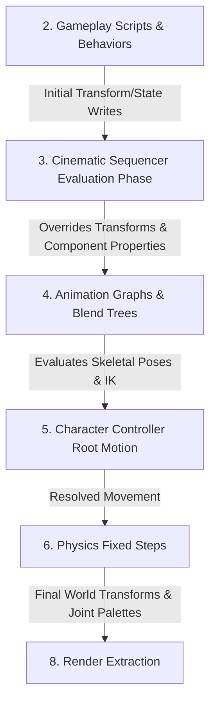

# Cinematic Sequencer Architecture

## Purpose

This document defines Horo Engine's cinematic sequencer runtime and authoring architecture. It specifies timeline data structures, track evaluation models, clock authority, frame evaluation scheduling, object and property binding resolution, camera cut coordination, event dispatching, and editor integration.

The goal is to provide a deterministic, data-oriented cinematic runtime capable of driving in-game cutscenes, interactive timelines, UI animations, and complex scene staging while maintaining strict architectural boundaries and zero heap allocations on frame-hot evaluation paths.

## Normative Decision Reference

This subsystem is governed by [ADR-014: Sequencer Ownership, Clock Authority and Binding Boundary Decision](../../adr/014-sequencer-ownership-clock-authority-and-binding-boundary.md).

## Core Decisions

- **Dedicated Clock Authority**: Every sequence player owns a `SequencePlaybackClock` governed by an explicit `SequenceClockPolicy` (`SimulationTime`, `UnscaledWallClock`, or `ExternalSync`). It handles pause, time-dilation, and reverse playback deterministically without drifting from engine time.
- **Explicit Evaluation Phase**: Sequence evaluation executes in an explicit frame phase **after** gameplay state updates and **before** animation graphs, IK solvers, and character controller root-motion extraction.
- **Durable Object Binding**: Authored sequence assets reference scene entities exclusively by durable `StableObjectId`s. `SequenceBindingAuthority` resolves these to generation-checked runtime `EntityRef`s at activation and orchestrates rebinding across scene transitions.
- **Shared Typed Property Registry**: Property tracks resolve target properties through `PropertyBindingRegistry` owned by `HoroEngine::SceneModel`. The Sequencer runtime and Inspector authoring surfaces share this registry without reverse dependencies on Editor UI.
- **Stateless Random-Access Sampling**: Keyframe curves evaluate statelessly at any time $T$. Reverse playback and seeks do not accumulate state or replay history from frame zero.
- **Local-Space Coordinate Invariance**: Transform tracks evaluate in local/parent-relative space, ensuring that large-world origin rebasing leaves keyframe curves invariant and preserves world transform consistency.

## System Boundaries and Target Topology

```text
[HoroEngine::Foundation]
       ^
       |
[HoroEngine::SceneModel] <---------------+
       ^                                 |
       |                                 |
[HoroEngine::CinematicModel]             | (Shared PropertyBindingRegistry)
       ^                                 |
       |                                 |
[HoroEngine::CinematicRuntime]           |
       ^                                 |
       |                                 |
[HoroEngine::EditorServices] ------------+
       ^
       |
[HoroEngine::Gui] (Timeline UI / Inspector)
```

| Target | Layer | Responsibilities | Dependencies |
|---|---|---|---|
| `HoroEngine::CinematicModel` | Model / Asset | `SequenceAsset`, tracks, keyframes, curves, interpolation math, playback settings, schemas, and bounded asset parsers. | `Foundation`, `SceneModel`, `Assets` |
| `HoroEngine::CinematicRuntime` | Runtime | `SequencePlayer`, `SequencePlaybackClock`, `SequenceBindingAuthority`, `SequenceEvaluationSystem`, camera blending, and event queues. | `CinematicModel`, `RuntimeScene`, `Runtime` |
| `HoroEngine::EditorServices` | Presentation / Tooling | Timeline workspace controllers, property recording, curve editing services, track solo/mute adapters, and Problems panel integration. | `CinematicRuntime`, `CinematicModel`, `SceneModel`, `EditorModel` |

`HoroEngine::CinematicRuntime` contains zero dependencies on `HoroEngine::EditorServices`, `HoroEngine::Gui`, or ImGui.

## Sequencer Data Model

### Sequence Asset

A sequence asset is an immutable, cookable project asset defining tracks, timeline parameters, and playback configuration:

```cpp
struct SequenceAsset {
    SequenceId                  id;
    std::string                 name;
    Duration                    duration;
    FrameRate                   frameRate;          // Authoring frame rate (e.g. 24, 30, 60 fps)
    std::vector<SequenceTrack>  tracks;
    SequencePlaybackSettings    defaultSettings;
};
```

### Track Structure

Each track animates an object transform, component property, camera cut, audio source, sub-sequence, or event timeline:

```cpp
enum class TrackType : uint8_t {
    Transform,
    Property,
    CameraCut,
    Event,
    Audio,
    SubSequence
};

struct SequenceTrack {
    TrackId                     id;
    std::string                 displayName;
    TrackType                   type;
    StableObjectId              targetObject;       // Durable UUID resolved to EntityId at activation
    ComponentTypeId             targetComponent;    // Target component type when applicable
    PropertyBindingId           targetProperty;     // Resolved via PropertyBindingRegistry
    std::vector<Keyframe>       keyframes;
    TrackBlendSettings          blend;
    bool                        muted;
    bool                        solo;
};
```

### Keyframe and Curve Interpolation

Keyframes define discrete control points with configurable interpolation modes:

```cpp
enum class InterpolationType : uint8_t {
    Constant,       ///< Step / hold value until next keyframe
    Linear,         ///< Direct linear interpolation (LERP / SLERP)
    CubicBezier,    ///< Cubic Bezier with explicit tangents
    HermiteSpline   ///< Smooth cubic Hermite spline
};

struct Tangent {
    float timeOffset;
    float valueOffset;
};

struct Keyframe {
    KeyframeId          id;
    float               time;               // Seconds from sequence start
    PropertyValue       value;              // Strongly typed variant (float, Vec3, Quat, Color, etc.)
    InterpolationType   interpolation;
    Tangent             tangentIn;
    Tangent             tangentOut;
};
```

## Track Types

### 1. Transform Track

Animates local position, rotation, and scale of a scene object:

```cpp
struct TransformKeyframe {
    float               time;
    Vec3                position;           // Local position
    Quat                rotation;           // Local orientation
    Vec3                scale;              // Local scale
    InterpolationType   interpolation;
    Tangent             tangentIn;
    Tangent             tangentOut;
};
```

- **Hierarchy-Aware Evaluation**: Evaluated top-down in topological parent-to-child order to guarantee valid model-to-world transform hierarchies.
- **Local-Space Authoring**: Always stores local-space coordinates. World transform updates absorb parent motion and large-world origin shifts naturally.

### 2. Property Track

Animates typed component properties registered in `PropertyBindingRegistry`:

- **Numeric**: `float`, `int32_t`, `double` (e.g. light intensity, camera FOV, post-process bloom threshold)
- **Vector**: `Vec2`, `Vec3`, `Vec4` (e.g. material tint, particle spawn velocity, UI offset)
- **Color**: `Color` (linear RGBA with HDR support)
- **Boolean**: `bool` (e.g. visibility, mesh renderer enable, light enable; evaluated as step function)
- **Asset References**: `AssetId` (e.g. material swap, mesh swap; step interpolation)

### 3. Camera Cut Track

Coordinates the active rendering camera and cinematic camera transitions:

```cpp
struct CameraCutKeyframe {
    float               time;
    StableObjectId      cameraObject;       // Target camera entity
    float               blendDuration;      // Cross-fade duration into next camera
    CameraBlendCurve    blendCurve;         // Linear, EaseIn, EaseOut, EaseInOut
};
```

### 4. Event Track

Dispatches named events with typed payloads at discrete timeline markers:

```cpp
struct EventKeyframe {
    float               time;
    EventName           eventName;
    VariantMap          payload;            // Typed parameter bundle
    bool                fireInReverse;      // Policy when playback runs in reverse
};
```

Event payload storage is cooked with the sequence asset and remains immutable for
the asset lifetime. Evaluation enqueues lightweight views into a fixed-capacity,
pre-allocated event queue; it neither constructs `VariantMap` entries nor grows
the queue on the frame-hot path. Events are dispatched to registered gameplay
behavior scripts, audio cues, or VFX triggers at the phase boundary.

### 5. Audio Track

Coordinates timeline-synchronized audio playback:

```cpp
struct AudioTrackKeyframe {
    float               startTime;
    float               duration;
    AssetId             audioClip;
    float               volume;
    float               pitch;
    bool                loop;
};
```

### 6. Sub-Sequence Track

Nests child sequence assets to enable modular cutscene assembly and multi-shot composition:

```cpp
struct SubSequenceKeyframe {
    float               startTime;
    AssetId             sequenceAsset;
    float               playbackSpeed;
    bool                syncToParent;
};
```

## Clock Authority: `SequencePlaybackClock`

Every `SequencePlayer` owns an isolated, deterministic `SequencePlaybackClock`.

```cpp
enum class SequenceClockPolicy : uint8_t {
    SimulationTime,     ///< Advances with fixed/interpolated engine simulation time; respects gameplay pause and time dilation.
    UnscaledWallClock,  ///< Advances with monotonic real time; ignores simulation pause and gameplay time dilation (UI/intro).
    ExternalSync        ///< Slaved to external provider (e.g. audio device playhead or media stream).
};

class SequencePlaybackClock {
public:
    // For SimulationTime, deltaSeconds is already-dilated Δt_sim; do not apply gameplayTimeDilation again.
    void Advance(float deltaSeconds, float gameplayTimeDilation);
    void Seek(float targetTime);
    void SetPlaybackSpeed(float speed);
    void SetPolicy(SequenceClockPolicy policy);

    float GetCurrentTime() const;
    float GetPlaybackSpeed() const;
    SequenceClockPolicy GetPolicy() const;
    bool IsReverse() const;

private:
    float               m_currentTime{0.0f};
    float               m_playbackSpeed{1.0f};
    SequenceClockPolicy m_policy{SequenceClockPolicy::SimulationTime};
};
```

### Time Progression Formulation

1. **`SimulationTime` (Default for in-game cutscenes)**:
   $$\Delta t_{\text{eff}} = \Delta t_{\text{sim}} \times \text{playbackSpeed}$$
   $\Delta t_{\text{sim}}$ already incorporates engine simulation dilation (`globalTimeDilation` / `gameplayTimeDilation`). Do not multiply `gameplayTimeDilation` again.
   When gameplay simulation is paused (`RuntimeMode::EditorPaused` or menu pause), $\Delta t_{\text{sim}} = 0$, deterministically pausing the sequence.
   When sequence playback settings specify `pauseGameplay = true`, gameplay behavior systems pause while the sequencer continues on its own simulation clock. The sequencer does not freeze.
2. **`UnscaledWallClock` (UI animations, intro sequences, pause menus)**:
   $$\Delta t_{\text{eff}} = \Delta t_{\text{real}} \times \text{playbackSpeed}$$
   Decoupled from gameplay simulation pause and dilation. Advances continuously during gameplay pause.
3. **`ExternalSync` (Audio / Media Master)**:
   Playhead time is locked to an authoritative external device clock (e.g., audio playback buffer position).

### Reverse Playback and Stateless Scrubbing

- `playbackSpeed < 0` triggers reverse playback.
- **Stateless Sampling Invariant**: Sampling the sequence at time $T$ yields identical values regardless of whether $T$ was reached through forward playback, reverse playback, or an instantaneous `Seek(T)` call. Keyframe curve sampling maintains zero forward-only state.

## Frame Evaluation Phase

Sequence evaluation runs in an explicit frame phase within the runtime lifecycle.

### Execution Ordering

This ordering follows the already-ratified animation/physics tick contract in [Animation Architecture](./animation-architecture.md). Sequencer evaluation is inserted after gameplay parameter/state writes and before animation graph evaluation. Physics remains after animation, IK, root-motion production, and character-controller resolution.

```text
1. Poll Platform Events & Input Snapshot
2. Gameplay Systems & Behavior Scripts (OnUpdate)
   - Set animation parameters and behavior state
3. === [Cinematic Sequencer Evaluation Phase] ===
   - Topological hierarchy evaluation of TransformTracks
   - PropertyTrack evaluation via PropertyBindingRegistry
   - CameraCutTrack & EventTrack queue evaluation
4. === [Animation Phase] ===
   - Animation Graph & Blend Tree sampling
   - Skeletal IK & Additive Pose Layer evaluation
   - Produce Character Controller Root-Motion delta
5. Character Controller consumes root motion / resolves movement
6. Physics Fixed Step & Collision Resolution
7. Physics Transform Publish (Scene Transform Update)
8. Render Snapshot Extraction (Joint palettes, world matrices, camera state)
9. Render Execution & GUI Presentation
```



### Rationale

- **Post-Gameplay Placement**: Gameplay AI, script updates, and player controls run in Phase 2. The sequencer evaluates in Phase 3, allowing cinematic tracks to override entity positions, rotations, and component properties with definitive authority.
- **Pre-Animation Placement**: Skeletal animation graphs, IK solvers (look-at, foot-placement), and character controllers evaluate in Phases 4–5. They consume the cinematic-driven root transforms and parameters, allowing character rigs to perform dynamic IK and additive blending on top of cinematic staging.
- **Pre-Physics Placement**: Animation pose, IK, root-motion production, and character-controller resolution run before physics fixed steps, matching [Animation Architecture](./animation-architecture.md) and [Character Controller Architecture](./character-controller-architecture.md).
- **Editor Preview Placement**: In `EditorIdle` mode, `SequenceEvaluationSystem` runs in `VariableUpdate` before `RenderExtraction`, ensuring responsive viewport scrubbing without executing fixed-step physics.

## Object Binding Resolution: `SequenceBindingAuthority`

### Identity Mapping

Authored sequence assets identify scene objects using durable 128-bit `StableObjectId`s. At runtime, entities are referenced via generation-checked `EntityRef { SceneRuntimeId, EntityId }`.

```cpp
class SequenceBindingAuthority {
public:
    Result<void> ResolveBindings(const SequenceAsset& asset, const RuntimeSceneView& sceneView);
    Result<void> Rebind(const RuntimeSceneView& newSceneView);
    void Invalidate();

    std::optional<EntityRef> GetBoundEntity(TrackId trackId) const;
    BindingState GetBindingState(TrackId trackId) const;

private:
    struct TrackBinding {
        StableObjectId  targetObjectId;
        EntityRef       boundEntity;
        BindingState    state;
    };
    std::unordered_map<TrackId, TrackBinding> m_bindings;
};
```

### Scene Transitions and Rebinding Lifecycle

```text
Sequence Activation (Play / Preview Mount)
  -> SequenceBindingAuthority queries RuntimeSceneView::FindByStableObjectId()
  -> Match: Store EntityRef { SceneRuntimeId, EntityId }, state = Bound
  -> Missing: Record state = Unbound, emit non-fatal diagnostic warning

Scene Transition / Replacement
  -> SceneRuntimeId changes; existing EntityRefs become stale
  -> SequenceBindingAuthority::Rebind() executed at CommitDeferredLifecycleChanges
  -> Re-resolves StableObjectIds against new scene authored index
```

### Error Containment

- If a target entity is missing, destroyed, or invalid:
  - **Runtime**: Produces a structured `BindingResolutionResult::MissingTarget` diagnostic event; the track is safely skipped without throwing exceptions or asserting.
  - **Editor**: Generates an actionable warning in the Problems panel with navigation to the affected sequence asset and track.

## Typed Property Binding Registry

### Architecture and Access Contracts

`PropertyBindingRegistry` lives in `HoroEngine::SceneModel` and provides reflection metadata and fast accessors:

```cpp
struct PropertyBindingDescriptor {
    PropertyBindingId       id;
    ComponentTypeId         componentType;
    std::string             propertyName;
    PropertyType            type;           // Float, Vec2, Vec3, Vec4, Quat, Color, Bool, Int32, AssetRef
    size_t                  byteOffset;     // Direct component struct offset when contiguous
    PropertyGetterFn        getter;         // Type-erased fast getter
    PropertySetterFn        setter;         // Type-erased fast setter
    PropertyRangeConstraint range;
};

class PropertyBindingRegistry {
public:
    void Register(PropertyBindingDescriptor descriptor);
    const PropertyBindingDescriptor* Find(PropertyBindingId id) const;
    const PropertyBindingDescriptor* FindByName(ComponentTypeId comp, std::string_view name) const;
};
```

### Dependency Flow

Both `HoroEngine::CinematicRuntime` and `HoroEngine::EditorServices` depend downward on `HoroEngine::SceneModel`:

- Sequencer tracks store `PropertyBindingId` and sample values matching `PropertyBindingDescriptor::type`.
- Inspector UI queries `PropertyBindingRegistry` to enumerate animatable properties and render UI widgets.
- No reverse dependencies exist from runtime or scene layers to editor UI.

## Origin-Rebase, Pause, and Time-Scale Interactions

### Large-World Origin Rebase

1. **Local-Space Storage**: Keyframes store local transforms ($T_{\text{local}}, R_{\text{local}}, S_{\text{local}}$).
2. **Rebase Invariance**: World origin translations ($\mathbf{x}_{\text{world}}' = \mathbf{x}_{\text{world}} - \Delta \mathbf{x}_{\text{origin}}$) do not alter local-space coordinates. Keyframe curves remain invariant.
3. **World Transform Recomputation**: Top-down hierarchy evaluation automatically incorporates the active `WorldOriginOffset`.
4. **Spatial Cameras**: Camera tracks authored in absolute world coordinates apply the active `WorldOriginOffset` at evaluation time.

### Interaction Matrix

| Condition | `SimulationTime` Policy | `UnscaledWallClock` Policy |
|---|---|---|
| Sequence `pauseGameplay = true` | Continues on its own simulation clock; gameplay behavior systems pause | Continues advancing |
| Gameplay Paused (menu pause / `EditorPaused`) | Playback frozen ($\Delta t_{\text{eff}} = 0$) | Continues advancing |
| Sequence Player Paused | Playback frozen; holds current values | Playback frozen; holds current values |
| Gameplay Time Dilation ($0.5\times$) | Advances at the already-dilated $\Delta t_{\text{sim}} \times \text{playbackSpeed}$ (no second dilation multiply) | Advances at $1.0 \times \text{playbackSpeed}$ |
| Host Suspended | Suspended; clock baseline reset on resume | Suspended; clock baseline reset on resume |
| Negative Speed ($-1.0\times$) | Stateless reverse curve evaluation | Stateless reverse curve evaluation |
| Seek / Scrubbing (`Seek(t)`) | Instantaneous bit-identical evaluation | Instantaneous bit-identical evaluation |

## Editor Authoring

### Timeline and Curve Editor

The cinematic editor provides:

- **Multi-Track Timeline**: Keyframe creation, deletion, box selection, and dragging with frame snapping.
- **Curve Editor**: Bezier tangent manipulation with smooth, linear, and broken tangent handles.
- **Property Recording**: Captures manual viewport object transformations as timeline keyframes.
- **Track Solo / Mute**: Isolate or bypass individual tracks during editing.
- **Viewport Scrubbing**: Direct playhead scrubbing with real-time preview in the active editor viewport.

### Document and Asset Workflow

Sequence assets are stored in the project's asset tree. Sequences reference scene objects by durable `StableObjectId`s, ensuring scene edits, renames, and reordering do not break sequence bindings.

## Feature Tiers

| Capability | `es3` | `dx11` / `dx12_vulkan` | `high_end` |
|---|---|---|---|
| Max Tracks per Sequence | 32 | 256 | 1024 |
| Simultaneous Active Players | 2 | 8 | 32 |
| Sub-Sequence Nesting Depth | 1 level | 4 levels | 8 levels |
| Curve Interpolation Modes | Constant, Linear | Constant, Linear, Cubic | Constant, Linear, Cubic, Hermite |
| Property Recording | No | Yes | Yes |
| Camera Cut Blending | Hard Cut, Linear | Smooth Hermite Blend | Multi-Camera Spline Blend |

## Testing and Verification Requirements

- **Determinism**: Verify bit-identical track evaluation results at time $T$ under variable framerates (30 Hz, 60 Hz, 144 Hz).
- **Reverse Seek Correctness**: Regression test proving `Seek(T)` produces identical values without forward history replay.
- **Allocation Budget**: Zero heap allocations during steady-state track sampling and evaluation in `SequenceEvaluationPhase`.
- **Rebinding on Scene Replacement**: Verify that sequence tracks gracefully rebind when `SceneRuntimeId` changes and report typed outcomes for missing entities.
- **Origin Rebase Consistency**: Verify world transform consistency when large-world origin rebasing occurs during sequence playback.
- **Hostile Asset Parsing**: Verify that malformed, corrupted, circular sub-sequence, or oversized sequence assets produce typed validation errors without crashes.

## Related Documents

- [ADR-014: Sequencer Ownership, Clock Authority and Binding Boundary Decision](../../adr/014-sequencer-ownership-clock-authority-and-binding-boundary.md)
- [Cinematic Sequencer UI Reference](./cinematic-sequencer.html)
- [Scene Runtime Architecture](./scene-runtime.md)
- [Animation Architecture](./animation-architecture.md)
- [Character Controller Architecture](./character-controller-architecture.md)
- [Runtime Lifecycle Architecture](./runtime-lifecycle.md)
- [Scene Math Architecture](../foundation/scene-math.md)
- [Audio Architecture](./audio-architecture.md)
- [VFX And Particles Architecture](./vfx-and-particles-architecture.md)
