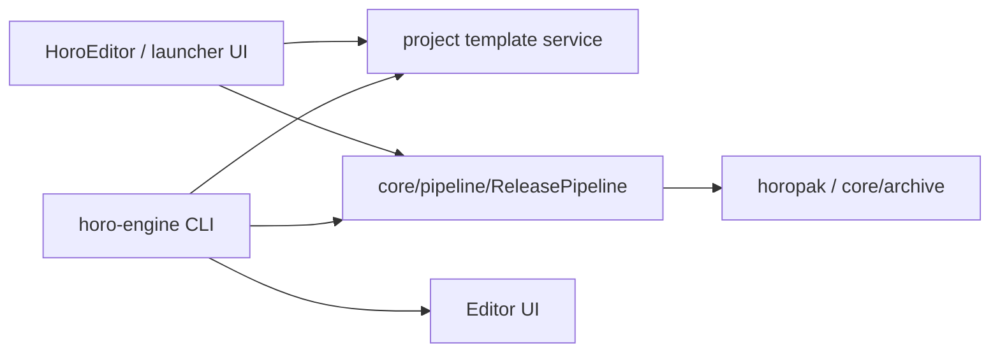

# Horo Engine CLI

`horo-engine` is the headless project-management entry point for Horo Engine.
The launcher/editor is one workflow, but project creation, builds, and releases
must also work from a terminal or CI job.

## Command Model



The important rule: CLI and UI should call the same engine-side services. UI
code may collect inputs and display progress, but the project/release behavior
should not live only in ImGui code.

## Project Commands

Developer commands are available through the cross-platform Python helper:

```bash
python3 scripts/dev.py cli help
python3 scripts/dev.py project create /tmp/horo_cli_sample --name HoroCliSample
python3 scripts/dev.py project release /tmp/horo_cli_sample --version 0.0.1 --archive-password local-secret
python3 scripts/dev.py project release-smoke
python3 scripts/dev.py mcp release-example /tmp/horo_cli_sample
```

Create a project:

```bash
horo-engine project create ~/Projects/MyGame --name MyGame
```

Create a project against an explicit SDK/prefix root:

```bash
horo-engine project create /tmp/horo_cli_sample \
  --name HoroCliSample \
  --sdk-root /Users/bodur/horo-engine/build/debug
```

Build a project:

```bash
horo-engine project build /tmp/horo_cli_sample \
  --config Debug \
  --sdk-root /Users/bodur/horo-engine/build/debug
```

Preview the build command without running it:

```bash
horo-engine project build /tmp/horo_cli_sample \
  --config Debug \
  --sdk-root /Users/bodur/horo-engine/build/debug \
  --dry-run
```

Create an encrypted release:

```bash
horo-engine project release /tmp/horo_cli_sample \
  --version 0.0.1 \
  --sdk-root /Users/bodur/horo-engine/build/debug \
  --archive-password cli-release-test
```

Open a project in the launcher/editor:

```bash
horo-engine project open /tmp/horo_cli_sample \
  --sdk-root /Users/bodur/horo-engine/build/debug
```

Preview the editor launch command:

```bash
horo-engine project open /tmp/horo_cli_sample \
  --sdk-root /Users/bodur/horo-engine/build/debug \
  --dry-run
```

## Release Output

A headless release should produce the same artifact shape as the editor release
screen:

```text
build/release/v0.0.1_macos_arm64/
  HoroCliSample
  assets.horo
  shaders/
    basic.frag
    basic.vert
```

Raw scene JSON should not remain in release output:

```bash
find /tmp/horo_cli_sample/build/release/v0.0.1_macos_arm64 -name '*.json' -print
strings /tmp/horo_cli_sample/build/release/v0.0.1_macos_arm64/assets.horo \
  | rg 'sceneName|objects|level.json|camera' || true
```

Expected result:

- no `*.json` files are printed
- no scene/object plaintext is printed from `assets.horo`
- `horopak` reports encryption enabled when `--archive-password` is provided

## Current Limitations

- `--archive-password` is suitable for local validation, but distribution/CI
  needs a proper secret-management policy.
- Cross-platform command quoting should remain covered by tests as Windows
  support hardens.
